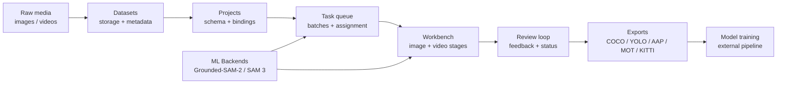
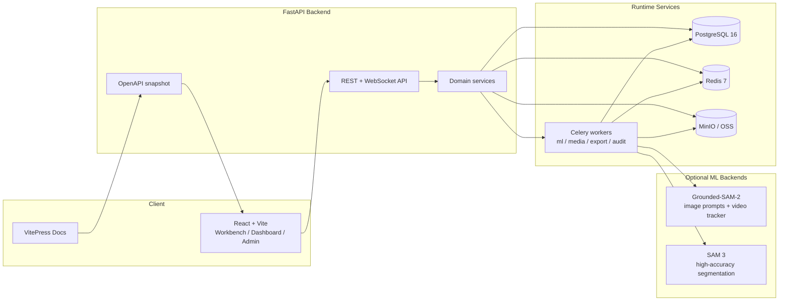

<div align="center">

<h1>AI Annotation Platform</h1>

<p><strong>A production-grade labeling control plane for image, video, and AI-assisted dataset operations.</strong></p>

<a href="https://github.com/yyq19990828/ai-annotation-platform/actions/workflows/ci.yml"></a>
<a href="https://github.com/yyq19990828/ai-annotation-platform/actions/workflows/docs.yml"></a>


<a href="https://yyq19990828.github.io/ai-annotation-platform/">Docs Site</a>
·
<a href="#快速开始">Quick Start</a>
·
<a href="#系统架构">Architecture</a>
·
<a href="./docs-site/api/">API</a>
·
<a href="./CHANGELOG.md">Changelog</a>

</div>

```text
raw media
  -> dataset + project cockpit
    -> image / video workbench
      -> AI pre-annotation + tracking
        -> review loop + notifications
          -> trainable exports
```

AI Annotation Platform 把项目管理、标注工作台、AI 预标注、审核、导出、后台任务与可观测性放在同一条产品链路里。它不是一个只画框的 Demo，而是一个用于持续迭代标注生产系统的全栈仓库。

## 控制台能力

<table>
  <tr>
    <td width="33%" valign="top">
      <strong>Labeling Ops</strong><br>
      项目、数据集、批次、任务分配、审核回退、个人通知与后台任务历史。
    </td>
    <td width="33%" valign="top">
      <strong>Image Workbench</strong><br>
      bbox、rotated bbox、polygon、polyline、keypoint、mask 相关标注链路。
    </td>
    <td width="33%" valign="top">
      <strong>Video Workbench</strong><br>
      <code>video_bbox</code>、<code>video_track</code>、关键帧、插值、outside 段、帧缓存与 chunk 服务。
    </td>
  </tr>
  <tr>
    <td width="33%" valign="top">
      <strong>AI Assist</strong><br>
      Grounded-SAM-2、SAM 3、ML Backend 注册、图像批量预标、视频 tracker job。
    </td>
    <td width="33%" valign="top">
      <strong>Training Exports</strong><br>
      COCO、YOLO det / obb / seg、AAP JSON、Video JSON、YOLO 逐帧、MOT、KITTI。
    </td>
    <td width="33%" valign="top">
      <strong>Engineering Spine</strong><br>
      OpenAPI codegen、Vitest、Playwright、pytest、VitePress、ADR、docs impact CI。
    </td>
  </tr>
</table>

## 数据航线



## 系统架构



## 快速开始

### 前置依赖

| 依赖 | 版本 |
|---|---|
| Node.js | `>= 20` |
| pnpm | `>= 10` |
| Python | `>= 3.11` |
| uv | Python 包管理 |
| Docker Compose | 本地数据库、队列、对象存储 |
| pre-commit | 可选，但推荐 |

### 本地启动

```bash
# 1. 安装依赖
pnpm install
cd apps/api && uv sync --extra test && cd ../..

# 可选：已安装 pre-commit 时启用本地 hooks
pre-commit install

# 2. 启动基础设施
docker compose up -d postgres redis minio mailpit

# 3. 初始化数据库
cd apps/api && uv run alembic upgrade head && cd ../..

# 4. 启动后端和前端
pnpm dev:api        # http://localhost:8000
pnpm dev:web        # http://localhost:3000
```

需要演示数据时：

```bash
cd apps/api
PYTHONPATH=. uv run python scripts/seed.py
```

### 常用入口

| 服务 | 地址 | 说明 |
|---|---|---|
| Web App | http://localhost:3000 | 标注平台主界面 |
| Swagger UI | http://localhost:8000/docs | 运行时 API 文档 |
| Docs Site | http://localhost:5173 | `pnpm docs:dev` 后打开 |
| MinIO Console | http://localhost:9001 | `minioadmin / minioadmin` |
| Mailpit | http://localhost:8025 | 开发邮件收件箱 |
| Grafana | http://localhost:3001 | `monitoring` profile 启动后打开 |

## 可选服务

```bash
# Celery 后台任务：批量预标、导出、视频帧、通知等
docker compose up -d celery-worker celery-worker-export celery-beat

# GPU ML Backend 在叠加文件 docker-compose.ml.yml（grounded-sam2 / sam3 / yolo）
# Grounded-SAM-2：适合图片 SAM / DINO 与视频 tracker
docker compose -f docker-compose.yml -f docker-compose.ml.yml --profile gpu up -d grounded-sam2-backend

# SAM 3：独立 GPU profile，需要 HF_TOKEN 与更高显存
docker compose -f docker-compose.yml -f docker-compose.ml.yml --profile gpu-sam3 up -d sam3-backend

# Prometheus + Grafana
docker compose --profile monitoring up -d prometheus grafana
```

修改 `apps/api/**` 下的 worker 业务代码后，Celery 不会热重载，重启 worker 即可；修改依赖、Dockerfile 或 compose build 配置才需要 rebuild。

## 开发工作流

```bash
# 前端
pnpm lint
pnpm typecheck
pnpm test
pnpm test:e2e          # 需要后端与 docker compose 服务

# 后端
cd apps/api && uv run pytest

# API 契约
pnpm openapi:export    # API 变更后刷新 snapshot
pnpm openapi:check     # CI 同款契约校验

# 文档站
pnpm docs:dev
pnpm docs:build
```

API 变更后同步跑 `pnpm openapi:export` 和 `pnpm codegen`；环境变量变更后同步更新 `.env.example` 并跑 `pnpm docs:gen-env-vars`。

## 文档地图

| 角色 / 任务 | 入口 |
|---|---|
| 标注员、审核员、项目管理员 | [docs-site/user-guide/](./docs-site/user-guide/) |
| 本地开发 | [docs-site/dev/tutorials/local-dev.md](./docs-site/dev/tutorials/local-dev.md) |
| 测试策略 | [docs-site/dev/testing.md](./docs-site/dev/testing.md) |
| API 文档 | [docs-site/api/](./docs-site/api/) |
| Python SDK / CLI | [docs-site/dev/sdk/quickstart.md](./docs-site/dev/sdk/quickstart.md) |
| ML Backend 协议 | [docs-site/dev/reference/ml-backend-protocol.md](./docs-site/dev/reference/ml-backend-protocol.md) |
| 视频帧服务 | [docs-site/dev/reference/video-frame-service.md](./docs-site/dev/reference/video-frame-service.md) |
| 导出格式 | [docs-site/user-guide/reference/export-formats.md](./docs-site/user-guide/reference/export-formats.md) |
| 架构概念 | [docs-site/dev/concepts/](./docs-site/dev/concepts/) |
| ADR | [docs/adr/](./docs/adr/) |
| 变更记录 | [CHANGELOG.md](./CHANGELOG.md) |

部署版文档站：[https://yyq19990828.github.io/ai-annotation-platform/](https://yyq19990828.github.io/ai-annotation-platform/)

## 仓库结构

```text
ai-annotation-platform/
├── apps/
│   ├── api/                       # FastAPI 后端、SQLAlchemy、Alembic、Celery workers
│   ├── web/                       # React 18 + TypeScript + Vite 标注前端
│   ├── grounded-sam2-backend/     # Grounded-SAM-2 GPU ML Backend
│   ├── sam3-backend/              # SAM 3 GPU ML Backend
│   └── _shared/mask_utils/        # mask -> polygon 共用工具包
├── docs-site/                     # VitePress 用户 / 开发 / API / 运维文档
├── docs/
│   ├── adr/                       # 架构决策记录
│   ├── changelogs/                # 历史版本变更
│   ├── plans/                     # 实施计划
│   └── research/                  # 调研报告
├── infra/                         # Docker、Prometheus、Grafana、Nginx 等基础设施配置
├── scripts/                       # OpenAPI、docs impact、seed、维护脚本
├── docker-compose.yml             # 基础栈（postgres/redis/minio/celery + 监控 profile）
├── docker-compose.ml.yml          # GPU ML Backend 叠加（grounded-sam2 / sam3 / yolo）
├── pnpm-workspace.yaml
└── package.json
```

## 技术栈

| 层 | 技术 |
|---|---|
| 前端 | React 18、TypeScript、Vite、TanStack Query、Zustand、Konva、Playwright |
| 后端 | FastAPI、Pydantic、SQLAlchemy 2、Alembic、Celery、pytest |
| 数据 | PostgreSQL 16、Redis 7、MinIO / OSS、DuckDB 分析视图 |
| AI | Grounded-SAM-2、SAM 3、开放 ML Backend 协议 |
| 文档 | VitePress、Mermaid、OpenAPI / Scalar、ADR |
| CI | GitHub Actions、docs impact、visual regression、OpenAPI snapshot check |

## 贡献前检查

- 只改和当前目标直接相关的文件。
- 前端 CSS 只使用 `apps/web/src/styles/tokens.css` 中存在的颜色 token。
- API、环境变量、用户可见行为变更时，同步更新相关 docs。
- 提交前至少跑和改动范围匹配的 lint / test / OpenAPI / docs 校验。

## License

MIT
