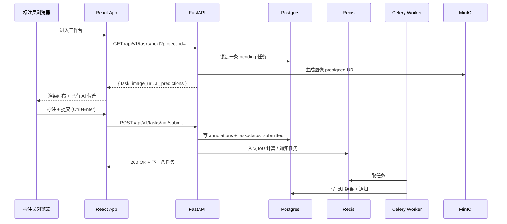
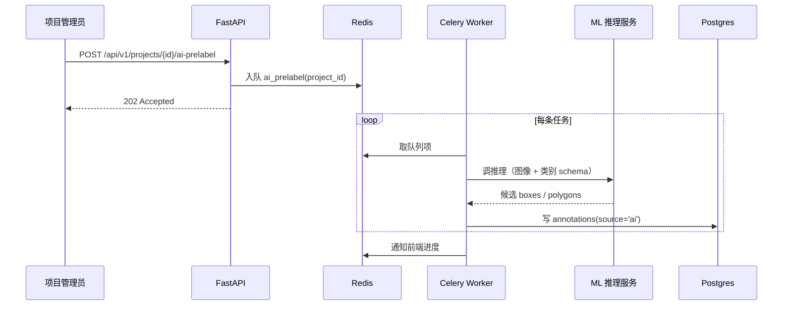
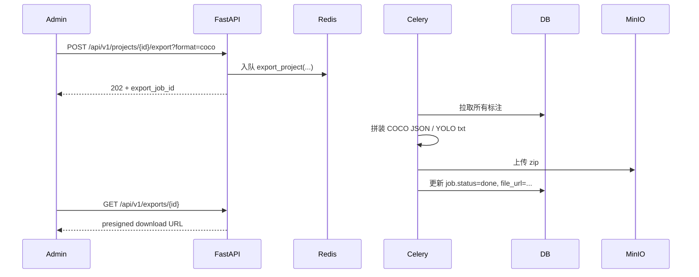

# 数据流

## 标注一条任务的完整链路

```mermaid
sequenceDiagram
  participant U as 标注员浏览器
  participant W as React App
  participant A as FastAPI
  participant DB as Postgres
  participant R as Redis
  participant C as Celery Worker
  participant S as MinIO

  U->>W: 进入工作台
  W->>A: GET /api/v1/tasks/next?project_id=...
  A->>DB: 锁定一条 pending 任务
  A->>S: 生成图像 presigned URL
  A-->>W: { task, image_url, ai_predictions }
  W-->>U: 渲染画布 + 已有 AI 候选

  U->>W: 标注 + 提交 (Ctrl+Enter)
  W->>A: POST /api/v1/tasks/{id}/submit
  A->>DB: 写 annotations + task.status=submitted
  A->>R: 入队 IoU 计算 / 通知任务
  A-->>W: 200 OK + 下一条任务
  C->>R: 取任务
  C->>DB: 写 IoU 结果 + 通知
```

## AI 预标注

```mermaid
sequenceDiagram
  participant Admin as 项目管理员
  participant A as FastAPI
  participant R as Redis
  participant C as Celery Worker
  participant ML as ML 推理服务
  participant DB as Postgres

  Admin->>A: POST /api/v1/projects/{id}/ai-prelabel
  A->>R: 入队 ai_prelabel(project_id)
  A-->>Admin: 202 Accepted
  loop 每条任务
    C->>R: 取队列项
    C->>ML: 调推理（图像 + 类别 schema）
    ML-->>C: 候选 boxes / polygons
    C->>DB: 写 annotations(source='ai')
  end
  C->>R: 通知前端进度
```

## 数据导出

```mermaid
sequenceDiagram
  participant Admin
  participant A as FastAPI
  participant R as Redis
  participant C as Celery
  participant DB
  participant S as MinIO

  Admin->>A: POST /api/v1/projects/{id}/export?format=coco
  A->>R: 入队 export_project(...)
  A-->>Admin: 202 + export_job_id
  C->>DB: 拉取所有标注
  C->>C: 拼装 COCO JSON / YOLO txt
  C->>S: 上传 zip
  C->>DB: 更新 job.status=done, file_url=...
  Admin->>A: GET /api/v1/exports/{id}
  A-->>Admin: presigned download URL
```

## 实时通知

WebSocket 通道：`ws://.../ws?token=<jwt>`

服务端 push 三类事件：

- 任务被分配 / 被回退
- AI 预标注进度
- 导出完成

前端在 `src/api/ws.ts`（待实现）订阅，dispatch 到 Zustand。
