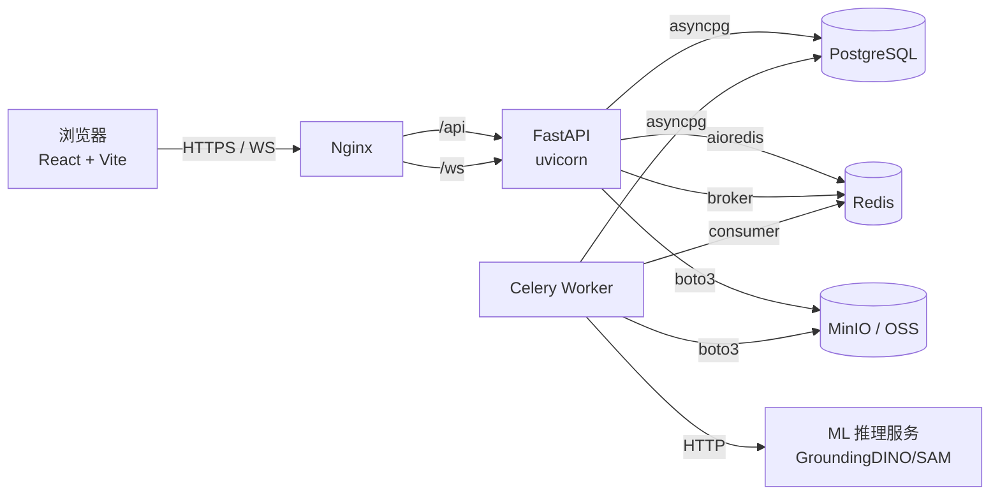

# 系统全景

## 物理架构



## 逻辑分层

### 后端（apps/api）

```
app/
├── api/v1/         # HTTP 路由（薄）
├── services/       # 业务逻辑（核心）
├── db/
│   ├── models/     # SQLAlchemy
│   └── session.py  # 引擎与连接池
├── schemas/        # Pydantic（请求/响应模型）
├── core/           # 配置 / JWT / 权限
├── middleware/     # 限流 / 审计 / 请求 ID
├── workers/        # Celery 任务
├── utils/
└── main.py         # FastAPI 入口
```

详见 [后端分层](./backend-layers)。

### 前端（apps/web）

```
src/
├── pages/          # 路由级页面
│   ├── Workbench/  # 标注工作台（最复杂，含 stage/state/shell 三层）
│   ├── Dashboard/
│   ├── Projects/
│   └── Users/
├── components/
│   ├── shell/      # TopBar / Sidebar
│   └── ui/         # 设计系统组件
├── api/
│   ├── generated/  # 由 openapi-ts 自动生成（不手改）
│   ├── users.ts    # 手写 wrapper
│   └── ...
├── stores/         # Zustand
├── styles/
└── main.tsx
```

详见 [前端分层](./frontend-layers)。

## 关键数据流

- 用户登录 → JWT → 前端存内存 + refresh token cookie
- 标注提交 → API 写 `annotations` 表 → 触发 Celery 异步任务（IoU 计算 / 通知）
- AI 预标注 → API 入队 Celery → Worker 调外部 ML 服务 → 写回 `annotations`（source=ai）
- 数据导出 → API 入队 Celery → Worker 拼装 → 写 MinIO → 通知前端下载链接

详见 [数据流](./data-flow)。

## 不在主流程中的组件

- **Sentry** — 前后端错误监控
- **Prometheus** — API 指标 `/metrics`
- **结构化日志** — `structlog`，输出 JSON 给 ELK
