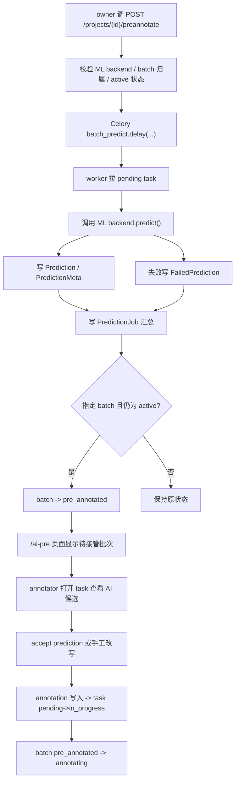

# AI 预标注接管

这页专门讲 `pre_annotated` 相关链路：项目如何触发预标，worker 如何写预测结果，batch 为什么会卡在 `pre_annotated`，以及人工接管和回滚路径是怎么落地的。

如果你要改：

- AI 预标注入口
- `prediction_jobs` / `predictions` / `failed_predictions`
- `pre_annotated` 的状态语义
- `/ai-pre` 页面和批量清理
- 人工接管时的状态联动

先读这页。

## 这条链路解决什么问题

AI 预标注的目标不是直接把 task 变成“完成”，而是：

1. 先把机器候选框写进系统
2. 让标注员在工作台里接管、修正、补全
3. 把 AI 产物和人工产物都保留在统一数据模型里

因此它天然分成两段：

- **机器阶段**：生成 prediction
- **人工阶段**：prediction 被采纳或改写成 annotation

## 全链路总图

## 代码入口

| 位置 | 作用 |
|---|---|
| `apps/api/app/api/v1/projects.py` | 触发 `POST /projects/{project_id}/preannotate` |
| `apps/api/app/workers/tasks.py` | Celery worker `_run_batch()` |
| `apps/api/app/services/prediction.py` | prediction / failed prediction 写入 |
| `apps/api/app/db/models/prediction.py` | `Prediction` / `PredictionMeta` / `FailedPrediction` |
| `apps/api/app/db/models/prediction_job.py` | `PredictionJob` 汇总表 |
| `apps/api/app/api/v1/admin_preannotate.py` | `/admin/preannotate-queue` 与批量清理 |
| `apps/api/app/services/batch.py` | `pre_annotated` 相关状态迁移与 reset |
| `apps/web/src/pages/AIPreAnnotate/` | 管理端 AI 预标入口与历史表 |
| `apps/web/src/hooks/usePredictions.ts` | 前端 prediction 查询与采纳 |

## 触发入口

项目级入口：

- `POST /projects/{project_id}/preannotate`

请求体核心字段：

- `ml_backend_id`
- `task_ids`
- `prompt`
- `output_mode`
- `batch_id`

### 当前约束

指定 `batch_id` 时，后端会校验：

- batch 属于当前 project
- `batch.status == active`

所以现在不能直接对：

- `draft`
- `pre_annotated`
- `annotating`

再发同一类 batch 预标请求。

## Worker 侧写入

`apps/api/app/workers/tasks.py:_run_batch()` 是预标真值源。

### 任务选择

worker 会按三种模式选任务：

1. 显式 `task_ids`
2. 显式 `batch_id` 时，取该 batch 下 `pending` task
3. 否则取整个 project 下 `pending` task

这里有个很关键的语义：**预标默认只跑 `pending` task。**
已经开始人工标注的 task 不会被同一轮批量预标覆盖。

### 输出产物

成功时写：

- `Prediction`
- `PredictionMeta`
- `task.total_predictions` 聚合

失败时写：

- `FailedPrediction`

整批运行级别还会写：

- `PredictionJob`

其中 `PredictionJob` 会记录：

- `project_id`
- `batch_id`
- `ml_backend_id`
- `prompt`
- `output_mode`
- `status`
- `total_tasks`
- `success_count`
- `failed_count`
- `duration_ms`
- `total_cost`

## `pre_annotated` 的语义

当 worker 跑完且满足：

- 这次请求指定了 `batch_id`
- batch 当前仍是 `active`

就会自动：

- `active → pre_annotated`

这个状态的含义不是“已完成”，而是：

- AI 候选已生成
- 人工还未真正开始接管
- 这批需要在工作台或 `/ai-pre` 里被人处理

### 为什么不直接变 `annotating`

因为 `annotating` 在当前系统里意味着：

- 已有人工工作痕迹
- 或至少已有 `in_progress / rejected` task

只有当 annotation 真正落库后，系统才认为“人开始做了”。

## 人工接管

### 接管入口

当前接管主要依赖这些前端路径：

- `/ai-pre` 页面查看历史批次
- 工作台里能看到 `pre_annotated` 批次
- task 详情 / 画布里加载 prediction 候选

### 接管动作

annotator 可选择：

1. `accept prediction`
2. 在 prediction 基础上继续改
3. 完全忽略 prediction，手工新建 annotation

只要出现有效 annotation，`AnnotationService._update_task_stats()` 就会把：

- `task.pending → in_progress`

随后 `BatchService.check_auto_transitions()` 会把：

- `pre_annotated → annotating`

这就是“AI 已就绪”到“人工已接管”的真正分界点。

## `/ai-pre` 管理面

`apps/api/app/api/v1/admin_preannotate.py` 提供两类接口：

### 1. 预标队列

- `GET /admin/preannotate-queue`

返回当前所有 `pre_annotated` 批次，并补齐：

- `prediction_count`
- `failed_count`
- `last_run_at`
- `can_retry`

这个列表回答的是：“哪些批次已经跑完 AI，正在等人工接手？”

### 2. 批量清理

- `POST /admin/preannotate-queue/bulk-clear`

支持两种模式：

1. `predictions_only`
   只清 prediction 相关表，并把 `pre_annotated → active`
2. `reset_to_draft`
   复用 `BatchService.reset_to_draft()` 做彻底重置

## 失败与回滚路径

### 单条失败

ML backend 对某题失败时，不会中断整批；worker 会写：

- `FailedPrediction`

这样批次仍可部分成功，`/ai-pre` 页面也能显示失败数。

### 清理 prediction 但保留 task 进度

如果你只是想把 AI 产物清掉，让 batch 回到“未接管但可继续生产”的状态，走：

- `bulk-clear` 的 `predictions_only`

它会删除：

- `prediction_metas`
- `predictions`
- `failed_predictions`
- `prediction_jobs`

并在 `batch.status == pre_annotated` 时回：

- `pre_annotated → active`

### 彻底回到草稿

如果整批要推倒重来，走：

- `reset_to_draft`

它除了删 prediction 相关产物，还会：

- 清 task lock
- task 非 `pending` 全回 `pending`
- 清 batch review 元数据

## 常见误解

### 误解 1：prediction 就是 annotation

不是。

- prediction 是 AI 候选
- annotation 才是最终人工结果

两者通过 `parent_prediction_id` 关联，但不共用一张表。

### 误解 2：batch 进入 `pre_annotated` 后 `/tasks/next` 会像 `active` 一样继续派题

当前不是。`scheduler.get_next_task()` 仍只从 `active / annotating` 中选题。

`pre_annotated` 更像等待人工通过批次 / task 入口接手的过渡态。

### 误解 3：清理 prediction 不需要动 batch 状态

不对。如果 prediction 清空但 batch 还停在 `pre_annotated`，UI 会出现“状态说 AI 已就绪，但实际没有候选”的矛盾态。

这也是 `predictions_only` 会主动把状态拉回 `active` 的原因。

## 前端同步点

| 文件 | 为什么要看 |
|---|---|
| `apps/web/src/pages/AIPreAnnotate/AIPreAnnotatePage.tsx` | 批量预标主入口 |
| `apps/web/src/pages/AIPreAnnotate/components/RunPanel.tsx` | 运行触发与进度提示 |
| `apps/web/src/pages/AIPreAnnotate/components/HistoryTable.tsx` | `pre_annotated` 历史列表与 bulk clear |
| `apps/web/src/hooks/usePredictions.ts` | prediction 查询与采纳 |
| `apps/web/src/pages/Workbench/shell/Topbar.tsx` | 当前 task 所属批次的 `pre_annotated` 提示 |
| `apps/web/src/components/badges/BatchStatusBadge.tsx` | `pre_annotated` 徽章 |

## 相关文档

- [预标注流水线](./prediction-pipeline)
- [批次模块](./batch-module)
- [标注模块](./annotation-module)
- [批次生命周期（端到端）](./batch-lifecycle-end-to-end)
