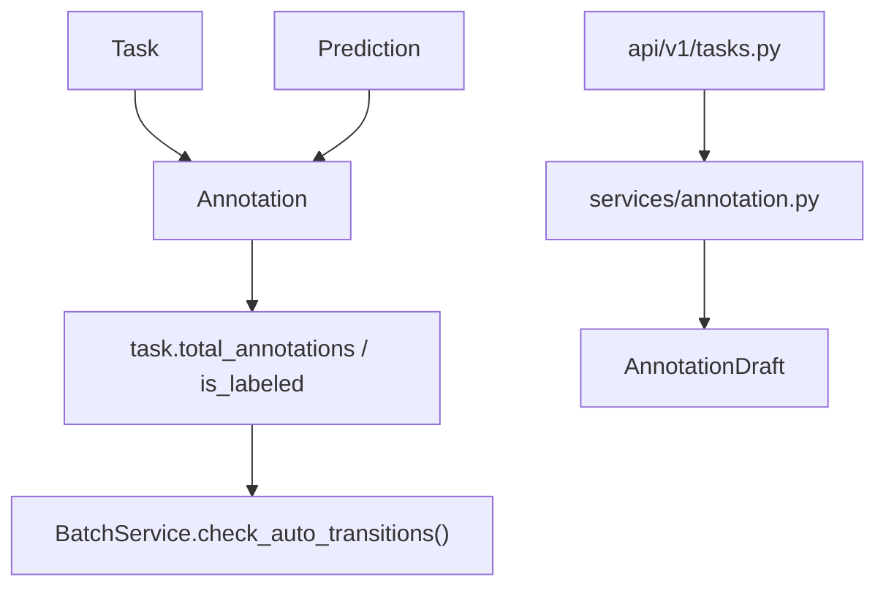

# 标注模块

本文是面向开发者的 annotation 手册，说明 `Annotation` / `AnnotationDraft` 的数据模型、写入路径、预测采纳、并发控制，以及 annotation 变更如何回推 task / batch 状态。

如果你要改：

- 画布创建 / 修改 / 删除标注
- AI prediction 采纳
- annotation 版本控制
- annotation 写入后 task / batch 的自动推进
- 标注草稿存储策略

先读这页。

## 模块定位

Annotation 是“用户最终提交的结构化标注结果”。它不是工作流状态机本身，但它会驱动状态机变化。

一句话理解：

- `task` 决定“这题现在处于什么阶段”
- `annotation` 决定“这题实际上写入了什么结果”
- annotation 的增删会反推 task / batch 的进度

## 代码入口

| 位置 | 作用 |
|---|---|
| `apps/api/app/db/models/annotation.py` | `Annotation` 主模型 |
| `apps/api/app/db/models/task_lock.py` | `AnnotationDraft` 模型，当前与 `TaskLock` 同文件 |
| `apps/api/app/schemas/annotation.py` | annotation 请求 / 响应 schema |
| `apps/api/app/services/annotation.py` | create / update / delete / accept_prediction / draft |
| `apps/api/app/api/v1/tasks.py` | annotation 与 prediction 相关 HTTP 入口 |
| `apps/api/app/services/batch.py` | annotation 写入后 batch 自动迁移 |
| `apps/web/src/api/tasks.ts` | 前端 annotation API wrapper |
| `apps/web/src/hooks/useTasks.ts` | React Query mutation 与 optimistic update |
| `apps/web/src/pages/Workbench/state/useWorkbenchAnnotationActions.ts` | 画布内增删改主消费方 |

## 数据模型

### `Annotation`

`apps/api/app/db/models/annotation.py` 中当前最关键的字段：

| 字段 | 含义 |
|---|---|
| `task_id` | 所属任务 |
| `project_id` | 所属项目，便于跨 task 聚合 |
| `user_id` | 标注创建者 |
| `source` | `manual` 或 `prediction_based` |
| `annotation_type` | 几何类型，如 `bbox`、`polygon`、`video_bbox`、`video_track` |
| `class_name` | 类目名 |
| `geometry` | JSONB 几何体 |
| `confidence` | 置信度，可空 |
| `parent_prediction_id` | 来自哪条 prediction，可空 |
| `parent_annotation_id` | 派生自哪条 annotation，可空 |
| `lead_time` | 标注耗时 |
| `attributes` | 扩展属性 |
| `was_cancelled` | 逻辑取消标记 |
| `is_active` | 软删除标记 |
| `version` | 乐观并发控制版本号 |

设计要点：

- 真实删除走 soft delete，`delete()` 只会把 `is_active` 置 `False`
- “有效标注数量”同时要求 `is_active=True` 且 `was_cancelled=False`
- `parent_prediction_id` 让系统能追踪“哪些标注来自 AI 采纳”

### Geometry union

`geometry` 是 JSONB，但 schema 边界由 `apps/api/app/schemas/_jsonb_types.py` 的 Pydantic discriminated union 约束。当前主分支包括：

| `geometry.type` | 用途 | 持久化语义 |
|---|---|---|
| `bbox` | 图片矩形框 | 单个归一化 bbox |
| `polygon` | 图片多边形 | 单个外环，可带 `holes` |
| `multi_polygon` | 多连通域 / 空洞预测 | 多个 polygon ring，主要来自 mask adapter |
| `video_bbox` | v0.9.16 视频逐帧框 | 单个 frame 上的 bbox，带 `frame_index` |
| `video_track` | v0.9.17 视频对象轨迹 | 一条 annotation 保存稳定 `track_id` 和 `keyframes[]` |

`video_track` 是 compact 轨迹模型，不把插值帧逐条写库。编辑同一对象其它帧时，前端会更新同一条 annotation 的 `geometry.keyframes[]`；前端显示的 interpolated bbox 只是视图结果。`absent=true` 表示目标在该关键帧消失，插值不能跨过该点；`occluded=true` 表示目标仍存在但被遮挡。

### `AnnotationDraft`

`AnnotationDraft` 目前定义在 `apps/api/app/db/models/task_lock.py`，不是独立文件。它保存：

- `task_id`
- `annotation_id`
- `user_id`
- `result`
- `was_postponed`

但要注意：**当前主工作台草稿并不主要依赖后端 draft 表。**
前端仍大量使用 `sessionStorage["canvas_draft:*"]` 做本地草稿恢复；后端 draft service 已存在，但还不是当前主路径。

## 写入路径

### 1. 手工创建 annotation

入口：

- `POST /tasks/{task_id}/annotations`
- `AnnotationService.create()`

主流程：

1. 校验 task 可编辑
2. 创建 `Annotation`
3. 根据是否带 `parent_prediction_id` 写 `source`
4. `flush()`
5. 调 `_update_task_stats(task_id)`
6. 对当前 task 做一次 `TaskLockService.heartbeat()`
7. 写审计日志

这意味着“画一个框”不是单纯插一行 annotation，还会续期锁并推动 task / batch 进度。

### 2. 更新 annotation

入口：

- `PATCH /tasks/{task_id}/annotations/{annotation_id}`
- `AnnotationService.update()`

当前只允许修改这些可变字段：

- `geometry`
- `class_name`
- `confidence`
- `attributes`

更新时会：

- 原地修改字段
- `annotation.version += 1`
- 返回新版本
- 路由层把 `ETag: W/"{version}"` 写回响应头

视频轨迹编辑也走同一条 `PATCH /tasks/{task_id}/annotations/{annotation_id}` 路径：新增关键帧、移动当前帧框、标记消失 / 遮挡，都会作为完整 `video_track` geometry 的一次更新保存。

### 3. 视频轨迹转独立框

入口：

- `POST /tasks/{task_id}/annotations/{annotation_id}/video/convert-to-bboxes`
- `AnnotationService.convert_video_track_to_bboxes()`

这个动作只接受 `video_track` 源 annotation，会创建一个或多个 `video_bbox`，并通过 `parent_annotation_id` 保留派生关系。

请求语义：

- `operation=copy`：保留源轨迹，只新增独立框；响应里的 `removed_frame_indexes` 为空。
- `operation=split`：从源轨迹移除对应关键帧，或在整条轨迹转换时删除源轨迹；响应里的 `removed_frame_indexes` 返回被移除的帧号。
- `scope=frame`：只转换指定 `frame_index`。
- `scope=track`：转换整条轨迹，`frame_mode=keyframes|all_frames` 决定只转换关键帧还是展开后端插值帧。

`all_frames` 与视频导出共用插值 helper，`absent=true` 不生成 bbox，并会阻断跨段插值。单次转换最多创建 5000 个 `video_bbox`，避免长视频一次写入过多 annotation。

### 4. 删除 annotation

入口：

- `DELETE /tasks/{task_id}/annotations/{annotation_id}`
- `AnnotationService.delete()`

语义不是物理删，而是：

- `annotation.is_active = False`
- 重新计算 task 统计
- 续期 task lock
- 写 `ANNOTATION_DELETE` 审计

## 预测采纳

AI 采纳入口：

- `GET /tasks/{task_id}/predictions`
- `POST /tasks/{task_id}/predictions/{prediction_id}/accept`
- `AnnotationService.accept_prediction()`

### 预测与 annotation 的边界

`Prediction.result` 在库里保存的是 Label Studio 风格 shape；读路径会先做 `to_internal_shape()` 适配，采纳时也走同一套转换。

采纳时还有两个关键语义：

1. `shape_index=None`
   采纳整条 prediction 的全部 shape
2. `shape_index=i`
   只采纳第 `i` 个 shape，并把 `_shape_index` 写进 `attributes`

这样前端可以按 `(predictionId, shapeIndex)` 双键判断“某个 AI shape 是否已经被采纳”，避免一条 prediction 里多个框互相串扰。

### alias 映射

`accept_prediction()` 会读取 `project.classes_config`，把 ML backend 写入的英文 alias 映射回项目真实类目名。

所以如果你改类目别名逻辑，要一起看：

- `annotation.py:accept_prediction`
- `project.classes_config`
- 前端 predictions 渲染与 class badge

## Task / Batch 回写

`AnnotationService._update_task_stats()` 是 annotation 模块最重要的副作用入口。

它会：

1. 统计当前 task 下有效 annotation 数
2. 更新 `task.total_annotations`
3. 更新 `task.is_labeled`
4. 在首次写入 / 全删空时推进 task 状态

当前规则：

- `count > 0` 且 `task.status == "pending"`
  `pending → in_progress`
- `count == 0` 且 `task.status == "in_progress"`
  `in_progress → pending`

如果 task 挂在 batch 下，还会继续：

- `BatchService.check_auto_transitions(batch_id)`
- `BatchService.recalculate_counters(batch_id)`

所以 annotation 模块虽然不直接写 batch.status，但它是 batch 自动迁移最核心的触发器之一。

## 并发控制与版本语义

annotation 更新当前支持 `If-Match` 乐观并发控制。

流程是：

1. 前端读取 annotation 当前 `version`
2. 更新时带 `If-Match: W/"{version}"`
3. 后端若发现版本不匹配，返回 `409 version_mismatch`

这层保护的目标不是替代 task lock，而是补一层“同一用户多标签页 / reviewer 编辑 review 态 annotation 时”的字段覆盖保护。

要区分：

- `task lock`：控制“谁能编辑这题”
- `annotation.version`：控制“同一条 annotation 是否被旧数据覆盖”

## 审计与锁续期

annotation 路径几乎都带两个伴随动作：

1. `TaskLockService.heartbeat()`
2. `AuditService.log()` / `log_many()`

当前审计动作包括：

- `ANNOTATION_CREATE`
- `ANNOTATION_UPDATE`
- `ANNOTATION_DELETE`
- `ANNOTATION_ATTRIBUTE_CHANGE`
- review 态下 reviewer 编辑时会降到 `TASK_REVIEWER_EDIT`

这意味着如果你新增 annotation 编辑动作，不能只补 service，通常还要补：

- 锁续期
- 审计 detail
- 前端 mutation 成功后的 cache invalidation

## 前端同步点

改 annotation 逻辑时，至少检查这些位置：

| 文件 | 为什么要看 |
|---|---|
| `apps/web/src/api/tasks.ts` | annotation API 包装 |
| `apps/web/src/hooks/useTasks.ts` | create/update/delete mutation |
| `apps/web/src/hooks/usePredictions.ts` | accept prediction 后的双缓存失效 |
| `apps/web/src/pages/Workbench/state/useWorkbenchAnnotationActions.ts` | 画布上的 optimistic edit |
| `apps/web/src/pages/Review/ReviewWorkbench.tsx` | reviewer 视角查看 annotation + prediction |
| `apps/web/src/pages/Workbench/state/useCanvasDraftPersistence.ts` | 当前主草稿路径仍在前端本地 |

视频工作台还要检查：

| 文件 | 为什么要看 |
|---|---|
| `apps/web/src/pages/Workbench/stage/VideoStage.tsx` | 视频播放、关键帧编辑、轨迹列表和插值显示 |
| `apps/web/src/pages/Workbench/state/transforms.ts` | `video_bbox` / `video_track` 与工作台 shape 的转换 |
| `apps/api/app/schemas/task.py` | `TaskOut.video_metadata` 和 video manifest response |

## 常见误解

### 误解 1：annotation 删除后 task 仍然算已标

不一定。只要有效 annotation 被删空，`_update_task_stats()` 会把：

- `is_labeled` 置回 `False`
- `in_progress → pending`

### 误解 2：accept prediction 只是“复制一下 prediction”

不对。它还会：

- 做 schema 适配
- 做 alias 回写
- 生成 `prediction_based` annotation
- 回推 task / batch 统计

### 误解 3：后端 draft 已经是主草稿系统

不是。当前更真实的说法是：

- 后端有 `AnnotationDraft` 数据模型和 service
- 前端工作台主草稿恢复仍以本地 `sessionStorage` 为主

## 相关文档

- [任务模块](./task-module)
- [审核模块](./review-module)
- [Task Lock](./task-locking)
- [AI 预标注接管](./ai-preannotate-handoff)
