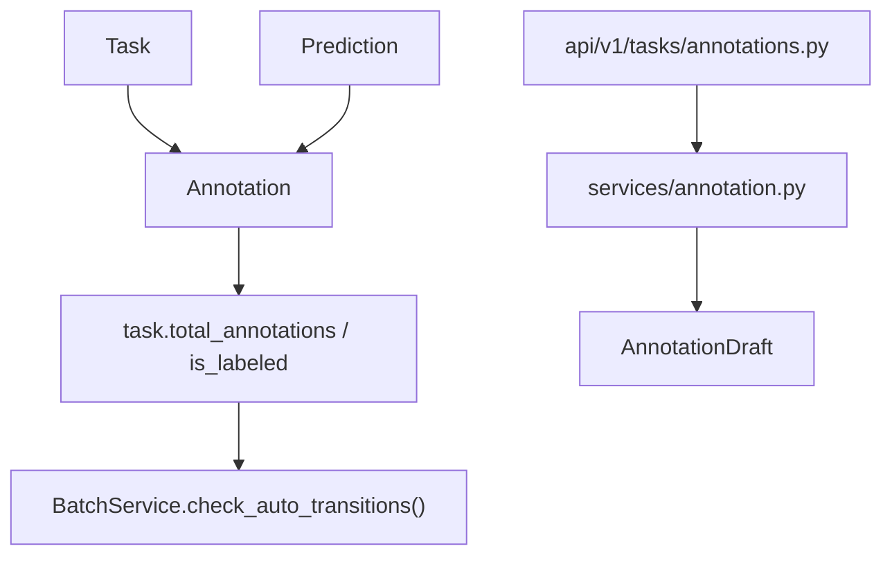

# 标注模块

本文是面向开发者的 annotation 手册，说明 `Annotation` / `AnnotationDraft` 的数据模型、写入路径、预测采纳、并发控制，以及 annotation 变更如何回推 task / batch 状态。

如果你要改：

- 画布创建 / 修改 / 删除标注
- AI prediction 采纳
- annotation 版本控制
- annotation 写入后 task / batch 的自动推进
- 标注草稿存储策略

先读这页。

## 模块定位

Annotation 是“用户最终提交的结构化标注结果”。它不是工作流状态机本身，但它会驱动状态机变化。

```mermaid
graph TD
  Task["Task"] --> Annotation["Annotation"]
  Prediction["Prediction"] --> Annotation
  Annotation --> TaskStats["task.total_annotations / is_labeled"]
  TaskStats --> BatchAuto["BatchService.check_auto_transitions()"]
  AnnotationAPI["api/v1/tasks/annotations.py"] --> AnnotationService["services/annotation.py"]
  AnnotationService --> Draft["AnnotationDraft"]
```

一句话理解：

- `task` 决定“这题现在处于什么阶段”
- `annotation` 决定“这题实际上写入了什么结果”
- annotation 的增删会反推 task / batch 的进度

## 代码入口

| 位置 | 作用 |
|---|---|
| `apps/api/app/db/models/annotation.py` | `Annotation` 主模型 |
| `apps/api/app/db/models/task_lock.py` | `AnnotationDraft` 模型，当前与 `TaskLock` 同文件 |
| `apps/api/app/schemas/annotation.py` | annotation 请求 / 响应 schema |
| `apps/api/app/services/annotation.py` | create / update / delete / accept_prediction / draft |
| `apps/api/app/db/models/annotation_operation.py` | 原子多对象操作与 lineage 账本 |
| `apps/api/app/services/mask_mutation.py` | Mask split / copy / join / overlap 事务边界 |
| `apps/api/app/db/models/annotation_conversion_plan.py` · `services/annotation_conversion.py` | 短期转换计划与原子执行边界 |
| `apps/api/app/api/v1/tasks/annotations.py` · `predictions.py` | annotation 与 prediction 相关 HTTP 入口 |
| `apps/api/app/api/v1/tasks/mask_mutations.py` | 任务级 Mask 原子 mutation 入口 |
| `apps/api/app/services/batch.py` | annotation 写入后 batch 自动迁移 |
| `apps/web/src/api/tasks.ts` | 前端 annotation API wrapper |
| `apps/web/src/hooks/useTasks.ts` | React Query mutation 与 optimistic update |
| `apps/web/src/pages/Workbench/stages/image/useImageAnnotationActions.ts` | 图片工作台 annotation action 主消费方 |
| `apps/web/src/pages/Workbench/stages/video/useVideoAnnotationActions.ts` | 视频工作台 annotation action 主消费方 |

## 数据模型

### `Annotation`

`apps/api/app/db/models/annotation.py` 中当前最关键的字段：

| 字段 | 含义 |
|---|---|
| `task_id` | 所属任务 |
| `project_id` | 所属项目，便于跨 task 聚合 |
| `user_id` | 标注创建者 |
| `source` | `manual` / `prediction_based` / `interpolated`（v0.15.x 跨帧区间插值生成框） |
| `annotation_type` | 几何类型，如 `bbox`、`polygon`、`video_bbox`、`video_track_bbox` |
| `class_name` | 类目名 |
| `geometry` | JSONB 几何体 |
| `confidence` | 置信度，可空 |
| `parent_prediction_id` | 来自哪条 prediction，可空 |
| `parent_annotation_id` | 父框 id，可空；表「车牌属于车」这类从属层级（仅一层，见下方父子约束） |
| `track_id` | 跨帧同一对象的通用标识（`String(64)`，可空，格式 `trk_<uuid.hex>`，几何类型无关）；由单一工厂 `_new_track_id()` 产出，propagate / interpolate / 导出 / 3D 前端统一读本列（见下方跨帧链）<!-- since v0.21.2 · ADR-0045 --> |
| `lead_time` | 标注耗时 |
| `attributes` | 扩展属性 |
| `attributes_meta` | 属性级溯源 sidecar，`{key: {origin, model_ref?}}`（只记 `origin=ai` 的键，见下方属性溯源） |
| `was_cancelled` | 逻辑取消标记 |
| `is_active` | 软删除标记 |
| `version` | 乐观并发控制版本号 |

设计要点：

- 真实删除走 soft delete，`delete()` 只会把 `is_active` 置 `False`
- “有效标注数量”同时要求 `is_active=True` 且 `was_cancelled=False`
- `parent_prediction_id` 让系统能追踪“哪些标注来自 AI 采纳”

#### 父子标注（`parent_annotation_id`）

`parent_annotation_id` 表达「子物属于父物」的层级从属（车牌属于车、零件属于整机）。约束与行为：

- **仅一层深度**：`AnnotationService._validate_parent_annotation` 在 `create` 时校验——父框须存在且 `is_active`、与子框**同一 task**（父子限帧内）、且父框自身 `parent_annotation_id` 为空。任一不满足返回 `400`。约束放在应用层而非 DB，给未来多层留后手。
- **级联软删**：`delete()` 软删一个父框时，其全部 `is_active` 子框一并置 `is_active=False`，不留孤儿；`_update_task_stats` 按剩余 active 数重算 task 计数。
- **创建入口**：`AnnotationCreate` 携带可空 `parent_annotation_id`，`POST /tasks/{task_id}/annotations` 透传给 service 建子框；缺省即顶层框。此前该字段只由视频 `convert` / `split` 内部构造框时写入（见下方轨迹转换）。
- **前端呈现**：工作台侧栏 `AIInspectorPanel` 按父子缩进渲染（父行下方缩进列出子框），是层级的主结构（编组已下线，顶层框平铺）。画布上，恰好单选一个框时，其直接子框描一圈**同胞高亮环**（`ImageStage` 用 `siblingHighlightChildren` 纯函数派生子框集，绕每个子框 bbox 画统一细点线环 `SIBLING_HIGHLIGHT_COLOR`，免逐 shape 穿 prop；offset 6px）。图片任务限定（video/3D 父子走各自轨迹）。**Alt 拖动联动**：按住 Alt 拖动一个 bbox 父框主体时，其直接子框按父框的实际位移一并平移（复用 `geometryTranslate` 的几何平移，父+子作为 history `batch` 复合命令进单次 undo）；不按 Alt 则仅搬父框。作用面限 `kind:"move"`（bbox 父框主体），与折线插点/关键点的 Alt 交互不冲突。

### Geometry union

`geometry` 是 JSONB，但 schema 边界由 `apps/api/app/schemas/_jsonb_types.py` 的 Pydantic discriminated union 约束。当前主分支包括：

| `geometry.type` | 用途 | 持久化语义 |
|---|---|---|
| `bbox` | 图片矩形框 | 单个归一化 bbox |
| `polygon` | 图片多边形 | 单个外环，可带 `holes` |
| `multi_polygon` | 多连通域 / 空洞预测 | 多个 polygon ring，主要来自 mask adapter |
| `rotated_bbox` | 旋转框 / OBB | `{cx,cy,w,h,angle}` 归一化，`angle` 顺时针 `[0,360)` |
| `polyline` | 开放折线 | `points[]`(≥2 顶点)，不闭合、无 `holes`、无自交校验 |
| `keypoint` | 关键点 (COCO 范式) | `points[]` 各 `{x,y,v}`，`v` 可见性 0/1/2，与类别 `keypoint_schema.nodes` 同 index 对齐 |
| `raster_mask` | 图片栅格 Mask | 单个 `coco_rle_ref`；内容在对象存储，创建由独立开关控制 |
| `video_bbox` | 视频逐帧框 | 单个 frame 上的 bbox，带 `frame_index` |
| `video_track_bbox` | 视频对象轨迹 | 一条 annotation 保存稳定 `track_id` 和 `keyframes[]` |
| `video_track_polygon` / `video_track_polyline` | 视频点集轨迹 | compact points keyframes 与 outside |
| `video_track_mask` | 视频栅格 Mask 轨迹 | compact `coco_rle_ref` keyframes；内容在对象存储 |

`keypoint` 的骨骼拓扑（命名节点 + 连线）不存进 geometry，而是 unit 级模板：`project.tool_bindings["keypoint"].keypoint_schema`（`KeypointSchema = {nodes: KeypointNode[], edges: [int,int][]}`，后端见 `_jsonb_types.py`，前端在项目设置「类别与属性」里的 `KeypointSchemaEditor` 维护）。geometry 只存各节点的 `{x,y,v}`，按 index 与 schema 节点一一对应。

`video_track_bbox` 是 compact 轨迹模型，不把插值帧逐条写库。编辑同一对象其它帧时，前端会更新同一条 annotation 的 `geometry.keyframes[]`；前端显示的 interpolated bbox 只是视图结果。目标"消失"用 `outside` 闭区间段表达；插值不跨消失段、其中不输出 bbox；`occluded=true` 表示目标仍存在但被遮挡。

`raster_mask` 保存单个图片尺寸的内容寻址 RLE 引用；`video_track_mask` 沿用 track 外壳，在关键帧保存同一种引用。创建 / 更新必须同时通过 Pydantic 强类型与 task 的媒体、尺寸和帧数上下文校验；读取对象还会复核 SHA-256、canonical bytes、runs 和 size。图片 Mask 没有时间轴语义，视频 Mask 帧间采用 hold 解析、不写展开帧；对象回收只删除没有任何 active annotation、prediction 或 staged tracker job 引用且超过 grace period 的内容。

图片工作台通过受任务权限保护的 `GET /tasks/{task_id}/mask-capabilities` 获取有效读写能力，不在浏览器复制环境变量。原生写入需同时通过部署总闸、项目 opt-in、`region` 绑定和任务 / 对象锁。`polygon | multi_polygon | raster_mask` 只能在同一 `region` 工具单元内原位转换；类型转换和 Raster 内容替换必须带最新 `If-Match`，同一事务内同步 `annotation_type` 与 `geometry.type`。

浏览器显示缓存按 `navigator.deviceMemory` 分为 64 / 128 / 192 MiB，缺失时使用 128 MiB；下载并发分别为
1 / 2 / 4。准入同时计算 crop alpha、bitmap 与保留的 RLE counts，在插入前淘汰未 pin LRU，不能让当前帧
全部 active 对象绕过硬预算。正在编辑和 selected 对象可 pin；其余对象进入可重试 `budget_exceeded`
状态。同一 SHA-256 的并发内容请求 single-flight。单对象的完整 crop 超预算时保留不超过约一百万像素的
preview 与 canonical RLE，显示使用 preview，命中按 RLE column-major run 精确查询。

### 原子多对象 Mask 操作

split / component copy / keyframe copy / join / overlap 不走多次普通 PATCH。客户端在预览时冻结媒体 / 帧范围、成员 ID 和
`expected_versions`，然后调用 `POST /tasks/{task_id}/annotations/mask-mutations:commit`。服务会稳定锁定范围对象，重算
fingerprint，复核 task / annotation / segment 锁、类别、帧、内容引用和非空结果，并从对象存储的实际 RLE 校验 copy 子集、split 分区、join 并集与 overlap 差集，再在一个 DB 事务内完成全部
update / create / soft-delete、任务统计、heartbeat、operation、lineage 和聚合审计。

`annotation_operations` 以 task + actor + idempotency key 去重，保存请求摘要、范围摘要、源 / 结果版本和类型化报告；
`annotation_lineage_edges` 表示多源到多结果的 split / copied / keyframe-copied / joined / overlap-erased / converted 关系。两张表都不存完整
geometry 或 RLE counts，source / result annotation ID 为软引用，使账本不会因标注或用户生命周期被意外删除。

### 标注转换计划

polygon、Mask 与紧致 bbox 的图片 / 视频转换使用 `dry-run → execute` 两步协议。dry-run 冻结请求、来源版本 / digest、目标 manifest 和逐项损失报告，只保存十分钟有效的 token 摘要；这一步不写对象存储，也不预留上传配额。

execute 先重验计划与来源快照，重算转换并与冻结报告比对，再按共享锁序预留新 Mask 引用、取得 annotation 行锁并复查快照。内容写入、annotation 变更、`convert_annotations` operation、`converted` lineage、统计、heartbeat 和聚合审计作为一个事务提交。短期计划过期后可清理，已成功请求的幂等回放仍由持久 operation 账本提供。

交互式 AI 的原生 Mask 候选不先写 Prediction，也不由浏览器拆成内容上传和标注创建。平台代理响应为每个候选签发绑定 task、像素、prompt revision 与实际路由的短生命周期 receipt；接受时 `POST /tasks/{task_id}/ai-mask-candidates/accept` 重新检查权限、写闸、锁和源版本，并在同一提交中写 Prediction、PredictionMeta、接受 decision、Annotation 与审计。decision 以 task + 客户端幂等键唯一保存完整响应并设有效期；相同请求可安全重放，不同请求复用 key 或过期重放返回冲突。有效 decision 引用的内容受 Raster GC 保活，过期 decision 先清理后才参与对象扫描。

### 属性 schema 与派生渲染

`Annotation.attributes` 是 JSONB 自由字段，由项目级 `AttributeField` schema（`apps/api/app/db/models/project.py` → `attribute_schema`，前端在「项目设置 / 类别与属性」用 `AttributeSchemaEditor` 维护）约束 key、类型、必填、`applies_to` 类别白名单等。

类型支持：`text` / `number` / `boolean` / `select` / `multiselect` / `range`，由 `apps/api/app/schemas/_jsonb_types.py` 的 `AttributeField` discriminated union 校验。

**派生渲染开关 `style_occluded`**（v0.11.27 引入）：单个 `AttributeField` 上的可选标记，**仅 `boolean` 字段允许**（后端 `_jsonb_types.py` 强校验，前端 `AttributeSchemaEditor` 在类型从 `boolean` 切走时同步清掉残留值、`validateAttributeFields` 做客户端兜底）。打开后，当该属性在某 annotation 上为 `true`，画布框渲染为虚线 + 半透（"遮挡样式"）。

该值不在 annotation 表上加列、不引入新枚举，纯属性驱动；因此：

- 自然进 COCO / YOLO 导出（普通属性走默认导出路径）
- 跨工具单位（图片 / 视频）的"遮挡键集合"在前端通过 `useWorkbenchShellModel` / `ReviewWorkbench` 取并集，避免切工具后视觉丢失
- 切类时属性按新类别 `applies_to` 过滤；改类悬浮框（`ClassPickerPopover`）即时联动刷新可见字段

> **历史背景**：v0.11.27 之前 `Annotation` 上有 `is_occluded` 内置布尔列，只影响视觉、不进导出。迁移 `0088_remove_annotation_occlusion` 删除该列；旧项目如需保留遮挡语义，请在 schema 上新增一个 boolean 属性并启用 `style_occluded`。`video_track_bbox.keyframes[i].occluded` 是视频轨迹层面的"目标存在但被遮挡"语义，与 annotation 表无关，未变更。

### 属性级溯源（`attributes_meta`）

`attributes` 是裸 `dict[key, value]`，说不清「某个属性到底人填还是 AI 填」——典型混合体是「人手画的框 + AI 二次推理填的属性」。`attributes_meta`（独立 JSONB 列）给每个属性 key 补一层来源标记。设计取**最小 sidecar**：**只存 `origin=ai` 的键，human 用「缺省即 human」隐式表达**，故存量行 `{}` = 全 human，无需回填。

形状：`{ "<key>": { "origin": "ai", "model_ref": { "backend_id", "model_id" } } }`。

写入与维护（`AnnotationService`）：

- **采纳预测**（`accept_prediction`）：查 `PredictionMeta`（与 prediction 1:1），从 `extra.pipeline.stages[]` 建「AI 富集属性键 → model_ref」映射。pipeline provenance 是 **stage 级、非 per-key**，per-key 靠前缀反推——富集键 = `f"{label}_{k}" if label else k`（与 `tasks.py` `_run_task_pipeline` 一致）。命中键标 `origin=ai` + model_ref；采纳前经 `attribute_overrides` 人工改过的键不标。`confidence` 在 extra 里不存在，不编造。
- **人工改属性**（`update` / `bulk_update`）：经 `_sync_attributes_meta` 同步——某 AI 键**值被改** → 删其 meta（人工认领，回落隐式 human）；**值未改** → 保留；键被**删除** → meta 联动消失。**键同步是正确性红线**（meta 不得残留已不存在的 key）。

前端：`AnnotationResponse.attributes_meta` 透传到 `AttributeForm`，`origin=ai` 的字段旁渲染极轻 `✦ AI` chip（hover 显 model）。

### 选中框二次推理（single-box secondary inference）

选中一个已落库的框 → 在它的 bbox ROI（crop）上同步跑一个能力（子物检测 / 属性分类 / OCR），产物按类型归位。端点 `POST /tasks/{task_id}/annotations/{annotation_id}/secondary-inference`，service `run_secondary_inference`（`app/services/secondary_inference.py`）。

- **与批量二次推理同一套投递**：复用 `crop_inputs_from_boxes`（裁 ROI + presigned 上传）+ `_build_predict_context` + `merge_classify_attributes` / `remap_geometry_to_image`。区别只是「源」是选中的现成框而非检测阶段，且**同步执行、不走 worker**（单框秒回）。
- **产物归位**：`write_target="attributes"` → 分类 / OCR 属性 union 回原框，写入键标 `attributes_meta.origin=ai`；`write_target="geometry"` → crop 检出几何回映回原图坐标后建**子框**（`parent_annotation_id=选中框`，`source=prediction_based`）。子检出类名不在项目标签集时回落 `__unknown`（不丢框，NG6 平台不做类映射）。
- 前端入口是画布顶部 `SecondaryInferenceBar`（选中单框时显），`useSecondaryInference` 跨启用 backend 枚举 `supported_inputs` 含 `crop` 的非交互模型、派生 `write_target`（检测→geometry / 分类·OCR→attributes）。UI 借鉴 `InteractiveToolBar` 悬浮面板：能力收成一个按 task 分组的 `<select>`（`<optgroup>`），选中项旁挂 ⚙ 参数 / ⚠ 补字段，右侧「运行」。
- **面板显隐**：二次推理不常用时可关闭该工具条（`useSecondaryBarHiddenPref` 读写 `User.preferences.ui.secondary_bar_hidden`，跨设备）；三入口切换、状态一致：工作台设置抽屉开关、选中框浮卡（`SelectedAnnotationCard`）头部 ✦ 按钮、标注右键菜单项（`buildImageContextMenuItems`）。gate 在 `useWorkbenchShellModel` 的 `SecondaryInferenceBar` 渲染条件（`!secondaryBarHidden`）。默认显示。
- **属性可见性闭合**：`AttributeForm` 只渲染项目 `attribute_schema` 里的键，故 attributes-型能力若输出项目没配的属性键，产物会写库却不显示。`SecondaryInferenceBar` 用 `missingAttributeFields` 比对能力输出键与项目已有键（`projectAttributeKeys`），缺则在能力旁给「补 N 字段」CTA，复用工作台的属性字段补全 `applyAttributeFields`（`handleEnsureAttributeFields`，带 `window.confirm`）一次补进所有启用工具单位。
- **参数控制**：能力若有可调推理参数（`hasConfigurableParams`：`params.properties` 除变体字段外还有字段），旁边给 ⚙，展开用与批量预标同一套 `SchemaForm` 渲染参数面板，初值取用户偏好 → `deriveDefaults`；调过的参数经 `buildSecondaryInferencePayload` 的 `params` 透传到后端 `_build_predict_context`。不调则沿用模型默认。
- **模型档位（变体）选择**：几何类能力（`write_target=geometry`）在能力下拉旁挂 `VariantSelector`（`compact`，与 `InteractiveToolBar` 同款），列该模型 `supported_variants` 的 series/size 等轴；用户所选经 `buildSecondaryInferencePayload` 与模型 `default_variants` 合并（所选覆盖、缺轴回落默认）成 `model_variants` 下发。属性类能力走扁平路径，`model_variants=null`，不显示档位。
- **开集文本输入**：`supported_prompts` 含 `text` 的开集（开放词表）检测 / 分割模型（`needsTextPrompt`），能力旁多一个文本框，值经 `buildSecondaryInferencePayload` 的 `prompt` 透传（后端 `run_secondary_inference` 的 `prompt` → `_build_predict_context`）；文本为空时禁运行。闭集模型不显示。
- **文本输出形态**：后端按所选 model 的 `supported_text_outputs` 选择 `context.output`；优先 `box` 以生成子框，否则使用模型声明的首项，未声明时按协议默认 `mask`。不能再把所有二次推理硬编码成 polygon，否则检测模型会走错输出链。
- **ROI 坐标回映**：`remap_geometry_to_image` 同时接受 backend 返回的 `[0,1]` 与 `[0,100]` crop 坐标，polygon / multi-polygon 的外环与 holes 一并回映，不得只保留首环。几何子项创建成功后立即失效 annotation query，使画布与右栏无需刷新即可出现。
- **同步错误翻译**：backend read timeout 转 `504`（提示先检查模型冷启动 / 显存驻留），connect error 转 `502`；不要让传输异常冒泡成含糊 500。裁剪短边不足或贴边退化仍返回 422。
- **参数 + 档位持久化**：`useSecondaryParamPrefs` 把参数与档位按 `backendId:modelId` 存进 `User.preferences.ai.secondary_by_model`（比 backend 更细，避免同 backend 多 model 串味），debounce 保存、`ai` 子树后端深合并，与 `useAiToolParamPrefs` 同范式；切框 / 刷新 / 换设备保留上次值，保存失败静默降级为组件内 state。

### `AnnotationDraft`

`AnnotationDraft` 目前定义在 `apps/api/app/db/models/task_lock.py`，不是独立文件。它保存：

- `task_id`
- `annotation_id`
- `user_id`
- `result`
- `was_postponed`

但要注意：**当前主工作台草稿并不主要依赖后端 draft 表。**
前端仍大量使用 `sessionStorage["canvas_draft:*"]` 做本地草稿恢复；后端 draft service 已存在，但还不是当前主路径。

## 写入路径

### 1. 手工创建 annotation

入口：

- `POST /tasks/{task_id}/annotations`
- `AnnotationService.create()`

主流程：

1. 校验 task 可编辑
2. 创建 `Annotation`
3. 根据是否带 `parent_prediction_id` 写 `source`
4. `flush()`
5. 调 `_update_task_stats(task_id)`
6. 对当前 task 做一次 `TaskLockService.heartbeat()`
7. 写审计日志

这意味着“画一个框”不是单纯插一行 annotation，还会续期锁并推动 task / batch 进度。

### 2. 更新 annotation

入口：

- `PATCH /tasks/{task_id}/annotations/{annotation_id}`
- `AnnotationService.update()`

当前只允许修改这些可变字段：

- `geometry`
- `class_name`
- `confidence`
- `attributes`

更新时会：

- 原地修改字段
- `annotation.version += 1`
- 返回新版本
- 路由层把 `ETag: W/"{version}"` 写回响应头

视频轨迹编辑也走同一条 `PATCH /tasks/{task_id}/annotations/{annotation_id}` 路径：新增关键帧、移动当前帧框、标记消失 / 遮挡，都会作为完整 `video_track_bbox` geometry 的一次更新保存。

### 3. 视频轨迹转独立框

入口：

- `POST /tasks/{task_id}/annotations/{annotation_id}/video/convert-to-bboxes`
- `AnnotationService.convert_video_track_to_bboxes()`

这个动作只接受 `video_track_bbox` 源 annotation，会创建一个或多个 `video_bbox`，并通过 `parent_annotation_id` 保留派生关系。

请求语义：

- `operation=copy`：保留源轨迹，只新增独立框；响应里的 `removed_frame_indexes` 为空。
- `operation=split`：从源轨迹移除对应关键帧，或在整条轨迹转换时删除源轨迹；响应里的 `removed_frame_indexes` 返回被移除的帧号。
- `scope=frame`：只转换指定 `frame_index`。
- `scope=track`：转换整条轨迹，`frame_mode=keyframes|all_frames` 决定只转换关键帧还是展开后端插值帧。

`all_frames` 与视频导出共用插值 helper，`outside` 段不生成 bbox，并会阻断跨段插值。单次转换最多创建 5000 个 `video_bbox`，避免长视频一次写入过多 annotation。

### 4. 删除 annotation

入口：

- `DELETE /tasks/{task_id}/annotations/{annotation_id}`
- `AnnotationService.delete()`

语义不是物理删，而是：

- `annotation.is_active = False`
- 重新计算 task 统计
- 续期 task lock
- 写 `ANNOTATION_DELETE` 审计

### 5. Mask 实例原子写入

入口与主流程：

- `POST /tasks/{task_id}/annotations/mask-mutations:commit`
- `MaskMutationService.commit()`
- 可见性检查先于幂等回放；回放可跳过新事务才需要的版本 / scope 检查，但不能绕过当前 assignment。
- 响应只返回操作 ID、对象 ID / 版本、删除 ID、lineage、digest 和审计 ID；成功前前端不清除草稿。
- 图片 join 支持「替换来源」和「创建副本并保留来源」；视频 join 只允许后者，新轨只含当前 manual keyframe。
- 视频 keyframe copy 通过 `source_frame_index` 锁定来源帧解析值，完整 RLE 等值验证通过后才创建目标帧单关键帧轨迹。
- 任一校验或写入失败由路由层 rollback，不会留下部分 annotation、lineage 或 audit。

## 跨帧 propagate 与插值（3D 时序）

点云 3D 时序标注支持「跨帧延续 + 区间插值」，把同一物体在 scene 多帧间的 `box_3d` 标注从「逐帧手搬框」升级为「ego 运动补偿延续 + 关键帧插值」。几何核心在 `apps/api/app/services/ego_transform.py`（`box_ego_to_world` / `box_world_to_ego` / `compensate_psr` / `interpolate_psr` 等纯函数，euler 约定与前端 three.js 锁步），业务编排在 `AnnotationService.propagate` / `propagate_batch` / `interpolate_range`，HTTP 入口都在 `api/v1/tasks/annotations.py`。

### track_id：跨帧链的键

<!-- since v0.21.2 · ADR-0045 · 跨帧链键从 group_id 高位段迁移到独立 track_id 列，编组 / group_id 列已下线 -->

`Annotation.track_id`（见上表）是跨帧延续的链键：同一物体在各帧的框共享同一个 `track_id` 形成一条链。源框无 `track_id` 时由 `_new_track_id()`（`services/annotation_propagation.py`）分配一个 `trk_<uuid.hex>` 并写回源框。区间插值据此找到链两端的关键帧。此前跨帧链借 `group_id` 高位段表达，随标注编组下线，`group_id` 列已删、跨帧语义统一到独立的 `track_id` 列。

<!-- migration 0118 · 紧凑视频轨迹 track_id 列/geometry 双写同步，Data Manager 跨 task track 检索依赖 -->

紧凑视频轨迹（`video_track_bbox` / `video_track_polygon` / `video_track_polyline`）的身份历史上有两处表示：`Annotation.track_id` 列与内嵌的 `geometry.track_id`。为让二者不再漂移，写入时由 `prepare_compact_track_identity()`（`services/annotation_track_identity.py`）收口——列一旦存在即权威，新轨迹沿用 geometry 值或分配平台 id，并把解析结果同时写回列与 `geometry.track_id`（互为镜像）。通用 `PATCH` 更新几何时拒绝改动身份（抛 `track_id cannot be changed through geometry update`），避免误换链键。迁移 `0118` 对存量数据做一次幂等回填对齐两处表示，并建偏索引 `ix_annotations_project_track_active (project_id, track_id, task_id)`——数据管理（Data Manager）跨 task 的 track 检索走这条索引。

### 单条 / 批量 propagate（运动补偿延续）

| 端点 | service | 语义 |
|---|---|---|
| `POST /tasks/{task_id}/annotations/{annotation_id}/propagate-to-task` | `propagate()` | 把单条 `box_3d` 延续到目标 task |
| `POST /tasks/{task_id}/annotations/propagate-batch` | `propagate_batch()` | 整批延续，一个事务，任一失败全部回滚 |

- `PropagateBatchRequest`：`annotation_ids: list[UUID] | None`（`None` → 源 task 全部 active `box_3d`）+ `to_task_id`。
- 运动补偿：源 / 目标帧均有 ego pose 时，由「世界位置不变」反算目标帧 PSR（`compensate_psr`），静止物在下一帧自动套住目标；任一帧缺 pose 则退化为原样复制（零回归）。响应带 `motion_compensated: bool` 标记，前端据此轻提示一次。
- 各源框延续后与源共享 `track_id` 链。

### 区间插值

`POST /tasks/{task_id}/annotations/interpolate-range` → `interpolate_range()`，`InterpolateRangeRequest`：`track_id: str` + `to_task_id`。

- 在同 `track_id` 链两端关键帧之间，给区间内每个有 task 的中间帧生成一个插值框（世界系线性内插中心 + slerp 朝向 + 线性尺寸，见 `interpolate_psr`）。
- 生成框 `source="interpolated"`，便于审核按来源过滤 / 批量删。
- 幂等：中间帧已有同 `track_id` 标注则跳过；返回 `(created, motion_compensated, skipped_frames)`。
- 任一帧缺 pose → 纯 ego 系插值（`motion_compensated=False`）。

> `point_mask_3d` 跨帧明确不做（点索引跨帧无意义）；Kalman / 非线性运动模型留后续。邻帧 overlay 的 ego 对齐是前端能力（`useSceneTrajectory` + `egoAlign.ts`），见用户指南 [点云跨帧标注](/user-guide/workbench/pointcloud-crossframe)。

## 预测采纳

AI 采纳入口：

- `GET /tasks/{task_id}/predictions`
- `POST /tasks/{task_id}/predictions/{prediction_id}/accept`
- `AnnotationService.accept_prediction()`

### 预测与 annotation 的边界

`Prediction.result` 在库里保存的是 Label Studio 风格 shape；读路径会先做 `to_internal_shape()` 适配，采纳时也走同一套转换。

采纳时还有两个关键语义：

1. `shape_index=None`
   采纳整条 prediction 的全部 shape
2. `shape_index=i`
   只采纳第 `i` 个 shape，并把 `_shape_index` 写进 `attributes`

这样前端可以按 `(predictionId, shapeIndex)` 双键判断“某个 AI shape 是否已经被采纳”，避免一条 prediction 里多个框互相串扰。

### alias 映射

`accept_prediction()` 按 `prediction.tool_unit_id` 读取 `project.tool_bindings` 中对应 unit 的 classes(`lookup_classes_for_tool_unit`),把 ML backend 写入的英文 alias 映射回项目真实类目名。生成的 annotation `tool_unit_id` 沿用 `prediction.tool_unit_id`。

所以如果你改类目别名逻辑,要一起看:

- `annotation.py:accept_prediction`
- `project.tool_bindings`（唯一存储真值；`classes_config` 是响应兼容视图，不是独立写入源）
- 前端 predictions 渲染与 class badge

## 工具单位（tool_unit）维度

annotation 必须携带 `tool_unit_id: String(30)`（枚举 bbox / polyline / region / lidar_box_3d / rotated_bbox / keypoint / point_mask_3d，与 `app/schemas/_jsonb_types.ToolUnitId` Literal 对齐）：

<!-- history: tool_unit and extra geometry units were introduced in separate release slices; this section now documents the current required model. -->

- 写入路径: `AnnotationService.create(..., tool_unit_id="bbox")` 按 `project.tool_bindings[unit].classes` **软校验** `class_name` 命中, 空集合放行兼容旧数据, 不命中返 422。
- `accept_prediction` 沿用 `prediction.tool_unit_id` 给生成的 annotation, 保持工具维度一致。
- 老数据由 alembic 0072 backfill: `annotation_type IN ('polygon', 'mask')` → `region`, 其它 → `bbox` 占位。
- `ai_interactive` 已退役。迁移把存量 annotation / prediction 及项目 binding 归位到 `region` / `bbox`；遗留客户端继续上报该值时，写入 schema 会按 geometry type 映射并记录 warning，不会把退役值重新写回数据库。

强隔离: 同名类在不同 unit 下是独立记录, 不能跨 unit 共享 (避免回退到"项目级扁平类别表"反模式)。详见 [ADR-0026](../adr/archive/0026-tool-unit-class-and-attribute-binding)。

## Task / Batch 回写

`AnnotationService._update_task_stats()` 是 annotation 模块最重要的副作用入口。

它会：

1. 统计当前 task 下有效 annotation 数
2. 更新 `task.total_annotations`
3. 更新 `task.is_labeled`
4. 在首次写入 / 全删空时推进 task 状态

当前规则：

- `count > 0` 且 `task.status == "pending"`
  `pending → in_progress`
- `count == 0` 且 `task.status == "in_progress"`
  `in_progress → pending`

如果 task 挂在 batch 下，还会继续：

- `BatchService.check_auto_transitions(batch_id)`
- `BatchService.recalculate_counters(batch_id)`

所以 annotation 模块虽然不直接写 batch.status，但它是 batch 自动迁移最核心的触发器之一。

## 并发控制与版本语义

annotation 更新当前支持 `If-Match` 乐观并发控制。

流程是：

1. 前端读取 annotation 当前 `version`
2. 更新时带 `If-Match: W/"{version}"`
3. 后端若发现版本不匹配，返回 `409 version_mismatch`

这层保护的目标不是替代 task lock，而是补一层“同一用户多标签页 / reviewer 编辑 review 态 annotation 时”的字段覆盖保护。

要区分：

- `task lock`：控制“谁能编辑这题”
- `annotation.version`：控制“同一条 annotation 是否被旧数据覆盖”

## 审计与锁续期

annotation 路径几乎都带两个伴随动作：

1. `TaskLockService.heartbeat()`
2. `AuditService.log()` / `log_many()`

当前审计动作包括：

- `ANNOTATION_CREATE`
- `ANNOTATION_UPDATE`
- `ANNOTATION_DELETE`
- `ANNOTATION_ATTRIBUTE_CHANGE`
- review 态下 reviewer 编辑时会降到 `TASK_REVIEWER_EDIT`

这意味着如果你新增 annotation 编辑动作，不能只补 service，通常还要补：

- 锁续期
- 审计 detail
- 前端 mutation 成功后的 cache invalidation

## 前端同步点

改 annotation 逻辑时，至少检查这些位置：

| 文件 | 为什么要看 |
|---|---|
| `apps/web/src/api/tasks.ts` | annotation API 包装 |
| `apps/web/src/hooks/useTasks.ts` | create/update/delete mutation |
| `apps/web/src/hooks/usePredictions.ts` | accept prediction 后的双缓存失效 |
| `apps/web/src/pages/Workbench/stages/image/useImageAnnotationActions.ts` | 图片 bbox / polygon / SAM / AI 候选 / 批量操作 |
| `apps/web/src/pages/Workbench/stages/video/useVideoAnnotationActions.ts` | 视频 bbox / track / keyframe / 转换操作 |
| `apps/web/src/pages/Workbench/modes/useReviewMode.tsx` | reviewer 模式下的 annotation 查看与审核策略 |
| `apps/web/src/pages/Workbench/state/useCanvasDraftPersistence.ts` | 当前主草稿路径仍在前端本地 |

视频工作台还要检查：

| 文件 | 为什么要看 |
|---|---|
| `apps/web/src/pages/Workbench/stages/video/VideoWorkbench.tsx` | 视频 Stage concrete implementation |
| `apps/web/src/pages/Workbench/stage/VideoStage.tsx` | 视频播放、关键帧编辑、轨迹列表和插值显示 |
| `apps/web/src/pages/Workbench/stages/video/useVideoAnnotationActions.ts` | 视频 annotation payload 与离线兜底 |
| `apps/web/src/pages/Workbench/state/transforms.ts` | `video_bbox` / `video_track_bbox` 与工作台 shape 的转换 |
| `apps/api/app/schemas/task.py` | `TaskOut.video_metadata` 和 video manifest response |

## 常见误解

### 误解 1：annotation 删除后 task 仍然算已标

不一定。只要有效 annotation 被删空，`_update_task_stats()` 会把：

- `is_labeled` 置回 `False`
- `in_progress → pending`

### 误解 2：accept prediction 只是“复制一下 prediction”

不对。它还会：

- 做 schema 适配
- 做 alias 回写
- 生成 `prediction_based` annotation
- 回推 task / batch 统计

### 误解 3：后端 draft 已经是主草稿系统

不是。当前更真实的说法是：

- 后端有 `AnnotationDraft` 数据模型和 service
- 前端工作台主草稿恢复仍以本地 `sessionStorage` 为主

### 误解 4：图片框"遮挡"是 annotation 上的内置状态位

不再是。v0.11.27 起 `Annotation.is_occluded` 列已删除（迁移 `0088`），"遮挡"收敛为普通 boolean 属性 + `AttributeField.style_occluded` 开关派生渲染。详见 [属性 schema 与派生渲染](#属性-schema-与派生渲染)。视频 `video_track_bbox.keyframes[i].occluded` 不在此次变更范围内，仍是轨迹关键帧的内置字段。

## 相关文档

- [任务模块](./task-module)
- [审核模块](./review-module)
- [Task Lock](./task-locking)
- [AI 预标注接管](./ai-preannotate-handoff)
