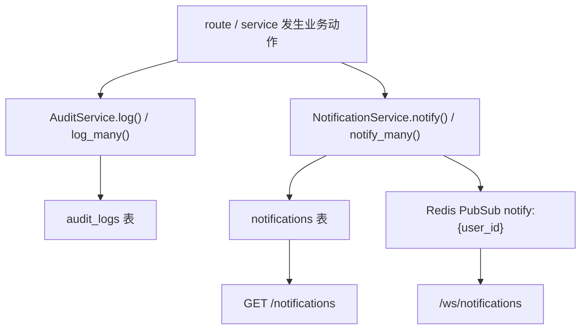

# 审计与通知

这页讲两个横切机制：

- `audit_logs`：事后追溯和运营可见性
- `notifications`：在线提醒和待办收件箱

它们经常在同一条业务链路里一起出现，但语义不同：

- audit 面向“记录发生过什么”
- notification 面向“提醒谁该处理什么”

## 模块定位

这两个机制不是统一事件总线自动派生出来的，而是**业务路由显式调用**。

这意味着改业务功能时，如果你忘了补 audit 或 notification，不会有统一框架替你兜底。

## 代码入口

| 位置 | 作用 |
|---|---|
| `apps/api/app/services/audit.py` | `AuditAction`、`AuditService.log()`、`log_many()` |
| `apps/api/app/db/models/audit_log.py` | `AuditLog` 数据模型 |
| `apps/api/app/api/v1/audit_logs.py` | audit 查询与导出 |
| `apps/api/app/services/notification.py` | 通知写表与 Redis PubSub |
| `apps/api/app/db/models/notification.py` | `Notification` 模型 |
| `apps/api/app/api/v1/notifications.py` | 通知列表、已读、偏好设置 |
| `apps/api/app/api/v1/ws.py` | `/ws/notifications` 在线推送 |

## Audit：记录发生了什么

### 核心模型

`AuditLog` 当前核心字段：

| 字段 | 含义 |
|---|---|
| `actor_id` / `actor_email` / `actor_role` | 谁触发了动作 |
| `action` | 业务动作名，如 `task.submit` |
| `target_type` / `target_id` | 作用对象 |
| `method` / `path` / `status_code` | HTTP 元数据 |
| `ip` | 客户端 IP |
| `detail_json` | 补充上下文 |
| `request_id` | 同一 HTTP 请求下的多条 audit 关联键 |
| `created_at` | 时间戳 |

### `AuditAction`

`apps/api/app/services/audit.py` 里的 `AuditAction` 当前覆盖了几类高频动作：

- 认证与用户：`auth.*`、`user.*`
- 项目 / 数据集：`project.*`、`dataset.*`
- 批次：`batch.*`
- 标注：`annotation.*`
- 任务审核：`task.submit / withdraw / approve / reject / reopen / skip`
- AI 预标：`preannotate.bulk_clear`

但它不是强制枚举。代码里也存在直接传字符串的情况，例如：

- `ai.preannotate.triggered`
- `project.cleanup_orphans`

所以现在更准确的理解是：

- 常用动作建议进入 `AuditAction`
- 业务上仍允许显式字符串

### `AuditService.log()`

最常见调用方式是：

1. 在 route 层完成状态写入
2. 调 `AuditService.log(...)`
3. 同事务 `commit`

`log()` 会自动补：

- `actor_*`
- `method`
- `path`
- `ip`
- `request_id`

调用方只需要专注于：

- `action`
- `target_type`
- `target_id`
- `detail`

### `AuditService.log_many()`

这个接口主要给“一次请求产生多条细粒度审计”的场景用。

当前最典型的例子是：

- annotation attributes 修改时，为每个 key 单独写一条 `annotation.attribute_change`

它的意义是：

- 降低前端 diff 回放的复杂度
- 便于后续按 `detail_json.field_key` 做 JSONB 查询

### `detail_json` 应该放什么

经验上，`detail_json` 适合放：

- 状态迁移前后值
- 影响数量
- 原因 / feedback
- 业务上对排障有价值的上下文

当前常见模式：

- task 提交：`project_id`、`assignee_id`
- batch 逆向迁移：`before`、`after`、`reason`
- batch reset：`from_status`、`affected_tasks`、`cascade`
- export：格式、行数、筛选条件、request id

不要把大块重复对象整份塞进去。`detail_json` 更适合“补事实”，不是“存快照”。

## Notification：提醒谁该处理什么

### 核心模型

`Notification` 当前关键字段：

| 字段 | 含义 |
|---|---|
| `user_id` | 收件人 |
| `type` | 通知类型，如 `task.rejected` |
| `target_type` / `target_id` | 指向哪个对象 |
| `payload` | UI 展示辅助数据 |
| `read_at` | 已读时间 |
| `created_at` | 创建时间 |

通知是“按用户持久化”的，不是纯瞬时弹窗。

### `NotificationService.notify()`

一次通知会做两件事：

1. 写 `notifications` 表
2. 向 Redis PubSub 频道 `notify:{user_id}` 发布消息

这样系统就同时有：

- 离线可恢复的持久化记录
- 在线即时推送

### `notify_many()`

业务上更常见的是 fan-out：

- reviewer 退回 task，通知 assignee
- annotator reopen 任务，通知原 reviewer
- reviewer 驳回 batch，通知 batch annotator

`notify_many()` 会自动去重 `user_ids`，避免重复通知同一收件人。

### 偏好静音

`NotificationService` 在写通知前会先查：

- `notification_preferences`

当前逻辑：

- 无偏好记录时，默认 `in_app = true`
- 如果某个 type 被静音，则直接跳过
  不写表，也不发 PubSub

这点很重要：**静音不是只屏蔽 websocket 推送，而是整个 in-app 通知链都不写。**

### 已知通知类型

当前 `apps/api/app/api/v1/notifications.py` 暴露的可配置类型主要有：

- `bug_report.commented`
- `bug_report.reopened`
- `bug_report.status_changed`
- `batch.rejected`
- `task.approved`
- `task.rejected`

这意味着并不是所有 `notify_many()` 类型都已经进入“用户可配置偏好”的白名单。

## 在线推送与离线读取

通知中心有两条消费路径：

### 1. REST 读取

- `GET /notifications`
- `GET /notifications/unread-count`
- `POST /notifications/{id}/read`
- `POST /notifications/mark-all-read`

这是持久化收件箱。

### 2. WebSocket 在线推送

- `GET /ws/notifications?token=...`

WS 握手时会校验 JWT，然后订阅：

- `notify:{user_id}`

如果 WS 断线，前端还能靠 REST 列表补齐遗漏消息。

## 审计和通知的配合方式

它们经常一起出现在同一个动作里，但承担不同职责。

以 `task.review/reject` 为例：

1. route 改 `task.status`
2. `AuditService.log(action=task.reject, ...)`
3. `NotificationService.notify_many(type="task.rejected", ...)`
4. `commit`

其中：

- audit 给管理员和历史记录看
- notification 给 assignee 立刻看

二者不是谁替代谁。

## 当前项目里的典型模式

### 只记 audit，不发 notification

适合：

- 纯管理动作
- 批量后台操作
- 不需要有人立即响应的设置项变更

例如：

- 用户角色变更
- 系统设置更新
- 导出操作

### audit + notification 一起发

适合：

- 有明确下游处理人的工作流动作

例如：

- `task.approved`
- `task.rejected`
- `task.reopened`
- `batch.rejected`
- `batch.review_reopened`

### 只发 notification 的情况很少

在这个仓库里，重要业务动作通常都应该至少有 audit。
如果你发现某个关键工作流只有通知没有审计，通常值得补。

## 常见修改落点

| 你想改什么 | 先看哪里 |
|---|---|
| 新增业务动作审计 | `services/audit.py` + 对应 route |
| 让某动作可通知 | `services/notification.py` + 对应 route |
| 通知偏好开关 | `api/v1/notifications.py` + `notification_preferences` |
| 审计查询 / 导出 | `api/v1/audit_logs.py` |
| 批次审计聚合视图 | `api/v1/batches.py:list_batch_audit_logs` |

## 常见误解

### 误解 1：通知就是审计

不是。

- 通知面向收件人体验
- 审计面向追溯和运营

### 误解 2：有 Redis PubSub 就不用写通知表

不对。当前实现明确是“写表 + 推送”双轨。

### 误解 3：新增 route 只要补一条 `AuditAction` 就够了

不够。你还要决定：

- `target_type / target_id` 怎么定义
- `detail_json` 记录哪些关键上下文
- 是否需要 fan-out 给具体用户

## 相关文档

- [审核模块](./review-module)
- [批次生命周期（端到端）](./batch-lifecycle-end-to-end)
- [可见性与权限](./visibility-and-permissions)
- [WebSocket 协议](/dev/reference/ws-protocol)
