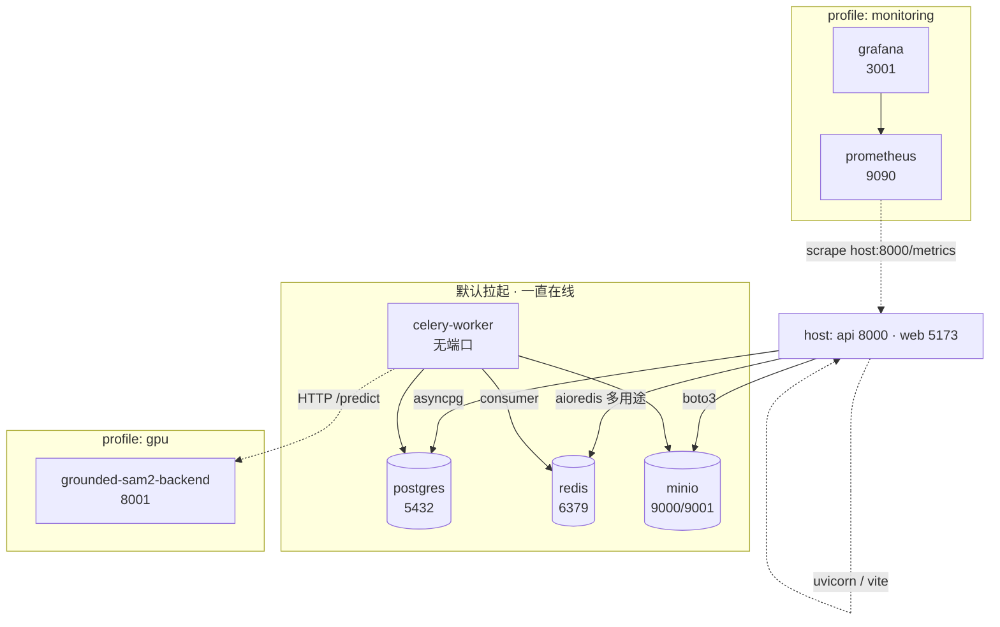

# 后端基础设施（容器）

本页对照 [`docker-compose.yml`](https://github.com/yyq19990828/ai-annotation-platform/blob/main/docker-compose.yml) 说明每个容器**做什么**、**存什么**、以及**怎么启停**。

## 一图看全



> **api / web 不在 compose 里**：dev 直接 host 跑（`uvicorn` / `vite`），compose 只管「不便本机跑的」基础设施。production 形态的 api 容器化在 [部署拓扑](./deployment-topology) 与 [部署指南](../deploy)。

## 启动 / 关停速查

```bash
# 默认四件套（postgres / redis / minio / celery-worker）
docker compose up -d

# GPU 推理（需 NVIDIA Container Toolkit）
docker compose --profile gpu up -d grounded-sam2-backend

# 可观测性（dev 多吃 ~200MB，按需）
docker compose --profile monitoring up -d prometheus grafana

# 全部停（保留 volume）
docker compose down

# 全部停 + 抹数据（重置 dev 环境）
docker compose down -v
```

## 各容器职责

### postgres · 业务主库

- **镜像**：`postgres:16-alpine`
- **端口**：宿主 `5432`
- **凭证**（dev only）：`user / pass`，库名 `annotation`
- **存什么**：所有业务数据 — `users / projects / batches / tasks / annotations / predictions / audit_log / bug_reports / api_keys / failed_predictions / ml_backends ...`，外加 alembic 迁移记录 `alembic_version`。详见 [后端分层](./backend-layers)。
- **持久化**：volume `pgdata` → `/var/lib/postgresql/data`
- **重启 vs rebuild**：业务代码改动只重启 api/worker；schema 改动跑 `alembic upgrade head`，不需要重启容器
- **常用命令**

  ```bash
  # 进 psql
  docker exec -it ai-annotation-platform-postgres-1 psql -U user -d annotation
  # 备份
  docker exec ai-annotation-platform-postgres-1 pg_dump -U user annotation > dump.sql
  # 看慢查询 / 表大小
  docker exec ai-annotation-platform-postgres-1 psql -U user -d annotation \
    -c "select relname, pg_size_pretty(pg_total_relation_size(c.oid)) from pg_class c \
        join pg_namespace n on n.oid=c.relnamespace where n.nspname='public' order by pg_total_relation_size(c.oid) desc limit 10;"
  ```

### redis · 多用途内存数据库

- **镜像**：`redis:7-alpine`
- **端口**：宿主 `6379`
- **存什么（**全在内存 + 不开 RDB**）**：

  | 用途 | key 形态 | 写入方 |
  |---|---|---|
  | Celery broker（任务队列） | `celery / unacked / kombu.binding.*` | api 入队 / worker 消费 |
  | Celery result backend | `celery-task-meta-<task_id>` | worker 写结果 |
  | WebSocket pub/sub（多副本广播） | `notify:<user_id>`、`predict:<project_id>` | api / worker → 前端 ws |
  | 限流 / 失败计数 / 进度缓存 | `ratelimit:*`、`login_fail:<ip>`、`progress:*` | middleware / api |
- **持久化**：**无 volume**。容器删 / 重启即清空 — 包括未消费的 Celery 任务、ws session、限流计数。dev 上是合意的；生产部署需挂 AOF volume。
- **常用命令**

  ```bash
  # 看队列堆积
  docker exec ai-annotation-platform-redis-1 redis-cli llen celery
  docker exec ai-annotation-platform-redis-1 redis-cli llen ml
  docker exec ai-annotation-platform-redis-1 redis-cli llen media
  # 清空（仅限 dev！）
  docker exec ai-annotation-platform-redis-1 redis-cli flushall
  ```

### minio · S3 兼容对象存储

- **镜像**：`minio/minio`
- **端口**：宿主 `9000`（S3 API）/ `9001`（Web 控制台 → http://localhost:9001 ， `minioadmin / minioadmin`）
- **存什么**：所有大文件 — 标注任务的图片帧、缩略图（blurhash 占位 + 真图）、批量导出包（COCO/YOLO/JSON zip）、评论附件、SAM 推理 fixture、用户上传 dataset；按 bucket 分（`local`、`exports`、`thumbnails` 等）
- **持久化**：volume `miniodata` → `/data`
- **常用命令**

  ```bash
  # 装 mc（host 上）：brew install minio/stable/mc
  mc alias set local http://localhost:9000 minioadmin minioadmin
  mc ls local/
  mc du local/local       # 看 bucket 占用
  ```

### celery-worker · 后台任务消费者

- **构建**：`infra/docker/Dockerfile.api`（与 api 同镜像，仅启动命令不同）
- **端口**：无（不对外暴露）
- **代码挂载**：`apps/api/app/**` 是 volume mount —— **业务代码改 .py 文件需 `docker restart` worker**（Celery 没有 `--reload`，详见 [docker rebuild vs restart](../troubleshooting/docker-rebuild-vs-restart)）
- **消费哪些队列**：`default,ml,media`（`--concurrency=4`），任务路由在 `apps/api/app/workers/celery_app.py:31-43`：

  | Queue | 谁路由进来 | 典型任务 |
  |---|---|---|
  | `default` | 兜底 | 通用异步任务 |
  | `ml` | `batch_predict` / `retry_failed_prediction` | 跑 ML backend / 重试失败预测 |
  | `media` | `generate_thumbnail` / `backfill_media` 等 | 缩略图、媒体 backfill |
  | `cleanup` | `purge_soft_deleted_attachments` / `refresh_user_perf_mv` | 默认 worker **不消费**，需另起 |
  | `audit` | `persist_audit_entry` / `persist_task_events_batch` | 默认 worker **不消费**，需另起 |
- **常用命令**

  ```bash
  # 看实时日志
  docker logs -f ai-annotation-platform-celery-worker-1
  # 改 task 签名后必须 restart（不会自动 reload）
  docker restart ai-annotation-platform-celery-worker-1
  # 验证容器加载的是最新代码
  docker exec ai-annotation-platform-celery-worker-1 \
    python -c "import inspect, app.workers.tasks as t; print(inspect.signature(t.batch_predict))"
  ```

### grounded-sam2-backend · GPU 推理服务

- **构建**：`apps/grounded-sam2-backend/Dockerfile`（context `./apps`，便于 `COPY` 兄弟目录 `_shared/mask_utils`）
- **端口**：宿主 `8001`
- **profile**：`gpu`（默认不拉起）
- **存什么**：

  | Volume | 路径 | 内容 |
  |---|---|---|
  | `gsam2_checkpoints` | `/app/checkpoints` | SAM 2.1 / GroundingDINO 模型权重（首启自动下载约 900 MB） |
  | `gsam2_hf_cache` | `/app/.cache/huggingface` | HuggingFace 下载缓存 |
- **环境变量**：`SAM_VARIANT`（默认 `tiny`）/ `DINO_VARIANT`（默认 `T`）/ `BOX_THRESHOLD` / `TEXT_THRESHOLD`
- **协议**：`POST /predict` + `GET /health`，详见 [ML Backend 协议](../ml-backend-protocol)
- **GPU 要求**：`deploy.resources.reservations.devices` 占用 1 张 NVIDIA GPU；本地无 GPU 笔记本启动会报 `could not select device driver`，跳过即可

### prometheus · 指标采集

- **镜像**：`prom/prometheus:v2.55.0`
- **端口**：宿主 `9090`
- **profile**：`monitoring`
- **存什么**：时序指标 TSDB，retention 14 天
- **持久化**：volume `prometheus_data` → `/prometheus`
- **scrape 目标**（`infra/prometheus/prometheus.yml`）：
  - `host.docker.internal:8000/metrics` ← FastAPI（host 上跑）
  - `localhost:9090` ← 自身
- **Linux 注意**：`host.docker.internal` 需要 compose 的 `extra_hosts: host-gateway` 才能解析（已配）；不通时把 target 改成宿主机 LAN IP

### grafana · 仪表盘

- **镜像**：`grafana/grafana-oss:11.4.0`
- **端口**：宿主 `3001`（避开前端 dev 3000） → http://localhost:3001 ， `admin / admin`
- **profile**：`monitoring`
- **存什么**：用户 / 看板配置 / 数据源等元信息
- **持久化**：volume `grafana_data` → `/var/lib/grafana`
- **数据源 / 看板预置**：`infra/grafana/provisioning/`（datasource）+ `infra/grafana/dashboards/anno-overview.json`（5 panel：HTTP / ML / Celery）只读 mount 进容器
- **依赖**：`depends_on: prometheus`

## Volume 一览

| Volume | 容器 | 作用 | dev 抹掉影响 |
|---|---|---|---|
| `pgdata` | postgres | 业务数据库 | **业务数据全丢**，需重新种用户 / 项目 / 任务 |
| `miniodata` | minio | 对象存储 | 所有图片 / 导出 / 附件丢失 |
| `gsam2_checkpoints` | grounded-sam2-backend | 模型权重 | 下次启动重新下载 ~900MB |
| `gsam2_hf_cache` | grounded-sam2-backend | HF 缓存 | 重新拉缓存 |
| `prometheus_data` | prometheus | 历史指标 | 历史曲线丢失 |
| `grafana_data` | grafana | 看板配置 | 自定义面板丢失（provisioned 看板会重建） |

> redis **没有** volume，不在表内。

## 健康检查与依赖关系

`postgres / redis / minio / grounded-sam2-backend` 都配了 `healthcheck`；`celery-worker` 在 `depends_on.condition: service_healthy` 上等所有底层 ready 后才启。`grafana` 只 `depends_on: prometheus`（无健康门控）。

dev 上常见 race：刚 `docker compose up -d` 立刻起 api，会因为 postgres 还在 healthcheck 中而连不上 — 等 5–15 秒再起 host 上的 `uvicorn` 即可。

## 相关文档

- [本地开发](../local-dev) · 怎么把这些容器跑起来 + host 上的 api/web
- [部署指南](../deploy) · production 形态（api / web 容器化）
- [部署拓扑](./deployment-topology) · 单机 / 分离 / 多 GPU 三种形态
- [可观测性 / 监控](../monitoring) · grafana 看板与 alerting 细节
- [ML Backend 协议](../ml-backend-protocol) · grounded-sam2-backend 的 HTTP 协议
- [Docker rebuild vs restart](../troubleshooting/docker-rebuild-vs-restart) · 改完代码什么时候要 rebuild
