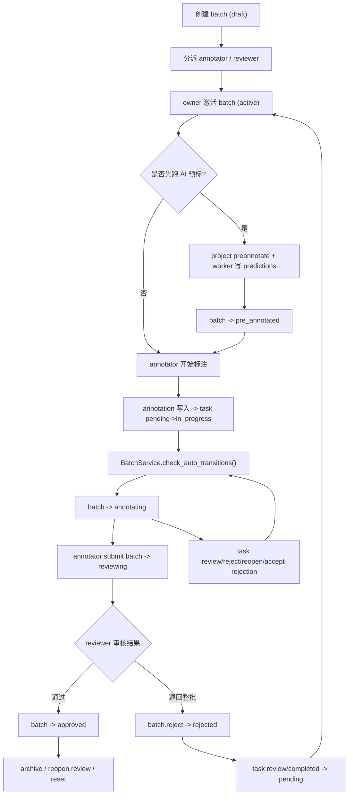

# 批次生命周期（端到端）

这页不再按“模块职责”拆，而是按一条真实批次从创建到收尾的业务链路来讲。

适合回答这类问题：

- 为什么 batch 看起来只是一个状态字段，实际上却牵着 task、annotation、scheduler 和 review 一起动
- 一次“AI 预标 → 人工接管 → 批次驳回 → 重做”的全链路到底经过哪些入口
- 哪些状态是自动推进，哪些必须人工操作

## 全链路总图

## 参与者与真值源

| 角色 / 模块 | 负责什么 |
|---|---|
| owner / super_admin | 建批、分派、激活、逆向迁移、重置 |
| annotator | 编辑 task、推动 `annotating`、提交批次送审 |
| reviewer | task 审核、batch 放行或驳回 |
| `BatchService` | batch 状态机、计数、reset、reject |
| `AnnotationService` | annotation 写入后触发 task / batch 自动推进 |
| `scheduler.get_next_task()` | 工作台按可见性与采样策略发题 |
| `workers/tasks.py:_run_batch()` | AI 预标 worker，写 predictions 并把 batch 置为 `pre_annotated` |

## 阶段 1：创建与分派

### 创建

batch 初始通常从 `draft` 开始。

此时它的语义是：

- 已经是一个业务分组
- 可以挂 task
- 但还不参与正常生产、审核和常规派题

### 分派

分派发生在 batch 层，但会级联回写 task：

- `annotator_id`
- `reviewer_id`
- `assigned_at`
- task 的 `assignee_id / reviewer_id`

所以“改的是 batch 分派”往往会影响：

- task 列表显示
- reviewer 侧待审树
- annotator 侧我的批次

## 阶段 2：激活进入生产

`draft → active` 是 owner 主动动作，不是自动迁移。

关键约束：

- 空批次不能激活
- 激活后 batch 才进入正常工作流

从这里开始，batch 会影响两个主要入口：

1. 工作台里用户能否看到该批次
2. `/tasks/next` 是否会从该批次派题

当前常规派题只从：

- `active`
- `annotating`

中挑题。

## 阶段 3：人工标注或 AI 预标接管

### 路径 A：纯人工

annotator 开始编辑任意 task 后，annotation 首次写入会触发：

- `task.status: pending → in_progress`
- `BatchService.check_auto_transitions()`

若 batch 原本是 `active`，则会自动：

- `active → annotating`

这个迁移不是前端显式点按钮，而是 annotation 写入驱动。

### 路径 B：先跑 AI 预标

owner 从项目级入口触发：

- `POST /projects/{project_id}/preannotate`

worker 会：

1. 拉本项目或指定 batch 的 `pending` task
2. 调 ML backend 产出 predictions
3. 写 `predictions / prediction_metas / failed_predictions / prediction_jobs`
4. 指定 batch 且当前仍为 `active` 时：
   `active → pre_annotated`

`pre_annotated` 的业务语义是：

- AI 候选框已经就绪
- 还没有人工真正开工
- 可以从工作台 / 批次入口进入接管

当前它**不是**常规 `/tasks/next` 继续出题的主状态；更接近“等待人工接管”的过渡态。

## 阶段 4：任务推进批次

一旦 annotator 在某题上真正开始工作，批次会进入自动推进区。

### 触发点

最常见触发点有：

- 新建 annotation
- 采纳 prediction
- 删除 annotation 导致 task 再次清空
- task 退回 / 重开 / 接受退回

### 自动迁移规则

`BatchService.check_auto_transitions()` 当前只管两类：

1. `active | pre_annotated → annotating`
   条件：存在 `Task.status in ["in_progress", "rejected"]`
2. `annotating → reviewing`
   条件：不存在 `Task.status in ["pending", "in_progress", "rejected"]`

这说明：

- `rejected` 在 batch 维度仍算“还在标注中”
- batch 是否进入 `reviewing` 看的是“是否还有未完成或待重做任务”

## 阶段 5：送审与 reviewer 处理

### annotator 提交整批

annotator 在自己负责的 `annotating` 批次上手工触发：

- `annotating → reviewing`

这是 batch 级送审，不等于每一条 task 都已经 individually `completed`。

### reviewer 决策

reviewer 有两类决定：

1. **task 级**
   `review/approve` 或 `review/reject`
2. **batch 级**
   `reviewing → approved`
   或 `POST /batches/{id}/reject`

task 级动作改变的是单题状态；batch 级动作改变的是整批是否放行。

## 阶段 6：驳回、重做与复审

### task 级退回

当 reviewer 对某题 `review/reject`：

- `task.status = rejected`
- `reject_reason` 保留
- annotator 后续可 `accept-rejection`

这通常会把 batch 继续维持在 `annotating` 语义上，直到重做完成。

### batch 级驳回

当 reviewer 驳回整批：

- `batch.status = rejected`
- `review_feedback` 写入批次
- 所有 `review / completed` task 回到 `pending`

这是一种“整批退回重做”，不清 annotation 历史，但会把生产流重新拉回前段。

### owner 复审重开

owner 可把：

- `approved → reviewing`
- `rejected → reviewing`

用于发起复审。系统要求 `reason`，并会发 `batch.review_reopened` 通知。

## 阶段 7：归档或重置

### 归档

`archived` 是收尾态，表示这批暂时退出日常工作流。

归档后：

- 常规工作台与 reviewer 流程不再以它为主
- owner 仍可 `archived → active` 重新拉回生产

### reset_to_draft

这是最重的兜底动作：

- 任意状态回 `draft`
- task 全部回 `pending`
- 删除 `task_locks`
- 清批次 review 元数据
- 级联删 `predictions / failed_predictions / prediction_jobs / prediction_metas`

它适用于：

- 预标产物要整体丢弃
- 这批需要重做分组或重跑流程
- `/ai-pre` 页面历史卡片需要彻底清掉

## 一个最常见的真实链路

下面这条链路基本覆盖了系统里最容易联动出 bug 的部分：

1. owner 创建并分派 batch
2. owner 激活到 `active`
3. owner 跑 AI 预标
4. worker 写 prediction，batch 变 `pre_annotated`
5. annotator 进入任务，采纳或修改 prediction
6. 首条有效 annotation 产生，batch 自动变 `annotating`
7. annotator 提交整批到 `reviewing`
8. reviewer 驳回其中若干 task 或整批
9. annotator 重做后再次送审
10. reviewer 放行到 `approved`
11. owner 归档，或必要时 reopen review / reset

如果你改的是下面任一项，最好按这条链路通读一遍：

- batch 状态机
- annotation 写入副作用
- reviewer 权限
- predictions 清理
- workbench 可见性

## 开发时的检查顺序

改 batch 生命周期相关代码时，建议按这个顺序检查：

1. `apps/api/app/services/batch.py`
2. `apps/api/app/api/v1/batches.py`
3. `apps/api/app/api/v1/tasks.py`
4. `apps/api/app/services/annotation.py`
5. `apps/api/app/services/scheduler.py`
6. `apps/api/app/workers/tasks.py`
7. `apps/web/src/pages/Projects/sections/BatchesSection.tsx`
8. `apps/web/src/pages/Review/ReviewPage.tsx`
9. `apps/web/src/pages/Annotate/AnnotatePage.tsx`
10. `apps/web/src/pages/AIPreAnnotate/`

## 相关文档

- [批次模块](./batch-module)
- [任务模块](./task-module)
- [审核模块](./review-module)
- [AI 预标注接管](./ai-preannotate-handoff)
