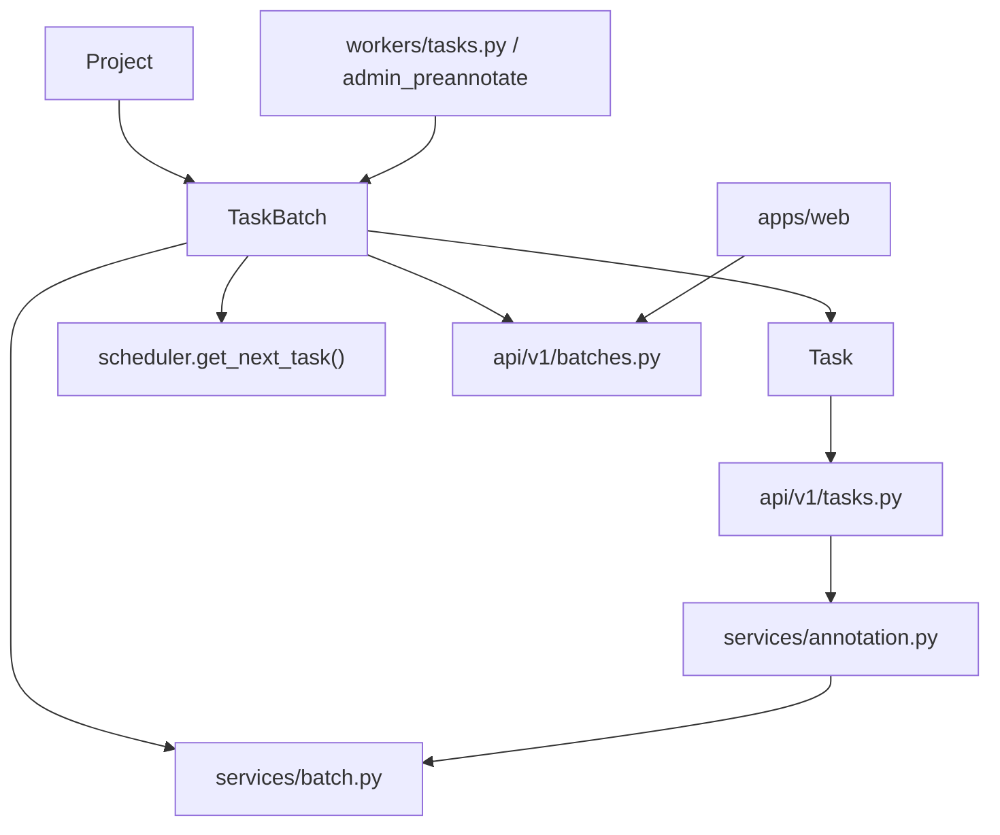
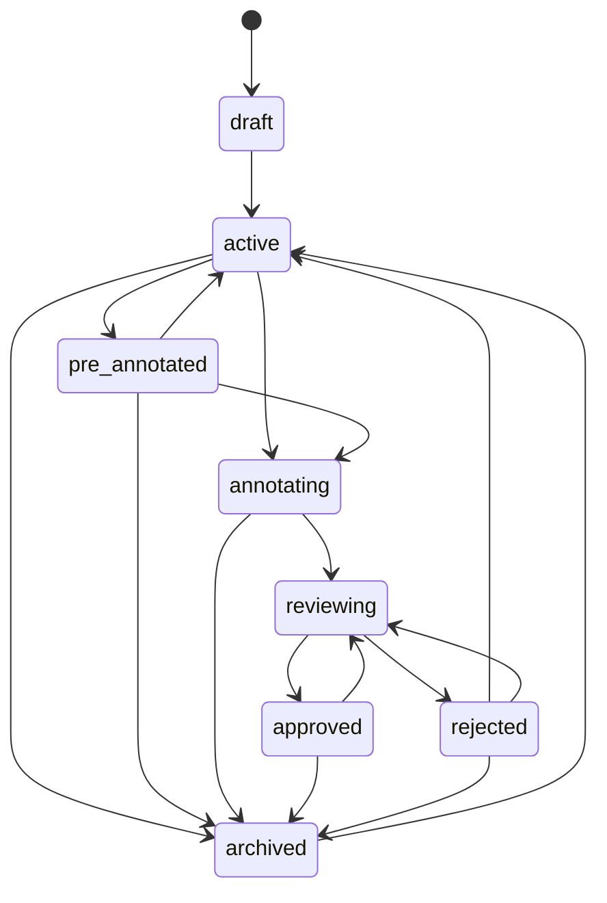

# 批次模块

本文是面向开发者的 batch 手册，覆盖批次的数据模型、状态机、调度联动、前后端入口与测试锚点。

如果你要改：

- 批次状态迁移
- 批次分派
- AI 预标后的接管流程
- 批量操作
- 工作台里“我的批次 / 下一题派发”的行为

先读这页。

## 模块全景

批次不是孤立表，它夹在项目、任务、工作台调度和审核流之间。



批次模块的关键职责：

- 把任务按业务维度分组
- 承载分派关系：`annotator_id` / `reviewer_id`
- 驱动 batch 级状态机
- 作为工作台筛题和“下一题派发”的边界
- 承接审核结果、逆向迁移、归档和终极重置

## 代码入口

| 位置 | 作用 |
|---|---|
| `apps/api/app/db/models/task_batch.py` | SQLAlchemy 模型 |
| `apps/api/app/db/enums.py` | `BatchStatus` 枚举 |
| `apps/api/app/schemas/batch.py` | 请求 / 响应 schema |
| `apps/api/app/services/batch.py` | 状态机、分派、split、bulk、reset 核心逻辑 |
| `apps/api/app/api/v1/batches.py` | HTTP 路由、权限、审计、通知编排 |
| `apps/api/app/services/scheduler.py` | `/tasks/next` 派题时的 batch 过滤 |
| `apps/api/app/services/annotation.py` | annotation 写入后触发 batch 自动迁移 |
| `apps/api/app/api/v1/tasks.py` | withdraw / reopen / accept-rejection 等 task 事件对 batch 的回写 |
| `apps/web/src/api/batches.ts` | 前端 batch API wrapper |
| `apps/web/src/pages/Projects/sections/BatchesSection.tsx` | 项目设置页的批次主 UI |
| `apps/web/src/pages/Projects/sections/BatchesKanbanView.tsx` | 批次看板与前端迁移 dry-run |

## 数据模型

`TaskBatch` 的核心字段：

| 字段 | 含义 |
|---|---|
| `project_id` | 所属项目 |
| `dataset_id` | 关联数据集，可空 |
| `display_id` | 人类可读 ID，如 `B-12` |
| `status` | batch 状态机当前状态 |
| `priority` | 工作台派题和列表排序的主序 |
| `annotator_id` | 单值标注员 |
| `reviewer_id` | 单值审核员 |
| `assigned_user_ids` | 兼容旧路径的派生字段，当前由前两者同步生成 |
| `review_feedback` | 批次被退回时的审核反馈 |
| `reviewed_at` / `reviewed_by` | 最近一次批次级审核元数据 |
| `total_tasks` / `completed_tasks` / `review_tasks` / `approved_tasks` / `rejected_tasks` | 聚合计数 |

设计要点：

- v0.7.2 之后是“单批次单标注员 + 单审核员”语义，不再是 batch 级多人 list
- `assigned_user_ids` 还保留着，但属于兼容层；新代码优先读 `annotator_id` / `reviewer_id`

## 状态机

当前合法状态集合：

```text
draft
active
pre_annotated
annotating
reviewing
approved
rejected
archived
```

状态机总图：



后端真值源在 `apps/api/app/services/batch.py:VALID_TRANSITIONS`。

### 自动迁移

`BatchService.check_auto_transitions()` 当前只处理两类自动迁移：

- `active | pre_annotated → annotating`
  条件：batch 内存在 `Task.status in ["in_progress", "rejected"]`
- `annotating → reviewing`
  条件：batch 内不存在 `Task.status in ["pending", "in_progress", "rejected"]`

注意：

- `reviewing → annotating` **不会**被 auto transition 自动反推
- `withdraw` / `reopen` / `accept-rejection` 这类 task 事件通过业务路由显式回写 task 状态，再调用 `check_auto_transitions()` 和 `recalculate_counters()`

### 手工迁移权限

主要权限矩阵在 `assert_can_transition()`：

- owner / super_admin：最终兜底，几乎覆盖所有合法迁移
- annotator：只允许把自己负责的 `annotating` 批次送到 `reviewing`
- reviewer：只负责 `reviewing → approved/rejected`
- reverse transition：
  `archived → active`
  `approved → reviewing`
  `rejected → reviewing`
  `pre_annotated → active`
  这些都要求 owner，并强制填写 `reason`

## AI 预标联动

`pre_annotated` 是 v0.9.5 引入的中间态，语义是：

- AI 文本批量预标已经跑完
- predictions 还在
- 批次等人工接管

这会影响 3 个地方：

1. `VALID_TRANSITIONS`
   `active → pre_annotated`、`pre_annotated → annotating | active | archived`
2. `check_auto_transitions()`
   标注员开始动 task 后，`pre_annotated → annotating`
3. 前端展示
   `BatchStatusBadge`、Kanban、AdminDashboard、`/ai-pre` 页面都需要认识这个状态

如果你新增一个 batch 状态，至少要同步这些位置；只改枚举通常不够。

## 调度与任务联动

### `/tasks/next`

`apps/api/app/services/scheduler.py:get_next_task()` 是真实的“下一题派发”入口。

它对 batch 的依赖包括：

- 只从 `TaskBatch.status in ["active", "annotating"]` 中选任务
- 非特权用户还要命中 batch 可见性条件
- 按 `TaskBatch.priority` 排序

因此，改 batch 状态机会直接影响工作台拿题行为。

### annotation 写入

`apps/api/app/services/annotation.py:_update_task_stats()` 在首次产生标注时会：

- `task.is_labeled = True`
- `task.status: pending → in_progress`
- 如果 task 属于某个 batch：
  调 `BatchService.check_auto_transitions(batch_id)`
  再调 `recalculate_counters(batch_id)`

这就是为什么 batch 状态并不只由 `/batches/{id}/transition` 控制。

### task 事件

`apps/api/app/api/v1/tasks.py` 里这些端点也会影响 batch：

- `POST /tasks/{id}/withdraw`
- `POST /tasks/{id}/reopen`
- `POST /tasks/{id}/accept-rejection`

它们都会在 task 状态变化后重新计算 batch 状态和计数。

## 批次级操作

`BatchService` 当前承载的主要能力：

- `create` / `update` / `delete`
- `transition`
- `split`
- `distribute_batches_in_project`
- `reject_batch`
- `reset_to_draft`
- `bulk_archive`
- `bulk_delete`
- `bulk_reassign`
- `bulk_activate`
- `check_auto_transitions`
- `recalculate_counters`

### `reject_batch`

这是“软重置”：

- 只把 `review` / `completed` 任务回退到 `pending`
- 不清 annotations 历史
- batch 写入 `review_feedback`

### `reset_to_draft`

这是“重兜底”：

- 任意状态回 `draft`
- 非 `pending` task 统一回 `pending`
- 删除 `task_locks`
- 清 review 元数据
- 级联清掉 predictions / failed_predictions / prediction_jobs / prediction_metas

### bulk 系列

后端当前已实现：

- `bulk-archive`
- `bulk-delete`
- `bulk-reassign`
- `bulk-activate`

尚未实现：

- bulk pause / resume
- admin_locked 语义

### 批次导出

`GET /api/v1/projects/{project_id}/batches/{batch_id}/export` 与项目级导出共享同一套格式参数。图片项目支持 `format=coco|yolo|voc`；`video-track` 批次通过 `format=coco` 兼容入口返回 Video JSON，并透传：

- `include_attributes`：控制是否输出属性 schema 与标注属性。
- `video_frame_mode=keyframes|all_frames`：控制视频轨迹只导出关键帧，或展开插值后的逐帧 bbox。

批次级 Video JSON 文件名使用 `*_video_tracks.json` 后缀，避免与图片 COCO JSON 混淆。

## 前端同步点

如果你改 batch 状态相关逻辑，至少检查这些文件：

| 文件 | 为什么要看 |
|---|---|
| `apps/web/src/api/batches.ts` | 前端请求和返回类型 |
| `apps/web/src/pages/Projects/sections/BatchesSection.tsx` | 批次列表页按钮、文案、状态标签 |
| `apps/web/src/pages/Projects/sections/BatchesKanbanView.tsx` | 前端 `VALID_TRANSITIONS` 镜像 |
| `apps/web/src/components/badges/BatchStatusBadge.tsx` | 状态徽章 |
| `apps/web/src/pages/Workbench/shell/WorkbenchShell.tsx` | 工作台批次筛选 |
| `apps/web/src/pages/Annotate/AnnotatePage.tsx` | 标注侧送审操作 |

常见坑：

- 后端加了新状态，前端 badge / 看板没补
- `VALID_TRANSITIONS` 改了，Kanban 还在用旧镜像
- `BatchResponse` 类型没补，UI 上读不到新增字段

## 测试锚点

先看这些测试文件：

| 文件 | 覆盖重点 |
|---|---|
| `apps/api/tests/test_batch_lifecycle.py` | 批次状态机主干、权限矩阵、bulk 操作 |
| `apps/api/tests/test_v0_7_6.py` | `reset_to_draft` 与 `pre_annotated → annotating` |
| `apps/api/tests/test_batch_pre_annotated.py` | `pre_annotated` 合法迁移 |
| `apps/web/src/pages/Projects/sections/BatchesSection.test.tsx` | BatchesSection 烟测 |
| `apps/web/src/pages/Projects/sections/BatchesKanbanView.test.tsx` | Kanban 前端迁移限制 |

推荐调试顺序：

1. 先改 `BatchService` 或路由
2. 补 / 改后端测试
3. 刷 OpenAPI 与前端 wrapper
4. 再改前端状态展示与交互

## 文档一致性

当前与 batch 相关的文档入口：

- 用户视角：[批次与分配](/user-guide/for-project-admins/batch)
- 决策视角：[ADR-0008](/dev/adr/0008-batch-admin-locked-status)

如果你改了以下内容，记得同步文档：

- `BatchStatus` 枚举
- `VALID_TRANSITIONS`
- 批量操作集合
- 批次导出的格式、查询参数或文件命名
- owner / annotator / reviewer 的迁移权限
- `pre_annotated` 或未来新状态的业务语义
