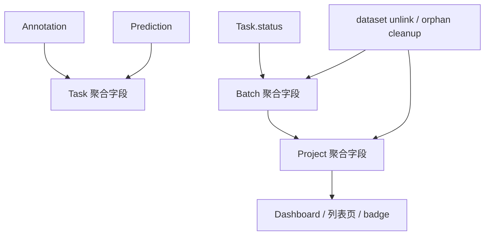

# 计数与派生字段

这页讲的是系统里那些“看起来像普通字段，实际上是聚合缓存或派生值”的内容。

如果你要改：

- `total_tasks / completed_tasks / review_tasks / in_progress_tasks`
- `task.total_annotations / total_predictions / is_labeled`
- dashboard 上的进度条、比例和概览数
- dataset unlink / orphan cleanup / reset 之后的统计一致性

先读这页。

## 这类字段是什么

当前仓库里有很多字段不是“原始事实”，而是从别的表算出来后持久化的结果。

最常见的几类：

- task 级：`total_annotations`、`total_predictions`、`is_labeled`
- batch 级：`total_tasks`、`completed_tasks`、`review_tasks`
- project 级：`total_tasks`、`completed_tasks`、`review_tasks`、`in_progress_tasks`
- dashboard 级：由上面这些字段再拼出的 UI 摘要

一句话理解：

**这些字段是为查询性能和页面展示准备的缓存层，不是最终真值源。**

## 模块关系

## 代码入口

| 位置 | 作用 |
|---|---|
| `apps/api/app/services/annotation.py` | 回写 `task.total_annotations`、`is_labeled` |
| `apps/api/app/services/prediction.py` | 回写 `task.total_predictions` |
| `apps/api/app/services/batch.py` | `recalculate_counters()` 与 `_sync_project_counters()` |
| `apps/api/app/services/dataset.py` | dataset link / unlink 后的 project / batch 重算 |
| `apps/api/app/api/v1/projects.py` | orphan cleanup 后的 project / batch 重算 |
| `apps/api/app/api/v1/dashboard.py` | 消费这些聚合字段形成总览 |

## Task 级派生字段

### `total_annotations`

来源：

- `AnnotationService._update_task_stats()`

统计口径：

- `Annotation.task_id == task_id`
- `is_active == True`
- `was_cancelled == False`

这意味着：

- 被软删除的 annotation 不计入
- 被 cancel 的 annotation 也不计入

### `is_labeled`

规则很简单：

- `total_annotations > 0` 时为 `True`
- 否则为 `False`

但它影响很大，因为 `scheduler.get_next_task()` 会用它过滤候选题。

### `total_predictions`

来源：

- `PredictionService.create_from_ml_result()`

它是 AI 候选数量的缓存，不等于 annotation 数量，也不等于 task 是否已经被人工接管。

## Task 字段为什么会推进状态

`AnnotationService._update_task_stats()` 不只是更新计数，还会顺手推进 task 状态：

- 首次出现有效 annotation：
  `pending → in_progress`
- annotation 删空：
  `in_progress → pending`

这说明 task 上有两类变化经常同时发生：

1. 聚合字段变化
2. 工作流状态变化

如果你只盯着状态，不看聚合字段，或者反过来，只盯着数字不看状态，都容易误判。

## Batch 级聚合字段

`BatchService.recalculate_counters()` 当前会重算：

- `total_tasks`
- `completed_tasks`
- `review_tasks`

统计口径直接看 `tasks` 表：

- `count(*)`
- `count(filter status == completed)`
- `count(filter status == review)`

注意：

- batch 级当前没有持久化 `in_progress_tasks`
- annotator dashboard 里看到的 “标注中” 数，有时是额外算出来的，不全靠 batch 列

## Project 级聚合字段

`BatchService._sync_project_counters()` 当前会重算：

- `total_tasks`
- `completed_tasks`
- `review_tasks`
- `in_progress_tasks`

这一步通常跟在 `recalculate_counters(batch_id)` 后面。

所以在绝大多数 task / batch 业务路径里，project counters 是 batch service 顺手同步上去的。

## 谁在触发重算

### 1. Annotation 写入

最常见的触发器：

- create annotation
- accept prediction
- delete annotation

路径：

1. `_update_task_stats()`
2. `BatchService.check_auto_transitions()`
3. `BatchService.recalculate_counters(batch_id)`
4. `_sync_project_counters(project_id)`

### 2. Task 审核流

这些动作都会在状态改变后调 batch 重算：

- `submit`
- `skip`
- `withdraw`
- `review/approve`
- `review/reject`
- `reopen`
- `accept-rejection`

虽然其中有些路径还手工先改了部分 project 字段，但最终仍会回到 batch 重算链路。

### 3. Batch 级操作

这些动作也会触发重算：

- `reject_batch`
- `reset_to_draft`
- `split`
- `delete`
- `bulk_*`

### 4. Dataset / 清理类操作

这类最容易漏，因为它们不是核心工作流，但会大规模改底层 task 集合。

当前已有重算路径：

- `DatasetService.link_to_project()`
- `DatasetService.unlink_project()`
- `projects.cleanup_orphans`

它们会直接重算 project / batch counters，而不是等用户下一次操作被动纠正。

## Dashboard 为什么依赖这些字段

dashboard 和列表页有两种取数方式：

1. 直接消费持久化聚合字段
2. 在持久化字段基础上再做额外查询

例如：

- project 列表会直接看 `project.total_tasks / completed_tasks / review_tasks`
- reviewer dashboard 会结合 `batch.review_tasks` 判断某批是否进入待审树
- annotator dashboard 的“已动工”有时会额外算 `in_progress`

所以改聚合字段后，不是只有模型层受影响，页面语义也可能变化。

## 这些字段为什么容易出错

### 原因 1：写路径很多

同一组 counters 可能被：

- annotation service
- batch service
- dataset service
- projects cleanup

分别改动。

### 原因 2：有些地方走统一重算，有些地方先手工改再统一重算

例如 task review 流里，部分端点会先手工增减：

- `project.completed_tasks`
- `project.review_tasks`

然后再调用 `recalculate_counters()`。

这种写法的好处是接口返回前局部语义更直观；坏处是如果后面忘了统一重算，容易漂移。

### 原因 3：UI 还会自己做二次派生

例如：

- `pendingTasks = totalTasks - startedDone`
- 百分比进度条
- reviewer / annotator 的特殊口径

所以“数据库数字对了，页面还不对”是可能发生的。

## 开发时的判断原则

### 原则 1：先找真值源，再找缓存层

例如你看到：

- `batch.completed_tasks` 不对

先问：

- 哪些 task.status 才算 completed
- 是 task 真值错了，还是 batch 聚合没刷新

### 原则 2：改集合边界时，一定补重算

凡是会增删 task 集合成员的地方，都要检查是否需要重算：

- dataset unlink
- orphan cleanup
- batch delete / split
- reset / bulk clear

### 原则 3：不要把 UI 层口径错当成数据库字段 bug

有些页面展示的是“业务口径派生值”，不是字段原样输出。

## 常见修改落点

| 你想改什么 | 先看哪里 |
|---|---|
| annotation 数和已标记语义 | `services/annotation.py` |
| prediction 数 | `services/prediction.py` |
| batch / project counters 重算 | `services/batch.py` |
| dataset 删除 / unlink 后数字异常 | `services/dataset.py` |
| orphan cleanup 后数字异常 | `api/v1/projects.py` |
| dashboard 显示口径 | `api/v1/dashboard.py` + 前端页面 |

## 常见误解

### 误解 1：`is_labeled` 等于 `status != pending`

不等于。

- `is_labeled` 看有效 annotation 是否存在
- `status` 看任务工作流阶段

### 误解 2：batch counters 只会在 batch 路由里改

不对。annotation、task 审核流、dataset 清理都可能触发 batch counters 重算。

### 误解 3：project counters 永远完全可信

它们是缓存层，正常情况下应被及时回写；但排查问题时，仍要回到 task 真值重新核对。

## 相关文档

- [任务模块](./task-module)
- [批次模块](./batch-module)
- [批次生命周期（端到端）](./batch-lifecycle-end-to-end)
- [Scheduler 与派题](./scheduler-and-task-dispatch)
