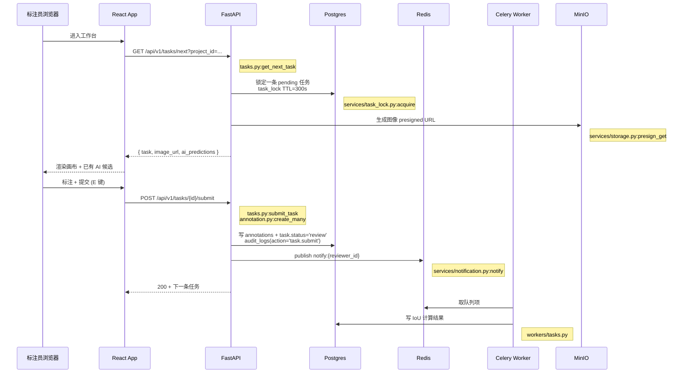
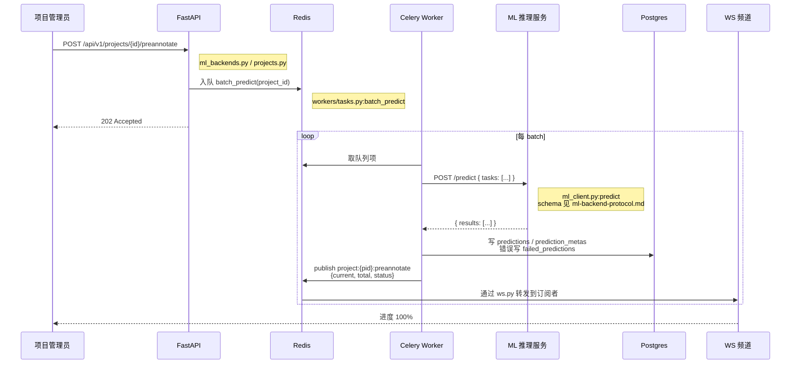
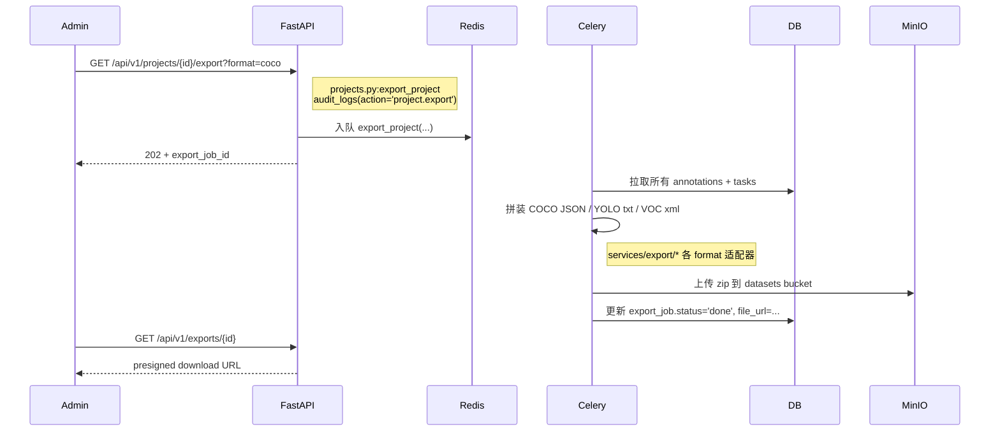
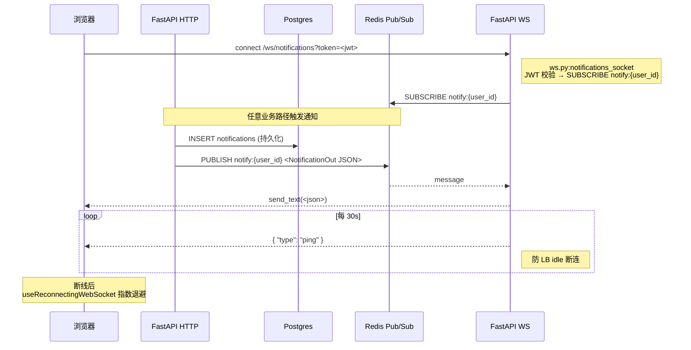

# 数据流

每张序列图配套关键代码路径——点 GitHub 或 IDE 跳转直达函数。

## 标注一条任务的完整链路

代码索引：
- 取下一题：`apps/api/app/api/v1/tasks.py` (get_next_task / next_smart 端点)
- 任务锁：`apps/api/app/services/task_lock.py:acquire/heartbeat/release`
- 提交：`apps/api/app/api/v1/tasks.py:submit_task`
- 审计：`apps/api/app/services/audit.py:AuditAction.TASK_SUBMIT`
- 通知：`apps/api/app/services/notification.py:NotificationService.notify`
- presigned URL：`apps/api/app/services/storage.py`

---

## AI 预标注

代码索引：
- 触发端点：`apps/api/app/api/v1/projects.py` 或 `ml_backends.py`
- ML client：`apps/api/app/services/ml_client.py:predict` (`ml_client.py:41-62`)
- ML 协议契约：[`docs-site/dev/ml-backend-protocol.md`](../ml-backend-protocol)
- Worker：`apps/api/app/workers/tasks.py:batch_predict`
- WS 频道：`apps/api/app/api/v1/ws.py:preannotate_progress` (`ws.py:48-67`)
- WS 协议：[`docs-site/dev/ws-protocol.md`](../ws-protocol)

---

## 数据导出

代码索引：
- 端点：`apps/api/app/api/v1/projects.py` (导出/列表/下载)
- 审计：v0.7.8 起所有导出写 `AuditAction.PROJECT_EXPORT` / `BATCH_EXPORT`
- Worker：`apps/api/app/workers/tasks.py`（export_project 任务）
- 格式适配：`apps/api/app/services/export/`

---

## 实时通知

服务端 push 主要事件：

- 任务被分配 / 被回退（type=`task.assigned` / `task.review_rejected`）
- AI 预标注完成（type=`ai.preannotate_done`）
- 导出完成（type=`export.completed`）
- 评论 @ 提及（type=`comment.mention`）

代码索引：
- WS 端点：`apps/api/app/api/v1/ws.py` (`ws.py:70-114`)
- 通知服务：`apps/api/app/services/notification.py:NotificationService.notify` (`notification.py:51-94`)
- 通知模型：`apps/api/app/db/models/notification.py`
- 前端 hook：`apps/web/src/hooks/useNotificationSocket.ts`
- 重连基础：`apps/web/src/hooks/useReconnectingWebSocket.ts`
- WS 协议详细：[`docs-site/dev/ws-protocol.md`](../ws-protocol)
