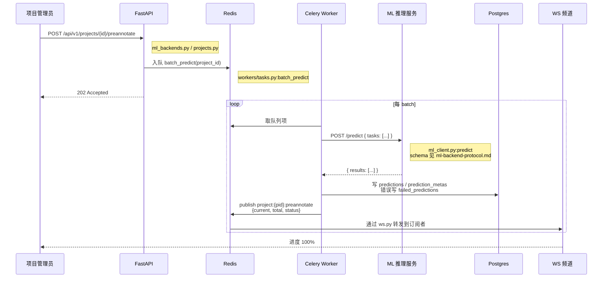
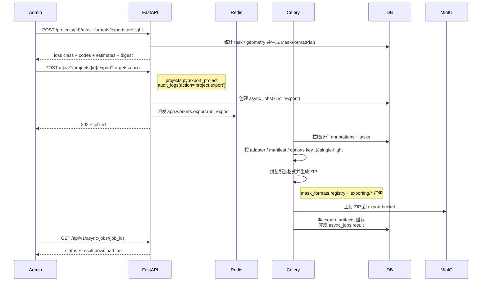
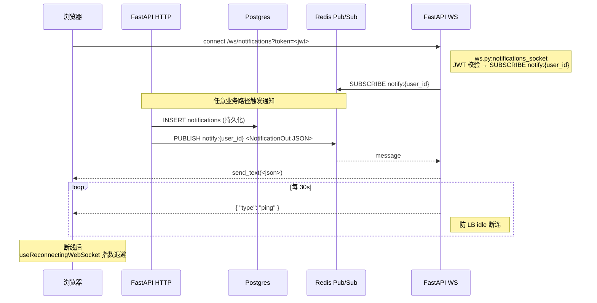

# 数据流

每张序列图配套关键代码路径——点 GitHub 或 IDE 跳转直达函数。

## 标注一条任务的完整链路

<ExcalidrawDiagram
  src="/diagrams/dev/concepts/annotation-task-flow.svg"
  alt="当前 React 工作台加载任务列表、申请与续期锁、分别读取媒体和预测、实时写标注、提交审核及条件 Mask 质检流程"
  caption="当前工作台完成一条标注任务的主链"
/>

当前 React 工作台先分页读取 `/tasks`，在本地选择记忆项、URL 指定项或首项，再单独申请 task lock；`GET /tasks/next` 是仍可用的调度旁路 API，但不是当前 UI 主链。`TaskOut.file_url`、annotations 与 predictions 分开读取，浏览器用签名 URL 直接访问对象存储。

标注在绘制过程中通过 POST / PATCH / DELETE 实时落库，首个有效标注会使 `pending → in_progress`。提交接口只负责 `pending / in_progress → review`、释放锁、批次计数 / 自动流转与 `task.submit` 审计；它不批量创建标注、不通知 reviewer，也不在响应中返回下一题。若项目启用提交时 Mask QC 且任务包含有效 Mask，事务提交后才会异步派发质检。

代码索引：

- 当前工作台选题：`apps/web/src/pages/Workbench/state/useWorkbenchShellModel.tsx`
- 任务列表与调度旁路：`apps/api/app/api/v1/tasks/list.py:list_tasks / next_task`、`apps/api/app/services/scheduler.py:get_next_task`
- Task 输出与签名 URL：`apps/api/app/api/v1/tasks/_shared.py:_task_with_url`、`apps/api/app/services/storage.py:generate_download_url`
- 任务锁：`apps/web/src/hooks/useTaskLock.ts`、`apps/api/app/api/v1/tasks/locks.py`、`apps/api/app/services/task_lock.py`
- 标注写入：`apps/api/app/api/v1/tasks/annotations.py`、`apps/api/app/services/annotation.py`
- 提交：`apps/api/app/api/v1/tasks/lifecycle.py:submit_task`
- 审计：`apps/api/app/services/audit.py:AuditAction.TASK_SUBMIT`
- 条件 Mask QC：`apps/api/app/services/mask_qc/service.py`、`apps/api/app/workers/mask_qc.py`

---

## AI 预标注

```mermaid
sequenceDiagram
  participant Admin as 项目管理员
  participant A as FastAPI
  participant R as Redis
  participant C as Celery Worker
  participant ML as ML 推理服务
  participant DB as Postgres
  participant WS as WS 频道

  Admin->>A: POST /api/v1/projects/{id}/preannotate
  Note right of A: ml_backends.py / projects.py
  A->>R: 入队 batch_predict(project_id)
  Note right of R: workers/tasks.py:batch_predict
  A-->>Admin: 202 Accepted

  loop 每 batch
    C->>R: 取队列项
    C->>ML: POST /predict { tasks: [...] }
    Note right of ML: ml_client.py:predict<br/>schema 见 ml-backend-protocol.md
    ML-->>C: { results: [...] }
    C->>DB: 写 predictions / prediction_metas<br/>错误写 failed_predictions
    C->>R: publish project:{pid}:preannotate<br/>{current, total, status}
    R->>WS: 通过 ws.py 转发到订阅者
  end
  WS-->>Admin: 进度 100%
```

代码索引：

- 触发端点：`apps/api/app/api/v1/projects.py` 或 `ml_backends.py`
- ML client：`apps/api/app/services/ml_client.py:predict` (`ml_client.py:41-62`)
- ML 协议契约：[`docs-site/dev/ml-backend-protocol.md`](../reference/ml-backend-protocol)
- Worker：`apps/api/app/workers/tasks.py:batch_predict`
- WS 频道：`apps/api/app/api/v1/ws.py:preannotate_progress` (`ws.py:48-67`)
- WS 协议：[`docs-site/dev/ws-protocol.md`](../reference/ws-protocol)

---

## 数据导出

```mermaid
sequenceDiagram
  participant Admin
  participant A as FastAPI
  participant R as Redis
  participant C as Celery
  participant DB
  participant S as MinIO

  Admin->>A: POST /projects/{id}/mask-formats/exports:preflight
  A->>DB: 统计 task / geometry 并生成 MaskFormatPlan
  A-->>Admin: loss class + codes + estimates + digest
  Admin->>A: POST /api/v1/projects/{id}/export?targets=coco
  Note right of A: projects.py:export_project<br/>audit_logs(action='project.export')
  A->>DB: 创建 async_jobs(kind='export')
  A->>R: 派发 app.workers.export.run_export
  A-->>Admin: 202 + job_id
  C->>DB: 拉取所有 annotations + tasks
  C->>C: 按 adapter / manifest / options key 取 single-flight
  C->>C: 拼装所选格式并生成 ZIP
  Note right of C: mask_formats registry + exporting/* 打包
  C->>S: 上传 ZIP 到 export bucket
  C->>DB: 写 export_artifacts 缓存<br/>完成 async_jobs.result
  Admin->>A: GET /api/v1/async-jobs/{job_id}
  A-->>Admin: status + result.download_url
```

代码索引：

- 项目导出端点：`apps/api/app/api/v1/projects.py:export_project`
- 批次导出端点：`apps/api/app/api/v1/batches.py:export_batch`
- 作业状态与下载 URL：`apps/api/app/api/v1/async_jobs.py:get_async_job`
- 审计：所有导出写 `AuditAction.PROJECT_EXPORT` / `BATCH_EXPORT`
- Worker：`apps/api/app/workers/export.py`（`app.workers.export.run_export` 任务）
- 格式 registry / plan / archive：`apps/api/app/services/mask_formats/`
- 导出打包：`apps/api/app/services/exporting/`

VOC 保留同步 ZIP 响应；其余目标走上述异步作业与缓存链路。

### 格式导入执行边界

格式导入先通过服务端生成的预签名 URL 上传到 import bucket，预检只接受当前项目与用户前缀下的 object key
和由调用方提交的 SHA-256。服务端流式复核字节配额与摘要，再将 adapter / manifest 版本、mapping / options digest、
逐任务计划和 15 分钟 receipt 写入 `mask_format_imports`。

执行时再次复核 object SHA-256 和全部 digest；任何一项变化都拒绝执行。Worker 逐 task 开启独立事务，并在
`result_json.items` 中记录 `committed / failed / skipped`；续跑只处理未提交项。本地临时目录在成功、失败和取消时都由
context manager 清理，staged object 由 import bucket 的 7 天 lifecycle 回收。项目标注导入 UI 在至少一个 Mask adapter 完成
consumer 闭环验证前保持关闭；capability 响应不会把未验证 adapter 暴露给前端。

---

## 实时通知

```mermaid
sequenceDiagram
  participant Web as 浏览器
  participant API as FastAPI HTTP
  participant DB as Postgres
  participant Pub as Redis Pub/Sub
  participant WS as FastAPI WS

  Web->>WS: connect /ws/notifications?token=<jwt>
  Note right of WS: ws.py:notifications_socket<br/>JWT 校验 → SUBSCRIBE notify:{user_id}
  WS->>Pub: SUBSCRIBE notify:{user_id}

  Note over API,Pub: 任意业务路径触发通知
  API->>DB: INSERT notifications (持久化)
  API->>Pub: PUBLISH notify:{user_id} <NotificationOut JSON>
  Pub-->>WS: message
  WS-->>Web: send_text(<json>)

  loop 每 30s
    WS-->>Web: { "type": "ping" }
    Note right of WS: 防 LB idle 断连
  end

  Note over Web: 断线后<br/>useReconnectingWebSocket 指数退避
```

服务端 push 主要事件：

- 任务通过、驳回或重开（type=`task.approved` / `task.rejected` / `task.reopened`）
- 导出完成或失败（type=`export.ready` / `export.failed`）
- 用户发起的白名单后台作业终态（type=`job.completed` / `job.failed` / `job.cancelled`）

代码索引：

- WS 端点：`apps/api/app/api/v1/ws.py` (`ws.py:70-114`)
- 通知服务：`apps/api/app/services/notification.py:NotificationService.notify` (`notification.py:51-94`)
- 通知模型：`apps/api/app/db/models/notification.py`
- 前端 hook：`apps/web/src/hooks/useNotificationSocket.ts`
- 重连基础：`apps/web/src/hooks/useReconnectingWebSocket.ts`
- WS 协议详细：[`docs-site/dev/ws-protocol.md`](../reference/ws-protocol)
