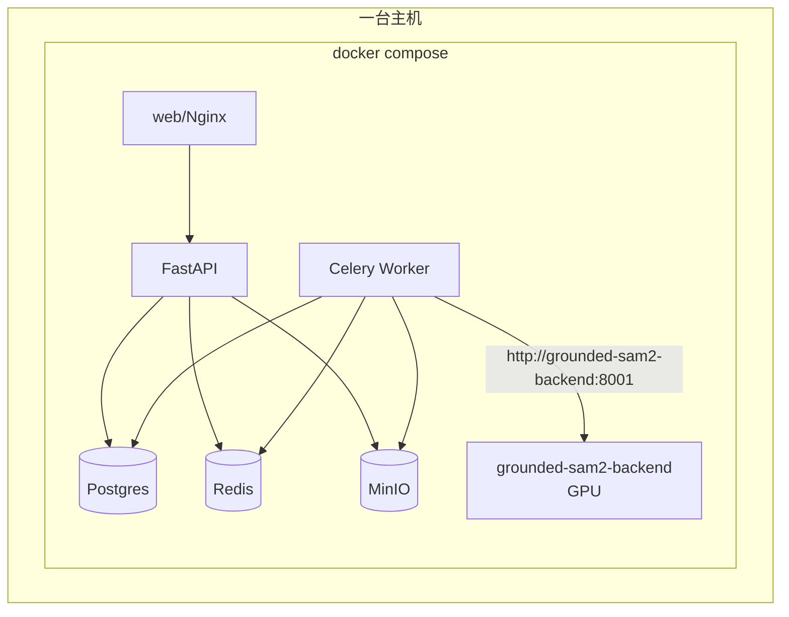
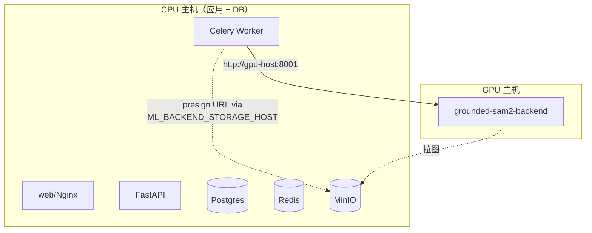
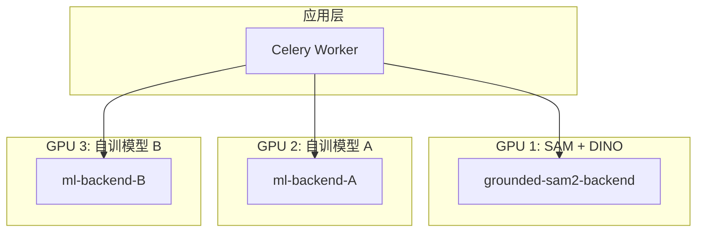
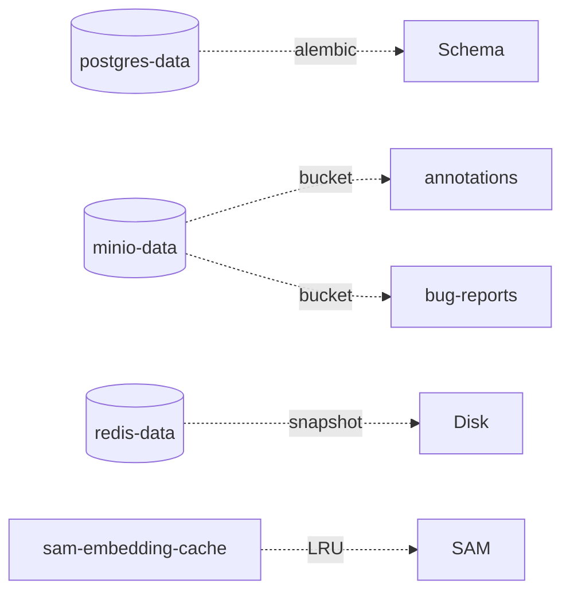

# 部署拓扑

平台支持三种部署形态，主要差异在于 GPU 推理服务（`grounded-sam2-backend`）的位置。

## 形态一：单机 All-in-one（开发 / 小团队）



要点：
- 全部走 compose service DNS（`grounded-sam2-backend:8001`），无 loopback 问题
- GPU 在同机时 `runtime: nvidia` 由 compose 声明
- 适合：≤ 5 标注员 / 单卡

## 形态二：API + GPU 分离（中等规模）



要点：
- ML Backend 注册时填 GPU 主机 LAN IP / 域名（**不能填 loopback**，详见 [容器网络](../troubleshooting/container-networking)）
- presigned URL 必须能从 GPU 主机访问 MinIO，因此设置 `ML_BACKEND_STORAGE_HOST=http://<minio-host>:9000`，worker 在生成 URL 时替换 host
- 适合：10–50 标注员 / 单卡或多卡 GPU 池

## 形态三：多 ML Backend / 多模型并存



要点：
- 每个 ML Backend 在 `ml_backends` 表注册一行，项目设置选择绑定（"模型市场"）
- 协议见 [ML Backend 协议](../ml-backend-protocol)
- 同一项目可以绑定不同模型，由 prompt + alias 路由

## 网络与端口

| 服务 | 默认端口 | 是否暴露公网 |
|---|---|---|
| web (nginx) | 80 / 443 | ✅ |
| api | 8000 | ❌（仅内网，nginx 反代） |
| worker | — | ❌ |
| postgres | 5432 | ❌ |
| redis | 6379 | ❌ |
| minio | 9000（API） / 9001（console） | 9000 ⚠️（presigned URL 客户端需可达）/ 9001 ❌ |
| grounded-sam2-backend | 8001 | ❌（仅 worker 调） |

**MinIO 9000 必须客户端可达**，否则前端无法用 presigned URL 拉图、上传。生产环境把 9000 走 nginx 反代到 HTTPS 是常见做法。

## 数据卷与持久化



- `postgres-data` — 关键，必须备份（schema + 业务数据）
- `minio-data` — 关键，存原图、prediction 截图、导出包、bug 反馈截图
- `redis-data` — 可丢失（Celery broker 重启即可）
- `sam-embedding-cache` — 可丢失，是性能优化（v0.9.1 LRU 缓存）

## 升级路径

```mermaid
graph LR
  v1[形态一<br/>全机] -->|流量增长| v2[形态二<br/>分离 GPU]
  v2 -->|多模型| v3[形态三<br/>多 backend]
  v3 -.->|未来.-> K8s[Kubernetes 编排]
```

K8s 化目前**没有计划**——compose 已能覆盖到形态三，迁移成本与收益不匹配。如确有需要，新建 ADR 论证。

## 相关

- [ADR 0012 — SAM Backend 独立 GPU 服务](../adr/0012-sam-backend-as-independent-gpu-service)
- [部署指南](../deploy)（运维细则）
- [容器网络与 loopback 限制](../troubleshooting/container-networking)
