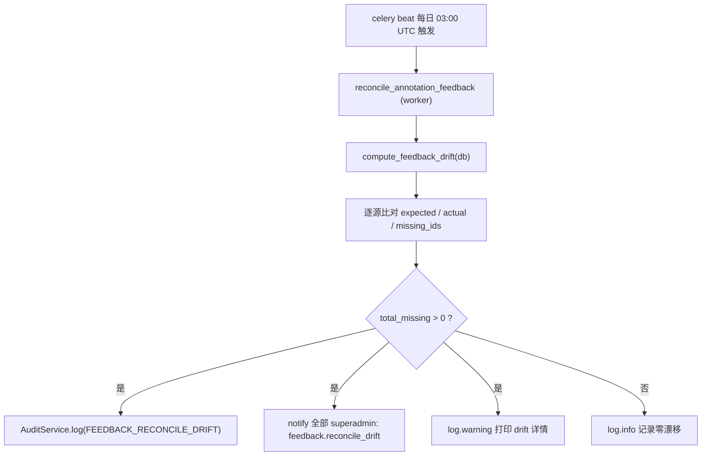

# 反馈收敛与双写对账

这页讲 ADR-0027「反馈统一表」迁移中 v0.11 阶段的两件事：

- **收敛目标**：把历史上散在 4 处的反馈入口收口为 `annotation_feedbacks` 单一写入源
- **对账安全网**：在切单源之前，用一个每日定时任务持续给出「双写零漂移」的证据

如果你要改 `bug_reports` / `annotation_comments` / `tasks.reject_reason` 的写路径，或想理解 superadmin 收到「反馈双写对账发现不一致」通知意味着什么，先读这页。背景规范见 [ADR-0027](/dev/adr/0027-annotation-feedback-unified-table)，审计与通知机制见 [审计与通知](./audit-and-notifications)。

## 为什么需要收敛

历史上反馈分散在 4 张表 / 字段里，语义重叠但各写各的：

| 来源 | 含义 |
|---|---|
| `bug_reports` | 产品 BUG |
| `annotation_comments` | 标注评论 |
| `tasks.reject_reason` | 审核驳回理由 |
| pixel-anchored issue | 像素锚点 issue（v0.10.19 新增） |

ADR-0027 立新表 `annotation_feedbacks`，用 `anchor_type`（project / task / annotation / pixel）+ `kind`（issue / comment / reject / bug）统一锚点与类型，目标是收口为单一写入入口。迁移按三段式推进，每段独立可回退（详见 [审计与通知 §反馈统一表](./audit-and-notifications#反馈统一表-adr-0027)）。

v0.11 处于「双写已稳定、准备切单源」的窗口期：旧三处写路径仍通过 `FeedbackService.mirror_*` helper 同事务双写到新表。切单源前必须先证明双写没有持续丢行——这就是对账任务存在的理由。

## 双写对账任务

### 它做什么

每日定时比对「旧表中应被 mirror 的行」与「新表中实际镜像的行」，统计每个来源的缺失数（drift）。drift 长期为 0 是 v0.11.9+ 删旧写路径的前置条件。



### 代码入口

| 位置 | 作用 |
|---|---|
| `apps/api/app/services/feedback_reconcile.py` | `compute_feedback_drift()` 纯对账逻辑 |
| `apps/api/app/workers/feedback_reconcile.py` | `reconcile_annotation_feedback()` Celery 任务包装：跑对账 + 落 audit/通知 |
| `apps/api/app/workers/celery_app.py` | beat schedule 注册（`reconcile-annotation-feedback`）+ worker include |
| `apps/api/app/services/audit.py` | `AuditAction.FEEDBACK_RECONCILE_DRIFT = "feedback.reconcile_drift"` |

### 对账逻辑

`compute_feedback_drift()` 对三类 mirror 行逐源比对三个维度：

- `expected`：旧表中「按业务口径应被 mirror 的行数」（例如 `bug_reports.project_id IS NULL` 的登录页 bug 不 mirror，故排除）
- `actual`：`v_annotation_feedback_unified` 中 `source_table='annotation_feedbacks'` 且 `kind` 对应该来源的行数
- `missing_ids`：旧表中未在统一表找到镜像的主键列表

匹配是**按业务字段回连而非主键**（用 `NOT EXISTS` + 业务字段等值 / `IS DISTINCT FROM`），因为 mirror 行有独立主键：

| 旧表 | mirror `kind` | 回连字段 |
|---|---|---|
| `bug_reports` | `bug` | `(project_id, title, body=description, author_id)` |
| `annotation_comments` | `comment` | 评论业务字段 |
| `tasks`（reject） | `reject` | 任务驳回业务字段 |

### 调度与配置

```python
# apps/api/app/workers/celery_app.py
"reconcile-annotation-feedback": {
    "task": "app.workers.feedback_reconcile.reconcile_annotation_feedback",
    "schedule": crontab(hour=3, minute=0),  # 每日 03:00 UTC，避开 03:30 分区维护
},
```

无专有环境变量，复用通用 celery broker/backend 配置（`settings.effective_celery_broker`）。

::: tip 改 worker 业务代码后要重启
Celery 没有 `--reload`，编辑 `apps/api/app/workers/**` 后需 `docker restart ai-annotation-platform-celery-beat-1`（及 worker）才会生效。见仓库根 `CLAUDE.md §8`。
:::

## 发现漂移时会发生什么

当 `total_missing > 0`：

1. **审计**：写一条 `action=FEEDBACK_RECONCILE_DRIFT`、`target_type='feedback_reconcile'` 的 audit，`detail` 含完整 drift 字典与 `total_missing`
2. **通知**：向所有 superadmin 发 `type='feedback.reconcile_drift'` 通知，`target_id` 用 nil UUID（无单一对象），payload 为 `{total_missing, missing_by_source}`，前端展示文案「反馈双写对账发现不一致」
3. **日志**：`log.warning` 打印 drift 详情，便于排障（配合 ADR-0027 双写日志关键字 `[ADR-0027 double-write]`）

drift=0 时只写 `log.info`，不打扰任何人。

::: warning superadmin 收到该通知意味着什么
说明某条旧表反馈没成功双写到 `annotation_feedbacks`。这是切单源的阻塞信号：应先按 `missing_by_source` 定位丢行来源、修复双写路径或 backfill，确认漂移归零后再推进 v0.11.9 删旧写路径。
:::

## 与统一表迁移的关系

对账任务是 ADR-0027 第三段（切单源）的安全网，对应 v0.11 计划中的 A 组工作：

- **v0.11.0**：本任务落地，提供长期零漂移证据
- **v0.11.9+**：drift 持续为 0 后，删旧写路径、旧表保留只读一个版本作回退

切单源完成后该任务仍可保留为回归守卫；旧表彻底下线后再考虑移除。

## 相关文档

- [ADR-0027 反馈统一表](/dev/adr/0027-annotation-feedback-unified-table)
- [审计与通知](./audit-and-notifications)
- [审核模块](./review-module)
- [工作台 Shell 架构](./workbench-shell)
