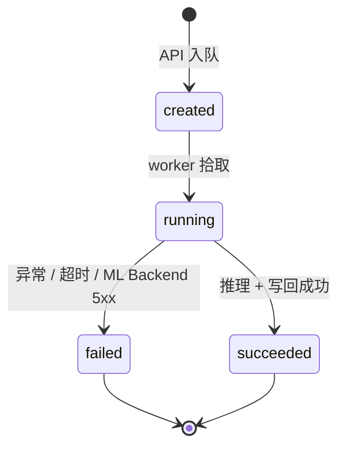
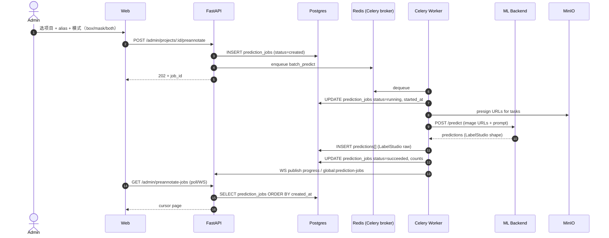

# 预标注流水线（Prediction Pipeline）

v0.9.8 引入 `prediction_jobs` 表后，AI 预标注从"无状态触发"升级为有状态的流水线。本页讲清状态机、写入时点、与下游表的关系。

> 决策依据：[ADR 0014 — Prediction Jobs 历史表](../adr/0014-prediction-jobs-table)

## 状态机

| 状态 | 何时进入 | 关键字段 |
|---|---|---|
| `created` | API 入队 Celery 时 | `created_at`, `celery_task_id`, `prompt`, `ml_backend_id` |
| `running` | worker 在 task body 第一步写入 | `started_at` |
| `succeeded` | task 正常返回 | `finished_at`, `succeeded_count`, `failed_count` |
| `failed` | `_BatchPredictTask.on_failure` 兜底 | `finished_at`, `error` |

## 端到端时序

## 与 `predictions` 表的边界

| 用途 | 查哪张表 |
|---|---|
| 列出"现在能采纳的候选框" | `predictions`（按 task 过滤） |
| 列出"AI 跑了哪几次、成功失败、谁触发" | `prediction_jobs` |
| 重置批次后回看历史 | **只能** `prediction_jobs`（`predictions` 已被清） |
| 工作台读取候选 → 渲染紫框 | `predictions` 经 `to_internal_shape` adapter |

详见 [API Schema 边界](./api-schema-boundary)。

## WebSocket 通道

| 通道 | 谁订阅 | 内容 |
|---|---|---|
| `project:{id}:preannotate` | 该项目工作台 | 单项目进度 / 错误 |
| `global:prediction-jobs` | 任何 admin | 全局 in-flight job 进度（Topbar Badge） |

后者解决 v0.9.7 的痛点：admin 切换项目后，旧项目的 in-flight 进度从屏幕上消失。

## 失败兜底（B-1 教训）

`_BatchPredictTask.on_failure` 把所有未捕获异常（包括 dispatch 阶段的 `TypeError`）推到 `project:{id}:preannotate`，前端 `progress.error` 分支可见——避免再出现"已排队后无响应"。

详见 [Docker rebuild vs restart](../troubleshooting/docker-rebuild-vs-restart)。

## 代码索引

- 模型：`apps/api/app/db/models/prediction_job.py`
- Worker：`apps/api/app/workers/tasks.py::batch_predict`
- 端点：`apps/api/app/api/v1/predictions.py`
- 前端：`apps/web/src/pages/AIPreAnnotate/`、`hooks/useGlobalPreannotationJobs.ts`
- 迁移：`apps/api/alembic/versions/0052_*.py`
