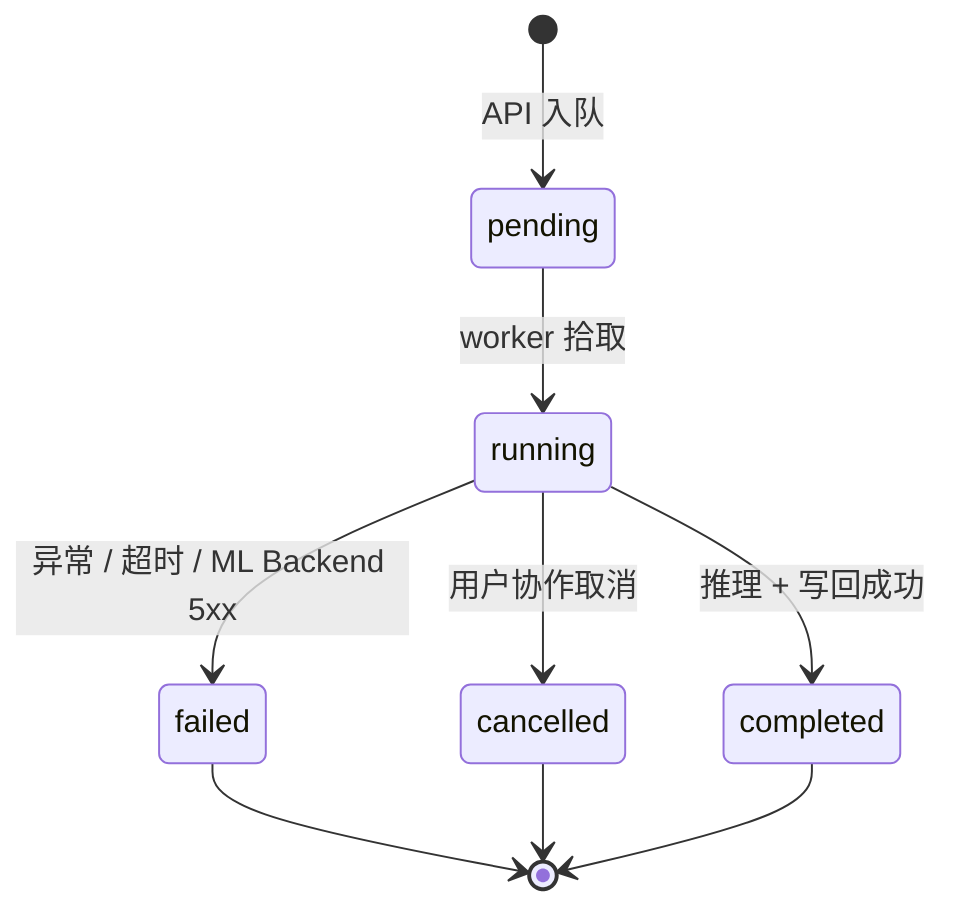
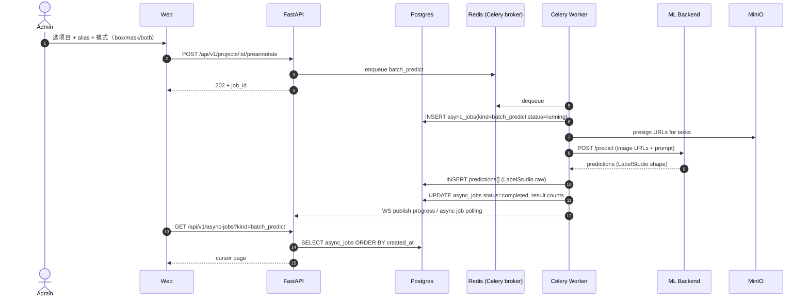

# 预标注流水线（Prediction Pipeline）

AI 预标注流水线以 `async_jobs(kind=batch_predict)` 作为用户可见任务真值，以 `predictions` / `failed_predictions` 保存可采纳结果和失败项。本页讲清状态机、写入时点、与下游表的关系。

> 决策依据：[ADR 0014 — Prediction Jobs 历史表](../adr/0014-prediction-jobs-table)

<!-- history: prediction_jobs was the early dedicated table; current docs describe async_jobs as the single job source. -->

## 状态机


```mermaid
stateDiagram-v2
  [*] --> pending: API 入队
  pending --> running: worker 拾取
  running --> completed: 推理 + 写回成功
  running --> failed: 异常 / 超时 / ML Backend 5xx
  running --> cancelled: 用户协作取消
  failed --> [*]
  cancelled --> [*]
  completed --> [*]
```

| 状态 | 何时进入 | 关键字段 |
|---|---|---|
| `pending` | API 入队 Celery 时 | `created_at`, `payload.prompt`, `payload.ml_backend_id` |
| `running` | worker 在 task body 第一步写入 | `started_at`, `celery_task_id`, `progress_pct` |
| `completed` | task 正常返回 | `completed_at`, `result.success_count`, `result.failed_count` |
| `failed` | worker 或 Celery signal 兜底 | `completed_at`, `error_message` |
| `cancelled` | 用户取消或 Celery revoke 被兜底标记 | `completed_at`, `result.cancelled_at_index` |

## 端到端时序


```mermaid
sequenceDiagram
  autonumber
  actor Admin
  participant Web as Web
  participant API as FastAPI
  participant DB as Postgres
  participant Q as Redis (Celery broker)
  participant W as Celery Worker
  participant ML as ML Backend
  participant S3 as MinIO

  Admin->>Web: 选项目 + alias + 模式（box/mask/both）
  Web->>API: POST /api/v1/projects/:id/preannotate
  API->>Q: enqueue batch_predict
  API-->>Web: 202 + job_id

  W->>Q: dequeue
  W->>DB: INSERT async_jobs(kind=batch_predict,status=running)
  W->>S3: presign URLs for tasks
  W->>ML: POST /predict (image URLs + prompt)
  ML-->>W: predictions (LabelStudio shape)
  W->>DB: INSERT predictions[] (LabelStudio raw)
  W->>DB: UPDATE async_jobs status=completed, result counts
  W->>API: WS publish progress / async job polling

  Web->>API: GET /api/v1/async-jobs?kind=batch_predict
  API->>DB: SELECT async_jobs ORDER BY created_at
  API-->>Web: cursor page
```

## 与 `predictions` 表的边界

| 用途 | 查哪张表 |
|---|---|
| 列出"现在能采纳的候选框" | `predictions`（按 task 过滤） |
| 列出"AI 跑了哪几次、成功失败、谁触发" | `async_jobs`（`kind=batch_predict` / `prediction_retry`） |
| 重置批次后回看历史 | **只能** `async_jobs`（`predictions` 已被清） |
| 工作台读取候选 → 渲染紫框 | `predictions` 经 `to_internal_shape` adapter |

详见 [API Schema 边界](./api-schema-boundary)。

## 工具单位（tool_unit）维度

`predictions.tool_unit_id String(30)` 是必填字段：

- 写入时由 `PredictionService.create_from_ml_result` 调 [`derive_tool_unit_from_result`](../../../apps/api/app/services/prediction.py) 按 `result[0].type` 派生:
  - `polygonlabels` / `brushlabels` / `multi_polygon` → `region`
  - `polylinelabels` → `polyline`
  - `rectanglelabels` → `bbox`; 若 `value.rotation` 字段存在 → `rotated_bbox`
  - `keypointlabels` → `keypoint`; 其它未知 LS type → `bbox` 占位
- `to_internal_shape()` 出参也带 `tool_unit_id`, 供前端候选层 / AAP JSON 导出消费
- `accept_prediction()` 创建的 annotation 沿用 prediction 的 `tool_unit_id` (与项目 `tool_bindings[unit].classes` 软校验保一致)

详见 [annotation-module · 工具单位](./annotation-module#工具单位tool_unit维度) 与 [ADR-0026](../adr/0026-tool-unit-class-and-attribute-binding)。

## WebSocket 通道

| 通道 | 谁订阅 | 内容 |
|---|---|---|
| `project:{id}:preannotate` | 该项目工作台 | 单项目进度 / 错误 |
| `global:prediction-jobs` | 任何 admin | 兼容全局 in-flight 进度推送 |
| `/api/v1/async-jobs` polling | 登录用户 | Topbar `JobsBell` 与 `/ai-pre/jobs` 任务历史 |

`JobsBell` 是当前用户可见任务的主入口；WebSocket 仍用于更快地刷新预标注进度。

## 失败兜底（B-1 教训）

`_BatchPredictTask.on_failure` 把所有未捕获异常（包括 dispatch 阶段的 `TypeError`）推到 `project:{id}:preannotate`，前端 `progress.error` 分支可见——避免再出现"已排队后无响应"。

详见 [Docker rebuild vs restart](../troubleshooting/docker-rebuild-vs-restart)。

## 能力协商与模态路由

### 能力快照落库

`check_health`（`apps/api/app/services/ml_backend.py`）在拉完 `/health` 后 best-effort 探一次 backend `/setup`，调 `extract_capabilities`（`apps/api/app/services/ml_capabilities.py`）把能力快照写进 `ml_backends.health_meta["capabilities"]`：

| 字段 | 来源 | 含义 |
|---|---|---|
| `supported_prompts` | `/setup` 直传 | 支持的图像提示类型（text/point/bbox/exemplar 等）|
| `supported_trackers` | `/setup` 直传 | 支持的视频追踪器（如 `sam2_video`）|
| `modalities` | `derive_modalities()` 派生 | `supported_prompts` 非空 → `image`；`supported_trackers` 非空 → `video` |
| `is_interactive` | `/setup.is_interactive` | 健康检查时回写，不再手填 |

`health_meta` 字段类型为 `HealthMeta(extra="allow")`，无需 alembic 迁移。探测失败时静默跳过，不影响健康检查结果（fail-open）。

### 绑定时模态校验

`PATCH /projects/{id}` 绑定 backend 时（`apps/api/app/api/v1/projects.py::_check_backend_modality_compat`），实时探 `/setup` 派生模态，与项目 `data_type` 不兼容返回 422。探测失败则 fail-open 放行，mismatch 留到 predict 时暴露。

### 前端按 data_type 模态分流

`/ai-pre` 执行页按项目 `data_type` 在前端分流，不再统一进入批量预标流水线：

| `data_type` | `/ai-pre` 行为 |
|---|---|
| `image` | 文本批量预标面板 → 走本页描述的 `batch_predict` 流水线 |
| `video` | 引导卡片（`VideoPreannotateGuide`）→ 跳工作台逐轨迹 Shift+T 发起追踪，**不进入批量 predict 流水线** |
| `lidar` | 显示占位提示，批量预标注入口暂不执行 |

视频项目的 AI 标注通过工作台 video tracker 发起，运行态保留 `video_tracker_jobs` 专表；历史汇总在 `/ai-pre/jobs?tab=video`，由 `async_jobs(kind=video_tracker)` 提供。

## 按后端动态参数透传

`PreannotateRequest`（`apps/api/app/api/v1/projects.py`）新增 `params: dict | None` 字段，由前端按选中 backend 的 `/setup.params` 用 SchemaForm 渲染并按 backend 记忆（`User.preferences.ai.params_by_backend`）后带上。

Worker（`apps/api/app/workers/tasks.py::batch_predict`）构建 `/predict` context 时：

```python
if params:
    context.update({k: v for k, v in params.items() if v is not None})
```

即 `params` 的非 None 值覆盖项目级 `box_threshold` / `text_threshold` 兜底值。无 `params` 时使用项目级阈值兜底，状态机本身不变。

## 代码索引

- 模型：`apps/api/app/db/models/async_job.py`、`apps/api/app/db/models/prediction.py`
- Worker：`apps/api/app/workers/tasks.py::batch_predict`
- async job service：`apps/api/app/services/async_job.py`
- 端点：`apps/api/app/api/v1/predictions.py`（结果查询）、`apps/api/app/api/v1/projects.py::trigger_preannotation`（触发）
- 能力协商：`apps/api/app/services/ml_capabilities.py`（`extract_capabilities` / `derive_modalities`）
- 前端：`apps/web/src/pages/AIPreAnnotate/`、`hooks/useGlobalPreannotationJobs.ts`
- 迁移：`apps/api/alembic/versions/0085_drop_prediction_jobs.py`
