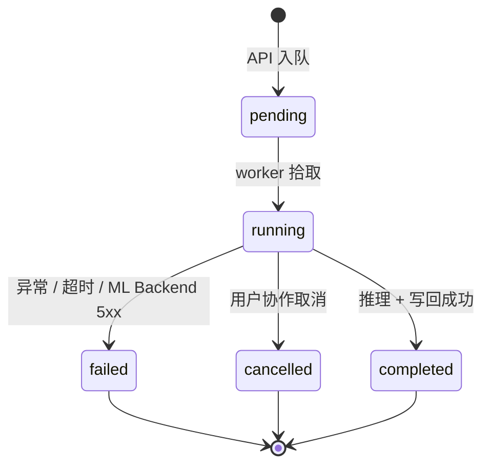
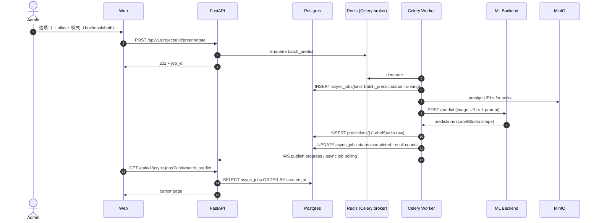

# 预标注流水线（Prediction Pipeline）

AI 预标注流水线以 `async_jobs(kind=batch_predict)` 作为用户可见任务真值，以 `predictions` / `failed_predictions` 保存可采纳结果和失败项。本页讲清状态机、写入时点、与下游表的关系。

> 决策依据：[ADR 0014 — Prediction Jobs 历史表](../adr/archive/0014-prediction-jobs-table)

<!-- history: prediction_jobs was the early dedicated table; current docs describe async_jobs as the single job source. -->

## 状态机


```mermaid
stateDiagram-v2
  [*] --> pending: API 入队
  pending --> running: worker 拾取
  running --> completed: 推理 + 写回成功
  running --> failed: 异常 / 超时 / ML Backend 5xx
  running --> cancelled: 用户协作取消
  failed --> [*]
  cancelled --> [*]
  completed --> [*]
```

| 状态        | 何时进入                            | 关键字段                                                      |
| ----------- | ----------------------------------- | ------------------------------------------------------------- |
| `pending`   | API 入队 Celery 时                  | `created_at`, `payload.prompt`, `payload.ml_backend_id`       |
| `running`   | worker 在 task body 第一步写入      | `started_at`, `celery_task_id`, `progress_pct`                |
| `completed` | task 正常返回                       | `completed_at`, `result.success_count`, `result.failed_count` |
| `failed`    | worker 或 Celery signal 兜底        | `completed_at`, `error_message`                               |
| `cancelled` | 用户取消或 Celery revoke 被兜底标记 | `completed_at`, `result.cancelled_at_index`                   |

## 端到端时序


```mermaid
sequenceDiagram
  autonumber
  actor Admin
  participant Web as Web
  participant API as FastAPI
  participant DB as Postgres
  participant Q as Redis (Celery broker)
  participant W as Celery Worker
  participant ML as ML Backend
  participant S3 as MinIO

  Admin->>Web: 选项目 + alias + 模式（box/mask/both）
  Web->>API: POST /api/v1/projects/:id/preannotate
  API->>Q: enqueue batch_predict
  API-->>Web: 202 + job_id

  W->>Q: dequeue
  W->>DB: INSERT async_jobs(kind=batch_predict,status=running)
  W->>S3: presign URLs for tasks
  W->>ML: POST /predict (image URLs + prompt)
  ML-->>W: predictions (LabelStudio shape)
  W->>DB: INSERT predictions[] (LabelStudio raw)
  W->>DB: UPDATE async_jobs status=completed, result counts
  W->>API: WS publish progress / async job polling

  Web->>API: GET /api/v1/async-jobs?kind=batch_predict
  API->>DB: SELECT async_jobs ORDER BY created_at
  API-->>Web: cursor page
```

## 与 `predictions` 表的边界

| 用途                                  | 查哪张表                                                  |
| ------------------------------------- | --------------------------------------------------------- |
| 列出"现在能采纳的候选框"              | `predictions`（按 task 过滤）                             |
| 列出"AI 跑了哪几次、成功失败、谁触发" | `async_jobs`（`kind=batch_predict` / `prediction_retry`） |
| 重置批次后回看历史                    | **只能** `async_jobs`（`predictions` 已被清）             |
| 工作台读取候选 → 渲染紫框             | `predictions` 经 `to_internal_shape` adapter              |

详见 [API Schema 边界](./api-schema-boundary)。

## 工具单位（tool_unit）维度

`predictions.tool_unit_id String(30)` 是必填字段：

- 写入时由 `PredictionService.create_from_ml_result` 调 [`derive_tool_unit_from_result`](../../../apps/api/app/services/prediction.py) 按 `result[0].type` 派生:
  - `polygonlabels` / `brushlabels` / `multi_polygon` → `region`
  - `polylinelabels` → `polyline`
  - `rectanglelabels` → `bbox`; 若 `value.rotation` 字段存在 → `rotated_bbox`
  - `keypointlabels` → `keypoint`; 其它未知 LS type → `bbox` 占位
- `to_internal_shape()` 出参也带 `tool_unit_id`, 供前端候选层 / AAP JSON 导出消费
- `accept_prediction()` 创建的 annotation 沿用 prediction 的 `tool_unit_id` (与项目 `tool_bindings[unit].classes` 软校验保一致)

详见 [annotation-module · 工具单位](./annotation-module#工具单位tool_unit维度) 与 [ADR-0026](../adr/archive/0026-tool-unit-class-and-attribute-binding)。

## WebSocket 通道

| 通道                         | 谁订阅       | 内容                                         |
| ---------------------------- | ------------ | -------------------------------------------- |
| `project:{id}:preannotate`   | 该项目工作台 | 单项目进度 / 错误                            |
| `global:prediction-jobs`     | 任何 admin   | 兼容全局 in-flight 进度推送                  |
| `/api/v1/async-jobs` polling | 登录用户     | Topbar `JobsBell` 与 `/ai-pre/jobs` 任务历史 |

`JobsBell` 是当前用户可见任务的主入口；WebSocket 仍用于更快地刷新预标注进度。

## 失败兜底（B-1 教训）

`_BatchPredictTask.on_failure` 把所有未捕获异常（包括 dispatch 阶段的 `TypeError`）推到 `project:{id}:preannotate`，前端 `progress.error` 分支可见——避免再出现"已排队后无响应"。

详见 [Docker rebuild vs restart](../troubleshooting/docker-rebuild-vs-restart)。

## 能力协商与模态路由

### 能力快照落库

`check_health`（`apps/api/app/services/ml_backend.py`）在拉完 `/health` 后 best-effort 探一次 backend `/setup`，调 `extract_capabilities`（`apps/api/app/services/ml_capabilities.py`）把能力快照写进 `ml_backend_registry.health_meta["capabilities"]`：

| 字段                 | 来源                             | 含义                                                                            |
| -------------------- | -------------------------------- | ------------------------------------------------------------------------------- |
| `supported_prompts`  | `/setup` 直传                    | 支持的图像提示类型（text/point/interactive_box/exemplar 等）                    |
| `supported_inputs`   | `/setup.models[]` 或平台兼容合成 | 支持的投递形态（整图 / 裁剪图 / 框提示 / 点提示），多阶段父子可达性用它判断     |
| `supported_trackers` | `/setup` 直传                    | 支持的视频追踪器（如 `sam2_video`）                                             |
| `modalities`         | `derive_modalities()` 派生       | `supported_prompts` 非空 → `image`；`supported_trackers` 非空 → `video`         |
| `is_interactive`     | `/setup.is_interactive`          | 健康检查时回写，不再手填                                                        |
| `warnings`           | 平台校验派生                     | 受控词表越界诊断（task / infra / prompt / geometry），模型市场显示为 `⚠ 协议 N` |

`health_meta` 字段类型为 `HealthMeta(extra="allow")`，无需 alembic 迁移。探测失败时静默跳过，不影响健康检查结果（fail-open）。

### 绑定时模态校验

`PATCH /projects/{id}` 绑定 backend 时（`apps/api/app/api/v1/projects.py::_check_backend_modality_compat`），实时探 `/setup` 派生模态，与项目 `data_type` 不兼容返回 422。探测失败则 fail-open 放行，mismatch 留到 predict 时暴露。

### 前端按 data_type 模态分流

`/ai-pre` 执行页按项目 `data_type` 在前端分流，不再统一进入批量预标流水线：

| `data_type` | `/ai-pre` 行为                                                                                      |
| ----------- | --------------------------------------------------------------------------------------------------- |
| `image`     | 文本批量预标面板 → 走本页描述的 `batch_predict` 流水线                                              |
| `video`     | 引导卡片（`VideoPreannotateGuide`）→ 跳工作台逐轨迹 Shift+T 发起追踪，**不进入批量 predict 流水线** |
| `lidar`     | 显示占位提示，批量预标注入口暂不执行                                                                |

视频项目的 AI 标注通过工作台 video tracker 发起，运行态保留 `video_tracker_jobs` 专表；历史汇总在 `/ai-pre/jobs?tab=video`，由 `async_jobs(kind=video_tracker)` 提供。

**数据边界**：本页的批量预标流水线以 `Prediction` 为候选存储，按 shape 采纳；交互视频 tracker 则把逐帧、多目标结果暂存在 `VideoTrackerJob.staged_result`，按 job 接受 / 丢弃，接受后才写入轨迹 annotation。两者共享 ML Backend 能力协议，但不共享候选表、计数或状态机。视频链路详见[视频 AI 追踪架构](./video-ai-tracking)。

## 按后端动态参数透传

`PreannotateRequest`（`apps/api/app/api/v1/projects.py`）新增 `params: dict | None` 字段，由前端按选中 backend 的 `/setup.params` 用 SchemaForm 渲染并按 backend 记忆（`User.preferences.ai.params_by_backend`）后带上。

Worker（`apps/api/app/workers/tasks.py::batch_predict`）构建 `/predict` context 时：

```python
if params:
    context.update({k: v for k, v in params.items() if v is not None})
```

即 `params` 的非 None 值覆盖项目级 `box_threshold` / `text_threshold` 兜底值。无 `params` 时使用项目级阈值兜底，状态机本身不变。

## 幂等预标模式（predict_mode，v0.11.24）

`PreannotateRequest.predict_mode`（`apps/api/app/api/v1/projects.py`）是 `Literal["skip_predicted", "overwrite", "append"]`，默认 `skip_predicted`，由 worker（`apps/api/app/workers/tasks.py::batch_predict` / `_run_batch`）透传决定 task 选取与旧预测处理：

| 模式                     | task 选取                                                            | 旧预测处理                                                                                          | 用途                                      |
| ------------------------ | -------------------------------------------------------------------- | --------------------------------------------------------------------------------------------------- | ----------------------------------------- |
| `skip_predicted`（默认） | task 选取追加 `.where(Task.total_predictions == 0)`，跳过已预标 task | 不动                                                                                                | 重复点"批量预标"时幂等，只补没跑过的 task |
| `overwrite`              | 不过滤已预标 task                                                    | 预标前先 `BatchService(db).clean_task_predictions([t.id])` + flush 清旧预测（**不重置 task 状态**） | 改了 prompt / 阈值想重跑                  |
| `append`                 | 不过滤                                                               | 不清，无脑追加                                                                                      | 兼容旧行为，仅特殊场景                    |

注意：

- `skip_predicted` 模式下，进度条分母（`projects.py` 触发处）也排除已预标 task，避免"跳过的 task"虚增分母让进度显示卡住。
- `overwrite` 只清 AI 预标产物（复用 [`clean_task_predictions`](./batch-module#clean-task-predictions)），手工标注 `source="manual"` 不受影响，task 状态不回退；与删批次/`reset_to_draft` 的级联清理是同一套清理逻辑。

## 多阶段预标注（pipeline_stages，路径 B）

`PreannotateRequest.pipeline_stages` 把单阶段批量预标泛化为**平台层跨 backend 编排**：源阶段（如 detect）产框 → 下游阶段（如 classify / box-seg）对每个父框按各自路由方式投递 → 结果合并回同一框。缺省（无 `pipeline_stages`）与单阶段 `batch_predict` 逐字等价，完全向后兼容。决策与边界见 [ADR 0043 — 多阶段预标注编排](../adr/archive/0043-staged-preannotation-pipeline)。

### 请求形态

```jsonc
// POST /api/v1/projects/{id}/preannotate 请求体节选
{
  "ml_backend_id": "<source-backend-uuid>", // 源阶段 backend（兼容字段，等价 stages[0].ml_backend_id）
  "model_id": "vehicle-detect", // 源阶段 model
  "pipeline_stages": [
    {
      "stage": 1, // 1-based 阶段序号
      "ml_backend_id": "<source-backend-uuid>",
      "model_id": "vehicle-detect",
    },
    {
      "stage": 2,
      "parent_stage": 1, // 父阶段（声明并行兄弟时同 parent_stage 即可挂多个 stage=2）
      "ml_backend_id": "<onnxtools-uuid>",
      "model_id": "vehicle-attr-classify",
      "parent_class_filter": ["car", "truck"], // 只对父框 class_name 命中时启动；其余降级保留纯检测
      "roi": { "pad": 0.05, "mode": "crop" }, // 仅 crop 模式有效，pad ∈ [0, 0.5]
      "on_failure": "keep_parent", // keep_parent（默认）/ drop_box
      "on_key_conflict": "reject", // reject（默认 422）/ last_wins（并行兄弟写同 key 时）
      "write": { "keys": ["vehicle_type", "color"] }, // 限定写回的属性 key 白名单（chip 多选）
    },
  ],
}
```

### 下游投递路由（`_resolve_input_mode`）

worker 解析投递模式：端点（`apps/api/app/api/v1/projects.py`）按下游 model 的 `supported_inputs` + `write.target` 烘焙 `input.mode`，worker（`apps/api/app/workers/tasks.py::_resolve_input_mode`）只读已烘焙的字段，缺省回落 `write.target` 启发式（产几何→`geometry`，产属性→`crop`）。

| `write.target` × 下游 `supported_inputs`                        | 投递模式               | 投递内容                                                                                  | 典型场景                                                         |
| --------------------------------------------------------------- | ---------------------- | ----------------------------------------------------------------------------------------- | ---------------------------------------------------------------- |
| `attributes`（产属性，纯分类）                                  | `crop`                 | 平台按 `parent_class_filter` 裁父框 ROI（pad 按深度，root+1=5% / root+2=8% / root+3=12%） | yolo/onnxtools 纯分类，回属性合并进父框                          |
| `geometry` × box-prompt seg（`supported_inputs` 含 `geometry`） | `geometry`             | 全图 URL + 父框归一化坐标列表（`tasks[].prompts[]`）                                      | gsam2 `box-seg`：`set_image` 一次、N 框共享 embedding 出 polygon |
| `geometry` × 普通检测器（`supported_inputs` 含 `crop`）         | `crop`                 | 同上裁父框 ROI 喂下游 → 检出几何按 crop transform 回映回原图坐标                          | depth-3 crop-detect：父框 ROI 内检出新子物体，落库为新 polygon   |
| `intermediate`                                                  | `geometry` / `crop`    | 同上，但产出仅供下游消费，不落库                                                          | 中间几何（如 box-seg → 给孙子阶段做 ROI）                        |
| 缺省（旧 payload / 端点未烘焙）                                 | 按 `write.target` 推断 | 产几何 `geometry`，产属性 `crop`                                                          | 向后兼容回落                                                     |

### crop 投递通用化

crop 模式默认走 **presigned URL** 而非 `data:` base64：平台把裁好的 ROI 上传 import 桶（key=`roi-crops/{job_id}/{task_id}/{box_idx}.jpg`），挂 7 天 lifecycle 自动清，URL 经 [`StorageService.rewrite_host_for_ml_backend`](../../../apps/api/app/services/storage.py) 重写到 backend 可拉取的 host。所有走 `httpx.get` 的下游 backend（gsam2 / sam3）零改造可作分类阶段。`data:` 内联保留为纯函数快路径（单测 / 已知支持 `data:` 的 backend：onnxtools / yolo），由 `_make_crop_uploader` 是否注入 `upload_crop` 选择路径。

### 单层并行兄弟（声明式，非 Celery chord）

同一 `parent_stage` 可挂多个下游阶段（车辆框 → 颜色 + 车型 + 车牌 OCR 各写不同属性键），结果按 `write.keys` union 合并进同一框。当前实现为 **worker 内顺序串跑各兄弟阶段**，不是 Celery chord — chord 真并行作单列计划被搁置（详 `docs/plans/` 下 chord-parallelism plan，无实测 wall-clock 压力前不实施）。声明形态本身是「并行」语义（互不依赖），实施层是「顺序」——后续切 chord 不破协议。

并行兄弟写同一属性键时：

- `on_key_conflict=reject`（默认）→ worker 校验失败抛 422；前端阶段卡在**配置期**就用红字 + 红 chip 预警，不再跑完才 422。
- `on_key_conflict=last_wins` → 按阶段顺序末位覆盖。

### 上游几何可裁校验（`check_parent_geometry_roi`）

下游阶段按上游父框裁 crop 或转 `bbox_prompt` 作 ROI 时，只有 **bbox / polygon** 是可裁几何（`roi._box_bbox_pct`）。若上游模型自报的 `supported_geometric_outputs` 只输出其它形态（如仅 `keypoint` / `polyline`），该阶段的所有父框会在运行期被跳过、零富集。为把这种"跑完才发现是空"的场景提前到配置期暴露，`check_parent_geometry_roi`（`apps/api/app/services/pipeline_validation.py`）作为**上游输出侧的对称门**，与已有的「下游能否吃框」门（`supported_inputs` 含 `bbox_prompt` / `crop`）形成上下游对称：

| 上游 `supported_geometric_outputs`   | 判决                   | 说明                                                            |
| ------------------------------------ | ---------------------- | --------------------------------------------------------------- |
| 未自报（老 backend）                 | 放过                   | 保零退化                                                        |
| 至少含一种可裁几何（bbox / polygon） | 放过                   | 部分不可裁交由运行期 `skipped_geometry` 兜底                    |
| 完全不含可裁几何（如仅 `keypoint`）  | 违例 `no_roi_geometry` | 保存编排时软提示 `capability_warnings`，触发预标时 **422 硬挡** |

两条通道复用同一纯函数：

- **保存编排** `PATCH /projects/{id}`：`_compute_pipeline_capability_warnings` 收集违例 detail 作为 `capability_warnings` 返回给前端阶段卡，红字预警但不拦保存（`apps/api/app/api/v1/projects.py`）。
- **触发预标** `POST /projects/{id}/preannotate`：dispatch-time 闸门 `_check_pipeline_capabilities` 命中直接 `HTTPException(status_code=422, detail=violations[0].detail)`，与「下游能否吃框」违例走同一 422 通道。

### trigger 响应的 `warnings` 字段

`POST /projects/{id}/preannotate` 成功入队时返回体新增 `warnings: string[]`，用于把**能跑但有代价**的选项（不硬挡的软提示）带回前端，与硬挡的 422 分开：

```json
{
  "job_id": "...",
  "status": "queued",
  "total_tasks": 12,
  "channel": "project:{id}:preannotate",
  "warnings": [
    "源阶段 output=both 会对同一实例产出「框 + 多边形」两条几何, 多阶段下游会各处理一次 (重复裁剪 / 推理 / 富集) 并落两条 region; 建议源阶段改用 box 或 mask。"
  ]
}
```

当前触发一条：源阶段 `output_mode=both` 且开启文本 prompt 又挂了下游阶段时，一条 both 结果会被两个下游各处理一次。空数组表示无软提示。硬校验违例不进这里，直接 422。

### ROI 模块（`roi.py`）

`apps/api/app/workers/roi.py` 集中所有 ROI 路由纯函数：

| 函数                          | 作用                                                                                                               |
| ----------------------------- | ------------------------------------------------------------------------------------------------------------------ |
| `crop_inputs_from_boxes`      | 按父框裁 ROI crop（`pad` 加边、`parent_class_filter` 过滤），返回 `CropBatch(inputs, skipped_geometry)`            |
| `geometry_prompts_from_boxes` | 父框 → 归一化 prompts 列表（带 `parent_box_idx`），供 box-seg 出多边形与父框对齐                                   |
| `collect_geometry_shapes`     | 把 box-seg 返回的 polygon 按 `parent_box_idx` 还原到原图坐标，追加进父框预测                                       |
| `merge_classify_attributes`   | 把下游分类结果按 `write.keys` 白名单 union 进父框 `attributes`                                                     |
| `box_class_name`              | 从 LS shape 提取 `class_name`（`value.rectanglelabels[0]` / `value.labels[0]`），供 `parent_class_filter` 命中判定 |

旋转框 / 多边形 / 退化框命中阶段路由但几何不支持时计入 `stats[si].skipped_geometry`，不再静默——见下文逐阶段统计。

### 逐阶段统计：实时快照 + 终态真值

worker 累加各阶段 stats（源阶段 `{detected}`、下游 `{targeted, ok, failed, skipped_geometry}`），有两条通道:

- **运行中实时快照**：按 5% 步长把当前累加 `pipeline_stages` 随进度推上 WS `project:{id}:preannotate`（复用现有通道，不新增）。前端阶段卡实时下放，显「待运行 / 运行中 / 已完成」徽标 + 计数 +`ProgressBar`。
- **终态真值**：`async_jobs.result.pipeline_stages` 落库（job 终态写一次）。WS 重连或运行后回看一律走终态字段，不丢。

若 GPU 仲裁在下游派发前拒绝，阶段仍按配置的 `keep_parent|drop_box` 处理，同时把完整根因记入 `PredictionMeta.extra.pipeline.gpu_arbiter_failures`。作业终态的 `async_jobs.result.gpu_arbiter_failures` 则按稳定错误码聚合 `status_code` / `retry_after_s` / `count`；`count` 表示被拒绝的派发次数，不替代 `pipeline_stages[].failed` 的受影响 ROI 计数。

### 拓扑落库与可追溯

`_pipeline_topology` 把 stages 配置派生为可审计拓扑落 `PredictionMeta.extra.pipeline`：

```json
{
  "stage_count": 2,
  "enriched_attr_keys": ["color", "vehicle_type"],
  "stages": [
    {
      "stage": 1,
      "ml_backend_id": "...",
      "model_id": "vehicle-detect",
      "parent_class_filter": null,
      "write_keys": null
    },
    {
      "stage": 2,
      "ml_backend_id": "...",
      "model_id": "vehicle-attr-classify",
      "parent_class_filter": ["car"],
      "write_keys": ["color", "vehicle_type"]
    }
  ]
}
```

这框的某属性来自哪个 backend / model 可逐条追溯——不改表（仍在 `PredictionMeta.extra` JSONB 内），`stage_count` / `enriched_attr_keys` 收口进同一 namespace。

### backend 来源与显存保护

backend 走**全局注册 + 项目启用**：一个物理 backend 全局只注册一行，项目按需勾选启用，**没有项目级数量上限**（跨 backend 编排天然需 detect + classify ≥ 2，多阶段 DAG 还会更多）。每个全局注册行的 `max_concurrency`（`extra_params.max_concurrency`）始终限制单进程 / 事件循环的并行请求；`ML_BACKEND_ROUTER_MODE=off|observe` 时 API 与多个 Celery worker 仍会叠加，路由模式为 `enforce` 时再由 Redis route lease 收口为跨进程实例上限。GPU 仲裁 effective mode 只负责显存准入与驱逐。

设置 `GPU_ARBITER_MODE=observe` 后，平台会在所有可加载端点的 HTTP 发送前，按稳定
`gpu_resource_id` 对同卡预算和新鲜 residency 快照计算 `would-*` 决策。该阶段只写结构化日志，
旁路查询有严格短超时并在失败时放行业务请求，不会改变请求结果。所有生产派发口已注入惰性
authority，effective `enforce` 下可使用 Redis lease 执行 Resident 快路与 cold admission。cold token
暴露后，完整 HTTP 响应会触发新 challenge 探测，并在逐卡持久锁内立即把 Loading 收口为
Resident、CPU fallback、Unloaded 或保守 Unknown。容量不足时，authority 会在 target cold intent
之前按优先级 + LRU 依次驱逐同一完整资源 ID 上的空闲 victim，只在严格 drain ACK、
新鲜 health proof 与终态 CAS 都成功后释放预算；不确定结果保守收口 Unknown 并停止后续驱逐。
空闲和 busy victim 的等待、驱逐与取消路径均已接通；effective `enforce` 只有在运维显式开启 release latch、
且逐资源 rollout 成功收敛为 `enforcing` 后才会生效。legacy unload 仍不能作为显存已释放或预算已减账的证据。

## 代码索引

- 模型：`apps/api/app/db/models/async_job.py`、`apps/api/app/db/models/prediction.py`
- Worker：`apps/api/app/workers/tasks.py::batch_predict` / `_run_batch` / `_run_task_pipeline` / `_resolve_input_mode`
- ROI 路由：`apps/api/app/workers/roi.py`（`crop_inputs_from_boxes` / `geometry_prompts_from_boxes` / `merge_classify_attributes`）
- async job service：`apps/api/app/services/async_job.py`
- 端点：`apps/api/app/api/v1/predictions.py`（结果查询 + `POST /tasks/{id}/predictions/{pid}/accept` `attribute_overrides`）、`apps/api/app/api/v1/projects.py::trigger_preannotation`（触发）
- 能力协商：`apps/api/app/services/ml_capabilities.py`（`extract_capabilities` / `derive_modalities`，含 `output_attribute_schema` / `composition` 字段）
- 前端：`apps/web/src/pages/AIPreAnnotate/`、`hooks/useGlobalPreannotationJobs.ts`、`pages/AIPreAnnotate/components/StageCard.tsx`（多阶段编排 UI）
- 迁移：`apps/api/alembic/versions/0085_drop_prediction_jobs.py`
