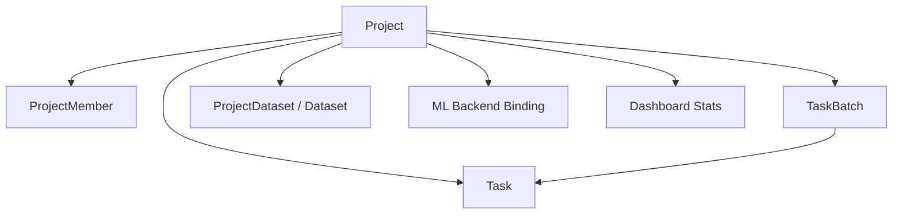

# 项目模块

本文是面向开发者的 project 手册，说明项目在系统中的职责、数据模型、配置面、成员边界，以及它如何约束 batch、task、工作台和 AI 能力。

如果你要改：

- 项目创建 / 更新 / 删除
- 项目成员与 owner
- 类目、属性 schema、采样配置
- ML backend 绑定
- 项目级统计、导出、预标注入口

先读这页。

## 模块定位

Project 是业务顶层容器。几乎所有生产对象都挂在 project 下面：



一句话理解：

- `project` 决定“这批数据按什么规则工作”
- `batch` 决定“任务如何分组推进”
- `task` 决定“单条数据当前处于什么工作状态”

## 代码入口

| 位置 | 作用 |
|---|---|
| `apps/api/app/db/models/project.py` | Project 主模型 |
| `apps/api/app/db/models/project_member.py` | 项目成员关系 |
| `apps/api/app/schemas/project.py` | Project 请求 / 响应 schema |
| `apps/api/app/api/v1/projects.py` | 项目 HTTP 路由 |
| `apps/api/app/api/v1/dashboard.py` | 项目级统计与聚合 |
| `apps/web/src/api/projects.ts` | 前端 project API wrapper |
| `apps/web/src/pages/Projects/` | 项目设置与管理 UI |

## 数据模型

`Project` 当前承载的核心字段：

| 字段 | 含义 |
|---|---|
| `display_id` | 人类可读项目 ID |
| `name` | 项目名 |
| `type_key` / `type_label` | 任务类型，例如 `image-det` |
| `owner_id` | 项目 owner，决定写权限上限 |
| `status` | 项目生命周期状态 |
| `classes` / `classes_config` | 类目与显示配置 |
| `attribute_schema` | 属性 schema |
| `sampling` | 工作台派题策略 |
| `maximum_annotations` | 多人重叠标注上限 |
| `show_overlap_first` | 是否优先展示重叠任务 |
| `task_lock_ttl_seconds` | task 锁 TTL |
| `ml_backend_id` | 实际绑定的 ML backend |
| `ai_model` | display hint，不再是行为真值 |
| `box_threshold` / `text_threshold` / `text_output_default` | 项目级 AI 推理默认参数 |
| `total_tasks` / `completed_tasks` / `review_tasks` / `in_progress_tasks` | 项目级聚合统计 |
| `due_date` | 截止日期 |

设计要点：

- Project 不只是“容器名”，它同时保存工作台策略、AI 行为默认值和统计缓存
- `ai_model` 已不是主真值，真实驱动能力的是 `ml_backend_id`

## 项目状态

项目状态枚举在 `apps/api/app/db/enums.py`：

```text
in_progress
completed
pending_review
archived
```

这些状态更多用于项目列表与总览展示，不像 task / batch 那样承载细粒度工作流。

经验上：

- 日常开发里更常碰的是 batch / task 状态机
- project.status 更接近“管理看板状态”，而不是驱动工作台细节的唯一真值

## Project 负责哪些配置

### 1. 标注 schema

项目定义：

- 支持哪些类目：`classes`
- 类目颜色 / 别名等扩展：`classes_config`
- 每个标注可以带哪些属性：`attribute_schema`

如果你改的是“标注长什么样”，十有八九要从 project 配置入手，而不是 task。

### 2. 工作台派题策略

`sampling` 决定 `scheduler.get_next_task()` 的排序行为：

- `sequence`
- `uniform`
- `uncertainty`

同时还会受这些项目级配置影响：

- `maximum_annotations`
- `show_overlap_first`
- `task_lock_ttl_seconds`

也就是说，工作台“下一题给谁、按什么顺序给”本质上是 project 级策略。

### 3. AI / 预标注配置

项目还决定：

- 是否启用 AI：`ai_enabled`
- 绑定哪个 ML backend：`ml_backend_id`
- 文本预标注默认阈值：`box_threshold` / `text_threshold`
- 默认输出形态：`text_output_default`

AI 能力是 project 级开关，不是 batch 或 task 私有配置。

## 成员与权限边界

项目权限边界由两层组成：

1. 全局角色：`super_admin` / `project_admin` / `reviewer` / `annotator` / `viewer`
2. 项目内成员关系：`ProjectMember`

`owner_id` 是项目级最终写权限兜底。

当前常见判断模式：

- `super_admin`：越权可见 / 可写
- `project owner`：当前项目的实际 owner
- 其他角色：必须命中 `ProjectMember(project_id, user_id)`

所以“用户是不是项目管理员”不是只看全局 role，而是“全局角色 + 是否是该项目 owner”的组合。

## 和 Batch / Task 的关系

### Project → Batch

一个项目下面有多个 batch。

项目层提供：

- batch 的业务边界
- batch 默认排序参考（`priority` 仍在 batch 上）
- batch 汇总统计（见 `ProjectOut.batch_summary`）

### Project → Task

所有 task 都属于某个 project。

Project 决定 task 的这些上层语义：

- 数据类型和标注 schema
- 重叠标注上限
- 派题策略
- task 锁 TTL

这也是为什么 task 虽然有独立状态机，但很多行为仍要回读 project 配置。

## 主要 API 面

`apps/api/app/api/v1/projects.py` 当前覆盖的主要能力：

- 列表 / 详情 / 创建 / 更新 / 删除
- 类目重命名
- 项目 owner 转移
- 成员列表 / 新增 / 删除
- 项目导出
- 项目级 AI 预标注触发
- orphan tasks 预览与清理
- 关联 datasets 查询

如果你新增 project 能力，优先判断它属于：

- “项目配置面”
- “项目成员面”
- “项目级运营动作”

不要把 project 路由写成 batch / task 杂项收纳箱。

## 统计与缓存

Project 模型本身保留了多种聚合字段：

- `total_tasks`
- `completed_tasks`
- `review_tasks`
- `in_progress_tasks`

这些字段不是纯展示装饰，它们被：

- Dashboard
- 项目列表
- 批次 / 工作台周边摘要

直接消费。

因此改 task / batch 状态时，要留意是否需要同步 project counters。

## 常见修改落点

| 你想改什么 | 先看哪里 |
|---|---|
| 新增项目配置字段 | `db/models/project.py` + `schemas/project.py` + `api/v1/projects.py` |
| 改项目权限 | `deps.py` + `api/v1/projects.py` |
| 改派题策略 | `db/models/project.py` + `services/scheduler.py` |
| 改 AI 默认参数 | `schemas/project.py` + `projects.py` + 相关前端表单 |
| 改项目统计 | `dashboard.py` + 相关 service / counter 回写 |

## 测试与联动点

改 project 相关逻辑时，至少检查：

- `apps/api/tests` 下 project、dashboard、preannotate 相关测试
- OpenAPI snapshot
- `apps/web/src/api/projects.ts`
- 项目设置页与 Dashboard 组件

高频联动风险：

- 后端 schema 加了字段，前端 settings 页没接
- project 配置改了，但 `scheduler` 还在读旧字段
- owner / member 权限判断只改了一半
