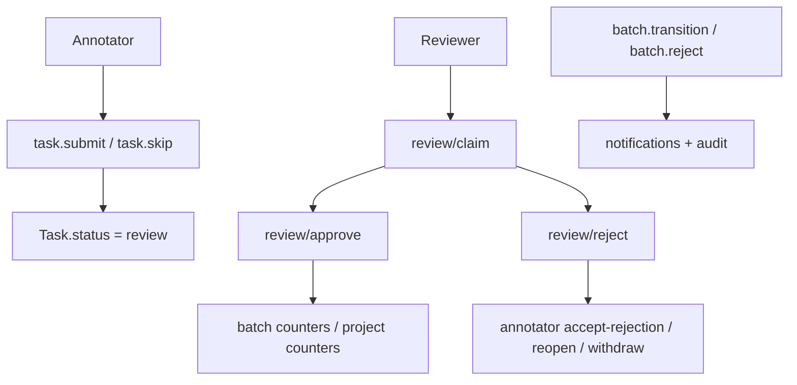
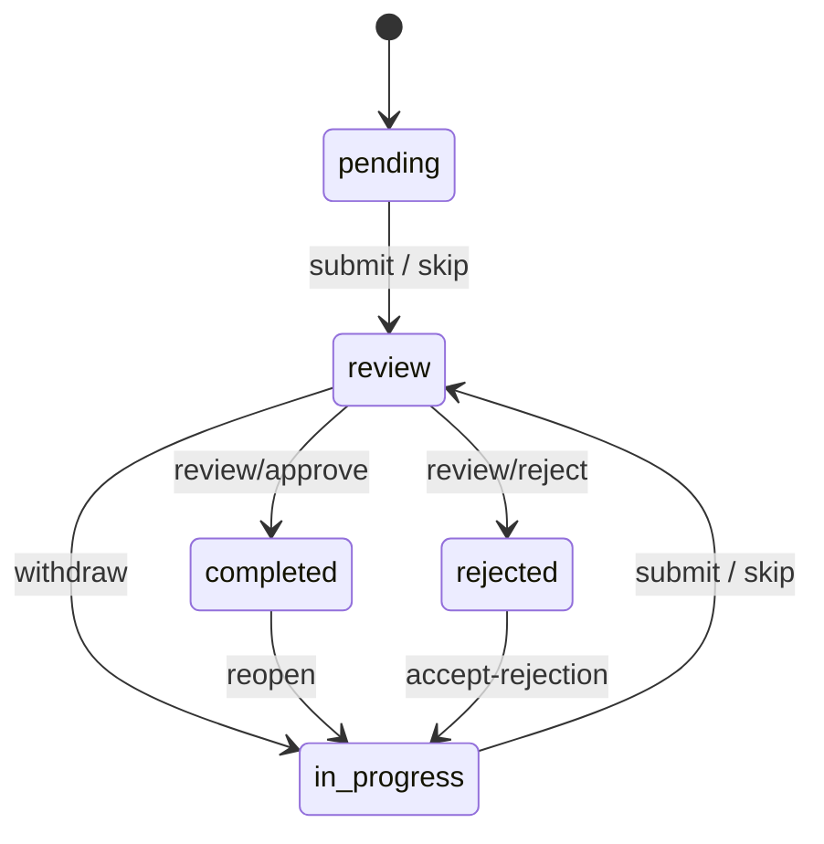
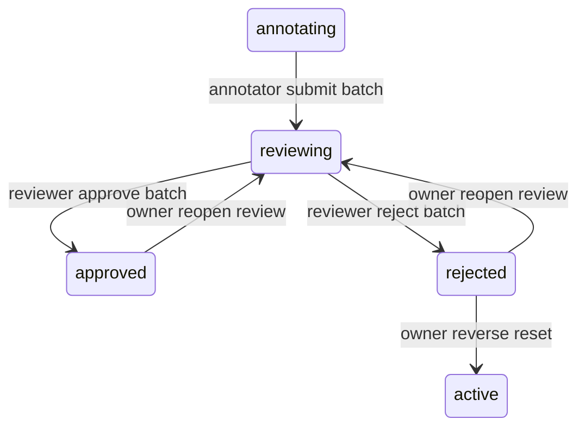

# 审核模块

本文是面向开发者的 review 手册。这里的“审核”不是单独一张表，而是一组跨 `task`、`batch`、通知和工作台的协作规则。

如果你要改：

- reviewer 的 task 审核动作
- annotator 的 submit / withdraw / reopen / accept-rejection
- batch `reviewing / approved / rejected` 的业务语义
- reviewer 页面、通知和审计联动

先读这页。

## 模块定位

当前系统的 review 分两层：

1. **task 级审核**
   reviewer 对单题做 `claim / approve / reject`
2. **batch 级审核**
   reviewer 对整批做 `approved / rejected`

这两层不是重复实现，而是串联关系。

## 代码入口

| 位置 | 作用 |
|---|---|
| `apps/api/app/api/v1/tasks.py` | task 级 submit / withdraw / review / reopen / accept-rejection |
| `apps/api/app/api/v1/batches.py` | batch 级 transition / reject / reset |
| `apps/api/app/services/batch.py` | batch 状态校验、reject_batch、counter 回写 |
| `apps/api/app/services/scheduler.py` | reviewer 可见性的 batch 过滤 |
| `apps/web/src/api/tasks.ts` | 前端 task review API |
| `apps/web/src/pages/Review/ReviewPage.tsx` | reviewer 列表页与批量审核 |
| `apps/web/src/pages/Review/ReviewWorkbench.tsx` | reviewer 预览画布 |
| `apps/web/src/pages/Annotate/AnnotatePage.tsx` | annotator 侧整批送审 |

## Review 不是单一状态机

### Task 级审核

`task` 在审核相关的主路径如下：

这里最重要的事实有两个：

- `review` 是“等待 reviewer 处理”的 task 态
- `rejected` 是“退回给原标注员重做”的 task 态

### Batch 级审核

`batch` 的 review 相关主路径如下：

要区分：

- task review 看的是单题质量
- batch review 看的是“这批是否整体可以放行”

## 角色矩阵

### Annotator

annotator 主要负责：

- 在 `pending / in_progress` 下编辑 annotation
- `submit`
- `skip`
- `withdraw`
- `reopen`
- `accept-rejection`
- 把自己负责的 `annotating` 批次送到 `reviewing`

annotator **不能**：

- 对 task 做 `approve / reject`
- 对 batch 做 `approved / rejected`

### Reviewer

reviewer 主要负责：

- `review/claim`
- `review/approve`
- `review/reject`
- `reviewing → approved`
- `reviewing → rejected`

reviewer 能看到：

- `active`
- `annotating`
- `reviewing`

这就是 reviewer 页面为什么既能处理 review 中任务，也能提前看到待审批次。

### Owner / Super Admin

owner 是反向迁移和兜底操作的最终执行者，例如：

- `approved → reviewing`
- `rejected → reviewing`
- `rejected → active`
- `archived → active`
- `reset_to_draft`

这些操作多数都要求填写 `reason`，并落审计。

## Task 级审核细节

### `submit`

入口：

- `POST /tasks/{id}/submit`

行为：

- `pending / in_progress → review`
- 若 `assignee_id` 为空，则把当前提交者补成 assignee
- 释放当前 task lock
- 清空上一轮 reviewer 痕迹

这解释了为什么提交后 annotator 不能继续直接编辑当前题。

### `skip`

入口：

- `POST /tasks/{id}/skip`

语义与 submit 很像，但它允许无标注进入 review，并额外写：

- `skip_reason`
- `skipped_at`

所以 skip 不是“丢弃任务”，而是“把任务连同跳过理由一起送 reviewer 复核”。

### `withdraw`

入口：

- `POST /tasks/{id}/withdraw`

前提：

- `task.status == "review"`
- 当前用户是 assignee，或是 admin 兜底
- `reviewer_claimed_at is NULL`

一旦 reviewer claim 成功，withdraw 入口就冻结。

### `review/claim`

入口：

- `POST /tasks/{id}/review/claim`

它是 reviewer 的抢占锁，不是 task lock。

语义：

- 第一个 reviewer 写入 `reviewer_id + reviewer_claimed_at`
- 后续调用幂等读取，不覆盖
- 一旦 claim，annotator 侧 withdraw 被锁死

### `review/approve`

入口：

- `POST /tasks/{id}/review/approve`

行为：

- `review → completed`
- 补 `reviewed_at`
- 如无 reviewer 记录则回写当前 reviewer
- project / batch counters 回写
- 给 annotator 发 `task.approved` 通知

### `review/reject`

入口：

- `POST /tasks/{id}/review/reject`

行为：

- `review → rejected`
- `reject_reason` 必填
- 回写 `reviewed_at`
- project / batch counters 回写
- 给 annotator 发 `task.rejected` 通知

`reject_reason` 会在 `accept-rejection` 后保留，前端可继续提示“重做中”。

### `reopen`

入口：

- `POST /tasks/{id}/reopen`

语义不是 reviewer 撤销，而是 **annotator 对已通过任务重新打开编辑**：

- `completed → in_progress`
- `reopened_count += 1`
- 清空 reviewer 元数据
- 保留原 annotation，继续在原地修改

系统还会给原 reviewer 发 `task.reopened` 通知。

### `accept-rejection`

入口：

- `POST /tasks/{id}/accept-rejection`

行为：

- `rejected → in_progress`
- 不清 `reject_reason`

这和 `reopen` 的区别是：

- `reopen` 发生在任务已通过后
- `accept-rejection` 发生在 reviewer 已明确退回后

## Batch 级审核细节

### annotating → reviewing

当前是 annotator 在批次页 / 标注页上手工提交整批。

对应：

- `POST /projects/{project_id}/batches/{batch_id}/transition`
- `target_status = "reviewing"`

这一步不要求每条 task 都已 `completed`；但批次 counters 和 reviewer 页面会立刻反映整批送审。

### reviewing → approved

reviewer 通过 batch transition 放行整批。

关键点：

- `BatchService.transition()`
- `target_status == approved` 时会触发 `on_batch_approved()`
- 批次通过后，task 仍保留各自 `completed` 状态

### reviewing → rejected

整批驳回走独立端点：

- `POST /projects/{project_id}/batches/{batch_id}/reject`

`BatchService.reject_batch()` 会：

- 把该 batch 下 `review` / `completed` task 统一回 `pending`
- 写 `batch.review_feedback`
- 写 `reviewed_at` / `reviewed_by`
- 重新计算 batch counters

这是一种“批次级软重做”，不会删 annotation 历史。

### reverse transitions

这些不是 reviewer 日常动作，而是 owner 兜底：

- `approved → reviewing`
- `rejected → reviewing`
- `rejected → active`

系统会：

- 强制填写 `reason`
- 写 `BATCH_STATUS_CHANGED` 审计
- 按方向给 reviewer / annotator 发通知

## 审计与通知

review 链路几乎每个动作都带审计。

常见审计动作：

- `TASK_SUBMIT`
- `TASK_SKIP`
- `TASK_WITHDRAW`
- `TASK_REVIEW_CLAIM`
- `TASK_APPROVE`
- `TASK_REJECT`
- `TASK_REOPEN`
- `TASK_ACCEPT_REJECTION`
- `BATCH_REJECTED`
- `BATCH_STATUS_CHANGED`
- `BATCH_RESET_TO_DRAFT`

常见通知类型：

- `task.approved`
- `task.rejected`
- `task.reopened`
- `batch.rejected`
- `batch.review_reopened`
- `batch.unarchived`

改 review 路径时，不要只改状态写入；通常还要同步检查：

- 审计 detail 是否完整
- fan-out 收件人是否正确
- 前端 toast / badge / sidebar 是否跟上

## 前端同步点

| 文件 | 为什么要看 |
|---|---|
| `apps/web/src/api/tasks.ts` | task review 端点定义 |
| `apps/web/src/hooks/useTasks.ts` | approve / reject / reopen mutation |
| `apps/web/src/pages/Review/ReviewPage.tsx` | reviewer 列表与批量处理 |
| `apps/web/src/pages/Review/ReviewWorkbench.tsx` | reviewer 画布预览与 AI 对比 |
| `apps/web/src/pages/Annotate/AnnotatePage.tsx` | annotator 整批送审入口 |
| `apps/web/src/hooks/useBatches.ts` | batch reject / reset / transition |

## 常见误解

### 误解 1：reviewer claim 等于 task lock

不是。

- `reviewer_claimed_at` 锁的是审核所有权
- `task lock` 锁的是标注编辑权

### 误解 2：batch reject 会清 annotation

不会。它只把 task 工作流回退并写 `review_feedback`。

### 误解 3：reopen 和 accept-rejection 是一回事

不是。两者都回到 `in_progress`，但：

- `reopen` 代表“已通过后重新编辑”
- `accept-rejection` 代表“接受退回并重做”

## 相关文档

- [任务模块](./task-module)
- [批次模块](./batch-module)
- [批次生命周期（端到端）](./batch-lifecycle-end-to-end)
- [ADR-0005](/dev/adr/0005-task-lock-and-review-matrix)
