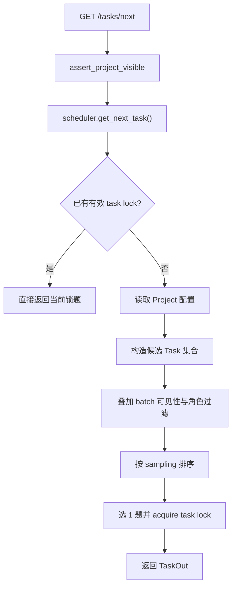

# Scheduler 与派题

本文讲的是工作台里的 `scheduler`。它不是 Celery 定时调度器，而是“**当前用户现在应该拿到哪一题**”的在线决策层。

代码真值源：

- `apps/api/app/services/scheduler.py`
- `apps/api/app/api/v1/tasks.py`
- `apps/api/app/db/models/project.py`
- `apps/api/app/services/task_lock.py`

## 它解决什么问题

`GET /tasks/next` 背后需要同时回答这些问题：

- 用户是否已经手里有一题没做完
- 当前用户在这个项目里能看见哪些 task
- 哪些 batch 允许出题
- 同一 task 是否已经被我标过
- 多人重叠标注项目里还能不能继续派这题
- 应该按顺序、随机还是 uncertainty 来排

这些逻辑集中在 `scheduler.get_next_task()`。

## 执行流程

当前派题主流程如下：

## `get_next_task()` 的 6 步

### 1. 先查当前用户是否已有锁题

如果当前用户在该项目下已经有一把有效 `task lock`，且 task 还没标完，就直接返回那题。

目的：

- 避免用户刷新页面时被派到另一题
- 避免同一个用户在同一项目里并行占多题

### 2. 读取项目配置

后续会用到这些 project 字段：

- `sampling`
- `maximum_annotations`
- `task_lock_ttl_seconds`

所以 scheduler 本质上是 project-aware 的。

### 3. 构造候选 task 集合

候选题至少要满足：

- 属于当前 `project_id`
- `is_labeled == False`
- 当前用户还没有对它留下有效 annotation
- 所在 batch 可工作

当前后端真值里，批次可工作状态主要是：

- `active`
- `annotating`

### 4. 叠加角色与可见性过滤

如果不是 `super_admin` 或项目 owner，还要过 `batch_visibility_clause(user)`。

当前规则：

- reviewer：可见 `active / annotating / reviewing`
- annotator：
  - `active / annotating` 且 `annotator_id == self` 或 batch 未分派
  - `rejected` 且 `annotator_id == self`

这意味着 scheduler 并不是只看 task，还会强依赖 batch 的状态和分派关系。

### 5. 按项目采样策略排序

调度顺序由 `Project.sampling` 决定：

- `sequence`
  按 `TaskBatch.priority`、`Task.sequence_order`、`Task.created_at`
- `uniform`
  随机
- `uncertainty`
  联 `Prediction.score`，低分优先

因此，“下一题为什么是这题”很多时候不是 bug，而是项目级 sampling 配置在起作用。

### 6. 派出后立即上锁

选出一题后会立刻调用 `TaskLockService.acquire()`。

这一步很关键，因为当前实现不是：

- 先把题给前端
- 前端再慢慢去申请锁

而是：

- 后端选题
- 后端同步占坑
- 再把题返回

这样能把“派题”和“并发保护”串成一个原子体验。

## 它与 task lock 的关系

两者关系非常紧，但不是同一个概念：

- scheduler：决定“该给谁哪一题”
- task lock：决定“这题此刻谁能编辑”

耦合点有 3 个：

1. scheduler 开头会先查 lock
2. scheduler 末尾会主动 acquire lock
3. lock TTL 取自 `project.task_lock_ttl_seconds`

所以可以把 scheduler 看成“派题器”，把 task lock 看成“编辑互斥层”。

## 常见误解

### 误解 1：scheduler 是定时任务系统

不是。这里的 scheduler 只管在线派题。

### 误解 2：task lock 决定可见性

不是。可见性主要由项目权限和 batch 可见性规则决定；lock 只负责并发编辑保护。

### 误解 3：只改 task 逻辑不会影响 scheduler

不对。只要你改了这些东西，scheduler 结果都可能变化：

- batch 状态集合
- annotator/reviewer 可见性
- `is_labeled` 的回写时机
- sampling 相关字段

## 常见修改落点

| 你想改什么 | 先看哪里 |
|---|---|
| 派题顺序 | `services/scheduler.py` + `db/models/project.py` |
| 角色可见性 | `scheduler.py` + `api/v1/tasks.py:_assert_task_visible` |
| 锁题优先返回 | `scheduler.py` + `services/task_lock.py` |
| `/tasks/next` 结果结构 | `api/v1/tasks.py` + `schemas/task.py` |

## 相关文档

- [任务模块](./task-module)
- [批次模块](./batch-module)
- [Task Lock](./task-locking)
- [可见性与权限](./visibility-and-permissions)
