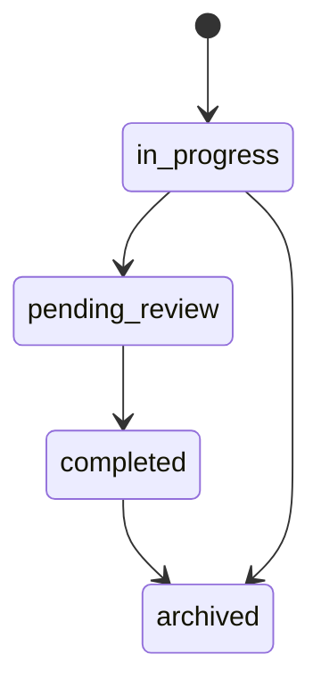
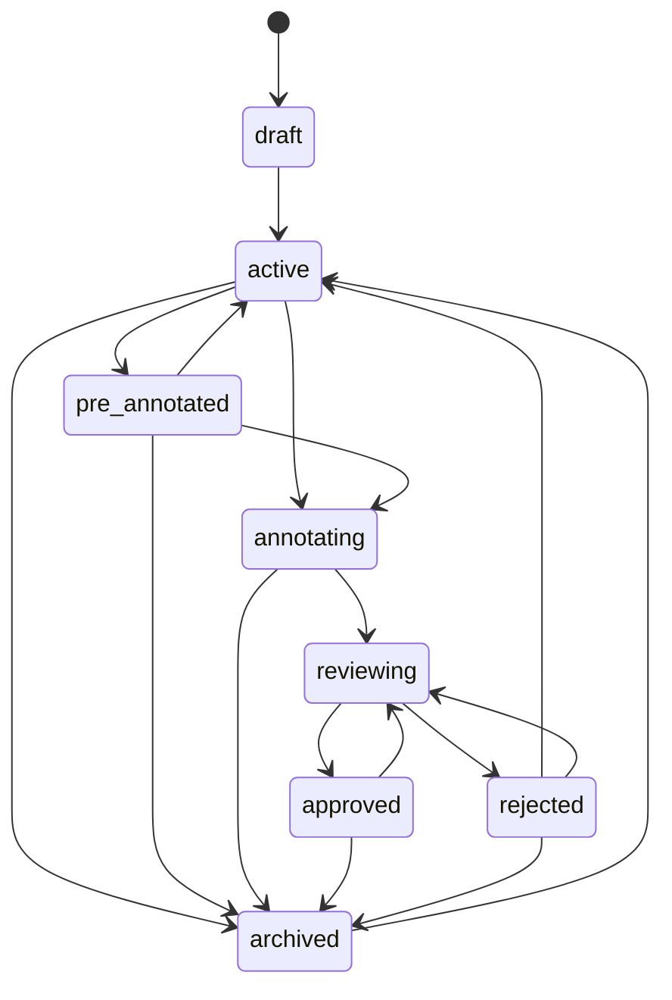
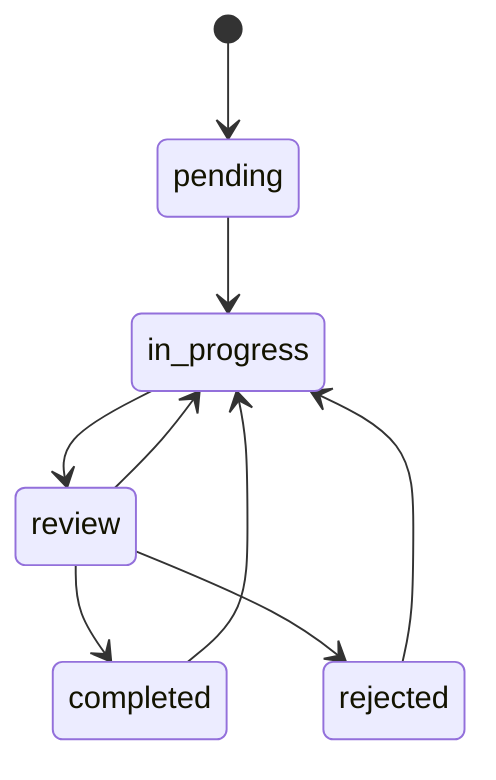
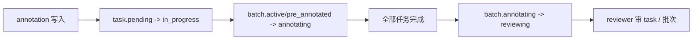

# 状态机总览

平台里至少有三类会影响业务流的状态机：

- project 状态
- batch 状态
- task 状态

它们的复杂度并不相同：真正承载生产流转压力的是 batch 和 task。

## Project 状态

当前项目状态较轻：

说明：

- project 状态更多是管理视图，不是工作台派题的唯一真值
- 真正影响“能不能标、能不能审”的，主要还是 batch / task

## Batch 状态

关键点：

- `active | pre_annotated → annotating` 是自动迁移
- `annotating → reviewing` 也是自动迁移
- owner 有多条逆向迁移兜底路径

## Task 状态

关键点：

- annotation 首次写入会触发 `pending → in_progress`
- `submit` 进入 `review`
- `withdraw`、`reopen`、`accept-rejection` 都会回到 `in_progress`
- 现仓运行时存在 `rejected` task 状态，虽然枚举定义仍有历史差异

## 三者怎么联动

最重要的联动链路：

也就是说：

- task 状态会推动 batch
- batch 状态会反过来影响 task 可见性和派题
- project 配置则决定 scheduler 如何在 task 间做选择

## 为什么需要单独一页

最常见的误解是：

- 只改 task 状态机，不看 batch
- 只改 batch 状态机，不看 scheduler
- 只改枚举，不看路由分支

这页的作用就是把“有哪些状态机”先一次讲清，再去看各模块页细节。

## 深入阅读

- [项目模块](./project-module)
- [批次模块](./batch-module)
- [任务模块](./task-module)
- [Scheduler 与派题](./scheduler-and-task-dispatch)
