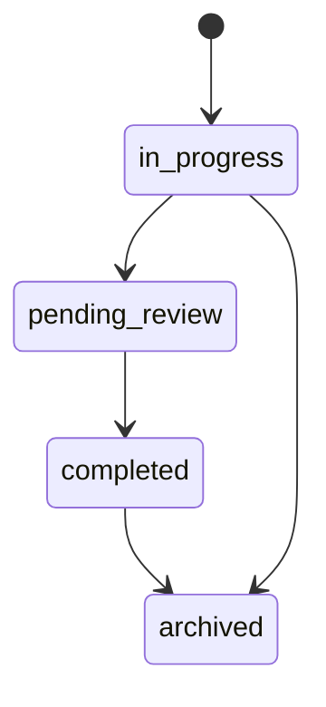

# 状态机总览

平台里至少有三类会影响业务流的状态机：

- project 状态
- batch 状态
- task 状态

它们的复杂度并不相同：真正承载生产流转压力的是 batch 和 task。

## Project 状态

当前项目状态较轻。下图表达管理视图采用的生命周期约定；后端目前没有像 Batch 一样的受控 transition guard，因此它不是可据此校验请求的状态真值：

```mermaid
stateDiagram-v2
    [*] --> in_progress
    in_progress --> pending_review
    pending_review --> completed
    completed --> archived
    in_progress --> archived
```

说明：

- project 状态更多是管理视图，不是工作台派题的唯一真值
- 真正影响“能不能标、能不能审”的，主要还是 batch / task

## Batch 状态

<ExcalidrawDiagram
  src="/diagrams/shared/state-machines/batch-lifecycle.svg"
  alt="Batch 从草稿激活，可经 AI 预标或人工标注进入审核，审核后通过、退回或归档，并支持 owner 逆向恢复"
  caption="Batch 完整状态机：正常推进、审核结果与 owner 逆向迁移"
/>

关键点：

- `active → pre_annotated` 由 AI worker 在批量预标成功结束后推进
- `active | pre_annotated → annotating` 是自动迁移
- `annotating → reviewing` 可以自动推进，也可以由被分派 annotator 主动送审
- owner 有多条逆向迁移兜底路径
- `reset_to_draft` 是绕过正常迁移边的 owner 恢复操作；`admin_lock` 只暂停派题和自动推进，不是一个生命周期状态

## Task 状态

<ExcalidrawDiagram
  src="/diagrams/shared/state-machines/task-lifecycle.svg"
  alt="Task 从待处理进入编辑，也可从待处理或编辑中直接送审；审核可撤回、通过或退回，完成和退回后可重新编辑"
  caption="Task 完整状态机：编辑、送审、审核与返工"
/>

关键点：

- 首个有效 annotation 触发 `pending → in_progress`，删掉最后一个有效 annotation 会触发 `in_progress → pending`
- `pending / in_progress` 都可以通过 `submit / skip` 直接进入 `review`
- `withdraw`、`reopen`、`accept-rejection` 都会回到 `in_progress`
- 直接上传任务会先经过 `uploading`；普通数据集关联创建的 task 直接从 `pending` 开始
- 批次驳回会把 `review / completed` task 回退到 `pending`，批次终极重置会把所有非 `pending` task 回退到 `pending`
- 现仓运行时存在 `rejected` task 状态，虽然枚举定义仍有历史差异

## 三者怎么联动

最重要的联动链路：

```mermaid
flowchart LR
  A["annotation 写入"] --> B["task.pending -> in_progress"]
  B --> C["batch.active/pre_annotated -> annotating"]
  C --> D["全部任务完成"]
  D --> E["batch.annotating -> reviewing"]
  E --> F["reviewer 审 task / 批次"]
```

也就是说：

- task 状态会推动 batch
- batch 状态会反过来影响 task 可见性和派题
- project 配置则决定 scheduler 如何在 task 间做选择

## 为什么需要单独一页

最常见的误解是：

- 只改 task 状态机，不看 batch
- 只改 batch 状态机，不看 scheduler
- 只改枚举，不看路由分支

这页的作用就是把“有哪些状态机”先一次讲清，再去看各模块页细节。

## 深入阅读

- [项目模块](./project-module)
- [批次模块](./batch-module)
- [任务模块](./task-module)
- [Scheduler 与派题](./scheduler-and-task-dispatch)
