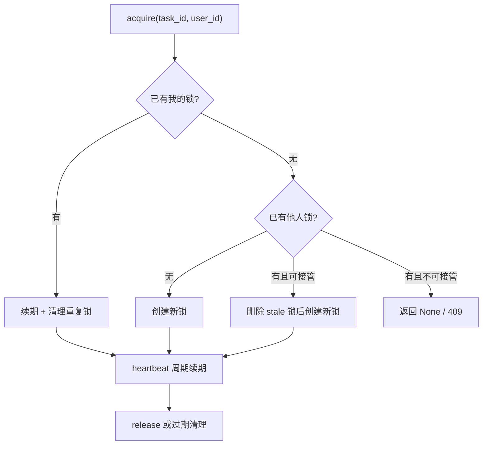

# Task Lock

Task lock 是工作台里的并发编辑保护层，不是权限系统，也不是 task 状态机。

代码真值源：

- `apps/api/app/services/task_lock.py`
- `apps/api/app/api/v1/tasks.py`
- [ADR-0005](/dev/adr/0005-task-lock-and-review-matrix)

## 它解决什么问题

如果两个标注员同时打开同一题并都开始编辑，就会出现：

- 标注互相覆盖
- 前端状态错乱
- submit / review 时审计与归属关系混乱

task lock 的目标是让“同一时刻谁在编辑这题”有一个明确答案。

## 生命周期

## 核心语义

### acquire

`TaskLockService.acquire()` 做的不是“简单 insert 一行”，它还处理：

- 同一用户的多行残留锁
- 他人锁是否已 stale
- assignee 的 force takeover
- 并发插入的 upsert 兜底

### heartbeat

活跃会话会定期 heartbeat，把 `expire_at` 往后推。

### release

用户离开题目、提交送审、切题等场景，会主动释放锁。

### cleanup expired

访问时会顺手清理过期锁，不依赖单独后台任务。

## TTL 与 takeover

当前默认：

- `DEFAULT_TTL = 300s`
- stale 判定阈值约为 `TTL / 2`

项目还可以通过 `project.task_lock_ttl_seconds` 覆盖 TTL。

这样做的目的：

- 避免用户刚断网几十秒就被踢锁
- 又不至于一把死锁占一整天

## 与 scheduler 的关系

task lock 和 scheduler 是串联关系：

1. `scheduler.get_next_task()` 会先查你有没有锁题
2. 没有才会选新题
3. 选出后立刻 acquire lock

所以从用户体感上看，“下一题”和“拿到锁”是一个动作。

## 与 task 状态机的关系

lock 不等于状态：

- `review` / `completed` 这些状态可能因为业务规则不可编辑
- `in_progress` 只是工作流状态，不保证一定有锁
- 一题是否可编辑，通常要同时看：
  - task 状态
  - 当前用户角色
  - lock 是否属于自己

## 典型场景

### 场景 1：用户刷新页面

- 如果锁还有效，scheduler 会把原题返还给他
- 不会悄悄换成别的题

### 场景 2：旧会话残留锁

- assignee 重进时可 `force_takeover`
- stale 锁也可能被自动接管

### 场景 3：审核员进入 review

- reviewer 虽不是 annotator，也会参与同一套 lock 机制
- lock 表里只是换一个 `user_id`

## 常见误解

### 误解 1：有锁就一定不可见

不是。lock 防并发编辑，不负责页面可见性。

### 误解 2：锁是纯前端行为

不是。真值在数据库和后端服务层，前端只是消费 acquire / heartbeat / release 端点。

### 误解 3：一题只能有一行 lock

理想上是，但历史并发残留会让同 task 出现多行，服务层显式做了去重兜底。

## 常见修改落点

| 你想改什么 | 先看哪里 |
|---|---|
| 调整 TTL | `services/task_lock.py` + `db/models/project.py` |
| 调整 takeover 逻辑 | `services/task_lock.py` |
| 改前端续期节奏 | `apps/web/src/hooks/useTaskLock.ts` |
| 改提交/切题时释放锁 | `api/v1/tasks.py` |

## 相关文档

- [Scheduler 与派题](./scheduler-and-task-dispatch)
- [任务模块](./task-module)
- [状态机总览](./state-machines)
