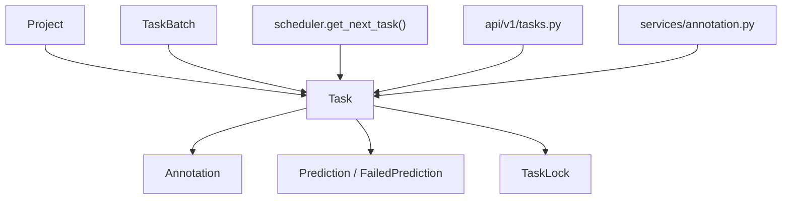
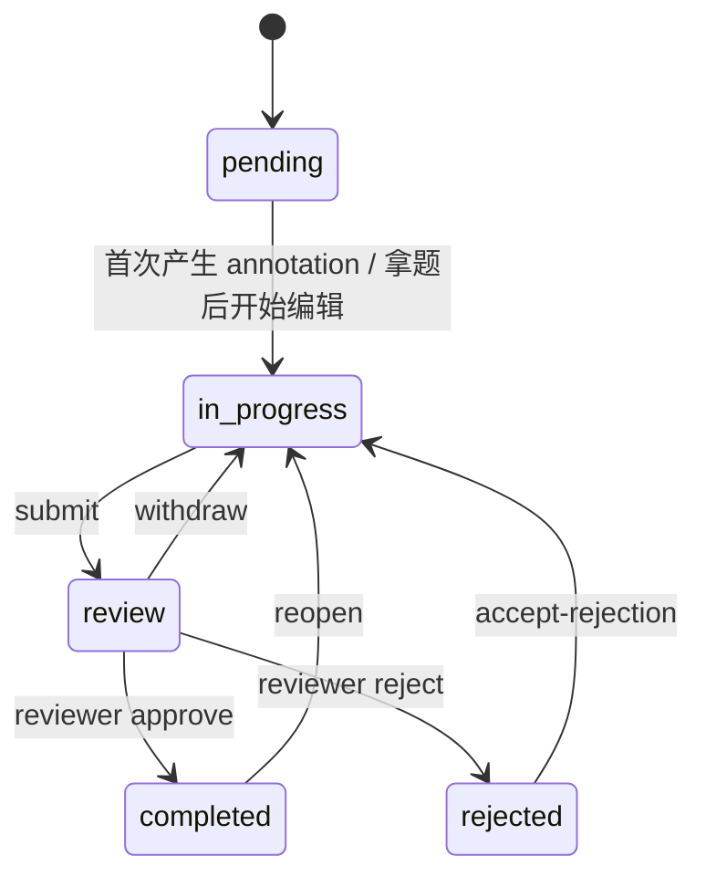

# 任务模块

本文是面向开发者的 task 手册，说明 task 的数据模型、工作流状态机、锁机制、审核流，以及它如何与 batch、annotation、scheduler 联动。

如果你要改：

- 工作台拿题与任务可见性
- task 状态机
- submit / withdraw / reopen / reject / approve
- task lock
- annotation 写入后 task / batch 的联动

先读这页。

## 模块定位

Task 是系统中的最小工作单元，一条数据最终总是落实到一条或多条 task 的状态变化。



一句话理解：

- project 决定规则
- batch 决定分组推进
- task 决定一条数据当前是否能被标、审、退回、重开

## 代码入口

| 位置 | 作用 |
|---|---|
| `apps/api/app/db/models/task.py` | Task 主模型 |
| `apps/api/app/db/enums.py` | `TaskStatus` 枚举 |
| `apps/api/app/schemas/task.py` | Task 响应模型与 lock 响应 |
| `apps/api/app/api/v1/tasks.py` | task 路由、状态机、审核动作、lock 端点 |
| `apps/api/app/services/scheduler.py` | 下一题派发、batch 可见性过滤 |
| `apps/api/app/services/task_lock.py` | task 锁服务 |
| `apps/api/app/services/annotation.py` | annotation 写入对 task 的状态回写 |
| `apps/web/src/api/tasks.ts` | 前端 task API wrapper |
| `apps/web/src/hooks/useTaskLock.ts` | 前端 task lock 生命周期 |
| `apps/web/src/pages/Workbench/` | 工作台主消费方 |

## 数据模型

`Task` 当前的关键字段：

| 字段 | 含义 |
|---|---|
| `project_id` | 所属项目 |
| `batch_id` | 所属批次，可空 |
| `dataset_item_id` | 数据集项引用 |
| `display_id` | 人类可读任务 ID |
| `file_name` / `file_path` / `file_type` | 原始素材信息 |
| `status` | 任务工作流状态 |
| `assignee_id` | 当前标注责任人 |
| `reviewer_id` | 当前审核责任人 |
| `assigned_at` | 分配时间 |
| `is_labeled` | 是否已有有效标注 |
| `total_annotations` / `total_predictions` | 聚合计数 |
| `submitted_at` | 送审时间 |
| `reviewer_claimed_at` | 审核员 claim 时间 |
| `reviewed_at` | 审核完成时间 |
| `reject_reason` | 退回原因 |
| `skip_reason` / `skipped_at` | 跳过原因与时间 |
| `reopened_count` / `last_reopened_at` | 重开编辑历史 |
| `version` | annotation 写入时的乐观并发辅助 |

## Task 状态机

task 状态枚举当前是：

```text
uploading
pending
in_progress
completed
review
```

但业务上还叠加了一个事实：

- 审核退回时，task 路由会把 `status` 写成字符串 `"rejected"`

这意味着现仓里存在“枚举定义”和“运行时业务状态”并不完全对齐的历史现象。开发时不要只看 `TaskStatus` 枚举，还要看 `tasks.py` 的真实分支。

### 主要工作流



补充：

- `uploading` 主要存在于上传阶段，不是标注主流程的常驻态
- `rejected` 虽不在当前 `TaskStatus` 枚举中，但在业务代码中是实际存在状态

## 可见性与派题

### 列表 / 点查可见性

非特权用户在 `GET /tasks` 和 `GET /tasks/{id}` 上受 batch 可见性限制。

规则在 `scheduler.batch_visibility_clause()` 与 `tasks._assert_task_visible()`：

- reviewer：可见 `active / annotating / reviewing` 批次中的任务
- annotator：可见
  - `active / annotating` 且 `annotator_id == self` 或 batch 未分派
  - `rejected` 且 `annotator_id == self`
- `super_admin` / project owner：越权放行

所以 task 的可见性不只是看 task 本身状态，也看它挂在哪个 batch 上。

### `/tasks/next`

`scheduler.get_next_task()` 是真实派题入口。它会：

1. 先看用户是否已有未完成锁任务
2. 基于 project 配置、batch 状态、可见性和采样策略构造候选集
3. 选出一题并加 task lock

关键过滤条件：

- `Task.is_labeled == False`
- task 不在“我已经标过”的集合里
- `TaskBatch.status in ["active", "annotating"]`
- 命中 batch 可见性约束

因此，task 派发行为本质上是 project + batch + task 三方共同决定的。

## Annotation 对 Task 的回写

`AnnotationService._update_task_stats()` 是 task 状态自动推进的关键入口。

当 annotation 数量变化时，它会：

- 更新 `task.total_annotations`
- 更新 `task.is_labeled`
- 首次有有效标注时：
  `pending → in_progress`
- 标注全删空时：
  `in_progress → pending`

如果 task 挂在某个 batch 下，还会继续：

- 调 `BatchService.check_auto_transitions(batch_id)`
- 调 `BatchService.recalculate_counters(batch_id)`

这就是为什么“只是改 annotation”也会连带改变 task 和 batch。

## 审核流

`apps/api/app/api/v1/tasks.py` 中和审核相关的主要动作：

- `POST /tasks/{id}/submit`
- `POST /tasks/{id}/withdraw`
- `POST /tasks/{id}/review/claim`
- `POST /tasks/{id}/review/approve`
- `POST /tasks/{id}/review/reject`
- `POST /tasks/{id}/reopen`
- `POST /tasks/{id}/accept-rejection`

### 语义要点

- `submit`
  `in_progress → review`
- `withdraw`
  标注员在 reviewer 未 claim 前把 `review → in_progress`
- `review/claim`
  reviewer 抢占审核所有权，设置 `reviewer_claimed_at`
- `review/approve`
  `review → completed`
- `review/reject`
  `review → rejected`，并写 `reject_reason`
- `reopen`
  标注员把 `completed → in_progress`
- `accept-rejection`
  标注员把 `rejected → in_progress`，保留 `reject_reason`

注意：

- `reviewer_claimed_at` 一旦存在，会冻结 withdraw 入口
- `reopen` 与 `accept-rejection` 都会回到 `in_progress`，但语义不同

## Task Lock

Task lock 是工作台并发编辑保护，不等于 task 状态机。

### 入口

- `POST /tasks/{id}/lock`
- `POST /tasks/{id}/lock/heartbeat`
- `DELETE /tasks/{id}/lock`

服务层在 `services/task_lock.py`。

### 语义

- 一个 task 可以因历史残留出现多行锁，需要服务层清理兜底
- 同一用户重进时优先续期自己的锁
- assignee 重进时可 `force_takeover`
- 锁过期会自动清理

默认 TTL：

- `TaskLockService.DEFAULT_TTL = 300`
- 真实 TTL 还会受 `project.task_lock_ttl_seconds` 影响

### 常见坑

- 不要把 task lock 理解成“谁都不能看这题”
  它只防并发编辑，不决定可见性
- 修改 `acquire()` 时要特别小心多行残留、并发插入和 stale takeover 分支

## 批次联动

task 事件会回写 batch，主要体现在：

- `in_progress` 出现后，batch 可能 `active/pre_annotated → annotating`
- batch 内任务都做完后，batch 可能 `annotating → reviewing`
- `withdraw` / `reopen` / `accept-rejection` 等动作会重新计算 batch counters

所以改 task 状态机时，必须同步审视 batch 状态机；这两者不是各自独立演化的。

## 前端同步点

改 task 逻辑时，至少检查这些位置：

| 文件 | 为什么要看 |
|---|---|
| `apps/web/src/api/tasks.ts` | 前端 task API wrapper |
| `apps/web/src/hooks/useTaskLock.ts` | 锁获取、续期、释放 |
| `apps/web/src/pages/Workbench/shell/WorkbenchShell.tsx` | 工作台主状态流 |
| `apps/web/src/pages/Workbench/shell/TaskQueuePanel.tsx` | 任务列表与 rejected 提示 |
| `apps/web/src/pages/Annotate/AnnotatePage.tsx` | 标注页面上的批次送审入口 |
| `apps/web/src/pages/Review/` | 审核工作台 |

高频联动风险：

- 后端新增 task 状态，前端 badge / 分支没补
- 可见性改了，但 `/tasks/next` 和 `/tasks` 规则不一致
- lock 行为改了，前端 heartbeat / 过期提示没同步

## 测试锚点

建议优先看这些测试：

| 文件 | 覆盖重点 |
|---|---|
| `apps/api/tests/test_task_lock_dedup.py` | task lock 残留 / 去重 |
| `apps/api/tests/test_batch_lifecycle.py` | task 事件对 batch 的反作用 |
| 相关 `tasks.py` 路由测试 | submit / withdraw / reopen / reject / approve |

调试顺序通常是：

1. 先确认 task 状态变化是否正确
2. 再确认 lock / reviewer claim 是否符合预期
3. 最后检查 batch 与 dashboard counters 是否一起被改对
