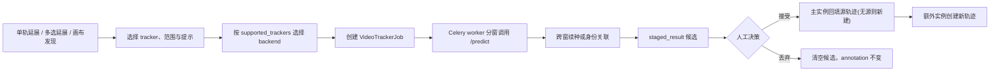

# 视频 AI 追踪架构

视频 AI 追踪是一条独立于图片批量预标的“人在环”链路：标注员可以延展单条已有轨迹、批量延展多条轨迹，或从画布级入口发现多个新目标。worker 分窗执行，结果先暂存为 job 候选，人工接受后才写入 annotation。

本页解释稳定的数据边界与执行流程。端点字段见[视频后端帧服务](../reference/video-frame-service#tracker-job)，backend wire contract 见 [ML Backend Protocol](../reference/ml-backend-protocol#22-interactive-predict单图或短交互)，WebSocket 事件见 [WS 协议](../reference/ws-protocol#6-wsvideo-tracker-jobsjob_id)。

## 三种 AI 数据不要混用

| 数据 | 用途 | 是否已落标注 | 人工决策 |
|---|---|---:|---|
| `Prediction` | 图片 / 视频当前帧批量预标候选 | 否 | 逐 shape 采纳 / 忽略 |
| `VideoTrackerJob.staged_result` | 一次视频传播产生的逐帧、多目标候选 | 否 | job 级接受 / 丢弃 |
| `Annotation(source="ai_tracker")` 或 prediction keyframe | 已接受的视频追踪结果 | 是 | 后续按轨迹 / 关键帧继续人工编辑 |

`staged_result` 的存在保证 tracker 完成、取消或模型返回坏结果时不会先污染 committed annotation。它不是 `Prediction` 的另一种序列化，也不参与 `task.total_predictions` 或批量预标状态机。

## 端到端流程



核心入口：

- 前端：`useWorkbenchShellModel.tsx` 组织范围、点 / 框种子和 job 审阅状态；顶部「发现目标」是画布级无源入口，选中卡 / 右键菜单的「延展此轨迹」是单源入口，多选卡的「批量延展」是多源入口。`VideoTrackerPropagateDialog` 首屏显示作用范围，并按作用范围过滤模型：文本发现只在画布级入口出现，单轨 / 多选只列种子驱动模型。
- API：`POST /tasks/{task_id}/video/tracks/{annotation_id}:propagate`（延展选中轨迹）或 `POST /tasks/{task_id}/video:track`（源可选）创建 job。`video:track` 的源模式有三种：`source_annotation_id` 单源延展；`source_annotation_ids[]` 多选批量（一个 job 延展 N 条已有轨迹，各回填各自源）；两者皆缺省即无源检测（`target_class_name` 指定新轨迹类别）。
- worker：`app.workers.video_tracker.run_video_tracker_job` 调用 `app.services.video_tracking.runner`。
- backend adapter：`app.services.video_tracking.adapters` 把平台 context 转为 ML Backend `/predict` 请求。
- 决策：`POST /video-tracker-jobs/{job_id}/accept|discard`。

## 能力路由

项目可以同时启用多个 ML Backend。tracker 选择不能只看 `Project.ml_backend_id`，否则 SAM3 tracker 可能被错误发给只支持 SAM2 的主后端。

tracker 先按能力确定请求所属服务池，再进入路由选择：

1. 读取项目所有已启用 backend。
2. 只保留状态为 connected，且 `health_meta.capabilities.supported_trackers` 包含全部所需能力的实例。
3. 项目主后端在候选中时优先；否则使用第一个匹配实例来定位其唯一所属服务池。没有 connected 候选时，创建 job 的 API 在排队前返回 422。
4. `off / observe` 固定派发该池的 legacy 实例，observe 只额外记录 would-select，不创建正式 route lease；`enforce` 由 `MLBackendRouter` 选出实例并取得 route lease。runner 必须使用这个 selected registry 构造 backend client，不能继续使用预选的 legacy 行。
5. 整个 job 固定同一实例；enforce 模式还固定同一 route lease 并周期 heartbeat。路由拒绝或 selected registry 缺失发生在首个推理前，job 直接失败；heartbeat 可能在部分窗口已经完成后失败，此时 runner 中止后续推理并把 job 标为失败。正常完成调用 finish，取消、中途返回和异常调用 cancel，并总是终止 heartbeat 与关闭 Redis client。

组合模型要求**同一个** backend 同时声明 `sam3_video` 与 `sam3_video_interactive`，不能把两个 backend 的能力并集误拼成可执行组合。前端从项目已启用 backend 的 `/setup` 能力与连接状态构建 `model_key → backend names`，下拉只显示可执行模型并标出提供者。`mock_bbox` 是本地 adapter，不参加 backend 路由；生产构建始终不在 UI 暴露它，仅开发构建在无真实 backend 时保留流程兜底。

## 面板与布局状态

AI 追踪与 AI 单题共用一套面板 chrome，但开关互斥：`togglePropagateDialog` 打开追踪前收起单题面板，`toggleAiPopover` 则先关闭追踪。追踪面板默认停靠画布右上，拖动与缩放都以 stage 的 `offsetParent` 为局部坐标系，而不是 viewport 坐标。画布或窗口收缩时，恢复的旧坐标和尺寸会被 clamp 回 8px 安全边界。

`useFloatingPanelFrame` 是 AI 面板局部偏好的共用持久化层。`useVideoTrackerPanelFrame` 使用 `wb:video-tracker-panel-position` / `wb:video-tracker-panel-size`，`useAiPopoverFrame` 使用独立的 `wb:ai-popover-position` / `wb:ai-popover-size`。它们只保存 UI 位置与尺寸，不进入 job payload、annotation 或服务端工作台偏好。

## 两类追踪语义

### 种子驱动：SAM2 / SAM3 PVS

`sam2_video` 和 `sam3_video_interactive` 消费调用方指定目标：

- 无显式种子时，使用源轨迹当前关键帧几何作为 `source_geometry`。
- `prompt.seeds[]` 可为每个 `obj_id` 提供点、框或多帧 `prompts[]`。
- 点坐标归一化到 `[0,1]`；第三位 label 为 `1` 正点 / `0` 负点。
- 同一 obj 在后续帧追加提示就是中途纠偏；不同 obj 各形成独立实例。
- backend memory 负责窗内跨帧传播，`instance_id` 直接沿用 caller 指定的 obj id。

### 文本自动发现：SAM3 multiplex

`sam3_video` 使用文本描述在每个窗口自动发现多个目标：

- `text` 必填，可附带 exemplar。
- 每个窗口是独立检测会话，窗内 id 不能直接视为全局对象 id。
- 后续窗口还会把上一窗每个实例最后的有效 bbox 作为正框提示，与 `text` 一起送入种子帧。这样窗首暂时没有纯文本检出时仍能续追已有对象，同时保留发现新目标的能力。
- 平台在相邻窗口边界帧按 bbox IoU 关联，把窗内局部 id 映射为全局稳定 `instance_id`。
- 未匹配的新实例分配新全局 id，供接受阶段创建独立轨迹。

这两类模型共享 `context.type="video_tracker"` 和结果结构，但提示来源与跨窗身份策略不同。不要用“是否多目标”区分它们：两者都可以多目标。

### 编排：发现追踪 combo（`sam3_video_combo`）

`sam3_video_combo` 不是新的 backend 模型，而是 runner 侧对上述两类原语的**两趟串行编排**（backend 零改），兼得 multiplex 的文本自动发现与 PVS 的干净跨帧身份：

1. **发现趟**：从种子帧向后取一小窗（`COMBO_DISCOVERY_WINDOW_FRAMES`）调 multiplex（`sam3_video`）。multiplex 需多帧传播才会在种子帧填充检测，单帧窗恒返回空——所以跑小窗但只取种子帧那一帧的 per-obj 框铸种。
2. **种子铸造**：每个发现框铸成一条 PVS 种子 `{obj_id: 1..N, geometry}`，不带 `source_annotation_id`（发现对象无源 → 落库全部新建）。
3. **追踪趟**：用这些种子跑 PVS（`sam3_video_interactive`）窗循环，逐对象 memory 跨窗续种。因是 PVS memory，不需要 multiplex 的窗边界 IoU 关联。

两趟串行意味着发现趟结束、追踪趟开始之间有一段 idle，可让 backend 卸载 multiplex 再载 PVS，避免两模型同容峰值。后端解析取 `sam3_video_interactive` 能力（同一 sam3-backend 也声明 `sam3_video`）；前端仅在两能力都声明时才放开该选项。发现不到目标或缺 `text` 时 job 直接失败。

## 分窗与续追

runner 根据模型选择窗口大小：SAM3 系使用 `VIDEO_TRACKER_SAM3_WINDOW_SIZE_FRAMES`，其它 tracker 使用 `VIDEO_TRACKER_WINDOW_SIZE_FRAMES`。

分窗有三个不变量：

1. job 的 `from_frame / to_frame` 始终使用绝对源帧。
2. 首窗接收原始点 / 框种子；后续窗使用上一窗每个实例最后一个非 outside 几何续种。PVS 把它们写入 memory，multiplex 把它们作为与文本组合的正框提示。
3. 帧采样只影响最终持久化：模型仍逐源帧计算，接受时按 `grid_step` 丢弃非网格帧。

`direction=backward` 时窗口倒序执行，但单个窗口和 prompt 中的 `frame_index` 仍是绝对帧号。窗口之间发布同一个 job 事件流，不为每窗创建子 job。

## 候选暂存与状态机

正常状态机：

```text
queued -> running -> pending_review -> accepted | discarded
                  -> failed
                  -> cancelled -> accepted | discarded   # 已有部分结果时
```

runner 把结果序列化到：

```json
{
  "results": [
    {
      "frame_index": 24,
      "geometry": { "type": "bbox", "x": 0.1, "y": 0.2, "w": 0.3, "h": 0.4 },
      "confidence": 0.91,
      "outside": false,
      "instance_id": "1",
      "primary": true
    }
  ],
  "grid_step": 1,
  "output_geometry": "bbox"
}
```

`geometry` 是 typed union：bbox、polygon，或 `{type:"mask", mask:coco_rle_ref, bbox?}`。`output_geometry` 可显式选择 `bbox / polygon / mask`；省略时跟随源轨迹。runner 在发布帧事件和追加候选前校验并把 inline tracker RLE 写成内容寻址引用。单 mask 限制 4096×4096、1,000,000 runs、4 MiB canonical object；annotation geometry 限 8 MiB，整个 staged payload 限 64 MiB。超限 job 以 `tracker_candidate_too_large` 失败并保持 `staged_result=NULL`。

正常完成进入 `pending_review`。取消时 worker 在停止前暂存已收集的部分结果，状态保持 `cancelled`；若候选非空，前端仍可进入审阅。失败不生成可审候选。

接受与丢弃都需要 task 可见性，并限制为 job 创建者或项目特权角色。accept 在落库事务内锁定并刷新 task、segment 和全部源 annotation，复核 task 状态、assignment、segment lease、源版本、active 状态与 annotation lock；源删除不降级为新轨迹。accept 成功和 discard 都清空 `staged_result`，对象引用分别转由 annotation 保活或进入 GC 宽限。API 记录 `VIDEO_TRACKER_JOB_ACCEPT` / `VIDEO_TRACKER_JOB_DISCARD` 审计动作。

## 接受阶段如何落库

`_partition_results_by_instance()` 把结果拆为主实例与额外实例：

- 有 `primary=true` 时，该 `instance_id` 是主实例。
- 没有 primary 标记时，使用字典序最小的 `instance_id` 作为确定性兜底。
- 没有任何 `instance_id` 时，全部按单实例老 backend 处理。

落库以 `source_map: {instance_id → 源 annotation}` 决定每个实例回填还是新建，命中源则 `apply_tracker_results()` 回填、未命中则 `_new_discovered_track()` 新建：

- **单源延展**：主实例回填源，额外发现实例各新建。
- **多选批量**（`source_annotation_ids[]`）：`prompt.seeds[]` 每条带 `source_annotation_id`，`instance_id == str(obj_id)` 契约让每个实例回填各自源；任一源在运行期被删、锁定或修改时整次接受返回 409。多源 job 的 `annotation_id` 存 NULL，走 job 级审阅，接受时按 task 粒度 invalidate，各源轨迹一并刷新。
- **无源检测 / combo 发现**（`job.annotation_id` 为空）：`source_map` 为空，主实例也走新建。

归属由 `_TrackTarget` 提供——有源继承源 label，无源取 job 的 `target_class_name` / `target_tool_unit_id` 显式类别。持久化时：

- 人工关键帧优先，预测不得覆盖 manual frame。
- outside 结果合并为 prediction outside ranges。
- polygon 输出少于三个顶点时按 outside 处理，避免写入非法几何。
- mask 输出保存 RLE 引用；accept 提交前再次按源视频 width / height / frame_count 校验，不能把错误尺寸写进 annotation。
- 新轨迹的类别与工具单位来自 `_TrackTarget`（有源继承源轨迹，无源取 job 显式 `target_class_name`），分配新 `track_id`，source 标记为 `ai_tracker`。

## 前端审阅边界

`useVideoTrackerJobs` 维护当前会话的运行 job 与候选预览：

- `job_completed` 与带部分结果的 `job_cancelled` 触发 `GET .../preview`。
- 工作台进入视频任务时调用任务级 reviewable 端点，以服务端 `VideoTrackerJob` 为真值恢复刷新前的候选；同时调用 active 端点拉取仍在 `queued` / `running` 的 job 并重连各自的 WebSocket，使运行中的追踪任务不会因整页刷新从界面消失。普通用户只恢复自己创建的任务，项目 owner / 超级管理员可恢复该任务下全部 job。
- `TrackerJobStore` 是跨任务复用的模块级单例。恢复某任务前会先按当前任务 scope 一次：关闭并清掉不属于该任务的 job / 候选 / WebSocket / 清理定时器，避免旧任务的完成提示或候选串到新任务；异步恢复以当前任务为护栏，若恢复途中已切走任务，迟到的旧任务结果会被丢弃。
- `VideoTrackerReviewBar` 提供 job 级接受 / 丢弃。
- 画布候选层只展示暂存结果，不把它们混入 annotation query cache。
- accept 成功后才 invalidate annotation query；discard 不需要刷新 committed annotation。

运行历史由 `/ai-pre/jobs?tab=video` 汇总，当前题审阅则留在工作台。历史列表与工作台实时候选不是同一份前端状态；`useVideoTrackerJobs` 在实时事件之外还会读取 `GET /tasks/{task_id}/video/tracker-jobs/reviewable`，再逐 job 拉 preview 恢复候选。恢复链路必须以 job + preview API 为真值，不能从 annotation 反推尚未接受的候选。

## 观测与排障

排障顺序：

1. 检查 job 的 `status / error_message / staged_result`。
2. 检查项目是否启用了声明目标 `model_key` 的 backend，以及能力快照是否刷新。
3. 检查 GPU worker 是否订阅 `gpu` queue、是否收到正确窗口环境变量。
4. 检查 backend `/health` 的 `video_pool` 与模型权重状态。
5. 对多目标漂移，区分 PVS 续种问题和 multiplex 窗边界 IoU 关联问题。

精确端点与状态码见 [Video Tracker Jobs API](/api/guides/video-tracker-jobs)；具体命令见[视频帧服务 Runbook](/ops/runbooks/video-frame-service)。

## 维护边界

- 新增 tracker：同步 backend `/setup.supported_trackers`、能力路由、前端模型语义和本概念页；字段级协议只写进 ML Backend reference。
- 修改 job 状态或接受语义：同步 Pydantic / OpenAPI / 前端生成类型、WS 文档、用户候选审阅流程和 runbook。
- 修改环境变量：改 `.env.example` 和运行容器透传，再运行 env 文档生成器；不要只改生成后的 `env-vars.md`。
- 计划文档可以记录 spike 和阶段选择，但当前行为以本页、reference 和代码为准。
