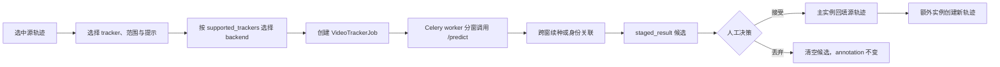

# 视频 AI 追踪架构

视频 AI 追踪是一条独立于图片批量预标的“人在环”链路：标注员从一条已有轨迹发起模型传播，worker 分窗执行，结果先暂存为 job 候选，人工接受后才写入 annotation。

本页解释稳定的数据边界与执行流程。端点字段见[视频后端帧服务](../reference/video-frame-service#tracker-job)，backend wire contract 见 [ML Backend Protocol](../reference/ml-backend-protocol#22-interactive-predict单图或短交互)，WebSocket 事件见 [WS 协议](../reference/ws-protocol#6-wsvideo-tracker-jobsjob_id)。

## 三种 AI 数据不要混用

| 数据 | 用途 | 是否已落标注 | 人工决策 |
|---|---|---:|---|
| `Prediction` | 图片 / 视频当前帧批量预标候选 | 否 | 逐 shape 采纳 / 忽略 |
| `VideoTrackerJob.staged_result` | 一次视频传播产生的逐帧、多目标候选 | 否 | job 级接受 / 丢弃 |
| `Annotation(source="ai_tracker")` 或 prediction keyframe | 已接受的视频追踪结果 | 是 | 后续按轨迹 / 关键帧继续人工编辑 |

`staged_result` 的存在保证 tracker 完成、取消或模型返回坏结果时不会先污染 committed annotation。它不是 `Prediction` 的另一种序列化，也不参与 `task.total_predictions` 或批量预标状态机。

## 端到端流程



核心入口：

- 前端：`useWorkbenchShellModel.tsx` 组织范围、点 / 框种子和 job 审阅状态。
- API：`POST /tasks/{task_id}/video/tracks/{annotation_id}:propagate` 创建 job。
- worker：`app.workers.video_tracker.run_video_tracker_job` 调用 `video_tracker_runner`。
- backend adapter：`video_tracker_adapters.py` 把平台 context 转为 ML Backend `/predict` 请求。
- 决策：`POST /video-tracker-jobs/{job_id}/accept|discard`。

## 能力路由

项目可以同时启用多个 ML Backend。tracker 选择不能只看 `Project.ml_backend_id`，否则 SAM3 tracker 可能被错误发给只支持 SAM2 的主后端。

`MLBackendService.get_tracker_backend(project_id, model_key)` 的选择顺序是：

1. 读取项目所有已启用 backend。
2. 只保留 `health_meta.capabilities.supported_trackers` 包含 `model_key` 的实例。
3. 项目主后端在候选中时优先。
4. 否则选择 connected 候选；没有 connected 时保留首个匹配项供调用层给出明确错误。

前端使用同一能力集合过滤追踪工具条。`mock_bbox` 是本地 adapter，不参加 backend 路由。

## 两类追踪语义

### 种子驱动：SAM2 / SAM3 PVS

`sam2_video` 和 `sam3_video_interactive` 消费调用方指定目标：

- 无显式种子时，使用源轨迹当前关键帧几何作为 `source_geometry`。
- `prompt.seeds[]` 可为每个 `obj_id` 提供点、框或多帧 `prompts[]`。
- 点坐标归一化到 `[0,1]`；第三位 label 为 `1` 正点 / `0` 负点。
- 同一 obj 在后续帧追加提示就是中途纠偏；不同 obj 各形成独立实例。
- backend memory 负责窗内跨帧传播，`instance_id` 直接沿用 caller 指定的 obj id。

### 文本自动发现：SAM3 multiplex

`sam3_video` 使用文本描述在每个窗口自动发现多个目标：

- `text` 必填，可附带 exemplar。
- 每个窗口是独立检测会话，窗内 id 不能直接视为全局对象 id。
- 平台在相邻窗口边界帧按 bbox IoU 关联，把窗内局部 id 映射为全局稳定 `instance_id`。
- 未匹配的新实例分配新全局 id，供接受阶段创建独立轨迹。

这两类模型共享 `context.type="video_tracker"` 和结果结构，但提示来源与跨窗身份策略不同。不要用“是否多目标”区分它们：两者都可以多目标。

## 分窗与续追

runner 根据模型选择窗口大小：SAM3 系使用 `VIDEO_TRACKER_SAM3_WINDOW_SIZE_FRAMES`，其它 tracker 使用 `VIDEO_TRACKER_WINDOW_SIZE_FRAMES`。

分窗有三个不变量：

1. job 的 `from_frame / to_frame` 始终使用绝对源帧。
2. 首窗接收原始点 / 框种子；后续窗使用上一窗每个实例最后一个非 outside 几何续种。
3. 帧采样只影响最终持久化：模型仍逐源帧计算，接受时按 `grid_step` 丢弃非网格帧。

`direction=backward` 时窗口倒序执行，但单个窗口和 prompt 中的 `frame_index` 仍是绝对帧号。窗口之间发布同一个 job 事件流，不为每窗创建子 job。

## 候选暂存与状态机

正常状态机：

```text
queued -> running -> pending_review -> accepted | discarded
                  -> failed
                  -> cancelled -> accepted | discarded   # 已有部分结果时
```

runner 把结果序列化到：

```json
{
  "results": [
    {
      "frame_index": 24,
      "geometry": { "type": "bbox", "x": 0.1, "y": 0.2, "w": 0.3, "h": 0.4 },
      "confidence": 0.91,
      "outside": false,
      "instance_id": "1",
      "primary": true
    }
  ],
  "grid_step": 1,
  "output_geometry": "bbox"
}
```

正常完成进入 `pending_review`。取消时 worker 在停止前暂存已收集的部分结果，状态保持 `cancelled`；若候选非空，前端仍可进入审阅。失败不生成可审候选。

接受与丢弃都需要 task 可见性，并限制为 job 创建者或项目特权角色。accept 对已接受 job 幂等；discard 清空 `staged_result`。API 记录 `VIDEO_TRACKER_JOB_ACCEPT` / `VIDEO_TRACKER_JOB_DISCARD` 审计动作。

## 接受阶段如何落库

`_partition_results_by_instance()` 把结果拆为主实例与额外实例：

- 有 `primary=true` 时，该 `instance_id` 是主实例。
- 没有 primary 标记时，使用字典序最小的 `instance_id` 作为确定性兜底。
- 没有任何 `instance_id` 时，全部按单实例老 backend 处理。

主实例通过 `apply_tracker_results()` 回填源 annotation；额外实例通过 `_new_discovered_track()` 创建同类新轨迹。持久化时：

- 人工关键帧优先，预测不得覆盖 manual frame。
- outside 结果合并为 prediction outside ranges。
- polygon 输出少于三个顶点时按 outside 处理，避免写入非法几何。
- 新轨迹继承源类别和工具单位，分配新 `track_id`，source 标记为 `ai_tracker`。

## 前端审阅边界

`useVideoTrackerJobs` 维护当前会话的运行 job 与候选预览：

- `job_completed` 与带部分结果的 `job_cancelled` 触发 `GET .../preview`。
- 工作台进入视频任务时调用任务级 reviewable 端点，以服务端 `VideoTrackerJob` 为真值恢复刷新前的候选；普通用户只恢复自己创建的任务，项目 owner / 超级管理员可恢复该任务下全部候选。
- `VideoTrackerReviewBar` 提供 job 级接受 / 丢弃。
- 画布候选层只展示暂存结果，不把它们混入 annotation query cache。
- accept 成功后才 invalidate annotation query；discard 不需要刷新 committed annotation。

运行历史由 `/ai-pre/jobs?tab=video` 汇总，当前题审阅则留在工作台。历史列表与工作台实时候选不是同一份前端状态；`useVideoTrackerJobs` 在实时事件之外还会读取 `GET /tasks/{task_id}/video/tracker-jobs/reviewable`，再逐 job 拉 preview 恢复候选。恢复链路必须以 job + preview API 为真值，不能从 annotation 反推尚未接受的候选。

## 观测与排障

排障顺序：

1. 检查 job 的 `status / error_message / staged_result`。
2. 检查项目是否启用了声明目标 `model_key` 的 backend，以及能力快照是否刷新。
3. 检查 GPU worker 是否订阅 `gpu` queue、是否收到正确窗口环境变量。
4. 检查 backend `/health` 的 `video_pool` 与模型权重状态。
5. 对多目标漂移，区分 PVS 续种问题和 multiplex 窗边界 IoU 关联问题。

具体命令见[视频帧服务 Runbook](/ops/runbooks/video-frame-service)。

## 维护边界

- 新增 tracker：同步 backend `/setup.supported_trackers`、能力路由、前端模型语义和本概念页；字段级协议只写进 ML Backend reference。
- 修改 job 状态或接受语义：同步 Pydantic / OpenAPI / 前端生成类型、WS 文档、用户候选审阅流程和 runbook。
- 修改环境变量：改 `.env.example` 和运行容器透传，再运行 env 文档生成器；不要只改生成后的 `env-vars.md`。
- 计划文档可以记录 spike 和阶段选择，但当前行为以本页、reference 和代码为准。
