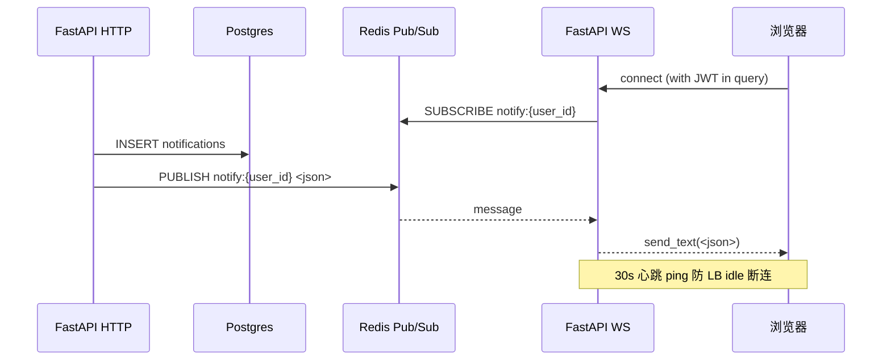

# WebSocket 协议

> 适用读者：要在前端订阅平台实时事件、或在第三方系统消费平台推送的工程师。
>
> 平台实现：`apps/api/app/api/v1/ws.py`、`apps/api/app/services/notification.py`、`apps/web/src/hooks/{useNotificationSocket,usePreannotation,useReconnectingWebSocket}.ts`。

平台目前公开两个 WS 频道，全部通过 Redis Pub/Sub 串接：HTTP 写表的同时 publish 到 Redis 频道，WS 端订阅 Redis 转发到客户端。所有持久化数据另有 REST 端点兜底（断线场景轮询即可），WS 仅是「在线推送」的快速通道。



---

## 1. 端点总览

| 频道 | URL | 鉴权 | Redis 频道 | 用途 |
|---|---|---|---|---|
| 用户通知 | `/ws/notifications?token=<jwt>` | JWT (query param) | `notify:{user_id}` (`notification.py:27`) | 任务分配、AI 进度、导出完成、@提及 等 |
| 预标注进度 | `/ws/projects/{project_id}/preannotate` | 无（依赖 cookie 会话） | `project:{project_id}:preannotate` (`ws.py:53`) | 单次自动预标注的 progress |

base URL：`ws://<api-host>/ws/...` 或 `wss://...`。前端通过 `apps/web/src/hooks/useReconnectingWebSocket.ts` 处理重连。

---

## 2. `/ws/notifications`

### 2.1 鉴权

握手时必须在 query 参数携带 JWT：

```
ws://api.example.com/ws/notifications?token=eyJhbGciOi...
```

服务端 `decode_access_token` 校验 sub 字段（`ws.py:80-88`）。失败立刻关闭 frame，code = `1008 Policy Violation`。

> 为什么走 query 而不是 `Authorization` header：浏览器原生 `WebSocket` API 不允许设置自定义 header。如果前端用 `subprotocols` 走 token 也可以，但当前实现选 query 一致简单。HTTPS 下 query 字符串不进入 server access log（前端代理需配置脱敏）。

### 2.2 消息格式

服务端 → 客户端，JSON 文本帧。两种 type：

#### 业务消息（NotificationOut）

由 `NotificationService.notify` 写表后 publish（`notification.py:51-94`）：

```json
{
  "id": "<notification_uuid>",
  "type": "task.assigned" | "task.review_rejected" | "ai.preannotate_done" | "comment.mention" | ...,
  "target_type": "task" | "project" | "annotation" | ...,
  "target_id": "<uuid>",
  "payload": { ... },
  "created_at": "2026-05-06T08:30:00+00:00"
}
```

`type` 是开放枚举，由各业务模块定义（grep `NotificationService` 调用点可枚举）。前端不强校验未知 type，但只对已注册 type 显示 toast / 跳转。

#### 心跳（系统消息）

每 30s 服务端推一帧（`ws.py:33-43`）：

```json
{ "type": "ping" }
```

客户端**不需要**响应，只用来保活——防止反向代理（nginx 默认 60s `proxy_read_timeout`、AWS ALB 默认 60s idle）主动断连。前端 `useNotificationSocket` 收到 `type=="ping"` 时直接忽略，不触发 `invalidateQueries`（`useNotificationSocket.ts:38-39`）。

### 2.3 可靠性 — 断线兜底

WS 不保证 at-least-once。所有通知行已经 INSERT 到 `notifications` 表，断线时前端通过 `GET /api/v1/notifications` 轮询补齐：
- 默认前端 30s 一次轮询（即使 WS 在线）
- WS 重连成功后立即 `invalidateQueries(["notifications"])` 刷一次

业务方写代码：**永远先写表再 publish**，不要把 publish 当主路径。

---

## 3. `/ws/projects/{project_id}/preannotate`

### 3.1 鉴权

当前**没有**显式鉴权（`ws.py:48-67`）。依赖：
- 浏览器自动带 cookie / origin（同源策略）
- 反向代理层做 IP/origin 过滤
- 这是项目级频道，泄露 project_id 的进度不算敏感

> 如果你的部署需要更严的鉴权（比如多租户隔离），后续会迁到 query JWT 模式与 `/ws/notifications` 对齐。

### 3.2 消息格式

由 `app/workers/tasks.py:batch_predict` 在每 batch 结束时 publish：

```json
{
  "current": 12,
  "total": 50,
  "status": "running" | "completed" | "error",
  "error": "string"            // status="error" 时携带
}
```

进度 100% 时再发一帧 `status="completed"` 后频道结束。前端 `usePreannotationProgress`（`useNotificationSocket.ts:50-102` 区域内的同模块 hook）据此驱动进度条；收到 completed/error 后断开 WS。

### 3.3 心跳

此频道**没有心跳**——预标注任务通常 < 5 分钟，且每 batch 都会 push 一帧消息天然保活。如果你的 backend 单 batch 推理 > 60s，需要在前端 LB / nginx 把 `proxy_read_timeout` 调高（推荐 ≥ 120s）或者参考 `/ws/notifications` 的心跳模式补丁。

---

## 4. 前端重连策略

`apps/web/src/hooks/useReconnectingWebSocket.ts` 是所有 WS 用法的基础：

- 初始重连间隔 **1s**，每次失败 ×2，上限 **30s**（`useReconnectingWebSocket.ts:18,31`）
- 最多重试 **8 次**（`useReconnectingWebSocket.ts:80-82`），超过后 silent fail（用户重新登录或手动刷新页面恢复）
- onOpen 回调可用于 `invalidateQueries` 补齐断线期间的状态

接入方实现自定义客户端时，建议遵循同样的 backoff，避免风暴。

### 4.1 鉴权过期重连（v0.8.8）

`useNotificationSocket` 在 `onclose` 收到 `1008`（policy violation）或 `4001`（自定义鉴权失败）时，主动调 `POST /auth/refresh` 用旧 token 换新 token：

```
ws.onclose code=1008
   ↓
authApi.refresh()         // 旧 token grace 期 7 天内有效
   ↓ success
authStore.setToken(new)
scheduleRetry()           // 用新 token 重连
   ↓ failure (401)
client.ts 已自动 logout()  // 路由层会跳 /login
```

关键点：

- **后端关闭码必须是 1008**（`apps/api/app/api/v1/ws.py:87` 用 `WS_1008_POLICY_VIOLATION`），其他 close code 走原有指数退避，不调 refresh。
- **同一次过期只调一次 refresh**：hook 内 `refreshing` flag 防止重连风暴打 `/auth/refresh` 限流（5/min）。
- **refresh 端点详细规约**：见 [ADR-0011](./adr/0011-websocket-token-reauth)。

---

## 5. Redis ConnectionPool（v0.7.0+）

服务端使用模块级共享 `ConnectionPool`（`ws.py:17-30`），`max_connections=200`。多副本部署时每副本 200 上限——如果你的 WS 副本数 ×200 接近 Redis 实例的 `maxclients`（默认 10000），调小 `max_connections` 或加 Redis 实例。

---

## 6. 扩展新频道（开发者 how-to）

新增一个 WS 频道大致 4 步：

1. **定义 Redis 频道命名**：放到对应 service 模块顶部（参考 `notification.py:27` 的 `channel_for(user_id)`）。
2. **写 publisher**：在 HTTP 端点或 Celery worker 里写表 + `r.publish(channel, json.dumps(payload))`。务必先写持久层，再 publish——否则订阅者拿到推送时 GET 兜底端点还查不到记录。
3. **写 WS 端点**：`@router.websocket("/ws/...")`，accept → SUBSCRIBE → 转发循环 → finally UNSUBSCRIBE。复制 `ws.py:notifications_socket` 模板即可，注意：
   - 鉴权写在 `accept` 之前；失败用 `await websocket.close(code=1008)`，不要先 accept 再 close（会被 LB 当成正常关闭）
   - 长生命周期频道补 `_heartbeat_loop` 防 LB idle
   - 用模块级 `_get_redis_pool()`，不要每连接 `aioredis.from_url`（连接数会爆）
4. **写前端 hook**：基于 `useReconnectingWebSocket`，参考 `useNotificationSocket.ts`。重连后 `invalidateQueries` 拉兜底数据。

加到本文档 §1 端点表，并在 PR 描述里附上抓包样本。

---

## 7. 关键文件索引

| 主题 | 路径 |
|---|---|
| WS 端点 | `apps/api/app/api/v1/ws.py` |
| Notification 服务 + publish | `apps/api/app/services/notification.py` |
| Notification 表 | `apps/api/app/db/models/notification.py` |
| 自动预标注 worker | `apps/api/app/workers/tasks.py` |
| Notification 兜底 REST | `apps/api/app/api/v1/notifications.py` |
| 前端通知 hook | `apps/web/src/hooks/useNotificationSocket.ts` |
| 前端预标注 hook | `apps/web/src/hooks/usePreannotation.ts` |
| 前端重连基础 | `apps/web/src/hooks/useReconnectingWebSocket.ts` |
