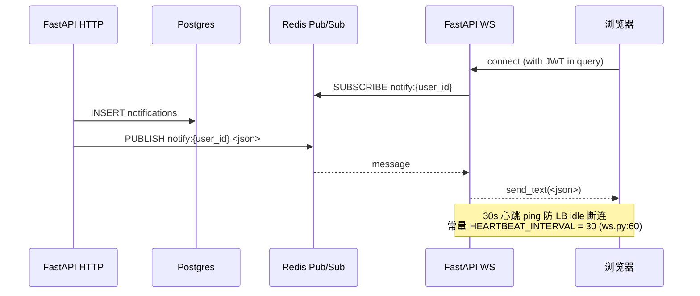
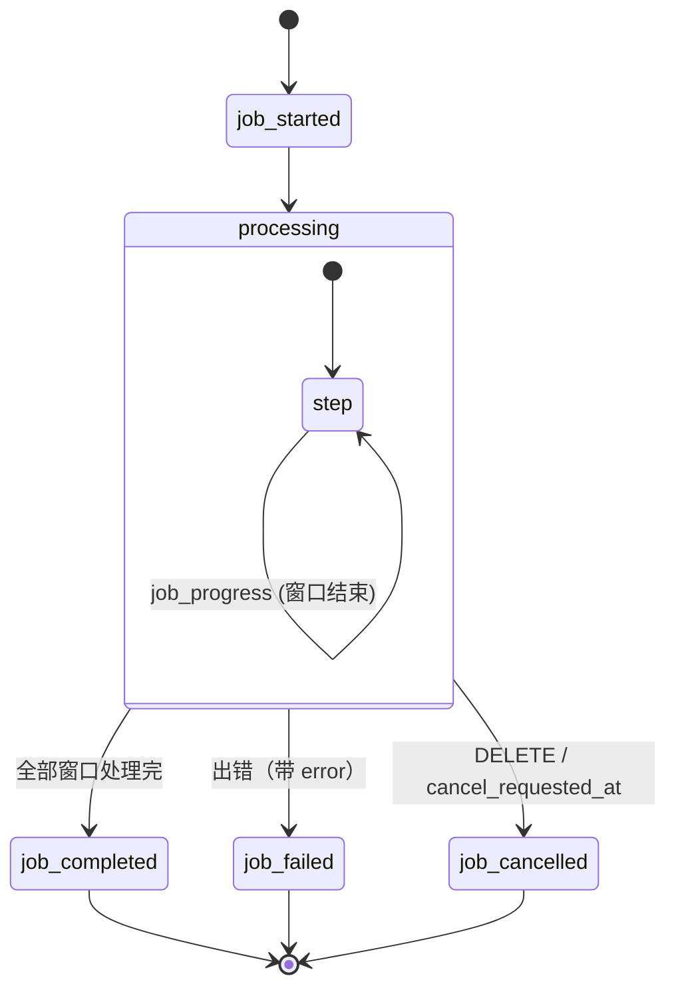

# WebSocket 协议

> 适用读者：要在前端订阅平台实时事件、或在第三方系统消费平台推送的工程师。
>
> 平台实现：`apps/api/app/api/v1/ws.py`、`apps/api/app/services/notification.py`、`apps/web/src/hooks/{useNotificationSocket,usePreannotation,useReconnectingWebSocket}.ts`。

平台目前公开 6 个 WS 频道，全部通过 Redis Pub/Sub 串接：HTTP 写表的同时 publish 到 Redis 频道，WS 端订阅 Redis 转发到客户端。所有持久化数据另有 REST 端点兜底（断线场景轮询即可），WS 仅是「在线推送」的快速通道。


```mermaid
sequenceDiagram
    participant API as FastAPI HTTP
    participant DB as Postgres
    participant Pub as Redis Pub/Sub
    participant WS as FastAPI WS
    participant Web as 浏览器

    Web->>WS: connect (with JWT in query)
    WS->>Pub: SUBSCRIBE notify:{user_id}
    API->>DB: INSERT notifications
    API->>Pub: PUBLISH notify:{user_id} <json>
    Pub-->>WS: message
    WS-->>Web: send_text(<json>)
    Note over WS,Web: 30s 心跳 ping 防 LB idle 断连<br/>常量 HEARTBEAT_INTERVAL = 30 (ws.py:60)
```

---

## 1. 端点总览

| 频道 | URL | 鉴权 | Redis 频道 | 用途 |
|---|---|---|---|---|
| 用户通知 | `/ws/notifications?token=<jwt>` | JWT (query param) | `notify:{user_id}` (`notification.py:27`) | 任务分配、AI 进度、导出完成、@提及 等 |
| 预标注进度（单项目） | `/ws/projects/{project_id}/preannotate` | 无（依赖 cookie 会话） | `project:{project_id}:preannotate` (`ws.py:80`) | 工作台单次自动预标注的逐 batch progress |
| Batch 状态广播 | `/ws/batches/project/{project_id}` | 无（项目内非机密） | `project:{project_id}:batch` (`ws.py:112`) | 项目级 batch 状态翻转事件（B-15），让标注员/admin 多端实时同步 |
| Prediction Jobs（全局） | `/ws/prediction-jobs?token=<jwt>` | JWT (query, `super_admin` / `project_admin`) | `global:prediction-jobs` (`ws.py:168`) | Topbar 徽章 + 切项目 toast 用，仅在 job 开始/结束/失败 3 时点带 `job_meta` 推一条 |
| 视频 tracker job | `/ws/video-tracker-jobs/{job_id}?token=<jwt>` | JWT (query)，并按 task 可见性校验 | `video-tracker-job:{job_id}` (`video_tracker_runner.py`) | 单条 tracker job 的 `job_started / job_progress / frame_result / job_completed / job_failed / job_cancelled` 事件 |
| ML Backend Stats | `/ws/ml-backend-stats?token=<jwt>` | JWT (query, `super_admin` / `project_admin`) | `ml-backend-stats:global` (`ws.py:246`) | Celery beat 每 1s 拉取 backend `/health` 快照后 publish；通过 `ml-backend-stats:subscribers` INCR/DECR 计数门控 — 0 订阅者时 beat 跳过实拉 |

base URL：`ws://<api-host>/ws/...` 或 `wss://...`。前端通过 `apps/web/src/hooks/useReconnectingWebSocket.ts` 处理重连。

---

## 2. `/ws/notifications`

### 2.1 鉴权

握手时必须在 query 参数携带 JWT：

```
ws://api.example.com/ws/notifications?token=eyJhbGciOi...
```

服务端 `decode_access_token` 校验 sub 字段（`ws.py:80-88`）。失败立刻关闭 frame，code = `1008 Policy Violation`。

> 为什么走 query 而不是 `Authorization` header：浏览器原生 `WebSocket` API 不允许设置自定义 header。如果前端用 `subprotocols` 走 token 也可以，但当前实现选 query 一致简单。HTTPS 下 query 字符串不进入 server access log（前端代理需配置脱敏）。

### 2.2 消息格式

服务端 → 客户端，JSON 文本帧。两种 type：

#### 业务消息（NotificationOut）

由 `NotificationService.notify` 写表后 publish（`notification.py:51-94`）：

```json
{
  "id": "<notification_uuid>",
  "type": "task.assigned" | "task.review_rejected" | "ai.preannotate_done" | "comment.mention" | ...,
  "target_type": "task" | "project" | "annotation" | ...,
  "target_id": "<uuid>",
  "payload": { ... },
  "created_at": "2026-05-06T08:30:00+00:00"
}
```

`type` 是开放枚举，由各业务模块定义（grep `NotificationService` 调用点可枚举）。前端不强校验未知 type，但只对已注册 type 显示 toast / 跳转。

#### 心跳（系统消息）

每 30s 服务端推一帧（`ws.py:33-43`）：

```json
{ "type": "ping" }
```

客户端**不需要**响应，只用来保活——防止反向代理（nginx 默认 60s `proxy_read_timeout`、AWS ALB 默认 60s idle）主动断连。前端 `useNotificationSocket` 收到 `type=="ping"` 时直接忽略，不触发 `invalidateQueries`（`useNotificationSocket.ts:38-39`）。

### 2.3 可靠性 — 断线兜底

WS 不保证 at-least-once。所有通知行已经 INSERT 到 `notifications` 表，断线时前端通过 `GET /api/v1/notifications` 轮询补齐：
- 默认前端 30s 一次轮询（即使 WS 在线）
- WS 重连成功后立即 `invalidateQueries(["notifications"])` 刷一次

业务方写代码：**永远先写表再 publish**，不要把 publish 当主路径。

---

## 3. `/ws/projects/{project_id}/preannotate`

### 3.1 鉴权

当前**没有**显式鉴权（`ws.py:48-67`）。依赖：
- 浏览器自动带 cookie / origin（同源策略）
- 反向代理层做 IP/origin 过滤
- 这是项目级频道，泄露 project_id 的进度不算敏感

> 如果你的部署需要更严的鉴权（比如多租户隔离），后续会迁到 query JWT 模式与 `/ws/notifications` 对齐。

### 3.2 消息格式

由 `app/workers/tasks.py:batch_predict` 在每 batch 结束时 publish：

```json
{
  "current": 12,
  "total": 50,
  "status": "running" | "completed" | "error",
  "error": "string"            // status="error" 时携带
}
```

进度 100% 时再发一帧 `status="completed"` 后频道结束。前端 `usePreannotationProgress`（`useNotificationSocket.ts:50-102` 区域内的同模块 hook）据此驱动进度条；收到 completed/error 后断开 WS。

### 3.3 心跳

此频道**没有心跳**——预标注任务通常 < 5 分钟，且每 batch 都会 push 一帧消息天然保活。如果你的 backend 单 batch 推理 > 60s，需要在前端 LB / nginx 把 `proxy_read_timeout` 调高（推荐 ≥ 120s）或者参考 `/ws/notifications` 的心跳模式补丁。

---

## 4. `/ws/batches/project/{project_id}`（v0.9.13+）

### 4.1 鉴权

与 `/ws/projects/{id}/preannotate` 一致：**无显式 JWT**。Batch 状态不属于机密信息，且项目内成员（含标注员）都需要感知状态翻转 (B-15)；限超管会丢失多端同步语义。生产环境通过反向代理的 origin / 内网 IP 过滤兜底。

### 4.2 消息格式

`BatchService.transition()` / `check_auto_transitions()` 在改 `TaskBatch.status` 后调 `publish_batch_status_change()` 推 `batch.status_changed`：

```json
{
  "type": "batch.status_changed",
  "batch_id": "<uuid>",
  "project_id": "<uuid>",
  "from_status": "in_progress",
  "to_status": "in_review",
  "actor_id": "<user_uuid>"
}
```

前端 `useBatchEventsSocket` 收到后 `queryClient.invalidateQueries(["batches", projectId])` 拉最新列表。

### 4.3 心跳

30s ping，同 `/ws/notifications`。

---

## 5. `/ws/prediction-jobs`（v0.9.8+，全局）

### 5.1 鉴权

JWT query param，且 `role` 必须是 `super_admin` 或 `project_admin`，否则握手前 close `1008`。

> 与 `/ws/projects/{id}/preannotate` 的关键区别：本端点**跨项目**，仅在 job 开始 / 结束 / 失败 3 时点带 `job_meta` 推一条；用于 Topbar 徽章 + 切换项目 toast。逐 batch 进度仍走单项目频道。

### 5.2 消息格式

由 worker 的 `_publish_progress` 在带 `job_meta` 时同时 publish 到 `global:prediction-jobs`：

```json
{
  "job_id": "<uuid>",
  "project_id": "<uuid>",
  "project_name": "演示项目-A",
  "status": "running" | "completed" | "failed" | "cancelled",
  "started_at": "...",
  "finished_at": "..."
}
```

### 5.3 心跳

30s ping。

---

## 6. `/ws/video-tracker-jobs/{job_id}`

### 6.1 鉴权

JWT query param，并按 task 可见性二次校验：服务端用 `decode_access_token` 拿 `user_id`，再用 `_assert_task_visible(task, user)` 检查角色 + 可见域；任一失败 close `1008`。

### 6.2 事件序列

publisher: `apps/api/app/services/video_tracker_runner.py`；channel: `video-tracker-job:{job_id}`。


```mermaid
stateDiagram-v2
    [*] --> job_started
    job_started --> processing
    state processing {
        [*] --> step
        step --> step: frame_result (每帧)
        step --> step: job_progress (窗口结束)
    }
    processing --> job_completed: 全部窗口处理完
    processing --> job_failed: 出错（带 error）
    processing --> job_cancelled: DELETE / cancel_requested_at
    job_completed --> [*]
    job_failed --> [*]
    job_cancelled --> [*]
```

文字版（事件按时间先后）：

```
job_started                            # 一次
  ↓
(job_progress + frame_result)*         # 多次，frame_result 与 job_progress 并发
  ↓
job_completed | job_failed | job_cancelled   # 一次，终止
```

事件类型与触发点：

| 事件 | 来源（行号） | 含义 |
|---|---|---|
| `job_started` | `video_tracker_runner.py:237` | tracker 进程已起，开始处理 |
| `job_progress` | `video_tracker_runner.py:333` | 阶段性进度更新（窗口/帧/检查点） |
| `frame_result` | `video_tracker_runner.py:327` | 单帧推理结果，包含框/掩码 payload |
| `job_completed` | `video_tracker_runner.py:354` | 正常结束 |
| `job_failed` | `video_tracker_runner.py:213` | 出错终止，带 `error` 字段 |
| `job_cancelled` | `video_tracker_runner.py:308,346` | 用户取消或外部信号中止 |

> 旧版文档曾列出 `queued / window_progress / window_completed` 等事件，**这些事件在当前实现中不存在**；如有依赖需迁移到上表中的事件名。

### 6.3 心跳

30s ping。

---

## 7. `/ws/ml-backend-stats`（v0.9.11+，PerfHud）

### 7.1 鉴权

JWT query param，`role ∈ {super_admin, project_admin}`，否则 close `1008`。

### 7.2 订阅计数门控

服务端在 `subscribe` 后立刻 `INCR ml-backend-stats:subscribers`，断开时 `DECR`（异常退出场景兜底 `max(0, ...)`）。Celery beat `publish_ml_backend_stats` 每 1s 启动前读这个键：**0 订阅者时直接 skip**，避免每秒空转 GPU 探活。

### 7.3 消息格式

`ml-backend-stats:global` 上是所有 `is_active=true` ML backend 的 `/health` 快照列表：

```json
[
  {
    "backend_id": "<uuid>",
    "name": "grounded-sam2",
    "status": "healthy" | "degraded" | "down",
    "meta": { /* health_meta 见 ml-backend-protocol.md */ }
  }
]
```

### 7.4 心跳

30s ping。

---

## 8. 前端重连策略

`apps/web/src/hooks/useReconnectingWebSocket.ts` 是所有 WS 用法的基础：

- 初始重连间隔 **1s**，每次失败 ×2，上限 **30s**（`useReconnectingWebSocket.ts:18,31`）
- 最多重试 **8 次**（`useReconnectingWebSocket.ts:80-82`），超过后 silent fail（用户重新登录或手动刷新页面恢复）
- onOpen 回调可用于 `invalidateQueries` 补齐断线期间的状态

接入方实现自定义客户端时，建议遵循同样的 backoff，避免风暴。

### 8.1 鉴权过期重连

`useNotificationSocket` 在 `onclose` 收到 `1008`（policy violation）或 `4001`（自定义鉴权失败）时，主动调 `POST /auth/refresh` 用旧 token 换新 token：

```
ws.onclose code=1008
   ↓
authApi.refresh()         // 旧 token grace 期 7 天内有效
   ↓ success
authStore.setToken(new)
scheduleRetry()           // 用新 token 重连
   ↓ failure (401)
client.ts 已自动 logout()  // 路由层会跳 /login
```

关键点：

- **后端关闭码必须是 1008**（`apps/api/app/api/v1/ws.py:87` 用 `WS_1008_POLICY_VIOLATION`），其他 close code 走原有指数退避，不调 refresh。
- **同一次过期只调一次 refresh**：hook 内 `refreshing` flag 防止重连风暴打 `/auth/refresh` 限流（5/min）。
- **refresh 端点详细规约**：见 [ADR-0011](../adr/0011-websocket-token-reauth)。

---

## 9. Redis ConnectionPool

服务端使用模块级共享 `ConnectionPool`（`ws.py:17-30`），`max_connections=200`。多副本部署时每副本 200 上限——如果你的 WS 副本数 ×200 接近 Redis 实例的 `maxclients`（默认 10000），调小 `max_connections` 或加 Redis 实例。

`close_redis_pool()` 在 lifespan shutdown 时带 2s timeout `disconnect(inuse_connections=True)`，让悬挂 WS 收到 abnormal closure（1006）后走自带的指数退避重连；进程退出后内核回收剩余 socket。

---

## 10. 扩展新频道（开发者 how-to）

新增一个 WS 频道大致 4 步：

1. **定义 Redis 频道命名**：放到对应 service 模块顶部（参考 `notification.py:27` 的 `channel_for(user_id)`）。
2. **写 publisher**：在 HTTP 端点或 Celery worker 里写表 + `r.publish(channel, json.dumps(payload))`。务必先写持久层，再 publish——否则订阅者拿到推送时 GET 兜底端点还查不到记录。
3. **写 WS 端点**：`@router.websocket("/ws/...")`，accept → SUBSCRIBE → 转发循环 → finally UNSUBSCRIBE。复制 `ws.py:notifications_socket` 模板即可，注意：
   - 鉴权写在 `accept` 之前；失败用 `await websocket.close(code=1008)`，不要先 accept 再 close（会被 LB 当成正常关闭）
   - 长生命周期频道补 `_heartbeat_loop` 防 LB idle
   - 用模块级 `_get_redis_pool()`，不要每连接 `aioredis.from_url`（连接数会爆）
4. **写前端 hook**：基于 `useReconnectingWebSocket`，参考 `useNotificationSocket.ts`。重连后 `invalidateQueries` 拉兜底数据。

加到本文档 §1 端点表，并在 PR 描述里附上抓包样本。

---

## 11. 关键文件索引

| 主题 | 路径 |
|---|---|
| WS 端点 | `apps/api/app/api/v1/ws.py` |
| Notification 服务 + publish | `apps/api/app/services/notification.py` |
| Notification 表 | `apps/api/app/db/models/notification.py` |
| 自动预标注 worker | `apps/api/app/workers/tasks.py` |
| Notification 兜底 REST | `apps/api/app/api/v1/notifications.py` |
| 前端通知 hook | `apps/web/src/hooks/useNotificationSocket.ts` |
| 前端预标注 hook | `apps/web/src/hooks/usePreannotation.ts` |
| 前端重连基础 | `apps/web/src/hooks/useReconnectingWebSocket.ts` |
