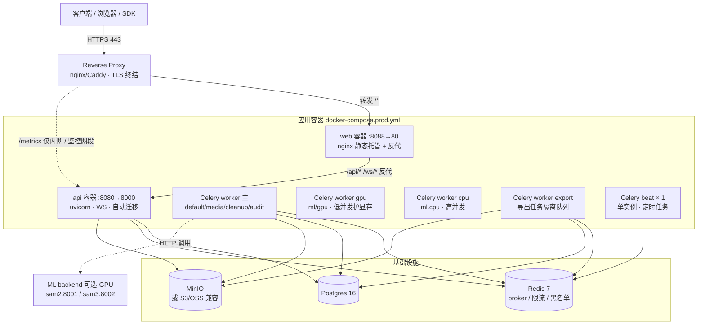

# 生产部署（Docker Compose）

> 适用读者：第一次把平台搬到 staging / production 的运维或开发者。本机开发部署见[开发部署（本地）](/ops/deploy/development)，不确定去哪先看[部署总览](/ops/deploy/)。
>
> 当前部署形态：叠加 `docker-compose.prod.yml` 把 **api / web 容器化**（api 镜像 entrypoint 自动跑迁移 + uvicorn，web 镜像 nginx 托管构建产物 + 反代），基础设施（PG / Redis / MinIO / Celery）沿用基础 `docker-compose.yml`。完整 K8s / Terraform 模板暂未维护。不走容器、改 systemd 进程式跑 api/web 的替代路径见 §4.5。
>
> 想先理解开发态 / staging / 生产态的整体差异（谁进容器、profile、`ENVIRONMENT` 断言行为），先读[运行环境形态](/dev/concepts/runtime-environments)。
>
> 端口暴露 / 防火墙 / 远程 SDK 安全访问独立成篇：[端口暴露与网络安全](/ops/deploy/network-security)。

---

## 1. 拓扑



> **Celery beat 必须单实例**：worker 可水平扩多副本，但 beat 多实例会重复触发定时任务（见 §4.2），漏了它则审计归档、PerfHud、ml health 等全部静默失效。

最小生产部署：1 台 4C8G + 1 个独立 PG 实例（托管 RDS 优先）。

---

## 2. 环境变量

平台通过 pydantic-settings 加载，源文件：`apps/api/app/config.py`。本节按 [`.env.example`](https://github.com/yyq19990828/ai-annotation-platform/blob/main/.env.example) 的分块结构介绍；标 **必填** 的在 `ENVIRONMENT=production` 启动时会触发断言失败。

> 生产部署：基于 `.env.example` 复制 `.env.production`，逐项审过再启动。`config.py` 里有几个未列入 `.env.example` 的可选项，统一在 §2.10 兜底。

### 2.1 数据库 (PostgreSQL)

| 变量 | 默认 | 说明 |
|---|---|---|
| `DATABASE_URL` **必填** | dev 连本机 | asyncpg 连接串，格式 `postgresql+asyncpg://用户名:密码@主机:端口/库`。驱动必须 `postgresql+asyncpg`；托管库走 SSL 用 `?ssl=require`（asyncpg **不认** `sslmode=`）。密码含特殊字符要 URL 编码（`@`→`%40`）。生产用托管 RDS / Cloud SQL 优先。 |
| `POSTGRES_USER` / `POSTGRES_PASSWORD` / `POSTGRES_DB` | `user` / `pass` / `annotation` | 仅 `docker-compose.yml` 的 postgres 容器初始化用，后端不读。**沿用 compose 自带 postgres 时**生产须设强凭据，且与 `DATABASE_URL` 的用户名/密码/库名一致；用托管库时忽略。 |

容器化生产由 api 镜像 entrypoint（`apps/api/scripts/entrypoint.sh`）在启动时**自动** `alembic upgrade head`，无需手动跑。进程式部署才需手动 `uv run alembic upgrade head`（见 §4.5）。

### 2.2 缓存 / 消息队列 (Redis)

| 变量 | 默认 | 说明 |
|---|---|---|
| `REDIS_URL` **必填** | `redis://localhost:6379/0` | 同时承担：Celery broker、result backend、WebSocket pub/sub、限流计数、token 黑名单，无需单独配置。 |
| `CELERY_BROKER_URL` | 空 → 复用 `REDIS_URL` | 想拆开 broker（如换 RabbitMQ）时单独设。 |

> Redis 建议为生产挂 AOF volume——dev 容器**没**挂 volume，重启即清空所有队列与限流计数。详见 [后端基础设施](/dev/concepts/backend-infrastructure)。

### 2.3 对象存储 (MinIO / S3 兼容)

| 变量 | 默认 | 说明 |
|---|---|---|
| `MINIO_ENDPOINT` **必填** | `localhost:9000` | host:port，**不含**协议前缀。S3 / OSS 走兼容协议时填它们的 endpoint。 |
| `MINIO_ACCESS_KEY` **必填** | `minioadmin` | 等价 AWS Access Key ID。 |
| `MINIO_SECRET_KEY` **必填** | `minioadmin` | 生产**必须**换。 |
| `MINIO_BUCKET` | `annotations` | 主标注文件桶（图像 / 视频帧）。 |
| `MINIO_DATASETS_BUCKET` | `datasets` | 上传 dataset 桶。 |
| `MINIO_BUG_REPORTS_BUCKET` | `bug-reports` | bug 反馈附件桶。 |
| `MINIO_DATA_DIR` | `miniodata` | Compose 的 MinIO `/data` 来源；可设宿主机绝对路径改为 bind mount。切换只改变挂载位置，不会自动迁移旧卷数据，切换前先停服务并复制 / 校验数据。 |
| `MINIO_PUBLIC_URL` | 空 | 客户端拿 presigned URL 时走的外网地址；与 `MINIO_ENDPOINT` 不同时必填（容器内/外网络两层视角）。 |
| `MINIO_USE_SSL` | `false` | 生产建议 `true`（即便 LB 终结 TLS，到对象存储一段也建议加密）。 |
| `ML_BACKEND_STORAGE_HOST` | 空 | dev 桥接：api 跑 host 进程时，docker 内的 ML backend 不能 hit `localhost:9000`。Linux `172.17.0.1:9000` / macOS `host.docker.internal:9000`；K8s 同 namespace 留空。 |
| `ML_BACKEND_DEFAULT_URL` | 空 | ML Backend 注册表单 URL 预填值，避免运维手敲；K8s 设 service DNS 即可。 |

### 2.4 认证 / 安全

| 变量 | 默认 | 说明 |
|---|---|---|
| `SECRET_KEY` **必填** | `change-this-...` | JWT 签名密钥，≥ 32 字节随机串。`ENVIRONMENT=production` 仍是默认值时启动会 RuntimeError（`apps/api/app/main.py:50-57`）。生成：`python -c "import secrets; print(secrets.token_hex(32))"`。 |
| `ALLOW_OPEN_REGISTRATION` | `false` | 自助注册开关，可在 SettingsPage 热更新覆盖。 |
| `REQUIRE_EMAIL_VERIFICATION` | 空（按环境派生） | 开放注册是否强制邮箱验证。留空时 production 默认开、dev/staging 默认关；显式 `true`/`false` 覆盖。开启后注册需点邮件链接验证才能登录，邀请注册恒视为已验证。依赖 SMTP 配置（未配时验证链接仅写日志）。 |
| `TURNSTILE_ENABLED` | `false` | Cloudflare Turnstile CAPTCHA。开启后 `/auth/register-open` `/auth/forgot-password` 必须带 `captcha_token`。 |
| `TURNSTILE_SITE_KEY` / `TURNSTILE_SECRET_KEY` | 空 | 启用 Turnstile 时配套；secret 绝不暴露给前端。 |
| `AUDIT_RETENTION_MONTHS` | `12` | 冷数据保留月数。Celery beat 每月 2 日把超期 partition 归档为 `audit-archive/{YYYY}/{MM}.jsonl.gz` 上 MinIO 后 DROP。 |
| `ACCESS_TOKEN_EXPIRE_MINUTES` | `1440`（24h） | 未列入 `.env.example`；高敏环境调到 `480`（8h）。 |

### 2.5 前端

> 前端 API base 是硬编码的同源相对路径 `/api/v1`（`apps/web/src/api/client.ts`），**不读 `VITE_API_URL`**——dev 由 vite proxy、生产由 web 容器内 nginx 反代 `/api/`→`api:8000`，故无需构建时注入 API 地址。

| 变量 | 默认 | 说明 |
|---|---|---|
| `VITE_TURNSTILE_SITE_KEY` | 空 | 与后端 `TURNSTILE_SITE_KEY` 一致；空则注册页不渲染 widget。 |
| `VITE_SENTRY_DSN` | 空 | 前端 Sentry DSN；留空禁用前端错误上报。 |
| `FRONTEND_BASE_URL` | `http://localhost:5173` | 后端在邮件 / 邀请链接里回跳到这个 origin；生产必改成实际域名。 |

### 2.6 错误监控 (Sentry)

| 变量 | 默认 | 说明 |
|---|---|---|
| `SENTRY_DSN` | 空 | 后端 DSN；留空完全不启用 SDK（不会偷偷上报）。 |
| `SENTRY_ENVIRONMENT` | `development` | 环境标签 → Sentry 看板按 `development / staging / production` 分组。 |
| `SENTRY_TRACES_SAMPLE_RATE` | `0.1` | 性能追踪采样率（0–1）。流量大时按比例降。 |

> production 启动若 `ENVIRONMENT=production` 但 `SENTRY_DSN` 为空，lifespan 会打 WARN（不阻断启动），便于 Sentry 失踪不悄悄发生。

### 2.7 跨域 (CORS)

| 变量 | 默认 | 说明 |
|---|---|---|
| `CORS_ALLOW_ORIGINS` **production 必填** | dev 默认放行 localhost 常用端口 | 支持 JSON 数组 `["https://app.example.com"]` 或逗号分隔。即便前后端同源也要显式列；`main.py:71-74` 启动断言。 |
| `CORS_ALLOW_ORIGIN_REGEX` | dev `http://localhost:\d+` | 仅 `dev / staging` 生效，production 自动忽略以防误把本机正则上线。 |

### 2.8 Grounded-SAM-2 ML Backend (GPU profile)

仅当启用 `docker-compose.ml.yml` 的 `--profile gpu` 拉起 grounded-sam2-backend 时生效。详见 §8.5。

| 变量 | 默认 | 说明 |
|---|---|---|
| `SAM_VARIANT` | `tiny` | 精度 / 显存递增：`tiny` → `small` → `base_plus` → `large`（4060 8G 选 tiny）。 |
| `DINO_VARIANT` | `T` | `T`（Swin-T 默认）/ `B`（Swin-B 更准但显存翻倍）。 |
| `BOX_THRESHOLD` | `0.35` | DINO 检测阈值；召回不足 → `0.25`，误检多 → `0.45`。 |
| `TEXT_THRESHOLD` | `0.25` | DINO 文本-标签匹配阈值；短语 prompt 一般 0.25 即可。 |
| `GSAM2_LOG_LEVEL` | `INFO` | `DEBUG / INFO / WARNING`。 |
| `MODEL_POOL_CAP` | `1` | 同容器内并存的 `(sam_variant, dino_variant)` 变体数上限（LRU 驱逐）。`1` = 维持单变体常驻；切变体走「驱逐旧 + 冷启新」。按显存预算调，见下表。 |
| `MODEL_POOL_BUILD_TIMEOUT` | `30` | pool 满 + 并发 miss 时排队等显存腾挪的超时（秒），超时返回 503「显存繁忙，稍后重试」。 |
| `PREFETCH_SAM_VARIANTS` | `tiny,small,base_plus,large` | entrypoint 启动时额外预拉的 SAM 变体 checkpoint（主变体 `SAM_VARIANT` 之外）。逗号分隔。pool 能服务多变体，但只有这里声明（+ 主变体）的 checkpoint 会落盘，**运行期请求未预拉的变体返回 503**。磁盘紧张时裁剪。 |
| `PREFETCH_DINO_VARIANTS` | `T,B` | 同上，GroundingDINO 变体。 |
| `IDLE_UNLOAD_SECONDS` | `600` | 空闲 N 秒后自动卸载模型释放显存；`<=0` 关闭定时卸载（仍可手动 `POST /unload`）。 |
| `IDLE_CHECK_INTERVAL` | `60` | 上面空闲判断的轮询间隔（秒）。 |
| `VIDEO_MODEL_POOL_CAP` | `1` | v0.10.35 · sam2_video tracker 的**独立**显存池上限，与图片池预算分离、互不驱逐。 |
| `VIDEO_MODEL_POOL_BUILD_TIMEOUT` | `60` | video 池满 + 并发 miss 时排队等显存的超时（秒）。 |
| `VIDEO_TRACKER_MAX_WINDOW_FRAMES` | `300` | 单次 `init_state` 一次性加载的最大帧数（安全上限，防超长窗口灌爆显存）。 |
| `VIDEO_IDLE_UNLOAD_SECONDS` | `600` | video 池独立 idle 卸载（与图片池 `IDLE_UNLOAD_SECONDS` 各自计时）；`<=0` 关闭。 |

> **多变体 checkpoint 预拉**：ModelPool 让运行期能切任意 `(sam_variant, dino_variant)`，但 checkpoint 必须先落盘。磁盘预算大致 `tiny ~150M / small ~180M / base_plus ~320M / large ~900M`，DINO `T ~680M / B(SwinB) ~940M`；全量约 3.2GB。
>
> 启动顺序（避免全量 ~3GB 阻塞期间容器对外 `error`）：entrypoint 只**阻塞**下载主变体（`SAM_VARIANT`/`DINO_VARIANT`，单档、秒级）→ uvicorn 立即起、`/health` 可达 → app startup 后台异步下载 `PREFETCH_*` 列表里的额外变体（边服务边补）。`/health.provisioning.status` 反映进度：`downloading`（额外变体下载中，容器仍 healthy）→ `ready`（全下完）/ `partial`（部分失败）/ `error`。下载期间请求尚未下完的变体返回 503（可诊断），主变体始终可用。主变体下载失败则容器启动失败（不带半残上线）；额外变体失败仅 warn 不阻塞。
>
> **按显存预算配 `MODEL_POOL_CAP`**：变体热切换让前端可按会话切 `(sam_variant, dino_variant)`，pool 把多个变体常驻显存以省冷启。cap 越大并存越多、切换越快，但显存占用线性上升（单变体 tiny/small ~2–4GB，large + SwinB 峰值 ~6–8GB）。
>
> | GPU | 显存 | 建议 `MODEL_POOL_CAP` | 说明 |
> |---|---|---|---|
> | RTX 4060 | 8G | `1` | 仅够单变体常驻；切变体冷启 1–3s，可接受。 |
> | RTX 3090 | 24G | `1–2` | 2 时 tiny/large 可并存，切换无冷启。 |
> | A100 | 40/80G | `2–4` | 多变体并存，团队多人并发切换最顺。 |
>
> cap 设过大触发 OOM 时，pool 在驱逐前先腾位（驱逐到 cap-1 再 build 新变体），并发 miss 排队超 `MODEL_POOL_BUILD_TIMEOUT` 返回 503 而非 OOM。保守起步用 `1`，观察 `/health.pool.evict_count` 与显存占用再调高。

### 2.8.1 SAM 3 ML Backend (gpu-sam3 profile)

v0.10.0+ 的高精度 backend（`facebookresearch/sam3` + `facebook/sam3.1` 权重），独立 profile `gpu-sam3`，与 grounded-sam2 的 `gpu` profile 解耦、两者可并存（sam3 高精度首选，grounded-sam2 4060 友好兜底）。仅当启用 `docker-compose.ml.yml` 的 `--profile gpu-sam3` 拉起 sam3-backend 时生效，监听 `8002`。

| 变量 | 默认 | 说明 |
|---|---|---|
| `HF_TOKEN` **必填** | 空 | sam3（图像）与 sam3.1（视频，预留）权重均为 gated repo（合计 ~6.6GB），首次启动下载必须带；`start_period=180s`。 |
| `SAM3_DOWNLOAD_VIDEO` | `1` | 启动时是否下载 sam3.1 视频权重与 config；设 `0` 可只运行图像能力，但 `sam3_video*` 调用会不可用。 |
| `SAM3_EMBEDDING_CACHE_SIZE` | `32` | 图像 embedding LRU 缓存条数。 |
| `SAM3_SCORE_THRESHOLD` | `0.5` | 检测置信度阈值；召回不足下调、误检多上调。 |
| `SAM3_LOG_LEVEL` | `INFO` | `DEBUG / INFO / WARNING`。 |
| `SAM3_IDLE_UNLOAD_SECONDS` | `600` | 空闲 N 秒自动卸载释放显存（sam3 ~7GB FP16，与 grounded-sam2 并存时强烈建议保留）；`<=0` 关闭。前缀与 grounded-sam2 的 `IDLE_*` 解耦，可独立调。 |
| `SAM3_IDLE_CHECK_INTERVAL` | `60` | 空闲判断轮询间隔（秒）。 |
| `SAM3_GPU_DEVICE_ID` | `1` | Compose 绑定的物理 GPU。默认与其它 backend 错开到卡 1；单卡机器必须改为 `0`。每个 backend 只能绑定一个 GPU/MIG，多值或已暴露 GPU 的 `all` 会在启动时被拒绝。 |

> 镜像基础 `pytorch/pytorch:2.7.1-cuda12.8-cudnn9-devel`（比 grounded-sam2 的 2.3.1-cuda12.1 更新，注意宿主 nvidia 驱动需支持 CUDA 12.8）。`docker-compose.ml.yml` 会显式透传 `SAM3_DOWNLOAD_VIDEO`；修改 `.env` 后需 recreate `sam3-backend`。

### 2.9 部署环境

| 变量 | 默认 | 说明 |
|---|---|---|
| `ENVIRONMENT` **必填** | `development` | `development / staging / production`。决定多个安全开关：CORS 严格断言、SECRET_KEY 默认值检测、Sentry 缺失告警、CORS regex 是否生效等。 |

### 2.10 未列入 `.env.example` 的可选项

`config.py` 支持但 `.env.example` 没列出，按需在 `.env.production` 显式添加：

| 变量 | 默认 | 何时改 |
|---|---|---|
| `MAX_INVITATIONS_PER_DAY` | `30` | 邀请活动期临时调高 |
| `INVITATION_TTL_DAYS` | `7` | 合规要求短链 → `1–3` |
| `ML_PREDICT_TIMEOUT` | `100` 秒 | LLM 慢 backend 调到 ≥ 180 |
| `ML_HEALTH_TIMEOUT` | `10` 秒 | 通常不需动；冷启动慢的 backend 适当上调 |
| `AUDIT_ASYNC` | `true` | broker 故障时回退 `false`（强一致但慢） |
| `TASK_EVENTS_ASYNC` | `true` | 同上，针对 task event 流 |
| `OFFLINE_THRESHOLD_MINUTES` | `5` | 在线状态心跳判断窗口 |
| `LOGIN_CAPTCHA_THRESHOLD` | `5` | 同 IP 登录失败几次后强制 Turnstile |
| `LOGIN_FAILED_WINDOW_SECONDS` | `3600` | 上面失败计数的窗口长度 |
| `SMTP_HOST` `SMTP_PORT` `SMTP_USER` `SMTP_PASSWORD` `SMTP_FROM` | 空 | 启用密码重置邮件 / bug digest 时配齐 |

---

## 3. 反向代理（nginx 示例）

> **容器化生产（§4.1 标准路径）**：web 容器内的 nginx 已经做了「托管静态产物 + 反代 `/api/` `/ws/`→`api:8000`」。所以**外层反代只需把 443 整体转发到 web 容器**（宿主 `8088`）：`location / { proxy_pass http://127.0.0.1:8088; }` 加下面的 WS 头与超时即可，**不必**自己托管静态或单独反代 `/api/`。唯一例外是 `/metrics`——它在 api 容器（宿主 `8080`），需单独 `location /metrics { allow ...; proxy_pass http://127.0.0.1:8080; }` 并限内网。
>
> 下面这份是**进程式部署 / 精细化外层反代**的完整示例（外层 nginx 自己托管静态、按 path 反代到 uvicorn）。容器化时按上面那段简化。

```nginx
upstream anno_api { server 127.0.0.1:8000; }

server {
    listen 443 ssl http2;
    server_name app.example.com;
    ssl_certificate     /etc/letsencrypt/live/app.example.com/fullchain.pem;
    ssl_certificate_key /etc/letsencrypt/live/app.example.com/privkey.pem;

    # WS 长连接（防 LB 把心跳间隔的连接踢掉）
    location /ws/ {
        proxy_pass http://anno_api;
        proxy_http_version 1.1;
        proxy_set_header Upgrade $http_upgrade;
        proxy_set_header Connection "upgrade";
        proxy_set_header X-Forwarded-For $proxy_add_x_forwarded_for;
        proxy_read_timeout 300s;        # > 30s 心跳
    }

    location /api/ {
        proxy_pass http://anno_api;
        proxy_set_header X-Forwarded-For $proxy_add_x_forwarded_for;
        proxy_set_header X-Real-IP $remote_addr;
        client_max_body_size 256m;       # 上传图像/分片
    }

    # 内网 only
    location /metrics {
        allow 10.0.0.0/8;
        deny all;
        proxy_pass http://anno_api;
    }

    location / {
        root /var/www/anno;
        try_files $uri /index.html;
    }
}
```

注意：
- `proxy_read_timeout` 必须 ≥ WS 心跳间隔（30s，`apps/api/app/api/v1/ws.py:33`）。建议 300s 给一定缓冲。
- `X-Forwarded-For` 是必传——审计日志的 IP 字段从这里拿（`apps/api/app/services/audit.py:69-77`）。
- Web 静态资源上 `Cache-Control: public, max-age=31536000, immutable` 给 hashed assets，HTML 走 `no-cache`。

---

## 4. 启动顺序

### 4.1 一键拉起（容器化生产标准路径）

```bash
docker compose --env-file .env.production \
  -f docker-compose.yml -f docker-compose.prod.yml up -d --build
```

这一条命令做完整套生产部署：

- **构建并起 api 容器**（`infra/docker/Dockerfile.api`）：entrypoint `apps/api/scripts/entrypoint.sh` 先 `alembic upgrade head`，再 exec uvicorn（`--host 0.0.0.0 --port 8000`，宿主映射 `8080:8000`）。**迁移自动跑，无需手动**。
- **构建并起 web 容器**（`infra/docker/Dockerfile.web`，多阶段）：`pnpm build` 产物交容器内 nginx 托管，nginx 反代 `/api/` `/ws/`→`api:8000`（`infra/docker/nginx.conf`），宿主映射 `8088:80`。
- **celery-worker / celery-worker-gpu / celery-worker-cpu / celery-worker-export / celery-beat** 改用生产配置（`env_file: .env.production` + inline 覆盖基础文件硬编码的 dev infra 凭据）。

两个 `-f` 与 `--env-file .env.production` **都不可省**：前者把 prod 叠加文件合进来才会容器化 api/web，后者是 worker 用 `${VAR}` 覆盖 dev 凭据的插值源（原理见[运行环境形态](/dev/concepts/runtime-environments)）。

跑完后栈内共 11 个容器：postgres / redis / minio / mailpit / api / web / celery-worker / celery-worker-gpu / celery-worker-cpu / celery-worker-export / celery-beat。GPU backend（profile `gpu` / `gpu-sam3`）与监控（profile `monitoring`）按需单独启用；mailpit 是 dev SMTP 收件箱，**生产应禁用并改真实 SMTP**（见 §2.10）。

> 宿主端口 `8080`（api）/ `8088`（web）只供外层反代转发，**绝不直接暴露公网**。prod 叠加文件默认把它们绑在宿主回环 `127.0.0.1`（`${PROXY_BIND_HOST:-127.0.0.1}`）——外层反代同机时开箱即安全；反代在**别的机器**时于 `.env.production` 设 `PROXY_BIND_HOST=<内网IP>`（勿用 `0.0.0.0`）。详见[端口暴露与网络安全](/ops/deploy/network-security)。

### 4.2 Celery 队列与 beat（容器已配好，理解即可）

worker/beat 容器已在 `docker-compose.yml` 定义、由 §4.1 一并拉起，下面是排障时需要的背景。

预标任务按模型自报的 `resource_profile.device` 做**设备感知队列路由**，worker 按设备分组消费（少订阅一个队列 → 该队列任务静默堆积）：

- **主 worker（`celery-worker`）** 订阅通用队列：
  - `default` — 兜底队列（`task_default_queue`）、PerfHud 推送、心跳、在线状态、分区维护等
  - `media` — 图像/视频转码、缩略图、视频帧
  - `cleanup` — 软删清理、效率看板物化视图刷新、DuckDB 同步
  - `audit` — 审计日志 / task event 批量入库
- **GPU worker（`celery-worker-gpu`）** 订阅 `ml`（自动预标注 / 模型调用，整条 pipeline 任一阶段 device=gpu 或未自报即落此）+ `gpu`（视频目标追踪）；并发默认 `CELERY_GPU_CONCURRENCY=2`，**低并发护显存**。
- **CPU worker（`celery-worker-cpu`）** 订阅 `ml.cpu`（整条 pipeline 全部 device=cpu 的预标任务）；并发默认 `CELERY_CPU_CONCURRENCY=4`，可较高。
- **导出 worker（`celery-worker-export`）** 订阅 `export`（导出大任务资源隔离，不拖累预标 / 媒体）。

队列名经 `PREANNOTATE_GPU_QUEUE`（默认 `ml`）/ `PREANNOTATE_CPU_QUEUE`（默认 `ml.cpu`）配置；改名须同步各 worker 的 `-Q`，否则任务静默积压。device 未自报的老 backend / 混合 device 的 pipeline 一律保守落 `ml`（GPU 队列），与拆分前行为等价、零退化。

**Celery beat（`celery-beat`，必须单实例，v0.9.11）**：定时任务调度（审计 partition 月度归档、PerfHud 推送、ml health 巡检等）。worker 可水平扩多副本（`docker compose up -d --scale celery-worker=N`），但 **beat 多实例会重复触发，绝不能扩副本**。漏了 beat 不报错，但所有定时任务静默不跑。

### 4.3 首个 super_admin（bootstrap_admin）

平台没有「第一个用户自动当管理员」的逻辑。第一次部署后在 api 容器内跑一次（依赖已 `--system` 装在镜像里，可直接 `python -m`）：

```bash
docker compose -f docker-compose.yml -f docker-compose.prod.yml exec \
  -e ADMIN_EMAIL=ops@your-org.com \
  -e ADMIN_PASSWORD='set-a-strong-one' \
  -e ADMIN_NAME='平台管理员' \
  api python -m scripts.bootstrap_admin
```

脚本：[`apps/api/scripts/bootstrap_admin.py`](https://github.com/yyq19990828/ai-annotation-platform/blob/main/apps/api/scripts/bootstrap_admin.py)。
- 已存在同邮箱用户时跳过（不更新角色）
- 写一行 `audit_logs.action = system.bootstrap_admin`，可在 SettingsPage 审计日志页搜索追溯
- **跑完后立即从 shell history 清除明文密码**，并要求该账号首次登录后改密

### 4.4 升级时重新构建

`git pull` 后镜像不会自动更新，需带 `--build` 重新拉起（entrypoint 会自动跑新迁移）：

```bash
docker compose --env-file .env.production \
  -f docker-compose.yml -f docker-compose.prod.yml up -d --build
```

rebuild 与 restart 的判断规则见[升级指南](/ops/upgrade-guide)。

### 4.5 进程式部署（替代路径，不走容器）

如果不容器化 api/web（例如裸机 + systemd），改为手动跑进程；此时迁移要自己跑：

```bash
# API
cd apps/api
uv sync
uv run alembic upgrade head
uv run uvicorn app.main:app --host 0.0.0.0 --port 8000 --workers $(($(nproc) * 2 + 1))

# Celery（主 / GPU / CPU / 导出 worker + beat，beat 务必单实例）
uv run celery -A app.workers.celery_app worker -l info -Q default,media,cleanup,audit --concurrency=4
uv run celery -A app.workers.celery_app worker -l info -Q ml,gpu --concurrency=2
uv run celery -A app.workers.celery_app worker -l info -Q ml.cpu --concurrency=4
uv run celery -A app.workers.celery_app worker -l info -Q export --concurrency=2
uv run celery -A app.workers.celery_app beat -l info --schedule=/tmp/celerybeat-schedule

# Web：构建静态产物后交给宿主机 nginx 托管
pnpm install --filter @anno/web
pnpm --filter @anno/web build
# 把 apps/web/dist/ rsync 到 nginx 的 root 目录；nginx 反代 /api/ /ws/→后端（参考 infra/docker/nginx.conf）
```

前端调用硬编码同源 `/api/v1`，无需构建时配 API 地址；用 systemd 管理各进程、`--workers` 取 `nproc*2+1`。基础设施仍走 `docker compose up -d postgres redis minio`。

---

## 5. 备份与恢复

### 5.1 Postgres

按业务重要度分级：

```bash
# 每日全量（保留 14 天）
pg_dump -Fc -U user -d annotation -f /backup/anno-$(date +%F).pgdump

# WAL 归档（点位恢复）
# postgresql.conf: archive_mode=on, archive_command='cp %p /backup/wal/%f'
```

恢复：
```bash
pg_restore -U user -d annotation_new -j 4 /backup/anno-2026-05-06.pgdump
```

> `audit_logs` 上有 `BEFORE UPDATE/DELETE` 触发器拒绝改写（`apps/api/alembic/versions/0032_audit_log_immutability.py`）。pg_restore 走 COPY，不会被触发器阻断。

### 5.2 MinIO 桶

```bash
# 用 mc client（或 aws s3 sync）按桶同步到异地
mc mirror anno/annotations s3-backup/anno/annotations
mc mirror anno/datasets    s3-backup/anno/datasets
```

桶名见 `MINIO_BUCKET` / `MINIO_DATASETS_BUCKET`（默认 `annotations` / `datasets`）。

### 5.3 Redis

不需要持久备份——Redis 当前只装：
- Celery 队列（短暂）
- 限流计数（5 分钟窗口）
- token 黑名单（≤ token 剩余有效期）
- 通知 Pub/Sub（瞬时）

崩溃影响：用户当下需重新登录、断线 30s 内 publish 的通知可能丢失（兜底 GET 端点会补齐）。

### 5.4 卷存储位置（命名卷 vs 宿主机统一前缀）

`docker-compose.yml` 默认用 **Docker 托管的命名卷**（`pgdata` / `miniodata` / 模型权重 / 监控），数据落在 `/var/lib/docker/volumes/<project>_<vol>`。想把它们集中到宿主机一个统一目录（便于备份、迁移、放到指定磁盘），叠加 `docker-compose.hostvols.yml`：

```bash
export DATA_ROOT=/srv/annotation-data   # 绝对路径
# bind 目录须先建好，Docker 不会自动 mkdir：
mkdir -p "$DATA_ROOT"/{pgdata,minio,gsam2-checkpoints,gsam2-hf-cache,sam3-checkpoints,sam3-hf-cache,prometheus,grafana}
docker compose -f docker-compose.yml -f docker-compose.hostvols.yml up -d
```

不挂这个文件时行为完全不变（仍是命名卷）。想免去每次敲 `-f`，在 `.env` 设 `COMPOSE_FILE=docker-compose.yml:docker-compose.hostvols.yml`。

> 切换不会自动迁移数据：从命名卷转 bind 前，先 `docker compose stop`，把旧卷内容（`docker volume inspect <vol>` 查 `Mountpoint`）`cp` 到 `$DATA_ROOT` 对应子目录，否则容器会以为数据为空。

---

## 6. 升级与迁移 runbook

每次 `git pull` 主分支后（容器化生产）：

1. **读 CHANGELOG**：包含 Alembic 迁移的版本需要先确认迁移顺序和回滚策略。
2. **先备份**：`pg_dump` + `mc mirror`（见 §5）。
3. **重新构建并拉起**：
   ```bash
   docker compose --env-file .env.production \
     -f docker-compose.yml -f docker-compose.prod.yml up -d --build
   ```
   依赖（`uv.lock` / `pnpm-lock.yaml`）烤进新镜像、api entrypoint 自动 `alembic upgrade head`，一步到位。迁移失败时容器启动失败、read 容器日志，**不要**手动 `alembic stamp`（除非熟悉 alembic 内部）。worker 仅改业务码时可 `docker compose restart celery-worker` 免重建（规则见[升级指南](/ops/upgrade-guide)）。
4. **冒烟测试**：
   ```bash
   curl -fsS https://app.example.com/api/v1/health/db | jq
   curl -fsS https://app.example.com/api/v1/health/redis | jq
   curl -fsS https://app.example.com/api/v1/health/minio | jq
   curl -fsS https://app.example.com/api/v1/health/celery | jq
   ```
5. **回滚预案**：`git checkout <旧 commit>` 后 `up -d --build` 重新构建旧镜像；含迁移时先 `docker compose ... exec api alembic downgrade -1`。MinIO 数据通常向前兼容；audit_logs 触发器 downgrade 已写在 0032 迁移里。

---

## 7. 健康检查端点

平台暴露多个健康检查（不需鉴权）：

| 端点 | 检查项 | 用途 |
|---|---|---|
| `/health` | 基础进程存活 | LB liveness |
| `/health/db` | PG 可读 | k8s readinessProbe |
| `/health/redis` | Redis ping | 同上 |
| `/health/minio` | MinIO bucket 存在 | 同上 |
| `/health/celery` | broker + 一个 worker 应答 | DataDog / Grafana |
| `/metrics` | Prometheus exposition | 仅内网 |

LB 配置 `livenessProbe → /health`、`readinessProbe → /health/db`。`/metrics` 不要暴露公网（包含 path 维度 label，可能泄露内部路由）。

---

## 8. 常见问题

**Q: API 启动时报 `PRODUCTION ENVIRONMENT DETECTED WITH DEFAULT SECRET KEY`**
A: `ENVIRONMENT=production` 但 `SECRET_KEY` 是默认值。生成强随机：`python -c "import secrets; print(secrets.token_hex(32))"`。

**Q: production 启动时报 `production 环境必须显式设置 CORS_ALLOW_ORIGINS`**
A: 即使前后端同源也要设。回填 `CORS_ALLOW_ORIGINS=["https://app.example.com"]`。

**Q: WS 频繁掉线，前端控制台报 1006**
A: 检查 nginx `proxy_read_timeout`。默认 60s 会被 30s 心跳保住，但反代链路上还有别的 LB（云厂商 ALB / WAF）也要 ≥ 60s。

**Q: `uv run alembic upgrade head` 报 `psycopg2 not installed` / 类似错误**
A: 这个项目用 asyncpg。Alembic 配置在 `apps/api/alembic.ini` 里指向 `app.db.base`，确保 `DATABASE_URL` 走 `postgresql+asyncpg://`。

**Q: ML Backend 测试连接 504**
A: 接入方实现的 `/health` 没在 `ml_health_timeout`（10s）内返回。如果你的 backend 冷启动慢，调高 `ML_HEALTH_TIMEOUT`，或在 backend 侧加 warm-up endpoint。详见 [`ml-backend-protocol.md`](/dev/reference/ml-backend-protocol)。

---

## 8.5 GPU 节点部署

ML backend（grounded-sam2-backend / sam3-backend 等）需要 nvidia GPU。本节给出 docker-compose 最小落地。

### 声明平台可分配的物理 GPU

平台不用容器内 `cuda:0` 猜测物理卡。每张 GPU 或 MIG 资源都要用稳定 key
`<resource_domain>/<physical_device_token>` 显式声明；同一主机的卡 0 / 卡 1 和不同主机的卡 0
因 resource domain 不同而互不混淆。优先用 GPU / MIG UUID；只有部署已固定容器与物理
索引映射时才用 `index:N`。

Compose 会把每个 `*_GPU_DEVICE_ID` 同时用于 device reservation 和容器内部
`AAP_GPU_PHYSICAL_DEVICE_TOKEN`。这个独立 token 是必要的：NVIDIA container runtime 可能把
PID 1 看到的 `NVIDIA_VISIBLE_DEVICES` 重写为 `void`，而 CUDA 又会把唯一挂载的物理
卡重编号为逻辑 `cuda:0`。Backend `/health.gpu_info` 优先报告这个 Compose 派生 token，
避免将宿主卡 1 误报为卡 0。

```dotenv
GPU_ARBITER_MODE=off
GPU_ARBITER_RESOURCES_JSON={"gpu-node-a/GPU-xxx":{"node_id":"gpu-node-a","physical_device_token":"GPU-xxx","allocatable_mb":22000,"mode":"off"}}
GPU_ARBITER_ADMISSION_TIMEOUT_SECONDS=30
GPU_ARBITER_RESIDENCY_COOLDOWN_SECONDS=30
# 仅在准备 promotion/enforce 时配置；文件权限建议 0400，并由 secret store 投递。
GPU_LIFECYCLE_SIGNING_KEYS_FILE=/secure/aap-gpu-signing-keys.json
GPU_LIFECYCLE_ACTIVE_SIGNING_KID=production-current
```

`allocatable_mb` 是扣除驱动 / CUDA context、桌面或系统进程、平台外占用和安全余量后的可分配
容量，不是显卡标称总显存。`GPU_ARBITER_MODE` 是全局上限，resource 的 `mode` 是逐卡
开关；期望模式取两者中更保守的一个，resource 未显式声明 mode 时按 `off`。静态配置
层只会拒绝缺字段、未知资源和单 backend 预算超卡；同卡多个 backend 的预算和超容量
是允许驱逐的弹性超售告警。管理 API 会分开显示 desired 与 effective mode；
`GPU_ARBITER_ADMISSION_TIMEOUT_SECONDS` 默认 30 秒，是 card/backend FIFO 共用的独立
等待上限；它不是 backend 的模型池 build timeout，也不是 busy victim 的 drain timeout。
空闲 victim 驱逐会在该期限内为 exact 终态清理预留固定窗口；超时返回带
`Retry-After` 的 503，`off/observe` 下不会入队，因此该值不生效。
`GPU_ARBITER_RESIDENCY_COOLDOWN_SECONDS` 默认 30 秒、取值 1..3600 秒。每次新 residency
只在首次可信 Loading→Resident Redis CAS 中开始该保护窗口；proof reset 重建 Resident 时会以
prepared 时刻保守恢复同样的窗口，精确重放均不续期。值可以长于 admission timeout；遇到未到期
victim 时，cold authority 会持有 exact card ticket，在 admission deadline 与固定 ticket TTL 内按
Redis 快照时间有界等待。等待不续期，超时或取消会精确清票；只有 victim 已可驱逐时才开始预留
驱逐终态清理窗口。
升级发现普通 v2 账本时会 fail-close 后重新 proof reset；若旧进程已留下合法 v2 prepared marker，
恢复器只沿用原 reset 上下文，并在 COMMIT 清除旧 child 后原子写成 v3，不会原地补 allocation 字段。
`observe` 已在 predict、交互预测、warmup、reload 与注册 smoke-test
的真实加载派发前生成非权威 `would-admit|would-evict|would-reject`
快照；legacy unload 只记录请求且不减账。旁路数据库查询使用严格短超时并 fail-open，
绝不拒绝、排队或驱逐业务请求。`enforce` 仍需 Redis 账本与 lifecycle gate
握手；desired 为 `enforce` 时，健康 worker 会先按物理资源 bootstrap/repair fail-closed 账本、恢复
prepared 中间态并完成 legacy membership ACK。派发侧已具备 Redis admission、业务 token、Resident/cold
authority、有界两级 FIFO 与空闲 victim 驱逐编排，但生产 effective mode 仍锁定为 `off`，因此实际请求不会
进入这条权威路径、签业务 token 或切换 backend enforce gate。Redis 会原子阻断 cooldown 未到期的
victim，authority 已能在 exact card ticket 上有界等待；busy victim drain/cancel、实物多卡验收与
enforce gate promotion 完成前，effective 保持 `off` 并显示 blocker，不会静默降级为
observe。`off/observe` 不创建或修复仲裁 Redis key。
当前 PostgreSQL 与 worker 共用应用数据库角色时，tombstone completion receipt 属于受信 worker 的跨存储声明；
正式启用 `enforce` 前应将 collector 收缩为独立受限角色/过程，并撤销普通应用角色对
`gpu_backend_memberships` 的直接 DELETE，或在安全评审中明确接受同角色 worker 为完全受信边界。
签名私钥文件使用严格 JSON `kid -> unpadded-base64url(raw 32-byte Ed25519 private seed)`；Compose 只把它
挂载到 API、通用 worker 与 GPU worker 的 `/run/secrets/gpu_lifecycle_signing_keys`。ML backend 只接收
`GPU_LIFECYCLE_VERIFY_KEYS_JSON` 公钥环；CPU/export/beat、Web 和 ML backend 均不应取得平台私钥。
这里有意使用服务级只读 bind 并要求宿主文件为 `0400`：Compose 本地 file secret 会忽略声明的
`uid/gid/mode` 并在容器内呈现为 `0444`，无法满足同容器非 root 用户不可读的边界。当前应用容器以 root
运行；若以后改成非 root，需同步调整宿主文件 owner，不能放宽权限。
轮换必须先扩展所有 backend 的公钥环，再切 active kid，待旧 token、lease 与 replay tombstone 安全收敛后
才能移除旧 key。desired `enforce` 但 effective 尚未提升时，普通业务派发仍不会读取或使用 signer。
管理诊断只使用 `connected` 且 3 分钟内成功探测的 CPU / GPU 身份快照；
URL 改动、探测失败或快照过期后都按 unknown 保守报告，不会用旧 CPU/UUID 证据跳过 claim blocker。

### docker compose 启用 GPU service

五个 backend 定义在叠加文件 `docker-compose.ml.yml`（从基础 `docker-compose.yml` 拆出，profile-gated 且与核心 infra 无 depends_on），各有独立 profile，可单独启用也可并存。启用时须同时 `-f` 两个文件：

```bash
# 默认不启任何 GPU service（基础栈不含 ML backend，节约本地资源）
docker compose up -d

# 启 grounded-sam2（profile gpu，端口 8001）
docker compose -f docker-compose.yml -f docker-compose.ml.yml --profile gpu up -d grounded-sam2-backend

# 启 sam3（profile gpu-sam3，端口 8002）
docker compose -f docker-compose.yml -f docker-compose.ml.yml --profile gpu-sam3 up -d sam3-backend

# 启 yolo（profile gpu-yolo，端口 8003）
docker compose -f docker-compose.yml -f docker-compose.ml.yml --profile gpu-yolo up -d yolo-backend

# 启 ONNXTools（profile gpu-onnxtools，端口 8004）
docker compose -f docker-compose.yml -f docker-compose.ml.yml --profile gpu-onnxtools up -d onnxtools-backend

# 启 RapidOCR（profile gpu-rapidocr，端口 8005）
docker compose -f docker-compose.yml -f docker-compose.ml.yml --profile gpu-rapidocr up -d rapidocr-backend
```

> 嫌每次敲两个 `-f` 麻烦，可在 shell 或 `.env` 固化 `COMPOSE_FILE=docker-compose.yml:docker-compose.ml.yml`，之后 `docker compose --profile gpu up -d grounded-sam2-backend` 即可（profile-gated 不影响默认 `docker compose up`）。

要点：

- 镜像基础：grounded-sam2 = `pytorch/pytorch:2.3.1-cuda12.1-cudnn8-devel`，sam3 = `pytorch/pytorch:2.7.1-cuda12.8-cudnn9-devel`（**devel 必需**：GroundingDINO 算子要 nvcc 现场编译；sam3 的 CUDA 12.8 要求宿主驱动够新）
- nvidia device reservation 已配置；需要 host 装 nvidia-container-toolkit。默认 grounded-sam2 / yolo / onnxtools / rapidocr 用卡 0，sam3 用卡 1；单卡机器设置 `SAM3_GPU_DEVICE_ID=0`。任一 `*_GPU_DEVICE_ID` 都必须是单个索引或 UUID，不接受逗号列表和已暴露 GPU runtime 的 `all`。
- healthcheck `start_period`：grounded-sam2 `120s`（冷启加载 ~80-100s）、sam3 `180s`（首次启动默认下载图像 + 视频约 6.6GB gated 权重）
- 显存 / 变体相关 env 见 §2.8（grounded-sam2）与 §2.8.1（sam3）；两者 `IDLE_*` / `MODEL_POOL_*` 前缀解耦，可独立调

### dev 跨容器存储访问（`ML_BACKEND_STORAGE_HOST`）

平台 api 跑 host 进程、SAM 容器跑 docker 网内时，SAM 无法访问 host `localhost:9000` MinIO，platform api 端 `_resolve_task_url` 会按 env 把 host 重写：

```bash
# .env
ML_BACKEND_STORAGE_HOST=172.17.0.1:9000   # docker bridge gateway
```

K8s 同 namespace 部署时一般留空（直接走 service DNS）；跨 namespace / 跨集群时按需配。详见 ADR-0012。

### `/health` 显存监控

backend `/health` 返回新增 `gpu_info` / `cache` 子对象，便于运维一眼看显存占用 + cache hit rate：

```json
{
  "ok": true,
  "gpu": true,
  "gpu_info": {
    "physical_device_token": "GPU-aaaaaaaa-bbbb-cccc-dddd-eeeeeeeeeeee",
    "device_uuid": "GPU-aaaaaaaa-bbbb-cccc-dddd-eeeeeeeeeeee",
    "device_name": "NVIDIA RTX 4060",
    "memory_used_mb": 4280,
    "memory_total_mb": 8188,
    "memory_free_mb": 3908
  },
  "cache": { "size": 12, "max_size": 16, "hits": 248, "misses": 92 },
  "model_version": "grounded-sam2-dinoT-sam2.1tiny",
  "loaded": true
}
```

验收物理卡映射时优先检查 `physical_device_token`。容器 runtime 可能把宿主卡 1 重映射成
逻辑 `cuda:0`，甚至把 PID 1 的 `NVIDIA_VISIBLE_DEVICES` 重写为 `void`。因此 Backend
优先报告 Compose 从 device reservation 同源派生的 `AAP_GPU_PHYSICAL_DEVICE_TOKEN`；
只在该 token 未设置时回落 runtime 可见设备配置，不用 logical current device 猜测宿主卡号。完整验收步骤见
[GPU 显存仲裁验收 Runbook](/ops/runbooks/gpu-arbitration-acceptance)。

各 backend 的 `/metrics`（GPU 利用率/显存/温度/功耗、推理延迟、cache 命中、容器 CPU/内存）由 Prometheus 的 `ml-backends` job **自动发现并抓取**：该 job 用 `http_sd_config` 从 anno-api 的 `/api/v1/internal/metrics-targets` 拉 target，真相源是 `ml_backend_registry` —— **新 backend 在超管注册即被纳入，无需改 `prometheus.yml`**。指标统一为裸名 + `service` label 区分 backend，Grafana 的 `ML Backends` dashboard 据此渲染。backend 在独立 GPU 机、prometheus 不在同网时，改用该 job 里注释好的 static 兜底。`/cache/stats` 仍单独提供更细的 LRU 内部状态。

> 这套 Prometheus/Grafana 与超管「模型市场」的实时 PerfHud 是**两套通道、同一数据源**（`/metrics` vs `/health` 共用同一次采样）：PerfHud 管"实时一眼看"，Prometheus 管"历史趋势 + 告警"。详见 [可观测性](/ops/observability/)。

### 进一步阅读

- [ADR-0012](/dev/adr/archive/0012-sam-backend-as-independent-gpu-service) — 为什么 SAM backend 独立 GPU 服务化
- [ADR-0013](/dev/adr/archive/0013-mask-to-polygon-server-side) — mask→polygon 后端化决策

---

## 9. 待补（roadmap）

参考 ROADMAP.md：
- HTTPS 强制 / HSTS / CSP middleware（B §安全）
- 审计日志归档按月 PARTITION + S3 冷备（B §治理）
- 真正的 K8s helm chart / terraform module — 暂未维护，进 P3

如团队需要，请先开 issue 讨论需求边界。
