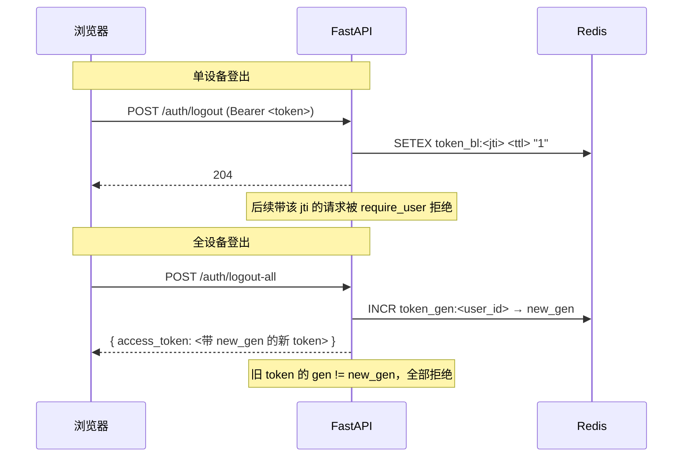
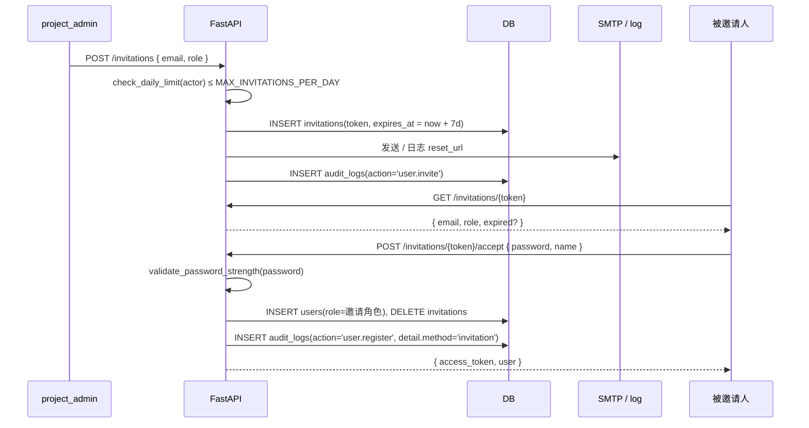

# 安全模型

> 适用读者：负责评估平台安全姿态的工程师 / 合规人员；想了解某个能力背后的访问控制规则的开发者。
>
> 这份文档描述「平台内置」的安全机制。HTTPS / WAF / 网络隔离等基础设施层属于部署侧，见 [`deploy.md`](/ops/deploy/docker-compose)。

---

## 1. 威胁模型摘要

| 威胁 | 缓解 | 实现位置 |
|---|---|---|
| 凭证泄露（撞库 / 钓鱼） | 密码强度 8+ 大小写数字 + 失败登录限流 + JWT 黑名单 | `apps/api/app/core/password.py`、`auth.py:48`（5/min）、`apps/api/app/core/token_blacklist.py` |
| 越权访问 | RBAC 5 级 + project_members 表细粒度授权 | `apps/api/app/core/permissions.py`、各路由 `Depends(require_roles(...))` |
| 邀请滥用 / 注册刷号 | `MAX_INVITATIONS_PER_DAY` + 开放注册 3/min 限流 + viewer 默认零权限 | `apps/api/app/services/invitation.py`、`auth.py:173` |
| 审计日志篡改 | PG `BEFORE UPDATE/DELETE` 触发器拒写 | `alembic/versions/0032_audit_log_immutability.py` |
| 数据泄露（导出滥用） | 导出端点写审计 + 计划中下载者签名水印 | `audit.py:AuditAction.PROJECT_EXPORT/BATCH_EXPORT` |
| CSRF | JWT 走 `Authorization: Bearer` + CORS 白名单 + production methods/headers 收紧 | `main.py:71-83` |
| XSS | React 默认转义 + 不允许 `dangerouslySetInnerHTML` 用户输入 | （前端约定） |
| 拒绝服务 | 请求级 SlowAPI 限流 + ML 调用超时 + Redis ConnectionPool 上限 | `core/ratelimit.py`、`config.py:54-55`、`api/v1/ws.py:26` |
| 敏感字段进日志 | Sentry `before_send` 屏蔽 Authorization | `main.py:28-36` |

威胁模型不包含：物理访问 PG、root SSH 入侵 API 主机——这些走部署侧的访问控制。

---

## 2. 角色与权限矩阵

`UserRole` 5 级（`apps/api/app/db/enums.py:4-9`）：

```
super_admin  > project_admin > reviewer > annotator > viewer
```

### 2.1 全局能力矩阵

| 能力 | super_admin | project_admin | reviewer | annotator | viewer |
|---|:-:|:-:|:-:|:-:|:-:|
| 创建项目 | ✅ | ✅ | ❌ | ❌ | ❌ |
| 删除项目 | ✅ | 仅 owner | ❌ | ❌ | ❌ |
| 邀请用户 | ✅ | ✅（≤ MAX/day） | ❌ | ❌ | ❌ |
| 改他人角色 | ✅ | annotator ↔ reviewer | ❌ | ❌ | ❌ |
| 查看审计日志 | 全部 | 项目相关 | ❌ | ❌ | ❌ |
| 系统设置（`/settings/*`） | 读+写 | 仅读 | ❌ | ❌ | ❌ |
| 导出数据 | ✅ | ✅ | ❌ | ❌ | ❌ |
| 标注任务 | ✅（演示） | ✅ | ✅ | ✅ | ❌ |
| 审核 / 通过-退回 | ✅ | ✅ | ✅ | ❌ | ❌ |
| 看 Dashboard | 全平台 | 项目相关 | 项目相关 | 自己 | 受邀的 |

> 注：`project_admin` 不能创建 `super_admin` / 不能改对方为 `viewer`（`apps/api/app/api/v1/users.py:27` 的注释）。
>
> `annotator_id` 单值绑定到 `batch.annotator_id`（v0.7.0 单值化），同一 batch 内任务都派给该一人；reviewer 通过 `task.reviewer_id` 锁定。

### 2.2 项目级 RBAC

`project_members(project_id, user_id, role)` 表给予某用户在指定项目内**临时角色覆盖**——例如全局是 `annotator`、但在某项目里被设为 `reviewer`。

权限解析顺序（`core/permissions.py`）：
1. `super_admin` 直接放行
2. project owner 放行
3. project_members 角色覆盖
4. 全局 `User.role` fallback

---

## 3. 鉴权链路

### 3.1 JWT 生命周期

平台使用对称 JWT（HS256），密钥从 `SECRET_KEY` env 读，默认值在 production 启动**会触发 RuntimeError**（`apps/api/app/main.py:50-57`）。

Token claims（v0.7.8）：

```json
{
  "sub": "<user_uuid>",
  "role": "<UserRole value>",
  "jti": "<token_uuid>",      // v0.7.8 · 用于黑名单
  "gen": 0,                   // v0.7.8 · 用户代际号；改变即旧 token 全失效
  "exp": 1745020800,
  "iat": 1744934400
}
```

默认 TTL = 24 小时（`ACCESS_TOKEN_EXPIRE_MINUTES`）。

### 3.2 注销机制（v0.7.8）



实现：
- `apps/api/app/core/token_blacklist.py` — `blacklist_token` / `is_blacklisted` / `increment_user_generation` / `get_user_generation`
- `apps/api/app/core/security.py:decode_access_token` 在解析后查 jti 黑名单 + gen 比对
- 前端 hook：`apps/web/src/api/auth.ts` 调 `/auth/logout` 后清 localStorage + 跳登录页

`logout` 黑名单 TTL = token 剩余有效期，自动随 `exp` 过期淘汰，不会无限增长。

### 3.3 密码

`apps/api/app/core/password.py:validate_password_strength`：
- 长度 ≥ 8（`auth.py:36`）
- 至少包含一个大写字母、一个小写字母、一个数字
- 不限符号（兼容性优先）

前端 RegisterPage / InvitationAcceptPage 用同一规则做实时强度提示（v0.7.8 对齐）。

### 3.4 失败登录限流

`auth.py:48` 的 `@limiter.limit("5/minute")` 装饰器（slowapi，按 IP）。失败时审计行 `auth.login` 状态码 401 + `detail.user_agent`（截前 256 字符），便于事后分析。

> 这是请求级限流，不防分布式拨号。如果开放注册放量后看到刷号迹象，下一步上 hCaptcha / Turnstile（ROADMAP §A 已列）。

---

## 4. 邀请流程



要点：
- `MAX_INVITATIONS_PER_DAY` 默认 30（`config.py:66`）。计数按发起人 + UTC 日期。
- TTL 默认 7 天（`INVITATION_TTL_DAYS`）。过期后 token 直接拒绝、不返回 email 防枚举。
- `super_admin` 邀请 super_admin 时 audit detail 含特殊标记，便于复盘。

### 4.1 开放注册（v0.7.7）

`POST /auth/register-open`，`ALLOW_OPEN_REGISTRATION=true` 时启用。新用户角色固定 `viewer`（最低权限），3/min 限流。

未来角色提升前必须先完成：邮箱验证、CAPTCHA。详见 ROADMAP §A「开放注册二阶段」。

---

## 5. 审计日志

### 5.1 字段

`audit_logs` 表（`apps/api/app/db/models/audit_log.py`）：

| 字段 | 类型 | 说明 |
|---|---|---|
| `id` | uuid | 主键 |
| `actor_id` `actor_email` `actor_role` | — | 行为发起人三元组（actor 删除后仍保留 email/role 快照） |
| `action` | str | `AuditAction` 枚举值，见 `services/audit.py:14-66` |
| `target_type` `target_id` | str | 受影响实体（`task` / `user` / `project` / `batch` / ...） |
| `method` `path` `status_code` | — | HTTP 请求三元组（来自 AuditMiddleware 或显式打点） |
| `ip` | str | `X-Forwarded-For` 头第一个值，否则 `request.client.host` |
| `detail_json` | jsonb | 自由结构；常见键：`user_agent`、`result`、`new_generation`、`from_role` / `to_role` |
| `request_id` | str | 关联同请求其它日志 / Sentry |
| `created_at` | timestamptz | 默认 `now()` |

### 5.2 不可变性（v0.7.8）

```sql
-- alembic/versions/0032_audit_log_immutability.py
CREATE TRIGGER trg_audit_log_no_update BEFORE UPDATE ON audit_logs ...
CREATE TRIGGER trg_audit_log_no_delete BEFORE DELETE ON audit_logs ...
```

任何 `UPDATE` / `DELETE` 触发 `RAISE EXCEPTION 'audit_logs rows are immutable'`。

**唯一豁免路径**：GDPR 用户数据清除任务在 session 中执行 `SET LOCAL app.allow_audit_update = 'true'` 后才能删行（`apps/api/app/services/gdpr_*` 类）。pg_restore / pg_dump --data-only 走 COPY 不走 UPDATE，备份恢复不受影响。

### 5.3 已打点的 action 一览

参见 `apps/api/app/services/audit.py:AuditAction` 枚举。涵盖：
- 认证：`auth.login` / `auth.logout` / `auth.logout_all`
- 用户：`user.invite` / `user.register` / `user.role_change` / `user.password_change` / `user.deactivate`
- 项目：`project.create/update/delete/transfer/member_add/member_remove`
- 批次：`batch.created/status_changed/rejected/reset_to_draft/deleted/distribute_even`、`batch.bulk_*`
- 任务：`task.submit/withdraw/review_claim/approve/reject/reopen`
- 标注：`annotation.create/update/delete/attribute_change/comment_add/comment_delete`
- 数据集：`dataset.create/delete/link/unlink`
- 导出：`project.export/batch.export`（v0.7.8 新增）
- bug 反馈：`bug_report.created/status_changed`
- 系统：`system.bootstrap_admin`

新加 action 时务必在枚举里登记——`AuditService.log` 接受 `str | AuditAction`，运行期不强校验，但 `AuditService` 路径是查 IDE 引用唯一可靠的入口。

---

## 6. HTTP 响应头与 CORS

### 6.1 Production 安全响应头（v0.8.8）

`apps/api/app/middleware/security_headers.py` 在 `environment == "production"` 时由 `main.py` 注册（详见 [ADR-0010](/dev/adr/0010-security-headers-middleware)）。dev / staging 不启用，避免本地热更新被 inline script 打挂。

| Header | Value |
|---|---|
| `Strict-Transport-Security` | `max-age=31536000; includeSubDomains` |
| `X-Content-Type-Options` | `nosniff` |
| `X-Frame-Options` | `DENY` |
| `Referrer-Policy` | `strict-origin-when-cross-origin` |
| `Content-Security-Policy` | 见下文 |

**CSP 当前为「宽松基线版」**：

```
default-src 'self';
img-src 'self' data: blob: https:;
style-src 'self' 'unsafe-inline';
script-src 'self' 'unsafe-inline' https://challenges.cloudflare.com;
frame-src https://challenges.cloudflare.com;
connect-src 'self' https: wss: ws:;
font-src 'self' data:;
object-src 'none'; base-uri 'self'; form-action 'self'; frame-ancestors 'none'
```

`'unsafe-inline'` 是为了兼容现有 inline style 与 vite shim；下一阶段切到 nonce-based。`https://challenges.cloudflare.com` 是 Turnstile widget 的固定来源（v0.8.7 引入 CAPTCHA 后所必需）。

**新增第三方依赖时的 checklist**：

- 加 Sentry CDN？追加 `script-src https://*.sentry-cdn.com`
- 加 Google Fonts？追加 `font-src https://fonts.gstatic.com` + `style-src https://fonts.googleapis.com`
- 加第三方 ML backend iframe？追加 `frame-src` 对应域

部署前先用 `max-age=300`（5 min）灰度 24h 确认 https 稳定，再切换到默认 1 年值——deploy.md 有 SOP。

`/metrics` 由独立 ASGI 子应用挂载，不经过 SecurityHeadersMiddleware，避免内网 scrape 被 HSTS 影响。

### 6.2 CORS

由 `apps/api/app/main.py` 注册：

| 维度 | development / staging | production |
|---|---|---|
| `allow_origins` | 默认 `localhost:3000/3001/5173` | 必填 `CORS_ALLOW_ORIGINS`（启动断言） |
| `allow_origin_regex` | `http://localhost:\d+` | 自动失效（`config.py:36-41`） |
| `allow_methods` | `*` | 显式白名单 `cors_allow_methods` |
| `allow_headers` | `*` | 显式白名单 `cors_allow_headers` |
| `allow_credentials` | `True` | `True` |

production 收紧的目的：避免误把 dev regex 上线放任何 localhost 端口；避免接受未声明的 method 让某些奇怪 path 被探到。

---

## 7. 数据泄露面

### 7.1 导出端点

`GET /api/v1/projects/{id}/export?format=...` 和 `GET /api/v1/projects/{id}/batches/{bid}/export` 都会写 `audit_logs.action = project.export / batch.export`，detail 含 `format` + `task_count`。审计页可按 `action ILIKE '%.export'` 筛查异常导出。

下载者签名水印（PDF/zip 内嵌发起人邮箱）已在 ROADMAP §B 列为 P2，未实现。

### 7.2 文件存取

MinIO presigned URL 默认 1 小时 TTL（`apps/api/app/services/storage.py`）。每个 URL 单文件，不含目录列表能力。日志中可看到生成事件。

### 7.3 Sentry 数据脱敏

`apps/api/app/main.py:28-36` 的 `_sentry_before_send` 钩子把 `Authorization` header 改为 `[REDACTED]`。同时 `send_default_pii=False`，Sentry 不会上传 cookies / 用户 IP。

---

## 8. 安全测试与监控

- **自动测试**：`apps/api/tests/test_auth.py` 覆盖密码策略、限流、JWT 过期。`test_audit_immutability.py` 覆盖触发器。
- **CI 静态扫描**：未启用（ROADMAP P3 待评估 bandit / semgrep）。
- **依赖扫描**：未配置（dependabot / renovate 待加）。
- **入侵检测**：依赖部署侧（CloudFlare WAF / fail2ban）。
- **日志告警**：建议在 Loki / Datadog 上加规则：
  - 单 IP 5min 内 `auth.login` 401 ≥ 20 → 告警
  - `system.bootstrap_admin` 写入 → 直接 PagerDuty
  - `audit_logs rows are immutable` 抛错 → P0（说明有人尝试改审计）

---

## 9. 关键文件索引

| 主题 | 路径 |
|---|---|
| 角色枚举 | `apps/api/app/db/enums.py` |
| 路由权限装饰器 | `apps/api/app/core/permissions.py` |
| 密码策略 | `apps/api/app/core/password.py` |
| JWT 编解码 | `apps/api/app/core/security.py` |
| Token 黑名单 | `apps/api/app/core/token_blacklist.py` |
| 限流 | `apps/api/app/core/ratelimit.py` |
| 审计服务 | `apps/api/app/services/audit.py` |
| 审计中间件 | `apps/api/app/middleware/audit.py` |
| 审计不可变 trigger | `apps/api/alembic/versions/0032_audit_log_immutability.py` |
| 邀请服务 | `apps/api/app/services/invitation.py` |
| Bootstrap super_admin | `apps/api/scripts/bootstrap_admin.py` |
| 认证路由 | `apps/api/app/api/v1/auth.py` |
| CORS / production 启动断言 | `apps/api/app/main.py:50-83` |
