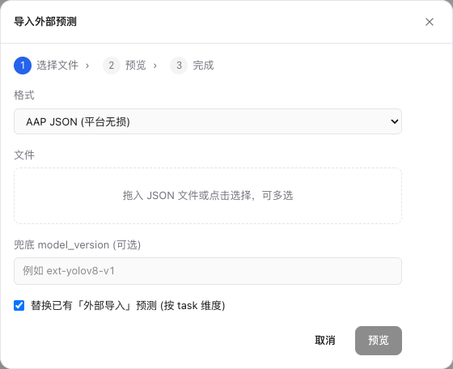
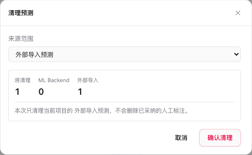

# 外部预测导入 / 导出

把外部模型（客户自训模型、第三方推理服务、离线脚本）的预测结果灌进项目，作为**待采纳预测**出现在工作台 AI 候选里；以及反向把项目里的标注 / 预测导出成 COCO / YOLO / AAP JSON 等格式。

本页只讲「外部预测进出本平台」这条链路。如果你要的是把**原始数据**导入数据集，图像见 [图像数据集导入](./import-images)、点云 / 多模态见 [点云 / 多模态数据集导入格式](./import-formats)；平台内置 ML Backend 自动跑预标的流程见 [AI 预标注](../projects/ai-preannotate)。

## 导入外部预测

### 入口

两个入口都打开同一个「导入预测」向导：

- **AI 预标注页**：进入某个项目详情后，头部右侧的 **「导入预测」** 按钮。
- **Dashboard**：项目卡片右下角 `⋮` → **「导入预测」**。

该入口**不要求项目已绑定 ML Backend**——即使头部显示「未绑定 ML backend」也能导入，因为外部预测走的是上传文件这条路，不经过平台推理。导入的预测行 `source='external_import'`、`ml_backend_id` 为空，与 ML Backend 跑出来的预标在来源上区分开。



<DocsVideo
  src="/media/ai/prediction-import.mp4"
  poster="/media/ai/prediction-import-poster.webp"
  alt="导入与真实车辆对齐的预测结果，在工作台检查候选并采纳为正式标注"
  caption="导入预测不会直接覆盖人工标注；候选需在工作台复核并采纳后才成为 Annotation。"
/>

### 向导流程

向导分三步：

1. **选择文件**：选格式、上传文件、（可选）填兜底 `model_version`、设置「替换已有外部导入预测」开关。
2. **预览**：以 `dry_run` 跑一遍校验路径但不入库，显示将写入 / 跳过 / 错误的数量与错误明细。
3. **完成**：确认后真正写入，再次显示汇总。

只有当预览结果「将写入」大于 0 时，「确认导入」按钮才可点。

### 三种格式

向导支持三种输入格式，对应 `format=aap_json|coco|yolo`。

#### AAP JSON（平台无损）

平台原生中间格式。预测导入向导消费 `predictions[]`；独立的标注导入 API 消费 `annotations[]`。两条路径都能通过 `mask_objects` 恢复视频栅格 mask track。最小预测 payload：

```json
{
  "schema_version": "1.3",
  "tasks": [
    {
      "task_match": { "file_path": "animals/cat/001.jpg" },
      "predictions": [
        {
          "class_name": "cat",
          "confidence": 0.92,
          "geometry": { "type": "bbox", "x": 0.1, "y": 0.2, "w": 0.3, "h": 0.25 }
        }
      ]
    }
  ]
}
```

要点：

- **`schema_version` 必填**，且主版本不能超过平台支持的 major（当前 `1`），否则整文件 422 拒绝。
- **`task_match` 必须给 `display_id` 或 `file_path` 至少一个**，两者全省略则该 task 块的预测全部跳过。`display_id` 全局唯一最稳；`file_path` 在项目内匹配，带子目录时会自动吸收 dataset 名前缀（库内 `task.file_path` 形如 `{dataset}/animals/cat/001.jpg`，外部相对路径 `animals/cat/001.jpg` 也能命中）。
- 图片预测支持 `bbox` / `polygon` / `multi_polygon` / `polyline` / `rotated_bbox` / `keypoint`；视频预测支持 `video_bbox` / `video_track_bbox` / `video_track_polygon` / `video_track_polyline` / `video_track_mask`。视频 task block 需声明 `media_type: "video"`，任务必须有可校验的源视频帧数；越界帧、重复关键帧或非法 outside 范围会显示在预览错误中。
- 视频 Mask 正文放在 `mask_objects`，向导会在预览时校验引用、尺寸和内容；`dry_run` 不会写 Prediction 或对象存储。正式导入后，Mask 仍是待审候选，不会直接成为标注。
- 一条 `predictions[i]` 可以用 `shapes[]` 把多个 shape 合并写入同一条预测；`shapes` 与单 `geometry` 同时存在时 `shapes` 优先。同一 entry 的 shapes 必须同属 bbox、region（polygon / mask）或 polyline 中的一个工具单位，不能混合。

坐标用归一化 `[0, 1]`。完整格式规范（含 `tool_bindings` / `attribute_schema` / `mask_objects` / 各几何字段）见 [导出格式 · AAP JSON](../reference/export-formats#aap-json-13无损)，本页不重复展开。

#### COCO Detection

标准 COCO Detection 子集（`images[]` + `annotations[]` + `categories[]`），`bbox` 为 `[x, y, w, h]` 像素坐标。最小结构：

```json
{
  "images": [{ "id": 1, "file_name": "animals/cat/001.jpg", "width": 1280, "height": 720 }],
  "categories": [{ "id": 1, "name": "cat" }],
  "annotations": [{ "image_id": 1, "category_id": 1, "bbox": [128, 144, 384, 180], "score": 0.9 }]
}
```

用 `image.file_name` 匹配 `task.file_path`。`images[i]` **缺 `width/height` 时**，可在向导里填**全局默认宽高**用于归一化；文件内已有尺寸时优先用文件内尺寸。向导里宽、高必须**同时**填写且为正整数，否则不放行。

#### YOLO（zip）

选择一个 zip 包，包内需含：

- `classes.txt`（每行一个类名）**或** `data.yaml`（`names:` 字段），用于把类别索引映射成类名；都缺且项目也没有可回退的类别顺序时整包报错。
- 每图一个 label `.txt`（空 label 文件视为该图无预测，对平台导出的 YOLO 包可往返）。

label 路径按**文件 stem** 匹配任务：归一化时会剥掉直到最后一个 `labels/` 目录段、再去掉扩展名，例如 `labels/animals/cat/001.txt` 匹配项目内 `animals/cat/001.jpg`（或 `.png` 等）。同名跨目录或跨扩展名出现歧义时不自动猜测，会在预览 errors 里提示。

向导里用 **YOLO 变体** 选择 `det`（检测）/ `obb`（旋转框）/ `seg`（分割）：

| 变体  | label 行格式                         | 落地几何                         |
| ----- | ------------------------------------ | -------------------------------- |
| `det` | `cls cx cy w h`（归一化）            | `bbox`                           |
| `seg` | `cls x1 y1 x2 y2 …`（≥3 点，归一化） | `polygon`                        |
| `obb` | `cls x1 y1 … x4 y4`（四角，归一化）  | `rotated_bbox`，退化时 `polygon` |

##### YOLO OBB 专项

`obb` 变体的四角是归一化坐标，需要**图像真实像素尺寸**才能还原成平台的旋转框（中心 + 宽高 + 角度）。因此被匹配到的任务对应的 `dataset_item` 必须有有效的 `width/height`，否则该图整体跳过并提示 `dataset item width/height required for YOLO OBB`。还原时若四角不构成矩形（边长不相等或不正交，容差约 3%），会**降级为 `polygon`** 原样保留四个角点。`det` / `seg` 用归一化坐标直接落地，不需要图像尺寸。

### 替换已有外部导入预测

「替换已有外部导入预测」开关**默认开启**。开启时，重导同一批文件会**先按 task 清掉该任务旧的 `source='external_import'` 预测，再写入新预测**——避免重复导入越堆越多。它**只清外部导入预测，不动 ML Backend 跑出来的预标**，也不动已采纳的人工标注。需要在旧导入基础上**追加**而非替换时，取消勾选即可。

### 导入结果

预览与完成都给出三项汇总：**写入 / 跳过 / 错误**。错误明细列出每条的 `task_match` 与原因（如 `task not found in project`、`unsupported geometry kind`、`ambiguous task file stem`），最多展示前若干条。

向导支持**一次选多个 JSON 文件**（YOLO 限单个 zip），后端作为同一批处理：「替换」的清理在整批内按 task 去重，多文件命中同一 task 只清一次，各文件结果合并后再汇总。

## 清理预测

需要撤销导入、或在重新整理文件前清空旧候选时，用「清理预测」按来源批量删除当前项目的预测。

### 入口

Dashboard 项目卡片右下角 `⋮` → **「清理预测」**。



### 来源范围

弹窗按 `source_scope` 提供三个选项：

| 来源范围                              | 含义                                                   |
| ------------------------------------- | ------------------------------------------------------ |
| **外部导入预测**（`external_import`） | 默认项，只删本页导入的预测                             |
| **ML Backend 预标**（`ml_backend`）   | 删平台模型跑出的预标候选，清理后需重新运行模型才能恢复 |
| **全部预测**（`all`）                 | 同时删除外部导入与 ML Backend 预标                     |

弹窗打开时会先以 `dry_run` **统计将删除的数量**（按来源拆分显示 ML Backend / 外部导入 / 其他来源），数量为 0 时无法提交。

选 **ML Backend 预标** 或 **全部预测** 属于高风险操作，需**额外勾选确认复选框**才能点「确认清理」；选「外部导入预测」无需额外确认。任何来源范围下，**已采纳的人工标注都不会被删除**——清理只动 `predictions` 表里的候选行。

## 导出标注 / 预测

反向链路：把项目里的标注与预测导出成外部格式（COCO / YOLO / AAP JSON 等）。

- 入口在 Dashboard 项目卡片 / 列表行右下角 `⋮` → **「导出标注数据」**，打开导出弹窗，可选导出范围（整个项目 / 单个批次）与一个或多个目标格式。
- 点击「开始导出」后任务进入后台队列；可在顶栏「后台任务」查看进度。完成行会列出项目、目标格式、ZIP 文件数与大小，并提供「下载」入口。
- AAP JSON 是无损中间格式，能把 `predictions[]` 连同 `confidence` / `model_version` 带出，也能用 `annotations[]` + `mask_objects` 迁移视频栅格 mask track，常用于跨实例迁移与离线回填闭环。

各格式的字段映射、目录结构、回源脚本等细节见 [导出格式参考](../reference/export-formats)。导出后按 task / scene 维度核对任务时，可用 [Data Manager](../projects/data-manager) 的「AI 待审」视图快速定位尚未处理的检测 shape 或视频追踪候选。
