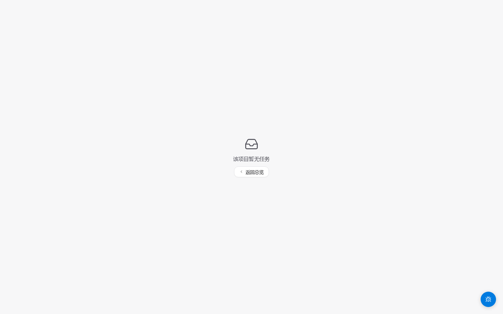

# Bbox 标注

<!-- TODO(0.8.1) IMAGE_CHECKLIST: 工作台工具栏全图，红框标注「矩形」按钮 + 显示其 hotkey 提示。 -->

## 操作

1. 按 `B` 切到矩形工具
2. 在画布上按下鼠标 → 拖动 → 松开，即生成一个矩形
3. 右侧属性面板选择类别

## 编辑已有 Bbox

- 单击 → 选中（出现 8 个角控制点）
- 拖角 → 缩放
- 拖中心 → 移动
- 双击边界 → 进入精确编辑模式

## 常见错误

- **画框太小**：低于 8×8 像素的框会被拦截，提示重画
- **超出图像**：会被自动 clip 到图像范围内
- **类别未选**：提交前必须为每个 Bbox 指定类别

## IoU 与质量

审核环节会用 IoU（Intersection over Union）判断你画的框与基准的重合度。一般要求 IoU ≥ 0.7 视为合格。

<!-- TODO(0.8.1) IMAGE_CHECKLIST: 一张图上叠两个 bbox（基准绿框 + 标注员蓝框），标注 IoU = 重叠面积 / 并集面积，含 0.5 / 0.7 / 0.9 三档对照。 -->

<!-- TODO(0.8.1) IMAGE_CHECKLIST: 多选 3-5 个 bbox（Shift+click）+ 右侧属性面板批量改类别的状态。 -->
