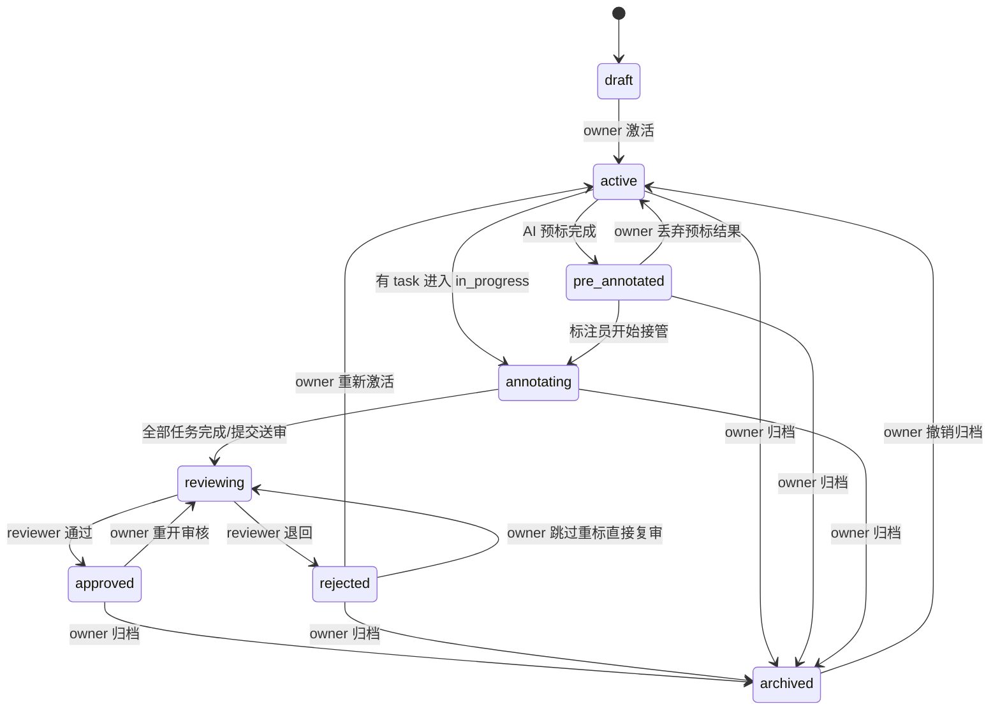

# 批次与分配

批次（Batch）是项目内一组任务的业务分组，也是分配、推进、审核和归档的基本单位。

常见用途：

- 按数据来源分批：不同供应商、采集批次、数据域
- 按运营节奏分批：周批、月批、活动批
- 按难度或人员分批：新手批、高优先级批、复审批

## 批次状态机

当前版本的批次状态机如下：

说明：

- `active → annotating`、`pre_annotated → annotating` 有自动路径，不需要管理员手工点状态
- `annotating → reviewing` 既可能由“全量完成”自动触发，也可能由标注员主动整批送审触发
- 当前版本**尚未实现**批次级“暂停 / 恢复（admin lock / unlock）”

## 状态语义

| 状态 | 含义 | 典型进入方式 | 下一步 |
|---|---|---|---|
| `draft` | 批次已建好，但还未正式投入生产 | 新建批次、`reset → draft` | owner 激活 |
| `active` | 已准备好，可开始分派或开始标注，但尚未进入“进行中” | `draft → active`、`archived → active`、`rejected → active`、`pre_annotated → active` | 标注员开始后自动转 `annotating`，或 owner 归档，或 AI 预标完成后转 `pre_annotated` |
| `pre_annotated` | AI 预标已跑完，等待人工接管 | AI 文本批量预标完成 | 标注员接管后自动转 `annotating`，owner 也可丢弃预标结果退回 `active` |
| `annotating` | 批次处于标注进行中 | 任一 task 进入 `in_progress` | 全部任务完成后进 `reviewing`，或 owner 归档 |
| `reviewing` | 审核员开始整批复核 | 标注员送审或系统自动推进 | reviewer 通过到 `approved`，退回到 `rejected` |
| `approved` | 审核完成，业务上通过 | reviewer approve | owner 可归档，也可重开审核 |
| `rejected` | 审核退回，批次需要返工 | reviewer reject | 标注员重做，或 owner 直接重新激活 / 重开审核 / 归档 |
| `archived` | 批次结束，不再作为工作中的生产批次使用 | owner archive | owner 可撤销归档回 `active` |

## 自动迁移与手工迁移

### 自动迁移

以下状态变化由系统自动驱动：

- `active → annotating`
  触发条件：批次内有任务进入 `in_progress`
- `pre_annotated → annotating`
  触发条件：标注员开始接管 AI 预标任务
- `annotating → reviewing`
  触发条件：批次内不再存在 `pending / in_progress / rejected` 任务

### 手工迁移

以下状态变化依赖用户操作：

- owner：`draft → active`
- 标注员：`annotating → reviewing`
- reviewer：`reviewing → approved`、`reviewing → rejected`
- owner 兜底逆向迁移：
  `archived → active`、`approved → reviewing`、`rejected → reviewing`、`rejected → active`、`pre_annotated → active`
- owner：多数工作态都可以直接归档

## 角色分工

| 角色 | 主要动作 |
|---|---|
| 项目 owner / super_admin | 创建批次、分配人、激活、归档、逆向迁移、终极重置 |
| 标注员 | 在自己负责的批次上开始标注，把批次送审 |
| 审核员 | 审核 `reviewing` 批次，决定通过或退回 |

补充：

- owner 是批次状态机的最终兜底角色
- 标注员不能直接把批次改成 `approved` / `archived`
- reviewer 不负责激活、归档或终极重置

## 分配人员

当前批次采用“一批次一标注员 + 一审核员”的单值语义：

- `annotator_id`：该批次的主标注员
- `reviewer_id`：该批次的主审核员

批次创建后通常先做两件事：

1. 指定标注员 / 审核员
2. 从 `draft` 激活到 `active`

如果只创建批次、不激活，它不会进入正常工作流。

## 批量操作

当前版本已实现的多选批量操作是：

- 激活
- 归档
- 重新分配
- 删除

说明：

- “暂停 / 恢复”还没有上线
- 批量激活只适用于 `draft` 批次
- 批量归档、删除、改派都受当前状态和权限约束，部分批次可能成功，部分批次会被跳过或失败

## 退回与重做

`reviewing → rejected` 不是简单改一个批次状态，它还会同步影响任务：

- 仅 `review` / `completed` 任务会被回退为 `pending`
- 现有 annotation 历史会保留，不会被硬删除
- `review_feedback` 会保留在批次上，供标注员查看退回原因

这意味着“批次被退回”更接近“软重开”，而不是“整批清空重做”。

## 终极重置到 Draft

owner 可以把任意状态批次 `reset → draft`。这是一个比普通逆向迁移更重的兜底动作。

它会做这些事：

- 批次状态回到 `draft`
- 批次下 task 状态统一回到 `pending`
- 删除 task locks，释放现场锁
- 清理批次 review 元数据
- 对 AI 预标相关数据做级联清理

适用场景：

- 批次切错了，想彻底重新来一遍
- AI 预标结果要整批作废
- 运营流程需要把批次回滚到“未启动”阶段

## 项目管理员日常操作建议

推荐节奏：

1. 先按业务维度切出批次
2. 再做标注员 / 审核员分派
3. 确认有任务后再激活
4. 标注完成进入审核
5. 通过后归档

不推荐的做法：

- 把所有任务都塞进一个超大批次再靠任务列表硬筛
- 在 `annotating` 中频繁手工做状态折返
- 把“归档”当成“临时暂停”使用

## 当前未实现能力

以下能力在 ADR / Roadmap 中有规划，但当前版本尚未上线：

- 批次级暂停 / 恢复（admin lock / unlock）
- 批量暂停 / 批量恢复
- 锁定后严格禁止新用户进入该批次
