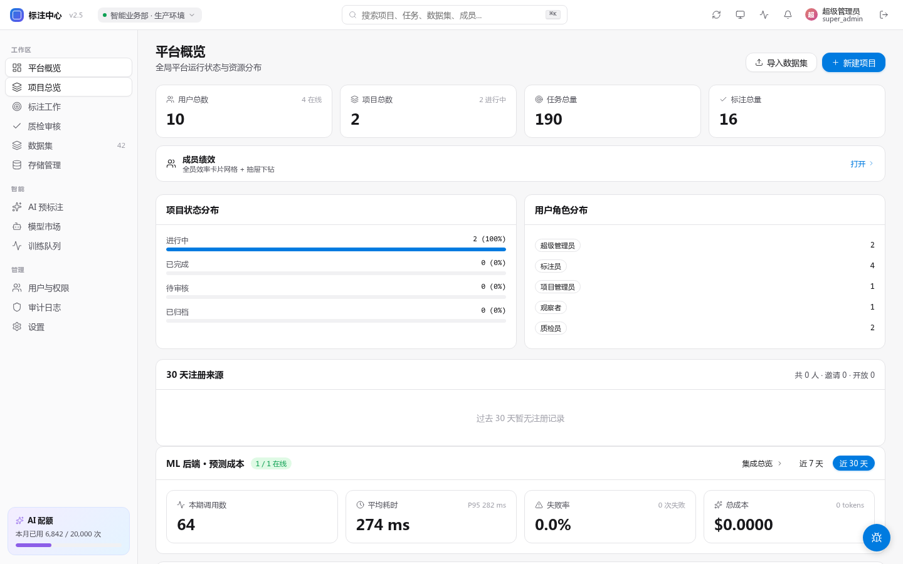
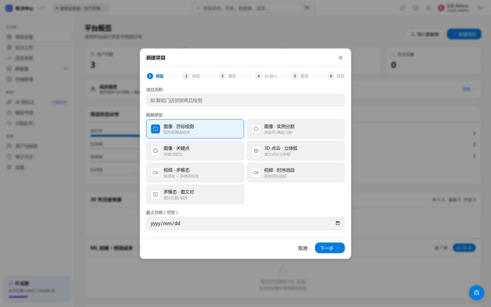

# 创建项目

> 适用角色：项目管理员 / 超级管理员

<!-- TODO(0.8.1) IMAGE_CHECKLIST: ProjectsPage「新建项目」按钮高亮。 -->

## 步骤

1. 顶部菜单 → 「项目管理」 → 「新建项目」
2. 填写基本信息：
   - **项目名**
   - **类型**：bbox / polygon / keypoint / classification / OCR
   - **类别 schema**（JSONB）：例如 `["person", "car", "bicycle"]`
   - **AI 模型**（可选）：选择预标注模型
3. 上传初始数据集（zip / 图片直传 / OSS 路径）
4. 设置标注规范文档（Markdown，标注员在工作台可见）
5. 配置审核策略：
   - **单审**：1 名审核员通过即可
   - **双审**：2 名审核员一致才通过
   - **采样审核**：随机抽 N% 审核

<!-- TODO(0.8.1) IMAGE_CHECKLIST: 6 步 wizard 各步关键截图（基本信息 / 类型 / 类别 schema / 属性 schema / AI 模型 / 审核策略），可拼成一张长图。 -->

## 任务生成

项目创建或数据集关联后，每条数据会自动生成一个任务，状态为 `pending`，等待分配。

如果数据集已经关联到项目，后续在数据集页继续上传文件、上传 ZIP 或执行「扫描导入」，新增文件也会同步生成项目任务；无需先取消关联再重新关联。

## 常见问题

**类别如何后续修改？**
进入项目设置页可追加类别；删除已用类别会要求确认（已用过的标注会保留旧类名）。

**能否中途切换 AI 模型？**
可以，但已生成的预标注不会重跑，需手动触发「重新预标注」。
