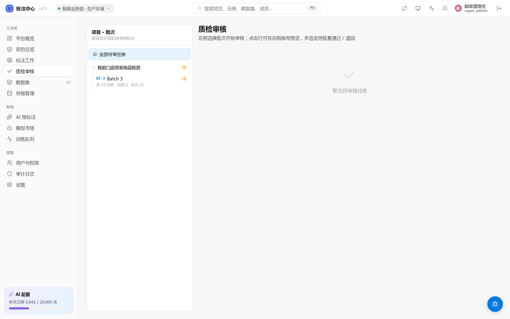

# 审核流程

> 适用角色：审核员 / 项目管理员

## 审核工作台

进入「审核」入口后，系统按队列分配一条「待审核」任务：

- 左侧：任务列表（待审 / 已通过 / 已退回）
- 中间：画布展示标注员的标注
- 右侧：审核操作面板


<!-- TODO(0.8.1) IMAGE_CHECKLIST: 审核界面三栏全图，标注员的标注可见，右侧操作面板包含「通过/退回/修改后通过」三个按钮。 -->

## 审核操作

| 操作 | 含义 | 后果 |
|---|---|---|
| **通过** | 标注合格 | 任务进入 `completed` |
| **退回** | 需要修改，必须填写备注 | 任务回到原标注员，状态变 `rejected` |


<!-- TODO(0.8.1) IMAGE_CHECKLIST: 点「退回」弹出的备注表单，含原因下拉 + 富文本备注框。 -->
| **修改后通过** | 你直接改正小问题，标注员收到通知 | `completed`，但标注员能看到你的改动 |

## IoU 阈值

如果项目配置了基准答案（gold standard），会自动计算 IoU：

- **IoU ≥ 0.8** — 优秀
- **IoU ∈ [0.7, 0.8)** — 合格
- **IoU < 0.7** — 不合格，建议退回

## 视频任务审核

视频任务会在审核工作台切到视频时间轴视图。审核时重点看：

- 轨迹列表里的类别和 `track_id` 是否能对应同一个对象。
- 第 1 帧、中间帧、最后一帧等关键位置的 bbox 是否贴合目标。
- 两个关键帧之间的虚线插值框是否发生明显漂移。
- 目标消失段是否标记了「消失」，避免插值框穿过不存在的对象。
- 被遮挡目标是否标记了「遮挡」，且框体仍覆盖可判断的目标区域。

退回视频任务时，建议在原因里写清楚 `track_id + frame_index`，例如：

```text
trk_person_01 frame 128: 车辆消失后仍有插值框，请标记为消失。
```

这样标注员重做时可以直接定位到问题轨迹和帧。

## 双审策略

如果项目设置「双审」，需 2 名独立审核员一致才能通过：

- 两人都通过 → completed
- 两人都退回 → rejected
- 一人通过、一人退回 → 升级到项目管理员仲裁

## 审核员绩效

「审核员」页面显示：审核数量、平均耗时、与同行一致率（用于校准评判尺度）。
