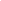
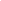

# 快速开始

## 1. 登录

打开平台地址，使用管理员发放的邮箱和密码登录。首次登录后建议在「我的」中修改密码。

<!-- TODO(0.8.1) IMAGE_CHECKLIST: 登录页全屏；标注红框：邮箱输入、密码输入、登录按钮、「忘记密码」链接。1920×1080，浏览器框架可保留。 -->

如果忘记了密码，点击登录页的「忘记密码」会跳到重置流程：

<!-- TODO(0.8.1) IMAGE_CHECKLIST: 忘记密码页；输入邮箱后的成功 toast 截图。 -->

第一次完整体验建议跟随这段端到端 GIF（登录 → 进入第一个项目 → 标第一个任务 → 提交）：

<!-- TODO(0.8.1) IMAGE_CHECKLIST: 录屏 GIF，30-60 秒，覆盖登录→Dashboard→打开项目→工作台标 1 个 bbox→提交→看到下一题的整段链路。1280×720。 -->

## 2. 首页一览

登录后默认进入「项目总览」(Dashboard)：

- **项目卡片**：每个你参与的项目，显示进度、待处理任务数
- **个人统计**：本周已完成任务数、平均耗时、通过率
- **快捷入口**：进入工作台、查看通知

## 3. 接受第一个任务

1. 进入项目卡片 → 点「开始标注」
2. 系统按队列分配一条未处理任务，进入「标注工作台」
3. 完成后点「提交」→ 自动加载下一条

## 4. 标注工作台基础操作

最常用 6 个快捷键（完整列表见 [标注工作台 / 界面与快捷键](./workbench/)）：

| 快捷键 | 动作 |
|---|---|
| `B` | 矩形（Bbox）工具 |
| `P` | 多边形（Polygon）工具 |
| `V` | 平移工具 |
| `Space + drag` | 临时拖动画布 |
| `Ctrl + Z` / `Ctrl + Shift + Z` | 撤销 / 重做 |
| `E` | 提交质检并加载下一题 |

工作台每 30s 自动保存草稿；意外刷新可恢复。

## 5. 提交后的去向

- 标注员提交 → 进入审核队列
- 审核员通过 → 任务完成，统计 +1
- 审核员回退 → 回到标注员，附带审核备注

## 下一步

- 想细看某种标注类型 → [Bbox](./workbench/bbox) / [Polygon](./workbench/polygon) / [关键点](./workbench/keypoint)
- 想管理项目和数据 → [创建项目](./projects/)
- 想了解审核 → [审核流程](./review/)
