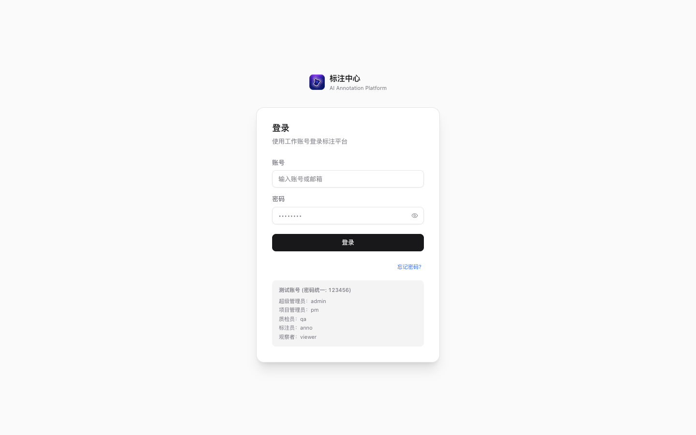
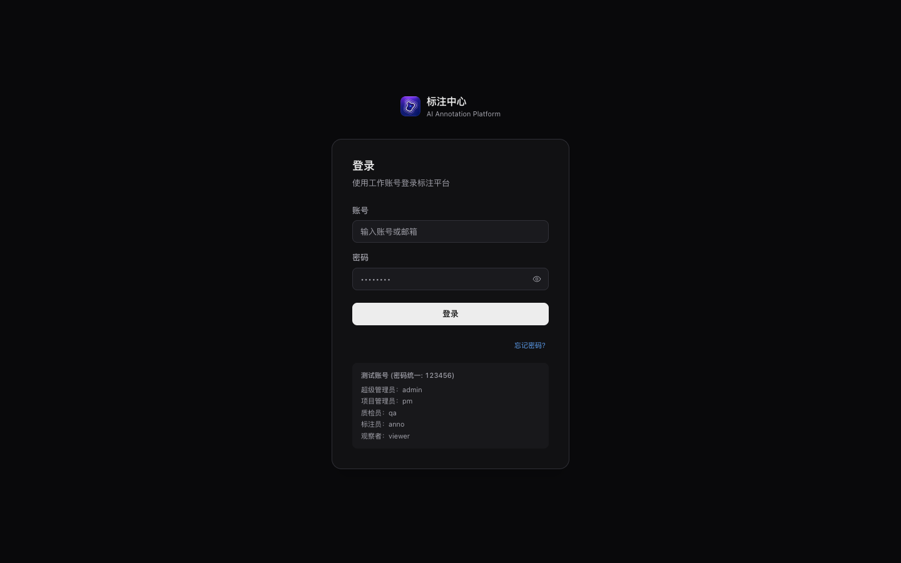
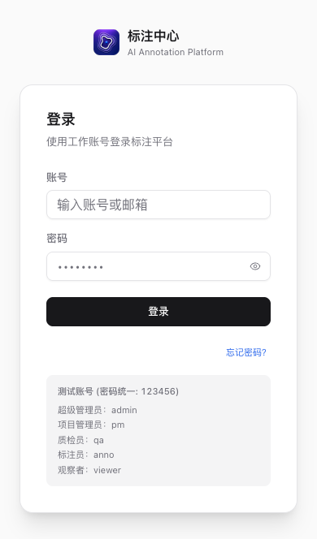
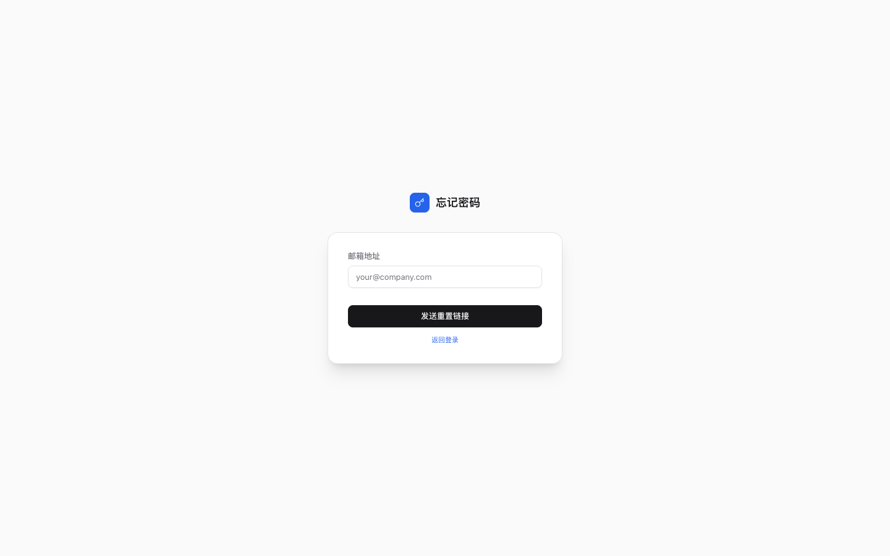

# 快速开始

## 1. 登录

打开平台地址，使用管理员发放的邮箱和密码登录。首次登录后建议在左侧导航「**设置**」中修改密码。

> 若平台开启了「开放注册」，登录页会有注册入口可自助注册（默认 viewer 角色）。开放注册在生产环境默认要求邮箱验证：注册后需点验证邮件里的链接才能登录，未收到可在验证页重发。通过邀请链接注册则无需验证，按邀请角色直接加入项目。

<!-- TODO(0.8.1) IMAGE_CHECKLIST: 登录页全屏；标注红框：邮箱输入、密码输入、登录按钮、「忘记密码」链接。1920×1080，浏览器框架可保留。 -->

浅色、深色和窄屏视图的登录入口相同；部署的主题或浏览器宽度不同时可参考对应界面：

如果忘记了密码，点击登录页的「忘记密码」会跳到重置流程：

<!-- TODO(0.8.1) IMAGE_CHECKLIST: 忘记密码页；输入邮箱后的成功 toast 截图。 -->

第一次完整体验可以按下方步骤完成登录、打开项目、标注和提交。

<!-- TODO IMAGE_CHECKLIST: 补录 30-60 秒端到端 GIF，覆盖登录→Dashboard→打开项目→工作台标 1 个 bbox→提交→看到下一题的整段链路。1280×720。 -->

## 2. 首页一览

<!-- TODO(v0.14.18) IMAGE_CHECKLIST: images/getting-started/annotator-dashboard.png — 标注员仪表盘全屏，标注红框：产能/质量分区 + 「打开」按钮 -->

登录后会按角色进入对应的首页面板；超级管理员默认进入「平台概览」，其他角色进入各自的 Dashboard。以下为**标注员视角**的主要区块：

| 区块 | 内容 |
|---|---|
| 退回提示 | 有被退回任务时在页面顶部显示醒目提示，点「进入工作台」直达 |
| 产能 | 待标任务数、今日完成、本周完成（+趋势%）、平均单题耗时（30 天中位）|
| 质量 | **原创比例**、**被退回率**（所有提交中的退回占比）、重审次数均值 |
| 投入 | 今日活跃时长、连续标注天数、累计标注数（依赖心跳） |
| 今日专注时段 | 24 小时柱状图，按小时聚合标注分钟数 |
| 本周目标进度 | 环形图，完成数/目标数（目标由项目管理员配置）|
| 近 7 天趋势 | 折线迷你图 |
| 我的批次 | 当前参与的批次列表，含完成率与截止日期 |
| 项目卡片 | 参与的项目列表，按剩余任务数降序；每张卡右下角有「**打开**」按钮直达工作台 |

## 3. 接受第一个任务

1. 左侧导航点「标注工作」，或在项目卡片右下角点「**打开**」
2. 系统按队列分配一条未处理任务，进入「标注工作台」
3. 完成后点「提交」→ 自动加载下一条

## 4. 标注工作台基础操作

### 画第一个 Bbox

1. 按 `B` 切到矩形工具（工具栏高亮）
2. 在图像上按下鼠标，拖出一个矩形后松开
3. 右侧属性面板选择类别
4. 按 `E` 提交并自动加载下一题

> 提示：标注操作即时写入服务端，无需手动保存。网络断开时操作进入本地离线队列，联网后自动回放。

最常用 6 个快捷键（完整列表见 [标注工作台 / 界面与快捷键](./workbench/)）：

| 快捷键 | 动作 |
|---|---|
| `V` | 选择工具（点选 / 移动已有标注与预标注；默认工具，`Esc` 回退到它） |
| `B` | 矩形（Bbox）工具 |
| `P` | 多边形（Polygon）工具 |
| `Space + drag` | 临时拖动画布 |
| `Ctrl + Z` / `Ctrl + Shift + Z` | 撤销 / 重做 |
| `E` | 提交质检并加载下一题 |

## 5. 提交后的去向

- 标注员提交 → 进入审核队列
- 审核员通过 → 任务完成，统计 +1
- 审核员回退 → 回到标注员，附带审核备注

## 下一步

- 想细看某种标注类型 → [Bbox](./workbench/bbox) / [Polygon](./workbench/polygon) / [关键点](./workbench/keypoint)
- 想管理项目和数据 → [创建项目](./projects/)
- 想了解审核 → [审核流程](./review/)
