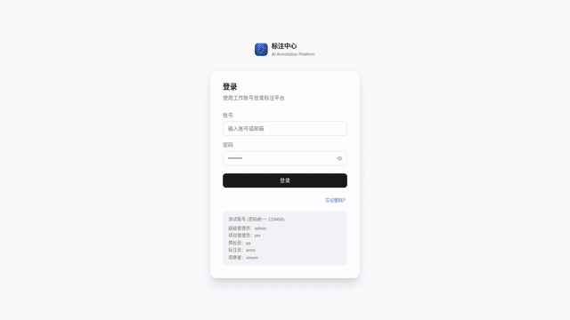

# 快速开始

这条路径帮助你从登录走到首条任务提交。开始前准备好平台地址、管理员发放的账号，并确认自己已加入项目或收到可执行批次；管理员和审核员可在最后的角色入口继续阅读。

## 1. 登录

打开平台地址，使用管理员发放的邮箱和密码登录。首次登录后建议在左侧导航「**设置**」中修改密码。

> 若平台开启了「开放注册」，登录页会有注册入口可自助注册（默认 viewer 角色）。开放注册在生产环境默认要求邮箱验证：注册后需点验证邮件里的链接才能登录，未收到可在验证页重发。通过邀请链接注册则无需验证，按邀请角色直接加入项目。

<!-- TODO(0.8.1) IMAGE_CHECKLIST: 登录页全屏；标注红框：邮箱输入、密码输入、登录按钮、「忘记密码」链接。1920×1080，浏览器框架可保留。 -->

登录入口在浅色、深色和窄屏视图中相同。需要对照其他界面时，展开下面的可选示例：

查看深色、窄屏和密码恢复示例

如果忘记了密码，点击登录页的「忘记密码」会跳到重置流程：

<!-- TODO(0.8.1) IMAGE_CHECKLIST: 忘记密码页；输入邮箱后的成功 toast 截图。 -->

## 2. 首页一览

登录后会进入与你的角色对应的首页。标注员可从「开工清单」或项目卡片的「打开」进入任务；先阅读项目指引，再继续下一节领取任务。

如果你是项目中的标注员，首页还会显示「**开工清单**」。清单按当前项目的真实数据更新，依次检查：阅读项目指引、打开已分派任务、完成首条标注、查看送审结果。项目没有发布指引或还没有可执行批次时，清单会直接说明缺少哪项条件；点击步骤右侧按钮可以进入对应工作台或项目设置。清单的跳过状态按账号、项目和指引版本保存，之后可以点「重新打开清单」继续查看；管理员修改指引后会生成新的版本，阅读步骤会重新出现。

打开指引后，请阅读正文并点击「确认已阅读」；展开或收起指引不会自动完成步骤。确认和跳过操作需要保存成功，失败时会显示重试入口。打开任务依据自己的工作台访问记录，首条标注只计入自己保存的有效标注，审核结果只计入已通过或已退回的任务；送审中不算已有结果。点击「再次查看结果」会在清单中展示最近审核结论和退回理由；已经结束或归档的任务也可以查看自己的结果，无需重新进入编辑工作台。

清单下方的「**优先处理**」会把继续上次工作、退回待处理和即将到期的项目放在一起。继续工作采用最近打开时间，临近截止项目按到期先后排列。工作台记住的任务也按账号隔离，换人登录或切换标注 / 审核模式不会误打开其他人的任务。

如果首页统计、项目或批次暂时无法读取，页面会显示具体的失败区域和「重新加载」入口。已有内容刷新失败时，页面会保留上一次成功读取的内容，并在区域内提示更新失败；权限变化会单独提示联系项目管理员。

浏览器检测到网络断开时，标注、审核和 Dashboard 会显示「等待网络连接」提示。尚未读取的统计、批次或任务会在恢复连接后自动继续加载；已经显示的内容会暂时保留。任务列表底部点击「加载更多」时断网，也会提示更多任务将在恢复连接后继续读取。

需要认识首页区块和侧边栏位置时，展开界面示例；它们不是领取任务的前置步骤。

查看首页和平台导航示例

<!-- TODO(v0.14.18) IMAGE_CHECKLIST: images/getting-started/annotator-dashboard.png — 标注员仪表盘全屏，标注红框：产能/质量分区 + 「打开」按钮 -->

桌面端可点击侧边栏顶部的按钮收起导航，仅显示图标；悬停图标可查看入口名称。展开后拖动右侧边缘可调整宽度（200–320px），双击边缘恢复默认 220px。也可用 Tab 聚焦边缘，以左右方向键每次调整 10px，Home / End 调至最小／最大宽度。收起状态和展开宽度保存在当前浏览器中；窄屏仍使用完整的抽屉导航。

侧边栏展开、收起或作为移动端抽屉显示时，屏幕阅读器均可读出待审核数量，以及 AI 预标注的待接管和失败数量。

登录后会按角色进入对应的首页面板；超级管理员默认进入「平台概览」，其他角色进入各自的 Dashboard。以下为**标注员视角**的主要区块：

| 区块         | 内容                                                                       |
| ------------ | -------------------------------------------------------------------------- |
| 退回提示     | 有被退回任务时在页面顶部显示醒目提示，点「进入工作台」直达                 |
| 产能         | 待标任务数、今日完成、本周完成（+趋势%）、平均单题耗时（30 天中位）        |
| 质量         | **原创比例**、**被退回率**（所有提交中的退回占比）、重审次数均值           |
| 投入         | 今日活跃时长、连续标注天数、累计标注数（依赖心跳）                         |
| 今日专注时段 | 24 小时柱状图，按小时聚合标注分钟数                                        |
| 本周目标进度 | 环形图，完成数/目标数（目标由项目管理员配置）                              |
| 近 7 天趋势  | 折线迷你图                                                                 |
| 我的批次     | 当前参与的批次列表，含完成率与截止日期                                     |
| 项目卡片     | 参与的项目列表，按剩余任务数降序；每张卡右下角有「**打开**」按钮直达工作台 |

首页统计卡片与人员统计中的迷你折线会随可用宽度缩放；放大页面或缩窄窗口时，仍显示完整时间范围内的数据。

## 3. 接受第一个任务

1. 左侧导航点「标注工作」，或在项目卡片右下角点「**打开**」
2. 系统按队列分配一条未处理任务，进入「标注工作台」
3. 完成后点「提交」→ 自动加载下一条

在标注或审核页面选择批次后，任务列表会先显示首页结果；列表底部的「加载更多」可以继续读取后续任务，并保留当前批次、筛选和已选任务。加载失败时可以重试，已读取的任务仍会保留。空队列、权限不足和网络或服务失败会显示不同提示，不会把失败误显示成「暂无任务」。

## 4. 标注工作台基础操作

### 画第一个 Bbox

1. 按 `B` 切到矩形工具（工具栏高亮）
2. 在图像上按下鼠标，拖出一个矩形后松开
3. 右侧属性面板选择类别
4. 按 `E` 提交并自动加载下一题

> 提示：标注操作即时写入服务端，无需手动保存。网络断开时操作进入本地离线队列，联网后自动回放。

第一次完整体验可以按本页步骤完成登录、打开项目、标注和提交：

最常用 6 个快捷键（完整列表见 [标注工作台 / 界面与快捷键](./workbench/)）：

| 快捷键                          | 动作                                                              |
| ------------------------------- | ----------------------------------------------------------------- |
| `V`                             | 选择工具（点选 / 移动已有标注与预标注；默认工具，`Esc` 回退到它） |
| `B`                             | 矩形（Bbox）工具                                                  |
| `P`                             | 多边形（Polygon）工具                                             |
| `Space + drag`                  | 临时拖动画布                                                      |
| `Ctrl + Z` / `Ctrl + Shift + Z` | 撤销 / 重做                                                       |
| `E`                             | 提交质检并加载下一题                                              |

## 5. 提交后的去向

- 标注员提交 → 进入审核队列
- 审核员通过 → 任务完成，统计 +1
- 审核员回退 → 回到标注员，附带审核备注

审核员首页的「优先处理」会列出待复核任务，并给返修重提的任务标记「返修重提」。点击任务可直接打开对应项目和任务的审核工作台；批次仍在审核中但暂时没有单条入口时，可以从「审核批次」进入批次列表。

## 下一步

- 想细看某种标注类型 → [Bbox](./workbench/bbox) / [Polygon](./workbench/polygon) / [关键点](./workbench/keypoint)
- 想管理项目和数据 → [创建项目](./projects/)
- 想了解审核 → [审核流程](./review/)
