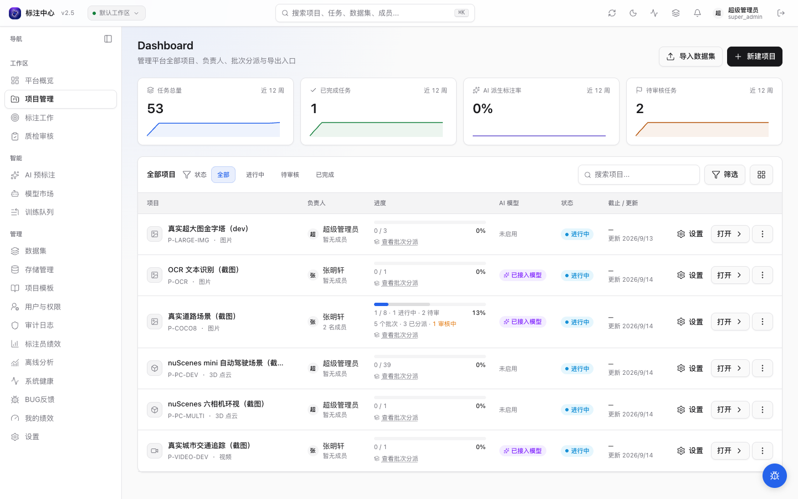
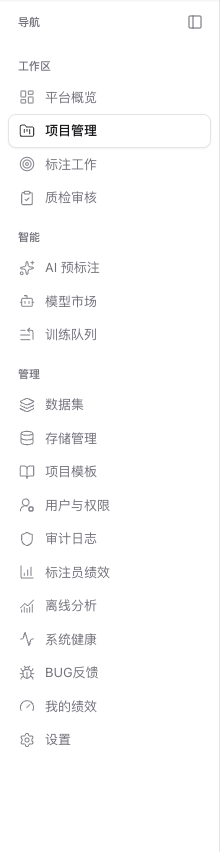

# 用户手册

面向标注员、审核员、项目管理员、超级管理员、观察者的使用文档。先按角色定位，再按任务进入。

## 按角色定位

不确定从哪里开始？选择你的角色：

  <DocLinkCard icon="🖊️" title="标注员" desc="接收任务、在工作台完成标注并提交" href="/user-guide/getting-started" />
  <DocLinkCard icon="📋" title="项目管理员" desc="创建项目、上传数据、分配任务、跟进进度" href="/user-guide/projects/" />
  <DocLinkCard icon="✅" title="审核员 / 质检员" desc="检查标注质量，通过或回退给标注员修正" href="/user-guide/review/" />
  <DocLinkCard icon="🛡️" title="超级管理员" desc="管理用户、注册 ML Backend、查看系统状态" href="/user-guide/superadmin/" />
  <DocLinkCard icon="👁️" title="观察者 Viewer" desc="仅可查看平台公开内容，需升级权限后参与标注" href="/user-guide/concepts" />

## 按任务进入

### 开始

| 我想做的事                             | 去哪里                              |
| -------------------------------------- | ----------------------------------- |
| 第一次进入平台                         | [快速开始](./getting-started)       |
| 理解「任务 / 批次 / 标注」这些词的含义 | [平台概念与术语](./concepts)        |
| 看快捷键列表                           | [工作台概览 → 快捷键](./workbench/) |

### 数据与项目

| 我想做的事           | 去哪里                                                                 |
| -------------------- | ---------------------------------------------------------------------- |
| 导入数据             | [导入图像数据集](./datasets/import-images) · [数据集总览](./datasets/) |
| 配置存储连接器       | [存储连接器导入](./datasets/storage-connections)                       |
| 端到端创建项目       | [新项目端到端流程](./workflows/new-project-end-to-end)                 |
| 切批次、分配给标注员 | [批次与分配](./projects/batch)                                         |

### 标注

| 我想做的事                     | 去哪里                                                                                     |
| ------------------------------ | ------------------------------------------------------------------------------------------ |
| 图片标注                       | [Bbox](./workbench/bbox) · [Polygon](./workbench/polygon) · [关键点](./workbench/keypoint) |
| 视频 / 点云标注                | [视频追踪标注](./workbench/video-track) · [3D 点云标注](./workbench/pointcloud-view)       |
| 使用 AI 辅助标注或管理 AI 任务 | [AI 辅助标注](./ai/)                                                                       |

### 审核与导出

| 我想做的事   | 去哪里                                     |
| ------------ | ------------------------------------------ |
| 审核标注质量 | [审核流程](./review/)                      |
| 导出标注数据 | [数据导出格式](./reference/export-formats) |

### 设置与支持

| 我想做的事                     | 去哪里                         |
| ------------------------------ | ------------------------------ |
| 修改密码 / 通知偏好 / 标注偏好 | [设置页](./reference/settings) |
| 提交 BUG 或问题                | 应用右下角「BUG 反馈」按钮     |
| 常见问题                       | [FAQ](./faq)                   |
