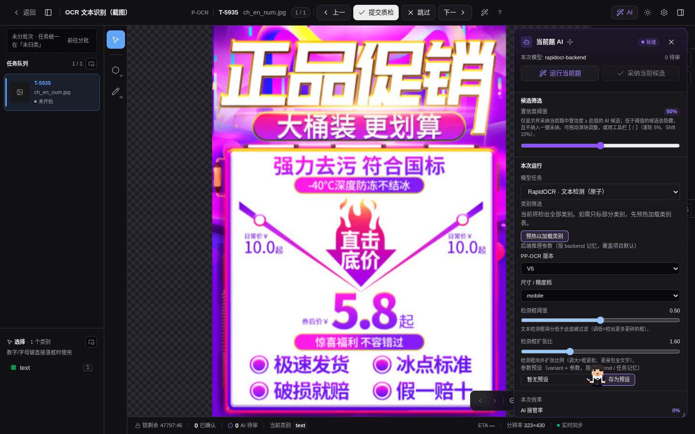

# AI 预标

<!-- history: merged the v0.9.5-v0.10.58 incremental AI pre-annotation notes into the current workflow. -->

AI 预标把模型输出写成候选预测，让标注员从 AI 结果接管而不是从空白开始。图像项目支持按批次批量预标；视频项目既能在编排画布里批量预标——按输入节点的**执行单位**分「整段序列」（跨帧追踪，落轨迹）或「逐帧」（图像检测逐帧跑，每帧落框），也能在工作台内对单条轨迹发起追踪。

## 入口

`/ai-pre`（主导航 →「AI 预标」）。仅项目管理员和超级管理员可用。

## 前置条件

1. 项目已从全局注册表启用至少一个可用 ML Backend，并在「项目设置 → ML 模型」设了项目主后端（设了主后端即视为启用 AI 预标注）。
2. 要跑批量预标的批次处于 `active` 状态。
3. 项目类别配置了清晰的名称或英文 alias，便于文本 prompt 召回。

## 选择项目

进入 `/ai-pre` 后先看到项目卡片网格。卡片会显示：

- ML Backend 状态；
- 待预标、已就绪、近期失败数量；
- 最近后台任务时间。

打开图像项目后，详情页会列出可预标的 `active` 批次。打开视频项目时，详情页进入编排画布：点输入节点选执行单位（整段序列 / 逐帧），源模型下拉据此过滤——整段序列只列 tracker，逐帧只列图像检测。你仍可进视频工作台选中轨迹后用 `Ctrl+B` 发起单轨迹追踪。

## 批量预标图像批次

1. 勾选一个或多个 `active` 批次。
2. 选择 ML Backend。项目启用多个 backend 时可在这里切换，不必回设置页改主后端。
3. 输入英文 prompt，例如 `person`、`ripe apple`、`car, truck, bicycle`。多类别用英文逗号 `,` 分隔。
4. 选择输出形态：
   - `□ 框`：只写 bbox，速度最快；
   - `○ 掩膜`：mask 转 polygon；
   - `⊕ 全部`：同一实例同时生成 box 与 polygon。
5. 按 backend 参数表单调整阈值、变体等参数。
6. 选择「已预标任务」处理方式（幂等模式）：
   - **跳过已预标**（默认）：只对还没有预测结果的任务跑预标，已预标的任务不再重复，避免叠加重复标注；
   - **覆盖**：先清除这些任务已有的 AI 预测与 AI 标注（保留人工标注），再重新预标；
   - **追加**：不去重，直接在已有预测上再加一份（仅特殊场景）。
7. 点击运行。勾选多个批次时可以选择串行或并行；并行请求仍会受 backend 的 `max_concurrency` 保护。

<DocsVideo
  src="/media/ai/preannotate.mp4"
  poster="/media/ai/preannotate-poster.webp"
  alt="选择项目和批次、运行 AI 预标、查看任务历史并返回工作台核对候选"
/>

## 参数与模型变体

参数面板来自当前 backend 的 `/setup.params`，常见字段包括 `box_threshold`、`text_threshold`、`score_threshold` 等。选择值按「用户 + backend」记忆，下次进入同一 backend 会自动恢复。

如果 backend 上报 `supported_variants`，页面会显示 SAM / DINO 变体选择器，选项带显存估算、速度/精度档位和推荐标识。触发预标时，这些值会并入请求 `params` 并透传给 ML Backend。

## 多阶段预标（检测 → 分类 → 写属性）

当一个检测框还需要进一步分类（如车辆框再判车型 / 颜色 / 车牌）时，可以在「批跑预标设置」里**加下游阶段**，把「检测 → 对每个框跑分类 → 把结果写回框属性」串成一条流水线，任意检测器与任意分类器自由组合。

编排区是**两列**：左侧是一张可交互的**流水线画布**（DAG），把整条流水线画成「源检测 → 下游」的节点图，一眼看清谁串谁、哪些并行；右侧是**当前选中节点的参数**。点画布上任一节点，右侧即切到它的配置；页面高度不随阶段数增长（右侧永远只有一张卡）。

- **加阶段**：把鼠标移到能当父的节点（源检测、或产几何的下游），点节点上的 **+**（或从节点右侧小圆点拖一条线到空白处）即在其下新建一个下游阶段并自动选中。新阶段默认选一个分类 backend；同一个父下可加多个下游，它们对同一批父框并行各跑一次、各写不同属性键（如颜色 + 车型 + 车牌 OCR）。加下游阶段需项目至少绑定两个 ML backend（检测与分类用不同后端）；只绑一个时画布下方会提示先绑定第二个。下游若选中不产属性的纯检测器，会在右侧参数里给 ⚠ 警示（作分类只会重新检测、属性恒空）。
- **删除 / 改父**：节点上的 🗑 删除该阶段（连同其所有后代级联删除，删多个时会提示连带数）；也可选中节点按 Delete/Backspace 删；**拖动节点之间的连线**可把某阶段改挂到另一个产几何的父节点上（拖动时合法落点会高亮），非法连接（成环、超过 3 层、父不产几何）实时拒绝并提示。方向键可在节点间移动选中。
- **节点信息**：每个节点直接显角色（检测/分割/分类）、所用 backend、是否「待配置」、父框过滤范围、运行进度与计数；悬浮节点弹出浮层显全量（模型、任务、投递方式、变体、写回键）。下游模型若与父产物不兼容（吃不了裁剪图/框提示），或作分类却不产属性，节点会标红 ⚠ 警示 —— 仅提示、不阻断，运行时仍由后端最终把关。
- **下游模型自动选纯分类**：若所选下游 backend 同时暴露纯分类 model（`task=classification`），该阶段会自动用它（卡上提示「下游模型：…（纯分类，跳过检测）」），直接对裁好的 ROI 出属性，不在小图上重复跑检测器；backend 只有检测 model 时回落用检测 model。
- **父框类别**：每张下游卡从项目类别中**多选**「父框类别」，只对这些类别的检测框启动；留空 = 对全部框跑。按检测框类名匹配。不同卡选不相交类别 = 不同类走不同模型；命中零阶段的框保持纯检测框。
- **ROI 扩展 pad**：平台按检测框裁剪小图喂下游分类器，`pad` 控制裁剪时向四周外扩的比例（0–0.5）。
- **写回属性键**：从下游 backend 自报的输出属性（或项目属性 schema）中**多选**本阶段写哪些属性键；多个并行阶段写同一键时，配置区即红字预警、默认拦截运行（避免互相覆盖），可显式勾选「末位覆盖」后放行。若选的键不在该模型自报的输出属性 schema 内，卡片还会给一条非阻断提示（该模型可能不产出此键）。
- **下游失败策略**：下游分类失败时可选「保留检测框、属性留空」（默认）或「丢弃该框」。
- **运行态**：批跑**过程中**逐阶段统计实时更新并落到画布节点上——源节点显检出框数，每个下游节点显运行态圆点（待运行 / 运行中 / 已完成）+「目标 / 成功」计数；选中某节点时右侧卡还展开「目标 / 成功 / 失败 / 几何跳过」明细。跑完或刷新后与终态统计一致。

> 下游分类 backend 需自身支持分类并在 `/predict` 返回 `attributes`；纯检测器只能作为源阶段。属性取值域对齐复用 backend 自报的 [输出属性 schema](../../dev/reference/ml-backend-protocol)（项目可一键导入）。

采纳侧见[工作台](../workbench/)：选中带属性的 AI 候选时，底部「属性审阅」区可先看预测属性、也可就地修改；从列表行点采纳时，改动会自动一并落库（画布贴框采纳读不到本地编辑，仍走候选原值）。

### 嵌套阶段（在子物体上继续跑）

流水线不止「检测 → 分类」两层，最深可串到**三层**：当一个阶段**产出新几何**（框→分割出 mask，或在父框 crop 上检测出子物体），它就能再作为下游阶段的父，对它产出的每个框继续跑。

- **谁能当父**：只有产几何的阶段（选中**框→分割**或**检测**类下游模型）的节点才有出向连接点、才能加子；纯分类阶段（只写属性）是叶子，节点上没有 **+**、也连不出子。链路最深 3 层（源检测 + 两层下游），到第 3 层的节点不再提供加子。
- **加子阶段**：在产几何的节点上点 **+**（或拖其连接点到空白），新节点出现在它右侧一列，表示「对该阶段产出的每个框」运行。整棵树就是画布本身（`检测(源) → 子 → 孙`），层级与并行关系所见即所得。
- **典型链路**：`person 检测 → 在每个 person 框 crop 上检测 hat → 给每个 hat 框分类 color`。hat 检测器在裁出的 person 小图上跑，检出的 hat 框**自动回映回原图坐标**并作为新框出现；color 分类阶段再裁 hat 框跑分类。
- **子物体命名**：给分类阶段填「子物体命名」（如 `hat`），它写回的属性键会加前缀（`color` → `hat_color`），避免不同子物体的同名属性互相覆盖；留空 = 写原始键。
- **可达性**：产几何的子阶段，其模型必须能吃「框提示」或「裁剪图」之一（见模型市场卡片「可接受输入」）；选了不兼容的模型，运行时会被拒绝并提示原因。

### 保存为项目编排

配好流水线（单阶段或多阶段）后，点设置区底部的 **保存为项目编排**，把当前这套配置存到项目（一项目一条「当前编排」）。保存后按钮旁出现「已保存编排 · N 阶段」标识，并多出 **清除** 按钮。

存了项目编排后，标注工作台“当前题 AI”面板会多出一个 **运行当前题（按项目编排 · N 阶段）** 入口，对正在标的这一张图按该编排跑完整流水线；当前题执行与候选审阅见[当前题 AI 与二次推理](../ai/current-task-inference)。无需回到本页、无需选批次。本页是**项目内**定义和保存编排的主要入口，工作台只执行、不编辑编排；重新保存即覆盖，点“清除”即移除。若想把一套编排跨项目复用，可在[**全局编排库**](./pipeline-library)（`/pipelines`）里维护命名编排模板（支持私有 / 组织 / 公开三档可见范围），再套用到具体项目。

## OCR / 文档版面预标

OCR 与文档版面预标走和几何检测（YOLO）、文本检测（gsam2/sam3）**完全相同的 model-first 配置**：「模型任务」下拉列出 backend 自报的所有可批量预标的模型，OCR 端到端 / 检测模型与几何检测器并列出现，按选中模型自动决定要不要文本 prompt、要不要变体面板。

<DocsVideo
  src="/media/ai/ocr-current-task.mp4"
  poster="/media/ai/ocr-current-task-poster.webp"
  alt="真实 OCR 图片在工作台运行当前题推理并生成文本候选"
/>

<noscript></noscript>

同一能力也可从工作台「当前题 AI」面板对正在标注的图片直接运行；项目必须先绑定支持 OCR 输出契约的 ML Backend。

<!-- 历史：曾有 OCR / 文档版面专属的「任务类型」tab 层，since v0.20.5 取消并与几何 / 文本检测的 model-first 配置对齐。-->

- **选 OCR 端到端模型**（默认值 `ocr-e2e`）：整图直接出文本 polygon + `text` / `orientation` / `language` 属性，不需要文本 prompt；变体面板按模型自报的轴展开 PP-OCRv5/v6 × 尺寸档 × 通用(中英)/英文，调档实际下发后端。
- **选纯检测模型**（如 `ocr-det`）：只出文本 polygon 框、不写文本属性，适合先批量出框、再走多阶段下游识别。
- **识别文本去向**：识别出的文本写入 annotation 属性。**项目需先在「类别与属性」配置 `text` 属性，否则文本不会入库** —— 面板给出静态提示，并提供「从 ML Backend 预填配置」入口一键导入 backend 自报的属性 schema。

### OCR 识别原子作下游 stage（跨 backend）

OCR 识别原子（`task=ocr`、`composition=atom`、吃 `crop` 输入,如 rapidocr 的 `ocr-rec`）可在多阶段编排里作下游识别阶段:**上游任意 backend 出框 → 裁 crop → 下游 rec 认字并写回 `text` / `orientation` / `language`**。下游卡角色徽标显「识别」,选中识别原子时收起与之冗余的整图「模型任务」下拉。典型链路:`YOLO 检测车牌框 → rapidocr ocr-rec 认字写回 text`。

## Alias chips

项目类别配置英文 alias 后，prompt 输入框附近会出现可点击 chip。点击 chip 会把 alias 填入 prompt；高频 alias 会排在前面，并显示历史预测次数。alias 保存时会自动小写化、折叠空格和逗号。

如果没有看到 chip，进入项目设置的「类别与属性」补充英文 alias。

## 进度与取消

批量预标会创建后台任务，并在 `/ai-pre/jobs`、右上角后台任务铃和通知中心中显示进度。取消、部分结果、失败项重试与升级给运维的边界统一见[AI 任务与失败恢复](../workflows/failed-prediction-recovery)；任务铃的本地隐藏不影响 Jobs 页面中的完整历史。

## 人工接管

批量预标完成后，批次会进入 `pre_annotated` 状态。项目管理员或标注员可以点击「打开标注工作台」进入对应批次。

工作台 Topbar 会显示「AI 预标已就绪」徽章；右侧 AI 面板列出候选预测，标注员逐条接受、修改或拒绝。当批次内第一个任务进入 `in_progress` 状态时，批次自动转为 `annotating`（由后端 `check_auto_transitions` 事件驱动，不需要手动触发）。

## 重置已预标批次

已就绪批次可以批量重激活或重置到草稿：

- **重激活**：清理预测并把批次退回 `active`；
- **重置到草稿**：清理预测、失败预测、相关后台任务和 task lock，让批次回到 `draft`。

这类操作需要输入原因并写入审计日志。

## 导入外部预测

除了通过 ML Backend 批量预标，也可以把客户自训模型的推理结果以 AAP JSON / COCO Detection / YOLO zip 形式直接导入为候选预测。详见 [导入 / 导出外部预测](../datasets/prediction-import-export.md)。

## 3D 点云项目

3D 点云（lidar）项目暂不支持 AI 预标。在 `/ai-pre` 详情面板中，lidar 项目会显示「点云（lidar）项目暂不支持 AI 预标」提示，运行按钮不可用。

## 常见问题

- **跑预标按钮灰**：检查项目是否已启用 backend 并设了主后端、批次是否 `active`、以及当前 backend 是否为文本预标模式（文本模式下 prompt 不能为空；几何 backend 或 OCR/文档版面模式不需要文本 prompt）。
- **某些 task 失败**：打开 `/ai-pre/jobs` 查看失败原因，可在 job 详情里重试可恢复项。
- **跑完批次状态没变**：刷新页面；偶发 WebSocket 延迟可能让前端进度滞后，后端状态通常已经更新。
- **视频项目整段序列 vs 逐帧怎么选**：整段序列用 tracker 跨帧连成轨迹（`VideoTrackGeometry`），适合运动目标持续跟踪；逐帧让图像检测在每帧独立跑、每帧落框（`VideoBboxGeometry`），适合逐帧全量检测、帧间不要求同一目标连贯。工作台内选中单条轨迹发起的 `Ctrl+B` 追踪是另一条交互式路径，与批量编排互不影响。
