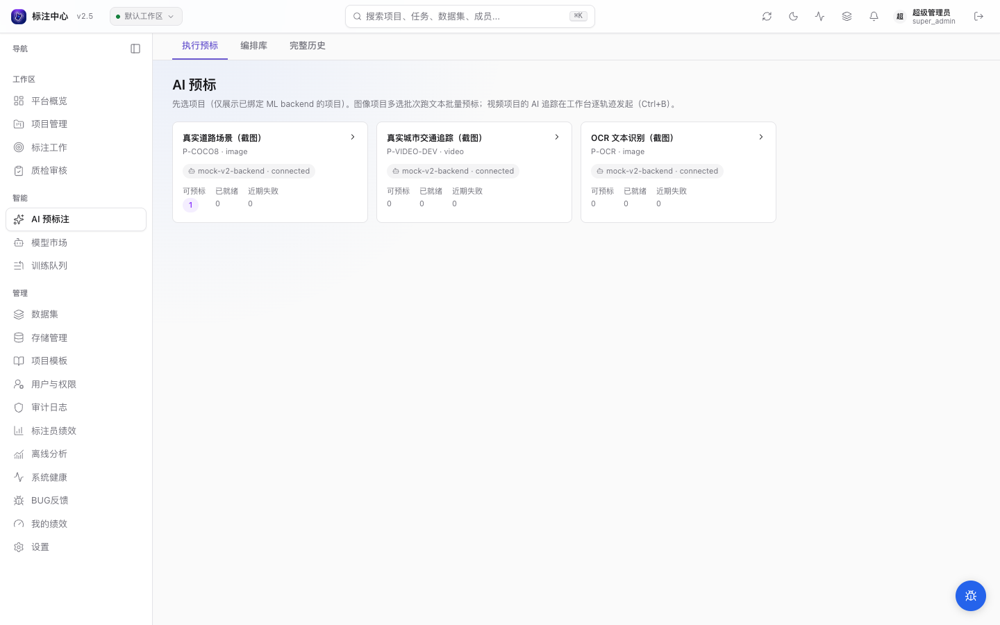
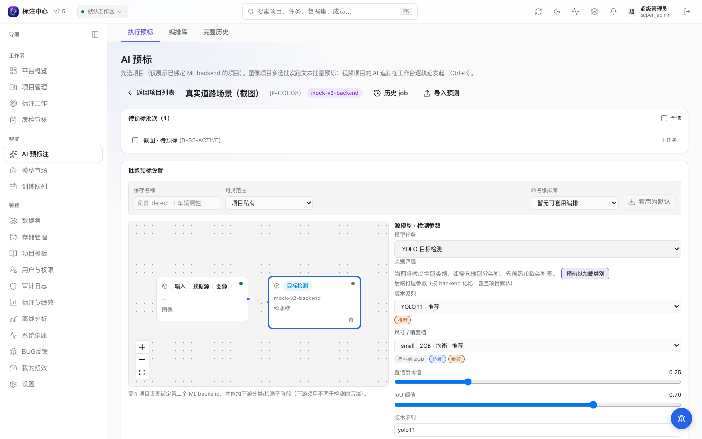
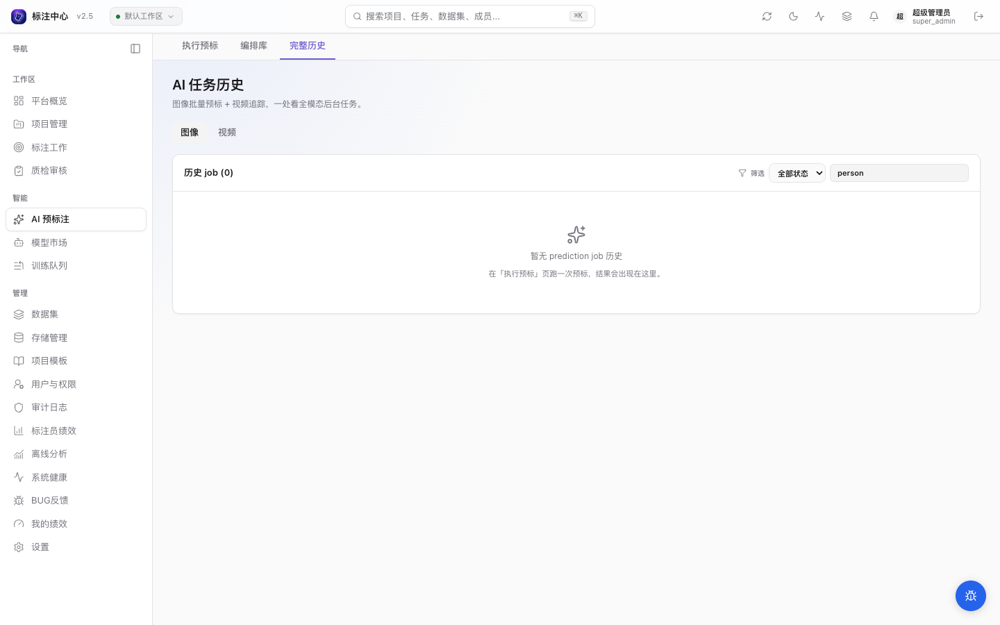

# AI 预标

<!-- history: merged the v0.9.5-v0.10.58 incremental AI pre-annotation notes into the current workflow. -->

AI 预标把模型输出写成候选预测，让标注员从 AI 结果接管而不是从空白开始。图像项目支持按批次批量预标；视频项目的 AI 标注是工作台内的逐轨迹追踪，不走整批文本检测。

## 入口

`/ai-pre`（主导航 →「AI 预标」）。仅项目管理员和超级管理员可用。

## 前置条件

1. 项目已在「项目设置 → ML 模型」启用 AI 预标注。
2. 项目已绑定可用 ML Backend。
3. 要跑批量预标的批次处于 `active` 状态。
4. 项目类别配置了清晰的名称或英文 alias，便于文本 prompt 召回。

## 选择项目

进入 `/ai-pre` 后先看到项目卡片网格。卡片会显示：

- ML Backend 状态；
- 待预标、已就绪、近期失败数量；
- 最近后台任务时间。

打开图像项目后，详情页会列出可预标的 `active` 批次。打开视频项目时，页面会显示引导卡片，提示你进入视频工作台选中轨迹后用 `Ctrl+B` 发起 AI 追踪，并提供视频 job 历史入口。

## 批量预标图像批次

1. 勾选一个或多个 `active` 批次。
2. 选择 ML Backend。项目注册多个 backend 时可在这里切换，不必回设置页改绑定。
3. 输入英文 prompt，例如 `person`、`ripe apple`、`car, truck, bicycle`。多类别用英文逗号 `,` 分隔。
4. 选择输出形态：
   - `□ 框`：只写 bbox，速度最快；
   - `○ 掩膜`：mask 转 polygon；
   - `⊕ 全部`：同一实例同时生成 box 与 polygon。
5. 按 backend 参数表单调整阈值、变体等参数。
6. 选择「已预标任务」处理方式（幂等模式）：
   - **跳过已预标**（默认）：只对还没有预测结果的任务跑预标，已预标的任务不再重复，避免叠加重复标注；
   - **覆盖**：先清除这些任务已有的 AI 预测与 AI 标注（保留人工标注），再重新预标；
   - **追加**：不去重，直接在已有预测上再加一份（仅特殊场景）。
7. 点击运行。勾选多个批次时可以选择串行或并行；并行请求仍会受 backend 的 `max_concurrency` 保护。

## 参数与模型变体

参数面板来自当前 backend 的 `/setup.params`，常见字段包括 `box_threshold`、`text_threshold`、`score_threshold` 等。选择值按「用户 + backend」记忆，下次进入同一 backend 会自动恢复。

如果 backend 上报 `supported_variants`，页面会显示 SAM / DINO 变体选择器，选项带显存估算、速度/精度档位和推荐标识。触发预标时，这些值会并入请求 `params` 并透传给 ML Backend。

## 多阶段预标（检测 → 分类 → 写属性）

当一个检测框还需要进一步分类（如车辆框再判车型 / 颜色 / 车牌）时，可以在配置区**加下游阶段**，把「检测 → 对每个框跑分类 → 把结果写回框属性」串成一条流水线，任意检测器与任意分类器自由组合。

- **加阶段**：源阶段（检测）配好后，点「加第二阶段」选一个分类 backend；再点「并行加同级阶段」可挂多个下游分类器，它们对同一批检测框并行各跑一次、各写不同属性键（如颜色 + 车型 + 车牌 OCR）。加分类阶段需项目至少绑定两个 ML backend（检测与分类用不同后端）；只绑一个时此处会提示先绑定第二个。下游若选中不产属性的纯检测器，会有 ⚠ 警示（作分类只会重新检测、属性恒空）。
- **父框类别**：每张下游卡从项目类别中**多选**「父框类别」，只对这些类别的检测框启动；留空 = 对全部框跑。按检测框类名匹配。不同卡选不相交类别 = 不同类走不同模型；命中零阶段的框保持纯检测框。
- **ROI 扩展 pad**：平台按检测框裁剪小图喂下游分类器，`pad` 控制裁剪时向四周外扩的比例（0–0.5）。
- **写回属性键**：从下游 backend 自报的输出属性（或项目属性 schema）中**多选**本阶段写哪些属性键；多个并行阶段写同一键时，配置区即红字预警、默认拦截运行（避免互相覆盖），可显式勾选「末位覆盖」后放行。
- **下游失败策略**：下游分类失败时可选「保留检测框、属性留空」（默认）或「丢弃该框」。
- **运行态**：批跑完后展示逐阶段统计——检出框数、各下游分类阶段的「目标 / 成功 / 失败」计数。

> 下游分类 backend 需自身支持分类并在 `/predict` 返回 `attributes`；纯检测器只能作为源阶段。属性取值域对齐复用 backend 自报的 [输出属性 schema](../../dev/reference/ml-backend-protocol)（项目可一键导入）。

采纳侧见[工作台](../workbench/)：选中带属性的 AI 候选时，底部「属性审阅」区可先看预测属性、改后再采纳，改动随采纳一并落库。

## OCR / 文档版面预标

当选中的 backend 在[能力声明协议 v2](../../dev/reference/ml-backend-protocol) 中暴露 `ocr` 或 `doc_layout` 模型条目时（按能力目录派生），面板顶部出现「任务类型」选择器，三选一：

- **文本预标**（默认）：走原有的纯文本 prompt 批量预标流程。
- **OCR 文字识别** / **文档版面**：走对应模型条目，请求带 `model_id` + `task_type` 透传给 backend。

选择 OCR 或文档版面后：

- **隐藏文本 prompt 控件**：这两类任务不需要文本 prompt，参数面板改用所选 model 条目自带的 params schema（不再用 `/setup.params`）。
- **识别文本去向**：识别出的文本写入 annotation 属性。**项目需先在「类别与属性」配置 text 属性，否则文本不会入库**——面板会给出静态提示。
- 切换 backend 或刷新能力目录后，若当前任务类型不再可用，会自动回落到「文本预标」。

## Alias chips

项目类别配置英文 alias 后，prompt 输入框附近会出现可点击 chip。点击 chip 会把 alias 填入 prompt；高频 alias 会排在前面，并显示历史预测次数。alias 保存时会自动小写化、折叠空格和逗号。

如果没有看到 chip，进入项目设置的「类别与属性」补充英文 alias。

## 进度与取消

批量预标会创建后台任务，并在 `/ai-pre/jobs`、右上角后台任务铃和通知中心中显示进度。

- `pending` / `running` 的批量预标任务可取消；
- 取消是协作式取消，worker 会在下一条预测边界停止，不会强杀进程；
- 已写入的 prediction 不会回滚；
- 取消结果会保留已处理、跳过、取消位置等摘要。

后台任务铃支持「全部 / 进行中」筛选，并可本地隐藏已完成、失败或取消的历史条目。隐藏只影响当前浏览器显示，完整历史仍在 `/ai-pre/jobs`。

## 失败重试

`/ai-pre/jobs` 的图像 tab 同时展示批量预标和失败预测重试任务。打开 job 详情可以查看 payload、result、完整错误、创建/开始/完成时间线。

新任务会在 result 中记录可重试的 `failed_prediction_ids`。详情里可以一键排队重试；没有这些字段的旧任务需要去失败预测列表逐条处理。

## 人工接管

批量预标完成后，批次会进入 `pre_annotated` 状态。项目管理员或标注员可以点击「打开标注工作台」进入对应批次。

工作台 Topbar 会显示「AI 预标已就绪」徽章；右侧 AI 面板列出候选预测，标注员逐条接受、修改或拒绝。当批次内第一个任务进入 `in_progress` 状态时，批次自动转为 `annotating`（由后端 `check_auto_transitions` 事件驱动，不需要手动触发）。

## 重置已预标批次

已就绪批次可以批量重激活或重置到草稿：

- **重激活**：清理预测并把批次退回 `active`；
- **重置到草稿**：清理预测、失败预测、相关后台任务和 task lock，让批次回到 `draft`。

这类操作需要输入原因并写入审计日志。

## 导入外部预测

除了通过 ML Backend 批量预标，也可以把客户自训模型的推理结果以 AAP JSON / COCO Detection / YOLO zip 形式直接导入为候选预测。详见 [导入 / 导出外部预测](../datasets/prediction-import-export.md)。

## 3D 点云项目

3D 点云（lidar）项目暂不支持 AI 预标。在 `/ai-pre` 详情面板中，lidar 项目会显示「点云（lidar）项目暂不支持 AI 预标」提示，运行按钮不可用。

## 常见问题

- **跑预标按钮灰**：检查项目是否绑定 backend、批次是否 `active`、以及当前 backend 是否为文本预标模式（文本模式下 prompt 不能为空；几何 backend 或 OCR/文档版面模式不需要文本 prompt）。
- **某些 task 失败**：打开 `/ai-pre/jobs` 查看失败原因，可在 job 详情里重试可恢复项。
- **跑完批次状态没变**：刷新页面；偶发 WebSocket 延迟可能让前端进度滞后，后端状态通常已经更新。
- **视频项目为什么不能整批跑文本预标**：视频 AI 标注依赖已有轨迹或当前帧框作为 seed，需要在工作台中选中轨迹后发起 `Ctrl+B` 追踪。
