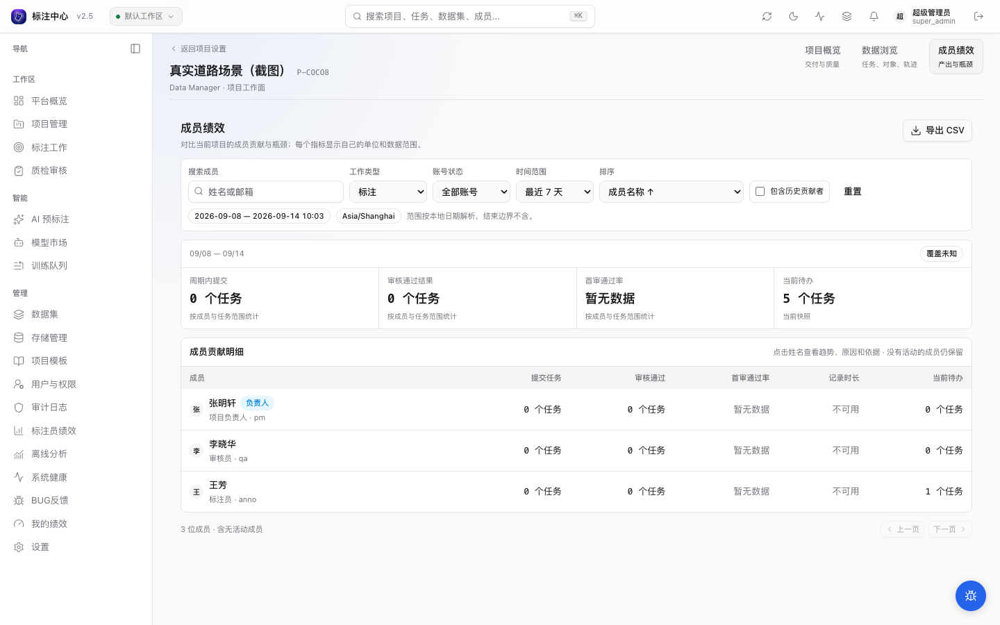
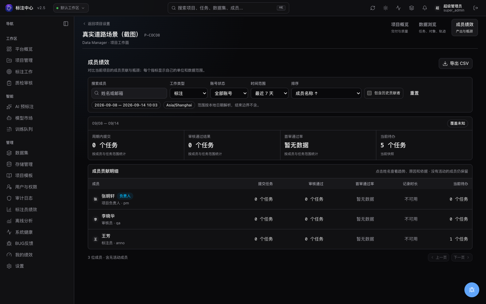

# Data Manager

Data Manager 用于在项目内查看交付进度、查找数据问题和管理成员工作。页面分为 **概览 / 数据 / 成员**：概览显示项目当前状态，数据提供任务、对象和轨迹查询，成员帮助项目负责人查看贡献、质量、已记录时长和待处理工作。

## 进入


在项目列表或卡片点击带表格图标的 **数据管理**，也可从项目设置的相同图标入口进入；漏斗图标用于筛选。原有链接仍直接打开数据区域：

```text
/projects/<project_id>/data-manager
```

**任务 / 对象 / 轨迹** 位于数据区域内部。桌面端左侧视图按内置、私有和项目共享分组，可收起侧栏；窄屏使用下拉框。右侧集中放置搜索、筛选、排序、列设置和列表/画廊切换。任务行打开“匹配对象”抽屉；对象或轨迹行打开实体详情，并可精确跳到工作台、任务与帧。任务列表和画廊复用媒体缩略图，点云使用明确的媒体类型占位。

成员区域仅项目负责人和超级管理员可见。普通成员继续使用自己的个人绩效页。

## 页面布局与滚动

数据区域使用页面滚动：项目标题、范围摘要和查询工具栏在结果上方，向下滚动时它们随页面移出视野，任务或对象列表随之占据可见页面。任务表保持每页 50 行，第 50 行之后紧跟分页控件；对象和轨迹列表沿用游标加载与虚拟化，纵向滚动的是同一个页面滚动容器，而不是表格内部的短滚动条。表头在结果仍可见时保持吸顶；列较多时，仅在表格内横向滚动，表格边框不超出结果区域，也不会撑宽整个页面。切换查询、排序、保存视图或粒度时回到结果开头；游标加载下一批时不改变当前视口位置。空结果保留原有的提示高度。

概览和成员区域保持各自的滚动方式，不受数据区域影响。

任务、对象和轨迹视图共用右上方的紧凑操作组：**统计** 展开或收起图表，**刷新** 重新获取数据，**保存视图** 保存当前查询配置。统计按钮的选中状态表示图表已展开。

结果工具栏把常用动作集中在一起：

- 关键词搜索、排序方向和列设置；
- “低置信”“有未解决问题”“人工标注”等一键筛选；
- 当前条件以可编辑芯片显示，点击芯片即可修改操作符和值，旁边的 × 可单独移除条件；
- 点击 **筛选** 后可按中文名称或字段标识搜索字段；
- 点击 **清除条件** 移除结构化和快捷条件，保留独立关键词、排序和列设置；当前保存视图会显示为未保存修改。

## 概览与统计范围

概览展示当前可见任务、已完成、待审核和未解决问题，以及状态与质量分布。可点击的状态或问题指标会带着对应条件进入数据区域。负责人还可查看最近一段时间的团队产出，并直接进入成员看板。当前存量和区间内产出分别标注，不混合为一个完成率。

Data Manager 同时显示两种数量：

- **可见任务**：当前用户在项目内有权访问的全部任务。项目负责人通常看到整个项目；标注员和审核员只统计其批次可见范围。
- **当前匹配**：应用保存视图、关键词和临时过滤条件后的任务数量。

紧凑摘要条展示当前匹配范围内的标注对象、AI 待审、低置信 AI 待审、逻辑轨迹和未解决问题；其中 **AI 待审** 和 **未解决问题** 可以点击，直接把对应筛选加入当前查询（再次点击同一格取消）。点击右上角 **统计** 会在概览条下方展开一个可折叠的聚合面板，折叠状态会被记住：图表展示任务状态、标注来源、类别、待审候选模型版本、候选置信度区间、几何类型或轨迹质量异常；详情还包含属性完整度和值分布，以及当前项目形态的分辨率、视频帧或点云标定摘要。在图表里点击任务状态、标注来源、类别或几何类型的柱子，即可把该取值加成一条筛选条件（再次点击同一柱取消），结果表和图表随之刷新；置信度区间、轨迹质量异常等没有对应筛选字段的维度只用于查看。这些聚合由服务端对完整匹配集合计算，不是当前页抽样；聚合与结果表使用相同的权限和过滤范围，不会通过统计数字暴露不可见批次。

## 三种查看粒度

| 粒度 | 一行代表                             | 适合回答                                                            |
| ---- | ------------------------------------ | ------------------------------------------------------------------- |
| 任务 | 一个标注任务                         | 哪些任务包含 AI 待审、特定来源、类别、属性或反馈                    |
| 对象 | 一个 active、非取消的单帧 annotation | 哪些具体对象满足类别 + 属性 + 来源条件，它们位于哪个任务或帧        |
| 轨迹 | 一条逻辑轨迹                         | 哪些轨迹跨越哪些帧，来源、关键帧、outside / occluded 与质量是否异常 |

对象视图不会先分页任务再展开，因此总数和分页都以对象为单位。视频 compact track 在轨迹视图中一条 annotation 对应一行，不会按关键帧重复；Scene 图片或点云按项目内共享的 track ID 聚合跨任务实例。没有轨迹能力的项目只显示任务和对象，不显示空的轨迹入口。

三种粒度拥有独立的内置视图、保存视图、默认列和排序。当前粒度、视图、搜索、筛选、排序、列与选中实体都会写入 URL；刷新或分享链接后可恢复，但接收者仍只能看到自己的项目和批次权限范围。

## 内置视图

所有项目都有以下 5 个只读视图：

| 视图         | 用途                                                        |
| ------------ | ----------------------------------------------------------- |
| 全部任务     | 项目内所有任务                                              |
| 待标注       | `task.status in ["pending"]`                                |
| 待审核       | `task.status in ["review"]`                                 |
| 有未解决问题 | `feedback.unresolved_count > 0`（按未解决问题计数）         |
| AI 待审      | 存在尚未接受/拒绝的 AI 检测 shape，或仍可审阅的 AI 追踪结果 |

系统还会按项目能力补充内置视图：配置了必填属性时显示“缺少必填属性”；视频项目显示“追踪候选待审”和“含轨迹”；Scene 项目显示“含插值标注”。没有对应能力时不显示空视图。

内置视图不会写入数据库。修改内置视图后点击 **保存视图** 会创建一个私有副本。

## 保存视图

保存视图会记录：

- 当前查看粒度（任务 / 对象 / 轨迹）
- 名称
- 关键词搜索
- 当前过滤条件
- 排序字段与方向
- 列显隐列表

从页面新建的视图为私有视图，只有创建者可见。已有的项目共享视图对项目成员可见，只有项目负责人或超级管理员能更新或删除它。删除视图只删除保存的视图配置，不删除任务、标注、预测或反馈。

创建后停留在新视图，分组修改会随保存和刷新保留。切换前可以选择继续编辑或放弃未保存修改；已经离开原项目或视图时，迟到的保存结果不会把页面切回原处。

## 过滤字段


页面可按任务编号、文件名或 Scene 搜索，输入停止后自动刷新结果。过滤条件使用受控条件芯片；字段、操作符、选项和类型来自当前项目与当前粒度的 Data Manager schema。字段选择器支持按显示名称、完整字段名和分组搜索。后端会拒绝未知字段、项目未启用的工具/属性、未知操作符和错误类型；页面不提供原始 JSON 编辑器。

已有的 AND/OR 组合条件会显示分组编辑器，可修改条件、添加组合和切换「全部满足 / 任一满足」。组的层级保留不变，独立关键词和快捷条件会作为额外的「且」条件加入；例如「AI 待审」中的检测或追踪条件不会在编辑时变成必须同时满足。

数字和区间在完整输入后才应用。输入 `1.`、只填一个区间端点或清空值时，保留上一次已应用的条件，并暂停保存和手动刷新；有效的 `0` 和「否」不会被当成空值。枚举列表可以多选，保存过但已不在建议中的值仍然显示。字段已删除、操作符不再支持或条件树超过结构上限时，页面显示错误并阻止查询与保存，保留原视图和链接供修正。

浏览器前进、后退、刷新和分享链接都会恢复对应条件。无法解析的 URL 状态会提示恢复失败并回到安全默认值；已有视图不会被自动覆盖。

当前页面可选字段（字段名含命名空间前缀）：

| 字段族      | 完整字段名                                                                                                                                                                                                 |
| ----------- | ---------------------------------------------------------------------------------------------------------------------------------------------------------------------------------------------------------- |
| task        | `task.keyword`、`task.status`、`task.assignee`、`task.reviewer`、`task.batch_id`                                                                                                                           |
| annotation  | `annotation.annotation_count`、`annotation.source`、`annotation.imported`、`annotation.annotation_type`、`annotation.tool_unit_id`、`annotation.class_name`、`annotation.has_track`、`annotation.track_id` |
| attribute   | `annotation.attribute.<tool_unit>.<key>`、`annotation.attribute_origin.<tool_unit>.<key>`                                                                                                                  |
| AI review   | `ai.pending_prediction_shape_count`、`ai.low_confidence_prediction_shape_count`、`ai.pending_tracker_job_count`                                                                                            |
| AI trace    | `prediction.model_version`（历史预测追溯）                                                                                                                                                                 |
| feedback    | `feedback.unresolved_count`（兼容别名）、`feedback.status`                                                                                                                                                 |
| issue       | `issue.unresolved_count`（未解决问题数）                                                                                                                                                                   |
| discussion  | `discussion.comment_count`（评论总数）                                                                                                                                                                     |
| video track | `keyframe.source`（启用视频轨迹能力时）                                                                                                                                                                    |
| scene       | `scene.scene_name`、`scene.frame_index`（仅 scene 项目）                                                                                                                                                   |

常见例子：

```json
{
  "op": "and",
  "rules": [
    { "field": "annotation.source", "op": "eq", "value": "prediction_based" },
    { "field": "annotation.attribute.bbox.color", "op": "eq", "value": "red" }
  ]
}
```

任务视图一次显示 50 条任务。对象和轨迹视图按 100 条一批使用游标继续加载，并对已加载结果做虚拟化；服务端实体查询的单次上限为 200 条，不会把全部标注拉到浏览器聚合。

**硬限制**：

- `in` 操作符值列表最多 **200** 项。
- 筛选树最多 **32 层、4096 个节点**，根节点计为第 1 层和第 1 个节点。
- 保存视图名称长度 **1–120** 字符。

对象视图中的多个 annotation 条件必须由**同一个对象**满足。例如“类别=car 且属性 color=red”不会因为任务里分别存在一个 car 和另一个 red 对象而误命中。任务视图仍以任务为结果，并在匹配对象抽屉中解释具体命中项。

“AI 待审”不是 prediction 行数：检测候选按 prediction 内剩余 shape 计算，排除已拒绝和已接受的 shape；视频 AI 追踪候选按仍带暂存结果、允许继续审阅的 tracker job 计算。

“低置信 AI 待审”使用相同的剩余 shape 范围，只统计候选自身 `score` 或 `confidence` 低于 50% 的项。没有候选分数时按 0 处理并进入低置信范围。Task 表不展示历史模型版本拼接或 prediction 平均分，因为它们混合多次运行后不能表达任务的当前质量；模型版本保留为历史追溯筛选，并在聚合图表中只按当前待审候选分布。

任务行的“匹配对象”按实际成立的条件分支解释结果：未成立的 OR 分支不会带入其他来源；低置信候选只显示相同阈值下仍待审的项。对象、检测候选和追踪结果共用连续分页与总数。筛选“待审候选数为 0”时，任务可以命中而没有候选明细。

空的 AND 或 OR 条件组视为不限制任务；单独命中时，“匹配对象”展示该任务的有效、未取消标注，不会因空 OR 而错误显示零项。空组与具体对象条件组成 AND 时，仍只展示命中对象条件的标注，不扩大范围。

## 列与项目类型

任务表可显示：

- `annotation_count`
- AI 检测候选待审数
- 低置信 AI 候选待审数（低于 50%）
- AI 追踪结果待审数
- `unresolved_issue_count`（未解决问题）
- `comment_count`（评论）
- 人工 / 接受 AI / AI 追踪 / 插值来源摘要
- 逻辑轨迹数
- `last_activity_at`
- 标注员 / 审核员

**未解决问题** 统计任务当前有效、开放且没有上级回复的主题问题（`kind=issue` 的根记录，状态 `open`）；回复、普通评论、已解决/搁置/删除的问题、缺陷和驳回记录都不计入。**评论** 统计任务当前的完整评论总数（工作台评论源里的原生任务评论 + 标注评论）；问题主题、问题回复和标注评论的镜像不重复计数。两列都独立于成员绩效的日期范围。例如：1 个未解决问题、2 条问题回复、3 条任务评论和 1 条标注评论显示 `未解决问题 1 / 评论 4`；解决该问题后变为 `0 / 4`，回复不会抬高任何一列。

旧的 `unresolved_feedback_count` 列、排序键和 `feedback.unresolved_count` 筛选保留为兼容别名，含义已对齐未解决问题计数；恢复显式保存过旧列的视图时会自动映射到新的问题列，数据库中的保存视图不会被改写。

页面使用统一的 Data Manager 壳层，但可用粒度、列和过滤器会按项目能力变化：

- 普通图片：显示分辨率、启用的 2D 工具、类别、属性和 AI 检测候选。
- scene 图片：在图片能力上增加 Scene 与帧。
- 视频：显示时长、FPS、总帧数、关键帧、不可见区间、compact track 和 tracker 待审；普通视频不显示 Scene/帧。
- 普通点云：显示相机路数、标定异常、启用的 3D box / point mask、类别和属性。
- scene 点云：增加 Scene、帧、Scene 总帧和跨 task 的 distinct track。

只有当前显示的昂贵列才会进入任务行聚合查询；取消列不仅隐藏前端内容，也会减少对应后端计算。

## 属性与轨迹搜索

属性字段由项目“类别与属性”配置生成，不允许搜索任意 JSONB key。select、boolean、number、text 和 multiselect 会得到与类型匹配的操作符；所有属性支持“已填写/缺失”。属性来源与标注来源分开：标注可能来自 AI，但某个属性已被人工修改；也可能是人工框上仍保留 AI 属性。

轨迹搜索以 `Annotation.track_id` 为准。视频 compact track 一条 annotation 通常是一条轨迹；scene 图片/点云则按跨 task 共享的 track ID 统计逻辑轨迹。对象详情展示属性值与逐键的 AI / 人工来源；轨迹详情展示可见成员、关键帧来源、遮挡/不可见状态和类别或属性不一致等质量信号。详情接口不返回 raw geometry。

## 标注图片预览

点击任务行、缩略图或画廊卡片打开“匹配对象”抽屉时，抽屉顶部会显示该任务的整图只读预览，默认叠加当前已保存的正式标注；工具栏可一键 **隐藏标注** 与原图对比。对象视图中选中一个图片对象后，实体详情顶部显示同一预览并高亮选中的对象。

预览覆盖普通图片和 Scene 图片任务中已保存的标注：边界框、旋转框、带孔洞或多连通域的多边形、折线、按项目骨骼配置渲染的关键点，以及实际像素掩码（掩码加载失败会明确提示并可重试，不会用外接矩形替代）。图像与几何共用同一缩放和偏移，含留白对齐；配色和骨骼来自当前项目配置。预览是只读的：不会产生标注修改、任务认领、锁定或工作流变化，编辑仍通过 **在工作台打开任务** 进入。

预览只读取当前打开任务的数据：媒体走任务读接口，标注走分页接口（每页 200 条）并按需“加载更多”；选中的对象不在第一页时会继续翻页直到找到或确认不存在。加载中、读取失败与空标注分别显示；后续页失败会保留已有内容并暂停自动翻页，点击重试后继续。只有全部页面成功读完仍未找到对象，才会提示对象可能已删除。

任务切换或关闭抽屉会取消未完成的请求，再次打开会重新读取当前保存内容。预览按各工具单元的类别和骨骼配置绘制，隐藏标注仍计入保存数量，但不显示也不下载其掩码。掩码下载中、失败或因内存预算暂未显示时均有提示；大图重试只刷新媒体读取，不触发切片重建。视频、视频轨迹和点云/多相机投影保持元数据和工作台跳转，暂不渲染密集叠加。

## 选定任务操作

项目负责人和超级管理员可以在任务列表或画廊勾选任务，再进行分派、导出或预标注。支持勾选当前页，并在同一查询下跨页保留明确的任务 ID，最多 200 个；不会自动选择全部匹配结果。切换搜索、筛选、保存视图、项目或账号会清空选择，单纯排序保留选择。

**分派**先选择标注员，可保留原值或恢复批次默认；未分批任务恢复默认后变为未分派。待审核任务还可指定审核员，其他状态会在预览中标明不适用。预览列出实际生效的前后指派、可更新数量及不可用原因；确认时再次校验权限、成员和锁。任务或指派已变化时需重新预览。锁定、归档或状态不适用的任务不会被强制改写，完成后显示实际成功、跳过和失败数量。单独指派只改变所选任务的访问与领取范围，不改变同批其他任务。

表格、画廊与人员筛选显示实际生效的指派；没有任务覆盖值时，沿用批次默认成员。显式指定任务负责人后，后续批次改派不会覆盖该任务，即使选中的人与当时批次默认相同；选择“恢复批次默认”后重新跟随批次变更。

**导出**选择当前媒体支持的格式后创建异步作业，范围始终是勾选任务。作业完成后可从任务铃下载。局部任务暂不支持 VOC、KITTI、nuScenes、Multi-camera COCO 和 Point Mask，需使用原项目或批次导出入口。

**运行预标**复用项目的模型与编排配置，只接受待标注、处于活动批次（或未分批）且没有编辑锁的任务。服务端与执行 worker 都会复核范围。导出和预标注保留作业编号、状态、失败原因与重试入口；清空选择后仍可查看刚提交的作业。

作业失败后可选择“重新运行”，沿用该次提交的任务与参数重新创建作业，无需重新勾选任务，也不会清空当前选择。重新运行仍需通过服务端的权限与状态检查。

## 成员绩效

项目负责人和超级管理员可从顶部 **成员绩效** 或项目操作菜单进入。看板用于查看项目内贡献和瓶颈，不生成综合评分或排名。



::: details 深色主题预览

:::

先选择标注或审核工作，再选择今天、最近 7 天、最近 30 天或自定义日期。页面显示实际时间范围与时区；自定义结束日期不包含当天，例如查看 9 月 1 日至 7 日需选择开始 9 月 1 日、结束 9 月 8 日。单次最多查询 90 天。数据浏览中的任务/对象筛选不会改变成员统计。

| 指标       | 含义                                                                                                                   |
| ---------- | ---------------------------------------------------------------------------------------------------------------------- |
| 已标注图片 | 区间内创建且仍保留标注的不同图片任务数，按任务实际媒体类型统计，不需要提交或审核；多人标注同一图片时项目汇总按图片去重 |
| 保留标注   | 区间内创建且仍保留的标注记录数；视频轨迹计一条，Scene 跨帧实例分别计数；删除或取消会减少计数                           |
| 提交任务   | 区间内实际提交人提交的去重任务数，重提次数单独展示                                                                     |
| 通过任务   | 区间内审核通过的去重任务，按该轮记录的贡献人归属                                                                       |
| 首审通过率 | 首次完成审核的任务中，通过的比例；待审不进入分母，历史不完整时提示缺失                                                 |
| 已记录时长 | 新采集器记录的可见工作区间，标注与审核分开；不是考勤时长                                                               |
| 当前待处理 | 查询时刻的任务存量，与所选时间区间内的产出分开                                                                         |
| 审核决定   | 区间内通过与驳回次数；同一任务的多轮审核可以有多次决定                                                                 |

所有当前成员和负责人都会显示，包括零活动、已停用或只读成员。开启“包含历史贡献者”后，可查看有项目记录但已不在当前成员列表中的人；这不表示系统知道其过去的成员身份或任职日期。

点击成员查看趋势、驳回原因、保留标注的类别/来源/几何分布及可继续加载的依据记录。人工、AI、导入和插值来源分开展示；已标注图片和保留标注是**区间内创建且当前仍保留**的保存内容，随删除、取消和修改变化，不作为不可变的历史产量，也不等同于提交产出。图片项目可以包含视频任务，图片计数只按任务的实际媒体类型统计。归属跟随记录的创建者/接受者/导入者，改派或他人后续编辑不会转移原有计数；在选定的日期区间之间移动旧对象不会产生新区间产出。列表、详情和 CSV 使用相同的项目、日期、时区与工作类型。项目去重总数独立计算，同一任务可能有多人贡献，因此不能用成员行相加替代项目总数。

修改成员搜索或筛选后，详情会清空，请从新列表重新选择成员。加载更多依据时会保留已显示记录。

跳过任务会保留在活动依据中，不计入提交产出。缺少采集或历史证据时显示不可用或覆盖不完整，不将其当成零；历史视频缺少送审记录时也会标记覆盖不完整。时长由客户端上报，服务端校验账号、任务归属和时间区间；它不能证明实际劳动投入，也不用于考勤或自动评分。首次审核事实和计时采集的技术口径见[项目成员绩效数据](../../dev/concepts/project-performance.md)。

## 边界

对象和轨迹查询保持只读。任务操作只针对显式勾选的任务；不提供“全部匹配结果”选择、批量审核、批量删除或清理预测。
