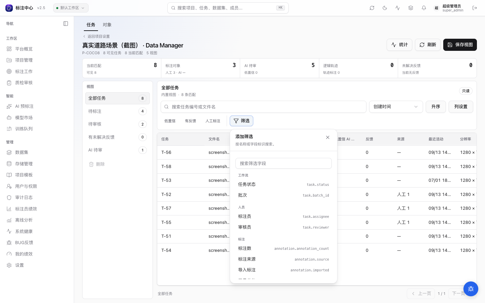

# Data Manager

Data Manager 是项目内的只读数据探索入口。它在同一页面提供任务、对象和轨迹三种查看粒度，以及当前视图聚合、可视化图表、搜索、结构化筛选、排序、动态列和保存视图，适合项目管理员或审核员定位 AI 待审、人工标注、轨迹、属性缺失与反馈问题。

## 进入


在项目设置页点击 **Data Manager**。也可以直接访问：

```text
/projects/<project_id>/data-manager
```

页面顶部只保留 **任务 / 对象 / 轨迹** 这一层粒度切换。桌面端左侧是当前粒度的视图列表，右侧是搜索、筛选、排序、列设置和结果表；窄屏会把视图列表收进下拉框。任务行会打开“匹配对象”抽屉；对象或轨迹行会打开实体详情，并可精确跳到对应工作台、任务与帧。

## 页面布局与滚动

Data Manager 使用单视口工作台布局：项目标题、当前范围摘要和查询工具栏保持在结果上方，长结果只在表格区域内部滚动，表头固定；打开统计或实体详情时，抽屉内容独立滚动。这样在大项目中切换条件、调整列或翻查结果时，不需要反复滚回页面顶部。

结果工具栏把常用动作集中在一起：

- 关键词搜索、排序方向和列设置；
- “低置信”“有反馈”“人工标注”等一键筛选；
- 当前条件以可编辑芯片显示，点击芯片即可修改操作符和值；
- 点击 **筛选** 后可按中文名称或字段标识搜索字段；
- 点击 **清除全部** 一次移除当前临时条件。

## 概览与统计范围

Data Manager 同时显示两种数量：

- **可见任务**：当前用户在项目内有权访问的全部任务。项目负责人通常看到整个项目；标注员和审核员只统计其批次可见范围。
- **当前匹配**：应用保存视图、关键词和临时过滤条件后的任务数量。

紧凑摘要条展示当前匹配范围内的标注对象、AI 待审、低置信 AI 待审、逻辑轨迹和未解决反馈。点击右上角 **统计** 打开完整聚合：图表展示任务状态、标注来源、类别、待审候选模型版本、候选置信度区间、几何类型或轨迹质量异常；详情还包含属性完整度和值分布，以及当前项目形态的分辨率、视频帧或点云标定摘要。它们使用服务端对完整匹配集合计算的聚合，不是当前页抽样。聚合与结果表使用相同的权限和过滤范围，不会通过统计数字暴露不可见批次。

## 三种查看粒度

| 粒度 | 一行代表 | 适合回答 |
|---|---|---|
| 任务 | 一个标注任务 | 哪些任务包含 AI 待审、特定来源、类别、属性或反馈 |
| 对象 | 一个 active、非取消的单帧 annotation | 哪些具体对象满足类别 + 属性 + 来源条件，它们位于哪个任务或帧 |
| 轨迹 | 一条逻辑轨迹 | 哪些轨迹跨越哪些帧，来源、关键帧、outside / occluded 与质量是否异常 |

对象视图不会先分页任务再展开，因此总数和分页都以对象为单位。视频 compact track 在轨迹视图中一条 annotation 对应一行，不会按关键帧重复；Scene 图片或点云按项目内共享的 track ID 聚合跨任务实例。没有轨迹能力的项目只显示任务和对象，不显示空的轨迹入口。

三种粒度拥有独立的内置视图、保存视图、默认列和排序。当前粒度、视图、搜索、筛选、排序、列与选中实体都会写入 URL；刷新或分享链接后可恢复，但接收者仍只能看到自己的项目和批次权限范围。

## 内置视图

所有项目都有以下 5 个只读视图：

| 视图 | 用途 |
|---|---|
| 全部任务 | 项目内所有任务 |
| 待标注 | `task.status in ["pending"]` |
| 待审核 | `task.status in ["review"]` |
| 有未解决反馈 | `feedback.unresolved_count > 0` |
| AI 待审 | 存在尚未接受/拒绝的 AI 检测 shape，或仍可审阅的 AI 追踪结果 |

系统还会按项目能力补充内置视图：配置了必填属性时显示“缺少必填属性”；视频项目显示“追踪候选待审”和“含轨迹”；Scene 项目显示“含插值标注”。没有对应能力时不显示空视图。

内置视图不会写入数据库。修改内置视图后点击 **保存视图** 会创建一个私有副本。

## 保存视图

保存视图会记录：

- 当前查看粒度（任务 / 对象 / 轨迹）
- 名称
- 关键词搜索
- 当前过滤条件
- 排序字段与方向
- 列显隐列表

从页面新建的视图为私有视图，只有创建者可见。已有的项目共享视图对项目成员可见，只有项目负责人或超级管理员能更新或删除它。删除视图只删除保存的视图配置，不删除任务、标注、预测或反馈。

## 过滤字段



页面可按任务编号、文件名或 Scene 搜索，输入停止后自动刷新结果。过滤条件使用受控条件芯片；字段、操作符、选项和类型来自当前项目与当前粒度的 Data Manager schema。字段选择器支持按显示名称、完整字段名和分组搜索。后端会拒绝未知字段、项目未启用的工具/属性、未知操作符和错误类型；页面不提供原始 JSON 编辑器。

当前页面可选字段（字段名含命名空间前缀）：

| 字段族 | 完整字段名 |
|---|---|
| task | `task.keyword`、`task.status`、`task.assignee`、`task.reviewer`、`task.batch_id` |
| annotation | `annotation.annotation_count`、`annotation.source`、`annotation.imported`、`annotation.annotation_type`、`annotation.tool_unit_id`、`annotation.class_name`、`annotation.has_track`、`annotation.track_id` |
| attribute | `annotation.attribute.<tool_unit>.<key>`、`annotation.attribute_origin.<tool_unit>.<key>` |
| AI review | `ai.pending_prediction_shape_count`、`ai.low_confidence_prediction_shape_count`、`ai.pending_tracker_job_count` |
| AI trace | `prediction.model_version`（历史预测追溯） |
| feedback | `feedback.unresolved_count`、`feedback.status` |
| video track | `keyframe.source`（启用视频轨迹能力时） |
| scene | `scene.scene_name`、`scene.frame_index`（仅 scene 项目） |

常见例子：

```json
{
  "op": "and",
  "rules": [
    { "field": "annotation.source", "op": "eq", "value": "prediction_based" },
    { "field": "annotation.attribute.bbox.color", "op": "eq", "value": "red" }
  ]
}
```

任务视图一次显示 50 条任务。对象和轨迹视图按 100 条一批使用游标继续加载，并对已加载结果做虚拟化；服务端实体查询的单次上限为 200 条，不会把全部标注拉到浏览器聚合。

**硬限制**：
- `in` 操作符值列表最多 **200** 项。
- 保存视图名称长度 **1–120** 字符。

对象视图中的多个 annotation 条件必须由**同一个对象**满足。例如“类别=car 且属性 color=red”不会因为任务里分别存在一个 car 和另一个 red 对象而误命中。任务视图仍以任务为结果，并在匹配对象抽屉中解释具体命中项。

“AI 待审”不是 prediction 行数：检测候选按 prediction 内剩余 shape 计算，排除已拒绝和已接受的 shape；视频 AI 追踪候选按仍带暂存结果、允许继续审阅的 tracker job 计算。

“低置信 AI 待审”使用相同的剩余 shape 范围，只统计候选自身 `score` 或 `confidence` 低于 50% 的项。没有候选分数时按 0 处理并进入低置信范围。Task 表不展示历史模型版本拼接或 prediction 平均分，因为它们混合多次运行后不能表达任务的当前质量；模型版本保留为历史追溯筛选，并在聚合图表中只按当前待审候选分布。

## 列与项目类型

任务表可显示：

- `annotation_count`
- AI 检测候选待审数
- 低置信 AI 候选待审数（低于 50%）
- AI 追踪结果待审数
- `unresolved_feedback_count`
- 人工 / 接受 AI / AI 追踪 / 插值来源摘要
- 逻辑轨迹数
- `last_activity_at`
- 标注员 / 审核员

页面使用统一的 Data Manager 壳层，但可用粒度、列和过滤器会按项目能力变化：

- 普通图片：显示分辨率、启用的 2D 工具、类别、属性和 AI 检测候选。
- scene 图片：在图片能力上增加 Scene 与帧。
- 视频：显示时长、FPS、总帧数、关键帧、不可见区间、compact track 和 tracker 待审；普通视频不显示 Scene/帧。
- 普通点云：显示相机路数、标定异常、启用的 3D box / point mask、类别和属性。
- scene 点云：增加 Scene、帧、Scene 总帧和跨 task 的 distinct track。

只有当前显示的昂贵列才会进入任务行聚合查询；取消列不仅隐藏前端内容，也会减少对应后端计算。

## 属性与轨迹搜索

属性字段由项目“类别与属性”配置生成，不允许搜索任意 JSONB key。select、boolean、number、text 和 multiselect 会得到与类型匹配的操作符；所有属性支持“已填写/缺失”。属性来源与标注来源分开：标注可能来自 AI，但某个属性已被人工修改；也可能是人工框上仍保留 AI 属性。

轨迹搜索以 `Annotation.track_id` 为准。视频 compact track 一条 annotation 通常是一条轨迹；scene 图片/点云则按跨 task 共享的 track ID 统计逻辑轨迹。对象详情展示属性值与逐键的 AI / 人工来源；轨迹详情展示可见成员、关键帧来源、遮挡/不可见状态和类别或属性不一致等质量信号。详情接口不返回 raw geometry。

## 边界

Data Manager 不支持批量写操作，包括批量指派、批量改状态、批量导出、重跑预标、清理预测或跨页 select all。需要执行流程动作时，仍使用批次管理、AI 预标注或导出入口。
