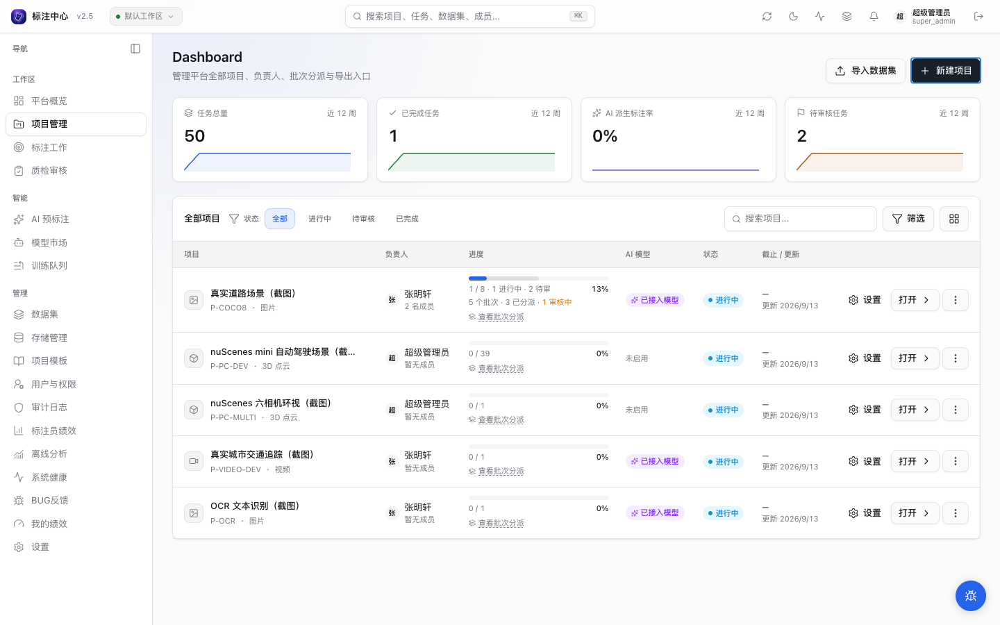
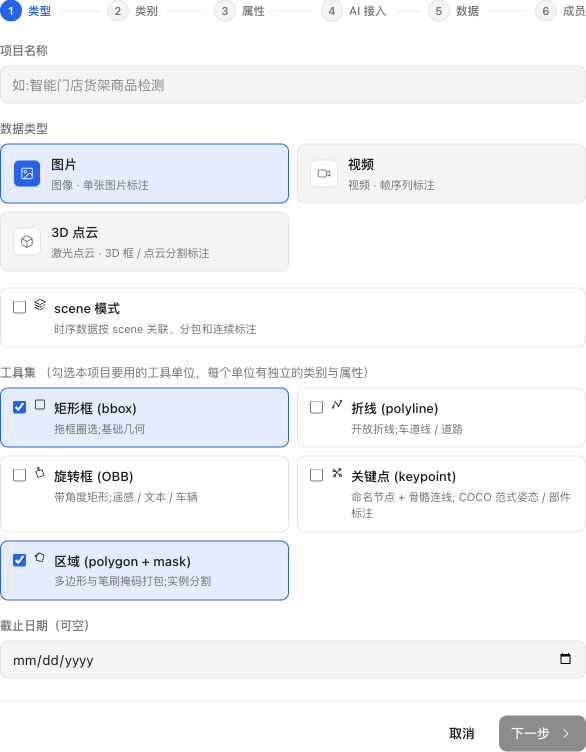

# 创建项目

> 适用角色：项目管理员 / 超级管理员

<!-- TODO(0.8.1) IMAGE_CHECKLIST: ProjectsPage「新建项目」按钮高亮。 -->

## 步骤

1. 顶部菜单 → 「项目管理」 → 「新建项目」
2. 填写基本信息：
   - **项目名**
   - **数据类型**：图片 / 视频 / 3D 点云（三选一，v0.10.17 起从原 7 种 type_key 收敛）
   - **工具集**（v0.10.17+, 多选）：勾选本项目要用的工具单位
     - **矩形框 (bbox)**：拖框圈选,基础几何
     - **区域 (polygon + mask)** ⭐ 打包：实例分割,多边形与笔刷掩码一起启用
     - **AI 交互** ⭐ 打包：SAM 点 / 框 / 文本 / 示例 + Magic Box 一起启用
     - **折线 (polyline)** / **旋转框 (rotated_bbox)** / **关键点 (keypoint)**：图片项目可用的新几何工具
     - **3D 立体框 (lidar_box_3d)**：本版置灰,后续版本上线
   - **类别 + 属性**：每个启用的工具单位独立编辑（v0.10.17+, 详见下文「工具维度类别 / 属性」）
   - **AI 接入**（可选）：启用 AI 预标注，并可复用其它项目已注册的 ML Backend
3. 上传初始数据集（zip / 图片直传 / OSS 路径）
4. 设置标注规范文档（Markdown，标注员在工作台可见）
5. 配置审核策略：
   - **单审**：1 名审核员通过即可
   - **双审**：2 名审核员一致才通过
   - **采样审核**：随机抽 N% 审核

## 工具维度类别 / 属性（v0.10.17+）

v0.10.17 起,类别与属性 schema 按**工具单位**(`tool_unit`)**强隔离**绑定:

- 每个被启用的工具单位**独立**持有自己的类别列表与属性 schema。
- 不同工具下的同名类是两条**独立**记录,可同名不同色。例如 bbox 工具下的「人」(红色) 与 region 工具下的「人」(蓝色) 互不干扰。
- 工作台切换工具时,左侧调色板会自动切换为对应工具单位的类别集。

**典型场景**:

| 场景 | 工具集勾选 | 类别配置 |
|---|---|---|
| 道路检测 | bbox + region | bbox: 人 / 车 / 交通标识; region: 可行驶区 / 天空 |
| 商品标注 | bbox + AI 交互 | bbox: 商品 / 价签; AI 交互: 用 SAM 智能框定细节 |
| 仅 AI 加速 | 仅 AI 交互 | AI 交互单位下配类别, 用 SAM 反复迭代 |

**注意**:

- 强隔离意味着**跨工具复用同名类需要重复输入**(bbox 加「人」 / region 加「人」是两次操作)。后续版本视客户反馈可能加可选「类别软关联」链。
- v0.10.16 之前创建的旧项目升级后,默认按 `type_key` 推断:`image-seg` → region unit;其它 → bbox unit。若实际混用 polygon 工具,需到项目设置页把类**复制**到 region unit。
- 详细架构决策见 [ADR-0026](../../dev/adr/0026-tool-unit-class-and-attribute-binding)。

<!-- TODO(0.8.1) IMAGE_CHECKLIST: 6 步 wizard 各步关键截图（基本信息 / 类型 / 类别 schema / 属性 schema / AI 接入 / 审核策略），可拼成一张长图。 -->

## 标注指引（v0.10.13+）

为项目编写 Markdown 形式的标注指引，工作台首次打开会自动展开浮层让标注员阅读。详见
[标注指引（Annotation Guide）](./annotation-guide.md)。

## 从已有项目复制配置（v0.10.11+）

如果新项目的 classes / 属性 schema / AI 接入配置 / 渲染配置等与既有项目相同（或大致相同），可以直接复制配置：

1. 在 Dashboard 找到要复制的项目卡片 → 右下角 `⋮` → 「复制项目配置」。
2. 自动跳到 Wizard，顶部出现 banner「已用源项目配置预填表单」；新项目名默认为 `{源项目名} (副本)`。
3. 7 步流程正常往下走，任何字段都可以在某步覆盖（你的修改优先于源配置）。
4. 提交后新项目就绪。**只复制配置**：classes / classes_config / attribute_schema / AI 配置 / label_config / rendering_config / 阈值 / 采样规则等。**不复制运行时数据**：datasets / tasks / annotations / members / batches。

> 需要跨项目共享 / 跨组织共享 / 模板版本管理？v0.10.14 起补上「项目模板库」独立资产形态，
> 详见 [项目模板库（Project Templates）](./project-templates.md)。

v0.10.13 起在 banner 中新增 checkbox **「同时复制标注指引」**（默认勾选）：复制配置时连
带源项目的 Markdown 指引与图片资源带过来。图片资源 storage key 与源项目共享，源项目删除资源会影响
新项目；如需独立资源在新项目设置页里重新拖入图片即可。

## 导入外部预测（v0.10.52+）

项目管理员可以在 Dashboard 找到项目卡片 → 右下角 `⋮` → 「导入预测」打开导入向导。该入口不要求项目已绑定 ML Backend，适合把客户自训模型产物以 AAP JSON / COCO Detection / YOLO zip 形式导入为待采纳预测。

导入向导支持一次选择多个 JSON 文件，并在后端作为同一个批次处理后汇总写入 / 跳过 / 错误数量。v0.10.57 起「替换已有外部导入预测」默认开启，重导同一批文件会先按 task 清掉旧的 `source='external_import'` 预测，再写入新预测；不会删除 ML Backend 生成的预标。需要保留旧导入时，取消勾选该选项即可追加。

COCO 文件如果 `images[]` 缺 `width/height`，可在向导里填写全局默认宽高；文件内已有尺寸时仍优先使用文件内尺寸。YOLO 选择一个 zip 包，并在向导里选择 `det` / `obb` / `seg` 变体。

AAP JSON 当前支持 `bbox` / `polygon` / `multi_polygon` / `polyline` / `rotated_bbox` / `keypoint` 预测导入；同一条 `predictions[i]` 也可以用 `shapes[]` 合并多个 shape。视频几何暂不导入。格式细节见 [导出格式 · AAP JSON](../reference/export-formats#aap-json-v12无损)。

YOLO zip 需包含 `classes.txt` 或 `data.yaml`，以及每图一个 label `.txt`。label 路径按文件 stem 匹配任务，例如 `labels/animals/cat/001.txt` 会匹配项目内 `animals/cat/001.jpg/png/...`；同名跨目录或跨扩展名有歧义时会在预览 errors 里提示，不会自动猜测。

## 清理预测（v0.10.57+）

项目管理员可以在 Dashboard 项目卡片 → 右下角 `⋮` → 「清理预测」按来源删除当前项目的候选预测：

- **外部导入预测**：默认选项，适合撤销导入或在重新整理文件前清空旧导入。
- **ML Backend 预标**：会删除平台模型跑出的预标候选，清理后需要重新运行模型才能恢复。
- **全部预测**：同时删除外部导入与 ML Backend 预标。

弹窗会先统计将删除的数量。选择 ML Backend 预标或全部预测时，需要额外勾选确认；已采纳的人工标注不会被删除。

## 任务生成

项目创建或数据集关联后，每条数据会自动生成一个任务，状态为 `pending`，等待分配。

如果数据集已经关联到项目，后续在数据集页继续上传文件、上传 ZIP 或执行「扫描导入」，新增文件也会同步生成项目任务；无需先取消关联再重新关联。

## 常见问题

**类别如何后续修改？**
进入项目设置页的「类别与属性」可按工具单位追加类别和属性 schema；删除已用类别 / 属性会先显示受影响标注数。删除定义不会删除标注数据：加回同名类别或同 key 属性即可恢复。工作台 ⚙ 菜单可临时隐藏孤儿标注；需要永久清理时由项目负责人或超管执行 cleanup。

**能否中途切换 ML Backend？**
可以，在项目设置的「ML 模型」中切换绑定的 backend；已生成的预标注不会重跑，需手动触发「重新预标注」。
