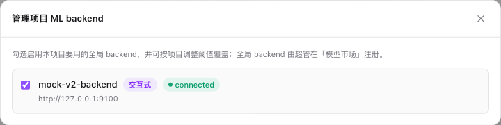

# 启用 ML 后端

> 适用角色：项目管理员 / 超级管理员

每个项目从**全局 ML backend 注册表**里勾选启用一个或多个 backend，用于工作台交互式 AI 工具（智能点 / 智能框 / Exemplar，均为画布手势驱动）和批量预标注（文本「找全图」/ 几何 / OCR / 版面）。本页解释项目侧的**启用、设主后端**两件事。物理 backend 的全局注册（新增 / 编辑 / 删除）是超管在[模型市场](../superadmin/model-market.md)的职责；项目侧只做启用，不复制 backend。推理参数（如检测阈值）不在项目设置预设，而是在工作台 / 预标**运行时**按 backend 自报的 `/setup.params` 调整（详见下）。

> **项目绑定的是服务池**：项目启用与主后端下拉在底层绑定的是**服务池**（`ml_backend_pool_id`，ADR-0050 的逻辑路由边界），不再是单个物理实例。每个全局 backend 注册后自动得到一个 singleton 服务池，off 模式下项目体验与单实例完全一致；当超管把多个等价实例加入同一池并切到 `observe|enforce` 模式时，平台会在池内自动选择实例，项目侧无需改动。`/projects/:id/ml-backends/pools/available` 与 `/pools/:pool_id/enablement` 是项目侧的服务池启用 API；旧 `ml_backend_id`（实例 id）字段仍被公共 schema 接受以兼容老前端 / SDK，内部解析回 singleton 池。

> **交互线 / 批量线分流**：启用多个后端时，工作台 AI 按角色 + 能力路由——交互工具(point/interactive_box/exemplar)自动路由到支持该 prompt 的交互后端，批量预标走批量后端，两条线**同时就绪**。例如 yolo 设为项目主后端（批量几何）+ gsam2 启用：批量运行走 yolo，工具栏 point/interactive_box 自动命中 gsam2。文本「找全图」属批量线（不在工具栏）。详见 [AI 工具组 § 交互后端选择](../workbench/sam-tool.md#交互后端选择多后端)。

## 启用一个全局 backend

进入 **项目设置 → ML 模型** 标签。页面上方是 AI 预标注设置，下方是**全局 backend 启用清单**——列出注册表里全部 backend（含 env 自动注册项），点「管理 backend」在悬浮面板里逐个勾选「启用」：

- **启用开关**：勾选后该 backend 对本项目可用（成为工作台 AI 与批量预标的可选项）。取消勾选即对本项目停用，不影响其它项目，也不删除全局注册项。

> **推理参数不在此预设**：检测阈值（如 `box_threshold` / `text_threshold`）这类参数因 backend 而异（由协议 `/setup.params` 自描述），统一在工作台「当前题 AI」面板与 `/ai-pre` 跑批配置里**运行时**按所选 backend 动态渲染调整、即调即生效；项目级 `box_threshold`（默认 0.35）仅作 `/setup` 拉取失败时的兜底。

每行还展示全局注册项自带的能力快照（`supported_prompts` / `supported_trackers`）、URL、鉴权方式与 `max_concurrency` 并发闸——这些由超管在全局注册时设定，项目侧只读。

> **没有可启用的 backend？** 说明超管还没在全局注册表注册任何物理 backend。env 配置的 backend 启动后会自动成为全局注册项（`source=env`），无需手动注册即可在清单里看到并启用；其余 backend 由超管在[模型市场 → 注册管理](../superadmin/model-market.md)注册。

> **交互能力 / 支持模态自动探测**：「是否交互式 backend」「支持哪些 prompt / tracker」不需要手填，由平台在**健康检查**时探 backend 的 `/setup` 派生（`is_interactive` / `supported_prompts`（图像 prompt）/ `supported_trackers`（视频 tracker））。这些是全局注册项的属性，超管在模型市场注册并健康检查后即写库，项目启用清单只读展示。

## 配置 AI 预标注与项目主后端

在页面上方的 **AI 预标注设置** 中：

- 在 **项目主后端** 下拉中选择——下拉只列**本项目已启用**的 backend。**设了项目主后端即视为启用 AI 预标注；留空 = 不启用**（无需单独的启用开关）。
- 可设置 **AI 框去重阈值**。
- **交互式 AI 工具** 总开关：控制标注员能否在工作台使用交互式 AI 工具（智能点 / 智能框 / Exemplar / Magic Box）。**默认开启**，关闭后工作台不再显示这些工具（不影响批量预标注）。底层字段 `ai_interactive_enabled`。
- 点 **保存 AI 设置**。

这些字段统一收口到 **ML 模型** 页。

## 从列表快捷设为项目主后端

> **启用 ≠ 主后端**：项目可启用多个 backend，它们都可用；「项目主后端」只是单个 `ml_backend_id` 指针，用作工作台 AI 与新建预标配置的初始选择 / fallback，并非「唯一可用」，且只能从已启用的 backend 里选。多阶段预标注中，每个阶段显式选择的 backend/model 仍然独立生效。

在启用清单某行点 **「设为主后端」**：

- 会同时把项目 `ml_backend_id` 设为该 backend、`ai_enabled` 置 true。
- 作为主后端的行显示蓝色 `主后端` 角标，其他已启用行仍可点 **「设为主后端」** 调整。
- 工作台进入时会拉这个 backend 的 `/setup`，按返回的 `supported_prompts` 决定工具栏哪些 AI 工具置灰。
- **模态校验**：设主后端时平台会按项目数据类型校验——视频项目只能设自报 `supported_trackers`（支持视频追踪）的 backend，否则拒绝。若 backend 此刻不可达探测失败，则放行（不因瞬时宕机卡住操作）。

## 能力列

清单的「能力」列展示每个 backend 的 `supported_prompts` 与 `supported_trackers`（视频追踪），例如：

- `grounded-sam2`：`point` `interactive_box` `text` `sam2_video`（最后一项为视频追踪能力徽标）
- `sam3-backend`：`point` `interactive_box` `text` `exemplar`，以及 `sam3_video` / `sam3_video_interactive` 视频追踪能力
- `yolo-backend`：`none` `text` `exemplar`（闭集检测/分割/关键点/旋转框走批量线；YOLOE 视觉提示走 Exemplar）

数据来自后端 `GET /setup`（详见 [开发文档 § ML Backend Protocol](../../dev/reference/ml-backend-protocol.md)）。后端如返回 `—`，说明 `/setup` 不可达或协议信息不完整。

模型市场会展示更完整的 model 粒度能力，包括「可接受输入」（整图 / 裁剪图 / 框提示 / 点提示）、「输出几何」、「输出属性」、资源画像和变体轴。多阶段预标会用「可接受输入」判断下游阶段能否消费上游框：分类器通常吃裁剪图，框提示分割模型通常吃框提示。

## 视频 tracker 如何选择 backend

视频工作台不是把所有 tracker 都发送给项目主后端。发起追踪时，平台会从本项目**所有已启用 backend** 中查找 `supported_trackers` 包含所选 `model_key` 的实例：

1. 项目主后端支持该 tracker 时优先使用。
2. 主后端不支持时，改用其它声明该 tracker 的 connected backend。
3. 没有任何已启用 backend 声明该 tracker 时，模型在追踪面板中置灰或提交时报不支持。

因此 SAM2 框追踪、SAM3 文本检测追踪和 SAM3 点框交互追踪可以由不同 backend 承载。项目主后端只是初始选择与同能力优先项，不是视频 tracker 的唯一执行后端。排查置灰模型时，先确认对应 backend 已对项目启用，再做一次健康检查刷新 `supported_trackers` 能力快照。

## 停用与切换

| 操作                             | 影响                                                                                                                                           |
| -------------------------------- | ---------------------------------------------------------------------------------------------------------------------------------------------- |
| **停用 backend**（取消勾选启用） | 该 backend 对本项目不再可用。如果它是当前项目主后端，项目 `ml_backend_id` 自动置 null、`ai_enabled` 不变。不影响其它项目，也不删除全局注册项。 |
| **切换主后端**                   | 切换 `ml_backend_id` 并同步 `ai_model` 展示名，老 backend 仍保持启用。                                                                         |

> 物理删除全局 backend 是超管职责，在[模型市场 → 注册管理](../superadmin/model-market.md)操作。

## 常见问题

**Q: 已经生成的预标注会受切换 backend 影响吗？**
不会。已写库的标注不会被回滚；只有新触发的预标注/交互式调用会走新 backend。

**Q: 我直接改 DB 改启用状态可以吗？**
可以，但工作台侧仍应通过启用清单和页面下拉显式操作。绕过 UI 直接改 DB 容易造成路由不清晰，运维纪律上不建议这么做。`max_concurrency` 限制请求并发；显存预算与驱逐由 GPU 资源声明和仲裁门禁负责，二者都不再依赖项目级 backend 数量上限。

**Q: 工具栏某个 AI 工具是灰的怎么办？**
按 ADR-0020 的能力协商约定，工具栏交互工具只 enable **任一已启用交互后端** `supported_prompts` 支持的项，不再只看项目主后端。Hover 灰按钮会显示「当前后端不支持此交互模式」。如果你需要那个交互模式，启用一个声明支持它的 backend 即可（无需设为主后端）。

## 相关文档

- 协议契约：[ML Backend Protocol](../../dev/reference/ml-backend-protocol.md)
- 架构决策：[ADR-0019 Prompt-first ToolDock + 1:N 架构](../../dev/adr/archive/0019-prompt-first-tooldock-1n-arch.md)、[ADR-0020 Capability 协商](../../dev/adr/archive/0020-ml-backend-capability-negotiation.md)
- 工作台侧使用：[AI 工具组](../workbench/sam-tool.md)
