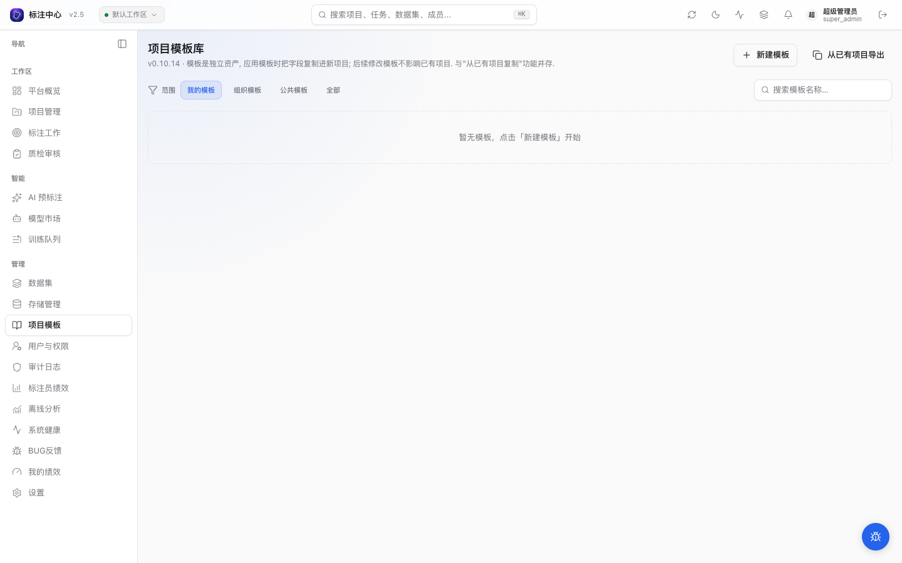

# 项目模板库（Project Templates）

> 适用角色：项目管理员 / 超级管理员

项目模板是可复用的项目配置资产。模板可被多个新项目引用，跨项目共享 classes、属性 schema、AI 配置和标注指引；与「[从已有项目复制配置](./index.md#从已有项目复制配置)」并存。

## 模板 vs 复制

|  | 从已有项目复制 | 项目模板库 |
|---|---|---|
| 形态 | 一次性快照 | 独立资产，可演进 |
| 来源 | 必须存在源项目 | 手工建 / 从源项目导出 |
| 跨组织共享 | 不能 | scope=organization / public |
| usage 统计 | 无 | 模板被引用次数自动累加 |
| 适用场景 | 偶发复用 | 标准模板 / 内置模板 / 跨项目共享 |

两者并存。**简单一次性需求继续用「复制项目」即可**；只在「跨项目复用」需求出现时建模板。

## 入口

侧边栏 → **管理** → **「项目模板」**（`/project-templates`）。

模板库页面包含四个 tab：

- **我的模板**：自己创建的私有模板（`scope=private`）
- **组织模板**：本人所在 organization 内被共享的模板（`scope=organization`）
- **公共模板**：全平台公共模板（`scope=public`，仅超级管理员可创建）
- **全部**：不按 scope 过滤的全量视图

支持按模板名称搜索。

## 创建模板

两种入口：

### 1. 「+ 新建模板」

- **基础信息**: 名称 / 描述 / 项目类型 / 标注指引（Markdown）/ 可见范围。
- **工具与类别**: 与新建项目向导相同的多 unit 编辑界面 — 勾启用工具单位(bbox / region / ai_interactive 等),在每个 unit 内独立编辑类别与属性 schema。详见[创建项目 · 工具维度类别 / 属性](./index.md#工具维度类别--属性)。
- **渲染配置**: 模板可携带渲染配置；若需要细调，也可以应用模板创建项目后再到项目设置页修改。

### 2. 「从已有项目导出」

- 选择一个本人有权访问的项目。
- 后端自动 dump 该项目的可克隆字段与 `annotation_guide`，导出为私有模板。
- 导出后即可在模板库中进一步编辑。

## 应用模板创建项目

<!-- TODO(v0.14.18) IMAGE_CHECKLIST: images/projects/template-apply-banner.png — 从模板创建 Wizard 顶部 banner [manual] -->

在模板卡片点击「应用」→ 跳转到 CreateProjectWizard，顶部出现 banner「已用模板字段预填表单」。
后续步骤与普通新建相同；任意字段可在某步覆盖（你的修改优先于模板配置）。

提交后：

- 新项目的字段从模板 deepcopy（**修改新项目不影响模板**）。复制白名单（`CLONEABLE_PROJECT_FIELDS`）为：`type_label`、`type_key`、`data_type`、`tool_bindings`（类别与属性 schema）、`ai_enabled`、`label_config`、`sampling`、`maximum_annotations`、`show_overlap_first`、`iou_dedup_threshold`、`box_threshold`、`text_threshold`、`rendering_config`。**不复制**运行时数据（datasets / tasks / annotations / members / batches）。
- 模板 `usage_count` + 1。
- 模板的 `annotation_guide` 文本会复制到新项目；**guide_assets（图片资源）不会复制**，需要在新项目设置页重新上传。

## 可见范围（scope）

- **私有 (private)**：仅创建者可见、可编辑。默认值。
- **组织 (organization)**：同 organization 的所有成员可见、可用；仅创建者 / 超级管理员可编辑 / 删除。
- **公共 (public)**：全平台可见、可用；**仅超级管理员可创建**。

普通项目管理员不能直接创建公共模板；需要公共模板时由超级管理员创建或调整 scope。

## 克隆模板

**项目管理员或超级管理员**对任意可见模板均可点「克隆」按钮，生成一份属于当前用户的私有副本（`scope=private`、`name=原模板 (副本)`），方便基于既有公共/组织模板做小幅修改后再用。其他角色无此权限。

## 删除模板

- 仅创建者 / 超级管理员可删除。
- 删除带 `usage_count > 0` 的模板会弹确认提示，但**不阻拦**；删除后已基于该模板创建的项目不受影响（字段已 deepcopy 落到项目上）。

## 与 annotation_guide 的关系

- 模板**存** `annotation_guide`（Markdown 文本，与 [标注指引](./annotation-guide.md) 共享同一字段语义）。
- 模板**不存** `guide_assets`（图片资源 storage key）——
  - 跨实例 storage key 引用混乱；
  - 跨组织私密性风险；
  - 源项目删除资产会让所有依赖模板的项目失效。

如果你的指引文档大量依赖图片，模板只能复制 Markdown 文本。应用模板后请在新项目里重新上传图片资源，避免跨项目共享 storage key。

## 常见问题

**模板和「复制项目」如何取舍？**

- 一次性 / 偶发复用：用复制即可。
- 标准模板 / 多项目共享：建模板，享 usage 统计 + 跨组织能力。

**改模板会影响已基于该模板创建的项目吗？**

不会。应用模板时字段 deepcopy 落到新项目，后续模板修改不会回流。

**模板可以维护 changelog 吗？**

当前模板编辑是直接覆盖字段，不提供模板版本历史。需要追溯时看项目创建审计和模板更新审计。
