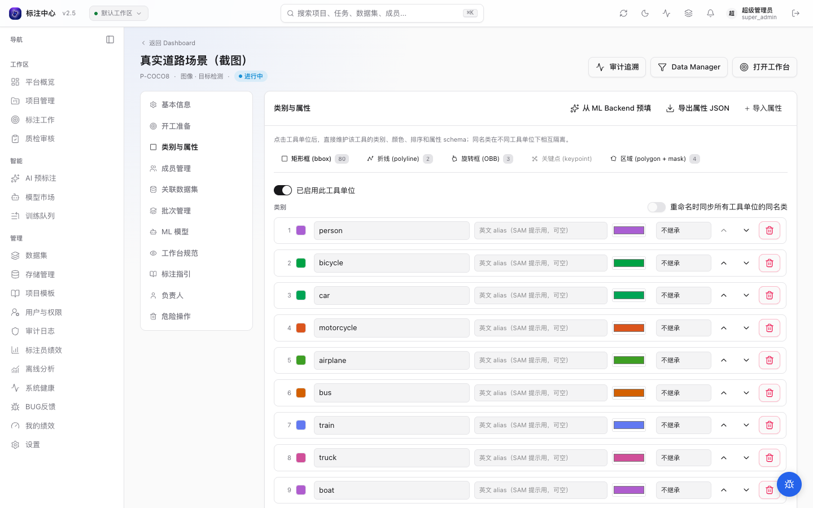

# 工具维度类别 / 属性

> 适用角色：项目管理员 / 超级管理员

本页是配置参考，讲清类别与属性 schema 如何按**工具单位**绑定，以及与之关联的几个配置开关（遮挡样式、视频单帧 / 轨迹框）。创建项目的整体流程见 [创建项目](./index.md)。

## 按工具单位强隔离绑定

类别与属性 schema 按**工具单位**（`tool_unit`）**强隔离**绑定：

- 每个被启用的工具单位**独立**持有自己的类别列表与属性 schema，互不共享。
- 不同工具下的同名类是两条**独立**记录，可同名不同色。例如 bbox 工具下的「人」（红色）与 region 工具下的「人」（蓝色）互不干扰。
- 工作台切换工具时，左侧调色板会自动切换为对应工具单位的类别集；当前激活类别若不在新工具的类别集里，会自动切到该工具的首个类。

底层存储是 `Project.tool_bindings`，形状大致为 `{ 工具单位: { enabled, classes, attribute_schema, ... } }`，这是类别 / 属性配置的**唯一存储真值**。导出（COCO / YOLO / AAP JSON）时再从这里按工具单位拍平。详细架构决策见 [ADR-0026](../../dev/adr/0026-tool-unit-class-and-attribute-binding)。

工具单位枚举（与后端 `ToolUnitId` 对齐）：`bbox`、`region`（polygon + mask 打包）、`ai_interactive`（SAM 系列 + Magic Box 打包）、`polyline`、`rotated_bbox`、`keypoint`、`lidar_box_3d`、`point_mask_3d`。每个工具单位的具体含义见 [创建项目 · 工具集](./index.md)。

### 典型场景

| 场景 | 工具集勾选 | 类别配置 |
|---|---|---|
| 道路检测 | bbox + region | bbox：人 / 车 / 交通标识；region：可行驶区 / 天空 |
| 商品标注 | bbox + AI 交互 | bbox：商品 / 价签；AI 交互：用 SAM 智能框定细节 |
| 仅 AI 加速 | 仅 AI 交互 | AI 交互单位下配类别，用 SAM 反复迭代 |

### 注意事项

- 强隔离意味着**跨工具复用同名类需要在每个工具单位各自建一次**（bbox 加「人」、region 加「人」是两条独立记录）。以下两项能力可在不破坏隔离的前提下减少重复劳动：
  - **颜色 / alias 软关联**：在「类别」区把某工具单位的类「链接」到另一工具单位的同名类，继承其颜色与 alias（显示层继承，链接后这两项只读，清除链接即可单独编辑）。它只影响画布显示取色，不改变存储、标注归属与导出（COCO / YOLO 仍按各工具单位独立类输出）。
  - **批量重命名**：当多个启用工具单位存在同名类时，重命名弹窗会出现「重命名时同步所有工具单位的同名类」开关，开启后一次改全；默认关闭，仅改当前工具单位。
- 从旧项目迁移来的配置会按历史 `type_key` 自动推断默认工具单位（例如 image-det / video-track 的类默认归入 `bbox`）；如果项目实际混用了 polygon / bbox 等工具，建议在项目设置页逐个工具单位检查并补齐类别。

## 属性字段 ·「遮挡样式」开关

> 起始版本：v0.11.27

在某个工具单位的属性 schema 里，给一个 **boolean（开关）字段** 勾上「遮挡样式」后，当该属性值为 `true` 时，工作台 / 审核界面上对应的标注框会渲染为**虚线 + 半透**，用来表达「目标被遮挡」。

- 「遮挡样式」**仅支持 boolean 字段**，给非开关字段勾选会被后端拒绝。
- 切换方式沿用属性自带的**数字键 hotkey（1-9）**或属性面板里的开关；图片侧旧的字母 `O` 键 / 右键「标记遮挡」已废弃。
- 因为它本质就是一个普通属性，遮挡值会随属性一起进导出（COCO `annotations[].attributes` / YOLO `attribute_schema.json`），无需额外配置；勾「遮挡样式」只影响画布渲染，不改变导出内容。
- **仅图片任务消费**这个渲染开关。视频任务的遮挡是另一套机制（轨迹关键帧自带 `occluded` 字段，工作台用 `Q` 键逐帧切换），与本开关无关。

## 视频 bbox ·「单帧框 / 轨迹框」独立开关

> 起始版本：v0.11.29

视频项目启用 bbox 工具单元后，「类别与属性」面板会多出一行**可用工具**，含「单帧矩形框」与「轨迹矩形框」两个独立开关（对应底层的 `video_modes.box` / `video_modes.track`）。

- 两者**共用同一套类别、颜色、排序与属性 schema**；开关只控制工作台允许新增哪种标注。
- **至少保留一个可用**：当只剩一个开着时，该开关会被禁用（提示「至少保留一个可用工具」），无法关到两个都关。
- 关闭某一种后，工作台不再提供对应的新增工具；**已有标注与配置仍保留**，重新开启即可继续新增。
- 该开关只做工具栏可用性过滤，不会强制校验或删除已存在的 annotation。老项目未设置时两者默认均可用。

## 后续修改类别 / 属性

进入项目设置页的「类别与属性」可按工具单位追加类别和属性 schema：

- 删除已用类别 / 属性会先显示**受影响标注数**，便于评估影响。
- 删除定义**不会删除标注数据**：加回同名类别或同 key 属性即可恢复。
- 工作台 ⚙ 菜单可**临时隐藏孤儿标注**（引用了已删除类别 / 属性的标注）；需要永久清理时由项目负责人或超管执行 cleanup。
