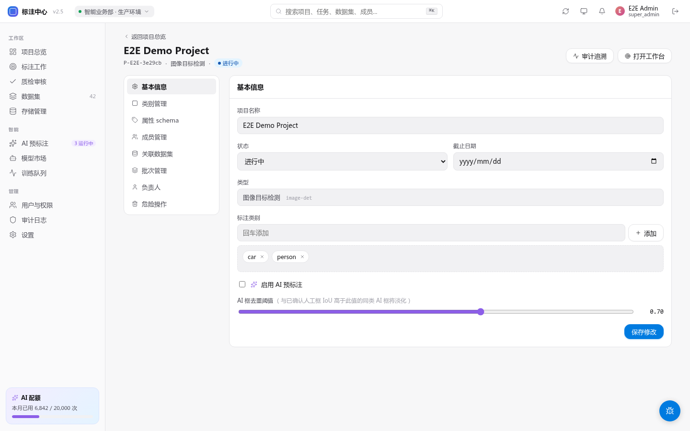

# 数据导出格式


<!-- TODO(0.8.1) IMAGE_CHECKLIST: 导出对话框，COCO / YOLO / VOC / Label Studio JSON 4 个选项 + 当前选中状态 + 导出范围（项目 / 批次）。 -->

项目「导出」页面支持以下格式。所有导出会异步生成 zip，完成后 Dashboard 顶栏出现下载链接（保留 7 天）。


<!-- TODO(0.8.1) IMAGE_CHECKLIST: 导出进行中的进度条 + 完成后的下载链接 toast。 -->

## COCO JSON

最常用格式，适配 Detectron2、MMDetection、YOLOv8 等。

结构：

```json
{
  "info": {...},
  "images": [{"id": 1, "file_name": "...", "width": 800, "height": 600}],
  "annotations": [
    {
      "id": 1,
      "image_id": 1,
      "category_id": 1,
      "bbox": [x, y, w, h],
      "segmentation": [[x1, y1, x2, y2, ...]],
      "area": 12345,
      "iscrowd": 0
    }
  ],
  "categories": [{"id": 1, "name": "person", "supercategory": ""}]
}
```

## YOLO

每张图一个 `.txt`，每行一个 bbox：

```
<class_id> <cx> <cy> <w> <h>      # 全部归一化到 [0,1]
```

附带 `data.yaml`：

```yaml
names: [person, car, bicycle]
nc: 3
```

## Pascal VOC

每张图一个 `.xml`，与 LabelImg 兼容。

## Label Studio JSON

平台间迁移用，含完整原数据 + 标注 + 审核备注。

## 视频轨迹

v0.9.16 / v0.9.17 的视频任务可以保存逐帧框和对象轨迹，但当前导出页面的 COCO / YOLO / VOC 仍面向图片检测数据。

视频轨迹导出边界：

- `video_track` 暂不支持“一键展开为每帧 bbox”导出。
- `video_bbox` / `video_track` 不建议选择 COCO、YOLO 或 Pascal VOC。
- 如需迁移或备份视频轨迹，请保留平台原始 annotation JSON；其中 `keyframes[]` 是真实保存的数据，插值帧不会写入库。

## 选哪个？

| 用途 | 推荐 |
|---|---|
| 训练 YOLOv8 | YOLO |
| 训练 Detectron2 / MMDetection | COCO |
| 数据迁移 / 备份 | Label Studio JSON |
| 视频轨迹备份 | 原始 annotation JSON |
| 老项目维护 | Pascal VOC |
