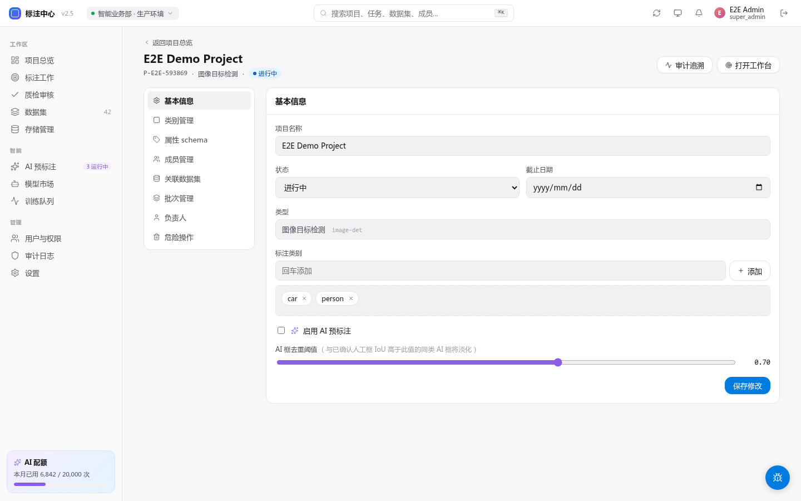

# 数据导出格式


<!-- TODO(0.8.1) IMAGE_CHECKLIST: 导出对话框，COCO / YOLO / AAP JSON 选项 + 当前选中状态 + 导出范围（项目 / 批次）。 -->

项目 Dashboard 的「导出」入口会打开居中的导出弹窗。**v0.10.43 起导出目标可多选**，一次导出产出**一个**压缩包：勾选单个目标时落包根（与旧布局一致），勾选多个目标时各目标落各自的 `{target}/` 子目录。

图片项目可选 **COCO / YOLO 检测 / YOLO 旋转框 / YOLO 分割 / AAP JSON**；视频轨迹项目可选 **Video JSON / YOLO 逐帧 / AAP JSON / MOT / KITTI**。

> **YOLO 拆三个变体（几何映射不同）**：`YOLO 检测`(det) 导矩形框、`YOLO 旋转框`(obb) 导 rotated_bbox 四角、`YOLO 分割`(seg) 导 polygon / mask 多边形。每个变体只取匹配的几何，其余跳过。

## 导出流程（v0.10.27 起异步化）

在导出弹窗点「开始导出」**不再即时下载**：后端会创建一个后台任务并立即弹出 toast「导出已入队，可在右上角任务铃查看进度并下载」，弹窗随即关闭。


<!-- TODO(0.8.1) IMAGE_CHECKLIST: 右上角任务铃（JobsBell）里「数据导出」进度条 + 完成后的「下载」按钮。 -->

1. 在**右上角任务铃（JobsBell）**里能看到一条「数据导出」任务，附带进度条。
2. 任务完成后，该条目出现「下载」按钮；个人通知中心也会出现「导出完成」通知，点击通知可打开下载链接。
3. 产物（ZIP）的下载链接 **7 天内有效，可反复点击下载**（任务铃在后台不轮询，故不会自动下载，需手动点）。下载文件名为可读的 `{项目编号}_{数据集名}_{任务号前 8 位}.zip`（项目跨多个数据集时省略数据集名），v0.10.43 起替代旧的纯 UUID 名。

> **重复导出走缓存**：一周内对**同一范围（项目 / 批次）+ 同一组导出目标 + 同一参数**、且标注未发生增删改的重复导出会**瞬间完成**（复用上次生成的产物）。目标集合顺序无关（勾选顺序不影响命中）。只要标注有任何增删改，就会重新生成。

## 图片产物形态：仅标注 + 回源脚本（不含图片本体）

为了控制体积、并尊重「用户本地往往已有原图」的现实，图片导出的 ZIP **只包含标注与回源脚本，不打包图片本体**。无论图片项目选哪种格式，包内都含以下公共文件：

| 文件 | 说明 |
|---|---|
| `classes.txt` | 类别清单 |
| `attribute_schema.json` | 属性 schema |
| `data.yaml` | YOLO 训练入口，`images` / `labels` 路径已配好 |
| `images_manifest.json` | 每张图一条记录，含相对路径、所属 dataset，以及 **7 天有效的预签名下载 URL + `expires_at`** |
| `fetch_images.py` | 回源脚本（纯 Python stdlib），跑它把原图按相对路径下载到 `images/`，与 `labels/` 平行 |

**回源脚本用法**：解压 ZIP 后执行

```bash
python fetch_images.py
```

脚本读取 `images_manifest.json` 里的预签名 URL，把图片下载到 `images/<同相对路径>`，与 `labels/` 严格平行 → 即取即训。本地已有原图时可不跑此脚本。预签名 URL **7 天有效**（与导出产物生命周期对齐，无需配置 MinIO 密钥）；脚本启动时会校验 `expires_at`，临近过期会提示尽快下载。

各格式的标注落点不同，详见下文。

## COCO JSON

最常用格式，适配 Detectron2、MMDetection、YOLOv8 等。COCO 是单文档格式，落在包根的 `annotations.json`（无 per-image label 文件）。图片的 `width` / `height` 现在取**真实尺寸**（来自 dataset 记录；早期版本曾硬编码 1920×1280，已修复）。

**v0.10.43 起 COCO 不再只导矩形框**，单文件可同时承载多种几何：

- `bbox`：矩形框（也作为 polygon / keypoint 标注的外接框）。
- `segmentation`：polygon / multi_polygon 标注的多边形顶点（像素坐标；孔洞/多连通域的完整还原留作后续）。
- `keypoints` + `num_keypoints`：keypoint 标注的 `[x,y,v,…]`（v=0 未标注 / 1 遮挡 / 2 可见）。骨架拓扑写在对应 `categories[].keypoints`（节点名）+ `categories[].skeleton`（连线，COCO 1-indexed），直接来自项目 keypoint 工具单位的 `keypoint_schema`。
- `attributes.__group_id`：Ctrl+G 同组标注的组号（启用 `include_attributes` 时）。

> `rotated_bbox` / `polyline` 无 COCO 原生表示，不进 COCO（rotated 走 `YOLO 旋转框`，polyline 走 AAP JSON）；被跳过的条数记在 `info.skipped_annotations`。

结构：

```json
{
  "info": {"skipped_annotations": 0, "...": "..."},
  "images": [{"id": 1, "file_name": "...", "width": 800, "height": 600}],
  "annotations": [
    {
      "id": 1,
      "image_id": 1,
      "category_id": 1,
      "bbox": [x, y, w, h],
      "segmentation": [[x1, y1, x2, y2, ...]],
      "keypoints": [x1, y1, v1, x2, y2, v2],
      "num_keypoints": 2,
      "area": 12345,
      "iscrowd": 0
    }
  ],
  "categories": [
    {"id": 1, "name": "person", "supercategory": "keypoint",
     "keypoints": ["nose", "left_eye"], "skeleton": [[1, 2]]}
  ]
}
```

## YOLO（det / obb / seg 三个变体）

YOLO 不同变体的标注行格式互不相同，v0.10.43 起拆成三个可独立选择的导出目标：

| 目标 | 行格式 | 取哪种几何 |
|---|---|---|
| `YOLO 检测`(det) | `<cls> <cx> <cy> <w> <h>`（归一化） | bbox |
| `YOLO 旋转框`(obb) | `<cls> <x1> <y1> … <x4> <y4>`（归一化四角） | rotated_bbox |
| `YOLO 分割`(seg) | `<cls> <x1> <y1> <x2> <y2> …`（归一化多边形） | polygon / multi_polygon |

> OBB 四角在像素空间按旋转角计算后再归一化（图像非正方形时直接在归一化坐标旋转会变形）。seg 对 multi_polygon 的每个连通域各出一行。

label 文件按**镜像目录**组织，保留原数据集的递归子目录结构：

```
{project_id}/{dataset_id}/labels/<原图相对路径>.txt
```

例如 `animals/cat/001.jpg` → `{project_id}/{dataset_id}/labels/animals/cat/001.txt`。这修复了过去只用叶子文件名、导致同名跨目录文件互相覆盖、丢失目录结构的问题。`fetch_images.py` 拉下来的原图会落在与之平行的 `images/` 树下。

启用 `include_attributes` 时，每个 label 旁会附一个同名的 `.attrs.json`（如 `001.attrs.json`）。

附带 `data.yaml`：

```yaml
names: [person, car, bicycle]
nc: 3
```

## Label Studio JSON

平台间迁移用，含完整原数据 + 标注 + 审核备注。

## AAP JSON v1.2（无损）

> v0.10.15 引入 1.0；**v0.10.17 升 1.1** 加 `tool_unit_id` / `tool_bindings`；**v0.10.31 升 1.2** 在 task 层加 `media_type`（image/video/lidar）+ `video` 子块（采样配置 / fps / 帧数 / 分辨率），视频 `video_track` geometry 无损透传，envelope 不拆。各版本向后兼容，旧 reader 走 `extra="ignore"` 仍可解析。**平台原生无损中间格式**。与 COCO / YOLO 并列，但**包含**它们丢失的所有字段：`tool_bindings`(工具维度类别/属性绑定) / `attribute_schema` 值、`prediction.confidence` / `model_version`、`annotation.source`、项目 `annotation_guide`、`classes_config`、`rendering_config`。

适合场景：

- **跨实例迁移**：A 平台 → B 平台，标注不丢失。
- **客户自家模型预测导入**：导出空项目结构 → 客户用自家模型填 `predictions[]` → 在 Dashboard 项目卡片 `⋮` 菜单选择「导入预测」，或上传到 `/projects/{id}/predictions/import` 端点。
- **dataset snapshot 锚点**：版本化备份 / 训练复现。

AAP JSON 是单文档格式，落在包根的 `annotations.json`（无 per-image label 文件）。

结构（简化）：

```json
{
  "schema_version": "1.2",
  "exported_at": "2026-05-19T10:00:00Z",
  "exported_from": {
    "platform": "aap",
    "platform_version": "0.10.17",
    "project_display_id": "P-12",
    "batch_display_id": "BT-3"
  },
  "project": {
    "name": "Traffic Sign",
    "type_key": "image-det",
    "classes_config": { },
    "attribute_schema": { "fields": [] },
    "tool_bindings": {
      "bbox": {
        "enabled": true,
        "classes": [{ "name": "stop_sign", "color": "#ff0000", "order": 0 }],
        "attribute_schema": { "fields": [] }
      }
    },
    "rendering_config": {},
    "annotation_guide": "..."
  },
  "tasks": [
    {
      "task_match": {
        "display_id": "T-101",
        "file_path": "datasets/foo/img_001.jpg"
      },
      "media_type": "image",
      "video": null,
      "annotations": [
        {
          "geometry": { "type": "bbox", "x": 0.1, "y": 0.2, "w": 0.3, "h": 0.4 },
          "class_name": "stop_sign",
          "tool_unit_id": "bbox",
          "attributes": {},
          "confidence": null,
          "source": "manual"
        }
      ],
      "predictions": [
        {
          "geometry": { "type": "bbox", "x": 0.1, "y": 0.2, "w": 0.3, "h": 0.4 },
          "class_name": "stop_sign",
          "tool_unit_id": "bbox",
          "confidence": 0.92,
          "model_version": "ext-yolov8-v1",
          "source": "external_import"
        }
      ]
    }
  ]
}
```

关键规则：

- `schema_version` 必填，breaking change 升 major，导入端 `major > 1` 返 422; minor 升级(如 1.0 → 1.1) 只加可空字段, 老 reader 走 `extra="ignore"` 继续兼容。
- `annotations[]` 与 `predictions[]` **分开两个数组**（不混 type 字段）。
- 导出严格写满 null；导入 lenient 忽略未知字段、缺失按默认。
- `task_match` 走 `display_id` 优先（全局唯一），`file_path` fallback；跨项目 `display_id` 不允许偷换项目。
- `geometry` 使用平台**内部格式**（`bbox` / `polygon` / `multi_polygon` / `polyline` / `rotated_bbox` / `keypoint`），不嵌套 LabelStudio shape。预测导入端也接受可选 `shapes[]`，用于把多个 shape 合并到同一条 prediction；`video_bbox` / `video_track` 暂不导入。
- **v0.10.17 新增** `project.tool_bindings` (工具维度类别 / 属性绑定) + 每条 annotation / prediction 的 `tool_unit_id`(`bbox` / `region` / `polyline` / `rotated_bbox` / `keypoint` / `ai_interactive` / ...)。导入端缺失时按 LS shape 类型回退派生(rectanglelabels→bbox, 带 rotation 的 rectanglelabels→rotated_bbox, polygonlabels→region, polylinelabels→polyline, keypointlabels→keypoint)。

详见 [ADR-0024](../../dev/adr/0024-aap-json-format) · [ADR-0026](../../dev/adr/0026-tool-unit-class-and-attribute-binding) · [API 导入指南](../../api/guides/import.md)。

## 视频轨迹

v0.10.31 起，`video-track` 项目导出统一走异步 zip 管线；v0.10.44 起可选 **Video JSON / YOLO 逐帧 / AAP JSON / MOT / KITTI**。导出包含标注主体 + `manifest.json` + `fetch_videos.py`（按预签名 URL 回源视频）；MOT / KITTI / YOLO 逐帧另带 `fetch_frames.py`（用本地 ffmpeg 按采样网格帧号抽帧，遵循「不物理打包帧」）。

**Video JSON**（帧模式二选一）：

- **关键帧**：默认模式，只导出人工 / 预测关键帧，适合备份、质检和后续继续编辑。
- **所有帧**：导出时按相邻有效关键帧线性插值展开每帧 bbox，适合下游训练或逐帧质检。
- 顶层包含 `export_type: "video_tracks"`、`frame_mode`、项目 / 类别 / 任务信息、`tracks[]`、扁平 `keyframes[]`、旧版 `video_bbox[]` 和 `video_metadata`。

**YOLO 逐帧（检测）**：目标名 `yolo-frames-det`。每个视频 = 一个 sequence，按项目采样网格抽帧，包内写 `labels/{sequence}/{frame:06d}.txt`，行格式与图片 YOLO 检测一致：`<cls> <cx> <cy> <w> <h>`（归一化）。来源同时包含：

- `video_bbox`：单帧框的 `frame_index` 落在采样网格上才输出，off-grid 框跳过。
- `video_track`：按相邻有效关键帧线性插值摊平成逐帧框，再只取采样网格帧；`outside` 区间不输出框。

`fetch_frames.py` 会把对应帧抽到 `images/{sequence}/{frame:06d}.jpg`，与 `labels/{sequence}` 对齐；ZIP 不直接包含帧图。每个采样帧都会有一个 label 文件，空帧写空 `.txt`。

**MOT 16/17/20**：每个视频 = 一个 sequence，落 `{sequence}/gt/gt.txt`（`frame,id,bb_left,bb_top,bb_w,bb_h,conf,x,y,z`）+ `{sequence}/seqinfo.ini`，可直接喂 trackeval。轨迹整数 `id` 自动派生；帧号按采样网格重排 1..N（如 60fps 采 10fps 则 `frameRate=10`）。

**KITTI Tracking 2D**：每视频落 `labels/{sequence}.txt`，18 列空格分隔（`frame track_id type truncated occluded alpha bbox… 3D占位`），帧号网格序号 0-based。

**AAP JSON**：单文档无损中间格式，`video_track` geometry 原样保留；详见上节（schema 1.2 起 task 层带 `media_type` + `video` 子块）。

目标消失语义（各格式共用）：

- `outside` 闭区间段表示目标在该段帧内不存在（v0.10.30 起统一用此表达，旧 `absent` 字段已删除）。
- 所有帧模式 / YOLO 逐帧 / MOT / KITTI 都不跨越 `outside` 段插值，也不在其中输出 bbox（MOT/KITTI 直接省略该帧，YOLO 保留该帧空 label 或其它对象的 label）。
- `occluded=true` 表示目标存在但被遮挡，仍可参与插值；MOT 仍输出该帧，KITTI 置 occluded 列=1。

## 选哪个？

| 用途 | 推荐 |
|---|---|
| 训练 YOLOv8 检测 | YOLO 检测 |
| 训练 YOLOv8 旋转框 (OBB) | YOLO 旋转框 |
| 训练 YOLOv8 分割 | YOLO 分割 |
| 训练 Detectron2 / MMDetection（检测 / 分割 / 关键点） | COCO |
| **跨实例无损迁移 / 客户自训模型预测灌入** | **AAP JSON** |
| 数据迁移 / 备份 | AAP JSON / Label Studio JSON |
| 视频轨迹备份 / 质检 | Video JSON（关键帧） |
| 视频逐帧训练（目标检测） | YOLO 逐帧 |
| 视频逐帧质检 / 自定义脚本处理 | Video JSON（所有帧） |
| 视频多目标跟踪评测（trackeval） | MOT 16/17/20 |
| 视频跟踪（KITTI 工具链） | KITTI Tracking |
| 视频跨实例无损迁移 | AAP JSON |
